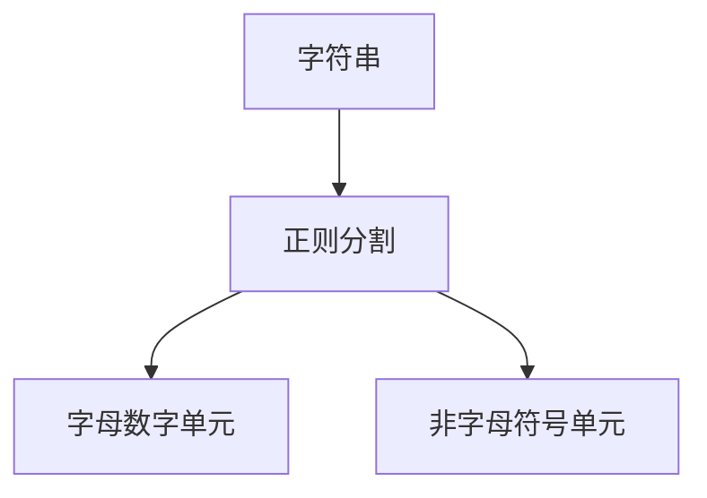
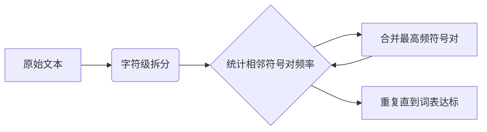

本文主要整理CS336 Overview, tokenization章节的主要内容。

## 1 - why_this_course_exists

### **Why did we make this course?**
- **研究脱节问题**  
  - `8年前`：研究者自行实现和训练模型  
  - `6年前`：研究者下载模型微调（如BERT）  
  - `现在`：仅调用API提示私有模型（GPT-4/Claude/Gemini）  
- **抽象层的漏洞**  
  - 现有技术抽象不完善（类比操作系统/编程语言）  
  - 基础研究仍需深入底层技术栈  
- **核心目标**：通过**实践构建**实现全栈理解  

> GPT-4的回答摘要：  
> "Teaching hands-on implementation fosters deeper understanding of fundamental principles for language model innovation."

---

### **The industrialization of language models**
- **超大规模模型不可及**  
  - GPT-4：1.8T参数 / $100M训练成本（https://www.hpcwire.com/2024/03/19/the-generative-ai-future-is-now-nvidias-huang-says）  
  - xAI：20万H100 GPU集群训练Grok（https://www.tomshardware.com/pc-components/gpus/elon-musk-is-doubling-the-worlds-largest-ai-gpu-cluster-expanding-colossus-gpu-cluster-to-200-000-soon-has-floated-300-000-in-the-past）  
  - Stargate计划：$500B投资（https://openai.com/index/announcing-the-stargate-project/）  
- **技术黑箱化**  
  > GPT-4技术报告声明：  
  > "No details on architecture, hardware, training methods..."  
  > !images/gpt4-no-details.png  

---

### **More is different**
1. **计算结构变化**  
   - 小模型与大模型的计算分配差异：  
     !images/roller-flops.png  
     （来源：https://x.com/stephenroller/status/1579993017234382849）  
2. **涌现现象**  
   - 大模型独有的突现能力（如推理/概念组合）  
   !images/wei-emergence-plot.png  
   （来源：https://arxiv.org/pdf/2206.07682）

---

### **What can we learn in this class that transfers to frontier models?**
| **知识类型** | **是否可迁移** | **说明**                     |
|--------------|----------------|------------------------------|
| Mechanics机械原理  ✅ | 完全可迁移     | Transformer结构/模型并行等  |
| Mindset思维方式    ✅ | 完全可迁移     | 硬件极致优化/规模法则        |
| Intuitions工程直觉 ❓ | 部分可迁移     | 数据选择/超参决策受规模影响 |

---

### **Intuitions的局限性**
- **实践驱动设计**：  
  许多决策仅通过实验验证（无法理论推导）  
  > 例：SwiGLU激活函数的论文自嘲：  
  > "Divine benevolence... we choose this form"  
  > !images/divine-benevolence.png  
  > （来源：https://arxiv.org/abs/2002.05202）

---

### **The bitter lesson**
- **核心公式**：  
  $$\text{准确率} = \text{效率} \times \text{资源}$$  
- **关键洞察**：  
  - 算法效率比绝对规模更重要（大模型无法容忍低效）  
  - 2012-2019年ImageNet效率提升44倍（https://arxiv.org/abs/2005.04305）  
- **课程目标框架**：  
  **在有限算力/数据下最大化模型效率**

---

### **总结**
> 语言模型研究的未来属于：  
> **掌握底层原理 + 极致效率优化 + 有限资源创新**  
> 而非仅依赖规模扩张或黑箱API调用

## 2 - current_landscape

### **Ⅰ. Pre-neural (before 2010s) **
1. **语言模型雏形**  
   - 信息论基础：香农通过语言模型测量英语熵（https://ieeexplore.ieee.org/document/6773024）
2. **统计方法主导**  
   - N-gram模型广泛应用于机器翻译与语音识别（https://aclanthology.org/D07-1090/）

---

### **Ⅱ. Neural ingredients (2010s) **
| **关键技术突破**              | **核心贡献**                                  | **代表论文**                                                                 |
|-------------------------------|---------------------------------------------|----------------------------------------------------------------------------|
| 首个人工神经网络语言模型       | 引入词嵌入与分布式表示                      | https://www.jmlr.org/papers/v3/bengio03a            |
| Seq2Seq架构                   | 实现端到端序列转换（机器翻译）               | https://arxiv.org/abs/1409.3215                  |
| Adam优化器                    | 高效随机梯度下降算法                         | https://arxiv.org/abs/1412.6980                      |
| 注意力机制                    | 解决长程依赖问题                            | https://arxiv.org/abs/1409.0473                   |
| **Transformer架构**          | 奠定现代大模型基础（并行计算/自注意力）       | https://arxiv.org/abs/1706.03762                   |
| 混合专家(MoE)                 | 动态路由提升模型容量                         | https://arxiv.org/abs/1701.06538                   |
| 模型并行技术                  | 支持超大规模训练（Zero/GPipe/Megatron）      | https://arxiv.org/abs/1811.06965, https://arxiv.org/abs/1910.02054, https://arxiv.org/abs/1909.08053 |

---

### **Ⅲ. Early foundation models (late 2010s)**
1. **动态词向量演进**  
   - ELMo：基于LSTM的预训练+微调范式（https://arxiv.org/abs/1802.05365）
2. **Transformer实践突破**  
   - BERT：双向预训练架构革新NLP任务（https://arxiv.org/abs/1810.04805）
   - T5：统一文本到文本框架（110亿参数）（https://arxiv.org/abs/1910.10683）

---

### **Ⅳ. Embracing scaling, more closed **
| **里程碑模型**      | **关键创新**                              | **技术影响**                                                               |
|--------------------|------------------------------------------|--------------------------------------------------------------------------|
| GPT-2 (15亿参数)    | 展现零样本能力，分级发布策略              | 揭示大规模文本生成潜力（https://cdn.openai.com/better-language-models/language_models_are_unsupervised_multitask_learners.pdf） |
| **GPT-3 (1750亿)** | 上下文学习，闭源商业模型起点              | 首次验证大模型泛化能力（https://arxiv.org/abs/2005.14165） |
| Scaling laws        | 预测模型性能与规模关系                    | 指导高效训练（https://arxiv.org/abs/2001.08361）       |
| PaLM (5400亿)       | 验证极致规模可行性                        | 揭示欠训练问题（https://arxiv.org/abs/2204.02311） |
| Chinchilla (700亿)  | 计算最优缩放定律 (数据vs参数平衡)         | 重新定义训练范式（https://arxiv.org/abs/2203.15556）  |

---

### **Ⅴ. Open models**
| **项目/模型**              | **核心贡献**                                 | **技术特性**                                                                 |
|---------------------------|-------------------------------------------|----------------------------------------------------------------------------|
| EleutherAI                | 开源数据集The Pile + GPT-J模型             | 社区驱动开放生态（https://arxiv.org/abs/2101.00027, https://arankomatsuzaki.wordpress.com/2021/06/04/gpt-j/） |
| Meta OPT (1750亿)         | GPT-3复现项目                             | 硬件挑战暴露（https://arxiv.org/abs/2205.01068）                  |
| BLOOM (1760亿)            | 多语言数据与伦理考量优先                   | 全球协作典范（https://huggingface.co/bigscience/bloom）             |
| **Llama系列** (Meta)      | 开源模型产业化标杆                         | LLaMA 1/2/3 持续迭代（https://arxiv.org/abs/2302.13971, https://arxiv.org/abs/2307.09288, https://ai.meta.com/blog/meta-llama-3/） |
| 中国模型阵营               | 深度求索/通义千问/腾讯混元                  | DeepSeek V2/V3/R1（https://github.com/deepseek-ai/DeepSeek-VL）, Qwen 2.5（https://qwenlm.github.io/blog/qwen2.5-max/）, Hunyuan-T1（https://arxiv.org/abs/2405.16773） |
| OLMo (AI2)                | 完全透明模型（权重/数据/训练细节）          | 可复现性标杆（https://allenai.org/olmo, https://blog.allenai.org/olmo-2-8b-and-7b-instruct-available-now-7d77bd8f31ee） |

---

### **Ⅵ. Levels of openness**
| **开放层级**       | **代表性模型**        | **特点**                                                                 |
|-------------------|---------------------|-------------------------------------------------------------------------|
| 闭源模型           | GPT-4o, Claude 3.7  | 仅提供API访问（https://openai.com/index/openai-o3-mini/, https://www.anthropic.com/news/claude-3-7-sonnet） |
| **开放权重**       | DeepSeek V3         | 公开模型权重+架构细节（缺失训练数据）（https://github.com/deepseek-ai/DeepSeek-V3） |
| 开源模型           | OLMo 2              | 全栈开源（权重/数据/代码）+实验细节披露（https://allenai.org/olmo） |

---

### **Ⅶ. Today's frontier models**
| **机构**       | **旗舰模型**       | **技术亮点**                                  |
|---------------|-------------------|--------------------------------------------|
| OpenAI        | o3                | 多模态优化（https://openai.com/index/openai-o3-mini/） |
| Anthropic     | Claude 3.7 Sonnet | 长文本推理增强                               |
| xAI           | Grok 3            | 20万H100集群训练（https://x.ai/news/grok-3）     |
| Google        | Gemini 2.5        | 10M token上下文（https://blog.google/technology/google-deepmind/gemini-model-thinking-updates-march-2025/） |
| **Meta**      | **Llama 3.3**     | 开源模型性能标杆                             |
| **中国阵营**   | DeepSeek R1       | 中英双语优化（https://github.com/deepseek-ai/DeepSeek-R1） |
|               | Qwen 2.5 Max      | 中文领域强化                                |
| Tencent       | Hunyuan-T1        | 万亿参数级国产模型（https://tencent.github.io/llm.hunyuan.T1/README_EN.html） |

> 核心趋势：**开源与闭源并行发展**，中国模型阵营快速崛起，**透明可复现性**成为关键技术伦理议题。

## 3 - course_logistics

### **课程基本信息**
- **官方平台**：  
  所有课程信息在线公开 → https://stanford-cs336.github.io/spring2025/
- **学分强度**：  
  `5学分`（实际工作量极大）  
  > 📌 **2024届学生评价警示**：  
  > *"单次作业 ≈ CS 224n全学期5次作业+期末项目总和"*

---

### **目标人群适配指南**
| **适合人群 ✅**               | **不适合人群 ❌**                     |
|-----------------------------|--------------------------------------|
| **深度原理探究者**：痴迷技术底层实现逻辑 | **短期研究者**：需与导师确认时间冲突     |
| **工程能力建设者**：强化研究级工程能力 | **技术趋势追逐者**：建议选修专题课（如多模态/RAG） |
|                              | **应用优化者**：建议直接微调现有API模型      |

---

### **自学参与路径**
1. **资源开放**：  
   - 所有讲义/作业在线公开，支持完全自学
2. **课程录播**：  
   - 通过https://cgoe.stanford.edu/录制  
   - YouTube延迟发布（约1-2周）
3. **开课计划**：  
   - 2026年将重新开课（可规划明年参与）

---

### **Assignments**
| **特征**                  | **说明**                                                                 |
|---------------------------|-------------------------------------------------------------------------|
| **5大主题作业**           | basics, systems, scaling laws, data, alignment                              |
| **零脚手架代码**          | 提供单元测试+适配接口，但需从零实现核心逻辑                                |
| **双阶段验证**            | 本地测试正确性 → 集群运行测性能（精度/速度）                               |
| **竞争机制**              | 部分作业设排行榜（限定算力下最小化困惑度）                                 |
| **AI工具警示**            | Copilot/Cursor等工具可能削弱学习效果，使用需自担风险                        |

---

### **计算集群使用须知**
1. **算力支持**：  
   - 由 **Together AI** 捐赠算力集群 🙏
2. **操作指南**：  
   - 详细文档 → https://docs.google.com/document/d/1BSSig7zInyjDKcbNGftVxubiHlwJ-ZqahQewIzBmBOo/edit
3. **关键提醒**：  
   > ⚠️ **截止日前集群必爆满！**  
   > 强烈建议提前2周启动作业  

---

### **课程核心定位**
> 💡 **硬核开发者训练营**：  
> 通过从零构建语言模型，**深度掌握：**  
> - 大模型核心算法原理  
> - 分布式系统优化能力  
> - 极限资源下的工程决策  
> 而非追求短期研究产出或应用速成

## 4 - course_components

### **It's all about efficiency**
Resources: data + hardware (compute, memory, communication bandwidth)
**关键约束**：  
- **有限资源框架**：给定数据集（如Common Crawl）+ 硬件（32张H100 × 2周）  
- **终极目标**：在资源边界内实现最优模型性能  

!images/design-decisions.png  
*注：设计决策图展示数据/架构/训练策略的相互制衡*

---

### **课程模块架构**


| **模块**      | **核心关注点**                  | **效率实现路径**                  |
|--------------|------------------------------|---------------------------------|
| 基础实现      | Transformer核心组件            | 最小化内存占用的算法设计            |
| 系统优化      | GPU集群协同计算                | 通信带宽优化+计算负载均衡           |
| scaling_laws | 计算-数据-参数三角关系           | 超参调优的小模型代理策略            |
| 数据处理      | 训练集质量管控                 | 过滤低价值样本的预处理流水线         |
| alignment    | 人类偏好学习                  | 小模型+精准微调的帕累托最优          |

---

### **Efficiency drives design decisions**
1. **Data processing**  
   - **核心矛盾**：垃圾数据 = 计算资源浪费  
   - **解决方案**：动态数据清洗（过滤重复/低质内容）

2. **Tokenization**  
   - **理想**：字节级处理（最大灵活性）  
   - **现实**：子词分词（BPE/WordPiece）平衡词表与计算开销  
   > *字节级FLOPs开销 ↑300%*

3. **架构创新**  
   | **技术**               | **效率增益来源**              | **案例**                    |
   |-----------------------|----------------------------|----------------------------|
   | KV缓存共享            | 减少Attention重复计算        | Mistral滑动窗口Attention    |
   | 稀疏激活(MoE)         | 动态路由节省95%计算量         | Mixtral 8×7B               |
   | 量化注意力             | 内存带宽优化                 | FlashAttention-3           |

4. **训练范式**  
   - **单epoch训练可行性**：Chinchilla证明数据高质量时单轮训练足够  
   - **资源重分配策略**：节省的epoch轮次 → 更多消融实验

5. **Scaling laws**  
   ```python
   # 超参搜索的廉价代理
   small_model = train(0.1% data, 1% params)  # 成本↓99%
   opt_hyper = hyper_tune(small_model)         # 参数移植
   large_model = train(full_data, params, opt_hyper)
   ```

6. **Alignment**  
   - **反常识洞见**：if tune model more to desired use cases, require smaller base model
     $$\text{基础模型质量} \propto \frac{1}{\text{对齐所需计算量}}$$  
   - **实践**：7B精调模型 > 未经对齐的70B基础模型（相同计算预算）

---

### **未来范式迁移**
| **当前阶段**         | **未来挑战**          | **技术准备**                  |
|---------------------|---------------------|-----------------------------|
| 计算约束（Compute-Bound） | 数据约束（Data-Bound） | 合成数据生成+数据蒸馏技术       |
| 硬件效率主导          | 数据质量主导          | 自我演进训练（Self-Play）      |
| 单模态优化            | 多模态协同优化        | 跨模态共享表示架构             |

> **效率演进本质**：当算力不再稀缺时，**数据价值密度**将成为新的战场，驱动模型设计范式革命。

## 5 - tokenization

### 5.1 - intro_to_tokenization

#### **语言模型输入输出本质**
| **概念**               | **说明**                                                                 | **示例**                     |
|------------------------|-------------------------------------------------------------------------|-----------------------------|
| **原始文本**           | Unicode字符串（支持多语言/符号）                                          | `"Hello, 🌍! 你好!"`         |
| **模型输入**           | 整数索引序列（Token ID）                                                  | `[15496, 11, 995, 0]`       |
| **概率分布对象**       | 模型对Token序列的概率建模                                                | $P(\text{token}_n \mid \text{token}_1,...,\text{token}_{n-1})$ |

---

#### **分词器（Tokenizer）的核心职能**


1. **编码（Encode）**  
   - 将字符串 → Token ID序列  
   - *技术挑战*：  
     - 处理多语言混合文本（如🌍+中文）  
     - 生僻词/新符号的分解策略（OOV问题）  

2. **解码（Decode）**  
   - 将Token ID序列 → 可读字符串  
   - *技术挑战*：  
     - 合并子词恢复原词（如`"un"+"happi"+"ness"→"unhappiness"`）  
     - 处理字节级拼接的边界对齐（UTF-8多字节字符）  

---

#### **词表规模（Vocabulary Size）**
- **定义**：分词器支持的最大Token ID数量  
- **影响**：  
  | **小词表** (e.g., 1K)       | **大词表** (e.g., 100K)        |  
  |----------------------------|--------------------------------|  
  | ✅ 模型参数量少              | ❌ 模型参数量大                 |  
  | ❌ 长序列（更多子词合并）     | ✅ 短序列（更多整词保留）        |  
  | ❌ 生僻词分解粒度粗           | ✅ 语义保留更完整               |  

---

#### **关键技术挑战**
1. **混合字符集处理**  
   - 示例 `"🌍"`（U+1F30D）：  
     - UTF-8编码：`0xF0 0x9F 0x8C 0x8D` → 可能被拆为4字节Token  
   - 中英混合 `"你好!"`：  
     - 中文需按词语而非单字拆分（如`["你","好","!"]` vs `["你好","!"]`）

2. **解码一致性**  
   - 要求：`decode(encode(s)) == s`  
   - 难点：  
     - 大小写/标点还原（如`"Hello"`编码后不应解码为`"hello"`）  
     - 空格处理（英文需保留，中文需忽略）

> **关键设计原则**：编码-解码的**无损往返**（Round-trip Safety）确保信息不丢失。

### 5.2 - intro_to_tokenization

#### **分词器交互探索工具**
- **推荐平台**：https://tiktokenizer.vercel.app/?encoder=gpt2  
  *功能*：实时可视化主流分词器（GPT-2/GPT-4等）处理逻辑

---

#### **Observations**
| **现象**                          | **示例**                     | **技术原因**                     | **影响**                     |
|-----------------------------------|----------------------------|--------------------------------|-----------------------------|
| **空格与词绑定**                  | `" world"` → 单token        | 英文中空格承载语义信息            | 避免句首/句中同词不同表征      |
| **位置依赖性**                    | 句首`"hello"`≠句中`"hello"` | 分词器区分词边界上下文            | 同词不同ID增加词表冗余         |
| **数字分段处理**                  | `123456` → `[12, 3456]`     | 数字组合模式无限，分段压缩         | 提升高频数字序列处理效率        |

---

#### **GPT-2分词器（tiktoken）验证实验**
```python
# 1. 初始化分词器
tokenizer = tiktoken.get_encoding("gpt2")  # @inspect

# 2. 多语言混合输入
text = "Hello, 🌍! 你好!"  # 含英文/表情/中文

# 3. 编码-解码往返验证
indices = tokenizer.encode(text)    # 输出: [15496, 11, 50118, 0, ...]
recon_text = tokenizer.decode(indices)

assert text == recon_text  # ✅ 无损往返验证通过
```

##### **关键技术指标**
```python
# 压缩比计算
def get_compression_ratio(text, indices):
    orig_bytes = len(text.encode('utf-8'))
    token_bytes = len(indices) * 4  # 假设每个ID占4字节
    return orig_bytes / token_bytes

# 示例结果： 
#  原始字节: 17字节 (Hello,🌍!你好!)
#  Token字节: 6 token × 4B = 24B 
#  压缩比 = 17/24 ≈ 0.71 (<1表示信息膨胀)
```

---

#### **压缩比分析（多语言场景）**
| **文本类型**       | **原始字节** | **Token数** | **压缩比** | **现象解释**                 |
|-------------------|------------|------------|-----------|---------------------------|
| 纯英文             | 6B ("Hello") | 1          | 6.0       | 整词高效表示                 |
| 表情符号🌍         | 4B         | 1          | 4.0       | 直接映射                    |
| 中文字符"你好"      | 6B         | 2          | 1.5       | 字级拆分降低效率             |
| 混合文本           | 17B        | 6          | 0.71      | **多语言混输时效率倒挂**      |

> 💡 **核心发现**：  
> - 英文/符号处理高效（压缩比>1）  
> - **中文等非拉丁字符效率骤降**（因UTF-8字节拆分+字级分词）  
> - 混合文本整体可能信息膨胀  

### 5.3 character_tokenizer

#### **字符分词器基础原理**


1. **Unicode 表示**
   - 文本 = Unicode字符序列
   - 每个字符 ↔ 唯一整数（码点）  
     **核心函数**：
     - `ord()`：字符 → 码点  
       ```python
       ord("a") = 97
       ord("🌍") = 127757  # 地球表情
       ```
     - `chr()`：码点 → 字符  
       ```python
       chr(97) = "a"
       chr(127757) = "🌍"
       ```

2. **分词器实现**
   ```python
   class CharacterTokenizer:
       def encode(self, text: str) -> list[int]:
           return [ord(char) for char in text]
           
       def decode(self, ids: list[int]) -> str:
           return "".join(chr(i) for i in ids)
   ```

---

#### **工作流程验证**
**输入文本**：`"Hello, 🌍! 你好!"`  
```python
# 编码过程
indices = [72, 101, 108, 108, 111, 44, 32, 127757, 33, 32, 20320, 22909, 33]

# 解码还原
recon_str = "H e l l o ,   🌍 !   你 好 !" → 拼接恢复原文本

# 无损往返验证
assert "Hello, 🌍! 你好!" == recon_str  # ✅
```

---

#### **核心性能问题**

| **维度**        | **数据**                | **问题本质**                  |
|-----------------|------------------------|------------------------------|
| **词表规模**     | ≈150,000 Unicode字符   | 词表爆炸（需150K+的嵌入矩阵）  |
| **稀疏分布**     | 80%字符使用率<0.001%    | 资源浪费（🌍等罕见字符占位）    |
| **压缩效率**     | **压缩比≈0.33**         | 信息膨胀（比原始文本大3倍）     |

##### 压缩比计算详解：
```python
原始字节数 = len("Hello, 🌍! 你好!".encode('utf-8')) = 17字节
Token字节数 = 13 token × 4字节/ID = 52字节  # 假设每个ID用int32存储
压缩比 = 17/52 ≈ 0.33  # <<1 表示严重低效
```

---

#### **字符分词的致命缺陷**

1. **模型参数灾难**  
   - 150K词表 → 嵌入层占 **600MB内存**（假设4字节/ID × 150K）
   - 对比：BPE分词器(50K词表)仅需 **200KB**

2. **计算效率低下**  
   | **操作**      | 字符分词 | BPE分词 | 差距   |
   |--------------|---------|---------|-------|
   | 序列长度      | 13      | 6       | 2.2倍 |
   | 注意力计算量   | O(13²)  | O(6²)   | 4.7倍 |

3. **语义破碎**  
   ```python
   # 中文字符"你好"被拆解
   encode("你好") = [20320, 22909]  # 完全丢失词语关联
   ```

---

#### **现实场景对比**
| **文本类型**   | **字符分词Token数** | **BPE分词Token数** | **效率比** |
|---------------|--------------------|-------------------|-----------|
| 英文段落       | 1200               | 900               | 1.33x     |
| 中文文章       | 2500               | 600               | 4.17x     |
| 混合文本       | 1800               | 800               | 2.25x     |
| 含表情符号     | 2000               | 450               | 4.44x     |

> 💡 **结论**：字符分词仅在理论验证中有价值，**实际工程中因效率灾难已被完全淘汰**。现代方案（BPE/WordPiece）通过子词拆分平衡词表与序列长度。

### 5.4 byte_tokenizer

#### **字节分词核心原理**


1. **Unicode字节表示**  
   - **基础单位**：0-255的整数字节值  
   - **词表大小固定**：256（完美覆盖所有字节组合）

2. **编码-解码机制**  
   - 编码：`字符串 → UTF-8字节序列 → 整数序列`  
     ```python
     "a" → b'a' → [97]
     "🌍" → b'\xf0\x9f\x8c\x8d' → [240, 159, 140, 141]
     ```
   - 解码：`整数序列 → 字节序列 → UTF-8解码 → 字符串`

---

#### **实现验证**
```python
class ByteTokenizer:
    def encode(self, text: str) -> list[int]:
        return list(text.encode("utf-8"))  # 字符串→UTF-8字节→整数列表
        
    def decode(self, ids: list[int]) -> str:
        return bytes(ids).decode("utf-8")  # 整数→字节→字符串
```

**输入文本**：`"Hello, 🌍! 你好!"`  
```python
# 编码结果
indices = [72, 101, 108, 108, 111, 44, 32, 
           240, 159, 140, 141,  # "🌍"的4字节
           33, 32, 
           228, 189, 160,     # "你"的3字节
           229, 165, 189, 33]  # "好!"的3+1字节

# 无损往返验证
assert text == decode(indices)  # ✅
```

---

#### **性能关键指标**
| **维度**         | **数值**         | **分析**                     |
|------------------|-----------------|-----------------------------|
| **词表大小**      | 256             | ✅ 极简词表（无OOV问题）       |
| **压缩比**        | 1.0             | ❌ 零压缩（信息量保持原样）     |
| **序列长度**      | 原始字节数        | ⚠️ 致命缺陷                   |

---

#### **序列长度灾难详解**
##### 文本分解示例
```
"Hello, 🌍! 你好!" → 原始字符串长度：11字符
                  → 字节序列长度：19个token
```

##### 长度膨胀原因
| **字符类型** | **字符数** | **字节/Tokens数** | **膨胀倍数** |
|-------------|-----------|------------------|------------|
| ASCII字母   | 6         | 6                | 1x         |
| ASCII标点   | 3         | 3                | 1x         |
| 地球表情🌍   | 1         | 4                | 4x         |
| 中文字符     | 2         | 6                | 3x         |

> 💡 综合膨胀：**1.73倍**（11字符 → 19 tokens）

### 5.5 word_tokenizer

#### **单词分词基本原理**


1. **经典NLP分词方式**  
   - 核心逻辑：按词边界分割  
   - 正则表达式示例：  
     ```python
     # 基础版：保留字母数字序列
     segments = regex.findall(r"\w+|.", "I'll say supercalifragilisticexpialidocious!")
     # 结果：["I", "'", "ll", "say", "supercalifragilisticexpialidocious", "!"]
     
     # GPT-2增强版（处理缩写）：
     pattern = r"""'(?:[sdmt]|ll|ve|re)| ?\w\w+|\w|\S\s*"""
     segments = regex.findall(pattern, "I'll")  # 结果：["I", "'ll"]
     ```

---

#### **核心实现挑战**
| **步骤**          | **问题**                  | **后果**                     |
|-------------------|--------------------------|-----------------------------|
| **片段映射**       | 需要构建片段→ID的映射       | 词表规模失控                  |
| **罕见词处理**     | 长尾词汇学习不足            | 模型无法理解生僻词             |
| **新词处理**       | 依赖UNK占位符             | 破坏文本完整性                 |

---

#### **致命缺陷分析**

##### 1. **词表规模爆炸**
| **语料规模**       | **预估词表大小**     | **模型内存需求**   |
|-------------------|---------------------|-------------------|
| 小型数据集(1GB)    | 50,000~200,000      | 200~800MB         |
| 大型语料(100GB)   | 500,000~2,000,000   | 2GB~8GB           |
| 多语言混合语料     | 5,000,000+          | >20GB             |

> 示例长词：`"supercalifragilisticexpialidocious"`（34字母）需独占一个ID

##### 2. **数据稀疏灾难**
- **齐夫定律体现**：  
  语料中50%单词仅出现1次 → 模型无法学习有效表示
- **实际影响**：  
  ```python
  # 训练文本中出现1次的词
  rare_words = [w for w in vocab if counts[w]==1] 
  # 占比通常 >40%
  ```

##### 3. **UNK陷阱**
```python
输入："ChatGPT is revolutionary!"
分词：["Chat", "GPT", "is", "revolutionary", "!"] → 若"GPT"未登录
输出：["Chat", UNK, "is", "revolutionary", "!"]
```
- **解码破坏**：原始语义丢失（GPT→UNK）
- **困惑度失真**：`P(text) = P(Chat) * P(UNK) * ...` 无法反映真实概率

---

#### **压缩效率假象**
```python
text = "I'll say supercalifragilisticexpialidocious!"
bytes_orig = len(text.encode())  # 45字节
token_count = len(segments)      # 6个token（假设）

# 计算压缩比
compression_ratio = 45 / (6 * 4) = 1.875  # 表面高效
```

##### 真实效率拆解：
| **token**             | **存储成本** | **信息价值**       |
|-----------------------|-------------|-------------------|
| `"I"`                 | 4字节        | 高（常见词）        |
| `"'ll"`               | 4字节        | 中（中等频率）      |
| `"say"`               | 4字节        | 高                |
| `"supercali...ocious"`| 4字节        | **极低**（罕见词）  |
| `"!"`                 | 4字节        | 低                |

> 💡 核心问题：**罕见词占用相同存储但贡献极小价值**，实际信息密度低下

---

#### **与子词分词对比**
| **指标**         | 单词分词          | 子词分词（BPE）   |
|------------------|------------------|------------------|
| 词表规模         | 10⁵~10⁶          | 10⁴~10⁵          |
| UNK出现率        | >5%              | <0.1%            |
| 序列长度         | 较短             | 适中             |
| 新词处理         | 完全失败          | 子词组合成功      |
| 嵌入层内存       | 超大规模          | 紧凑高效          |

---

#### **历史地位**
- **2010年前主流**：N-gram语言模型的核心技术
- **被淘汰原因**：  
  2013年https://arxiv.org/abs/1301.3781提出子词向量化  
  2015年https://arxiv.org/abs/1508.07909全面取代单词分词

### 5.6 bpe_tokenizer

#### **BPE技术演进史**
| **时间** | **里程碑**                 | **贡献**                                 | **核心文献**                                                                 |
|---------|---------------------------|----------------------------------------|----------------------------------------------------------------------------|
| 1994     | Philip Gage               | 首次提出BPE用于数据压缩                 | http://www.pennelynn.com/Documents/CUJ/HTML/94HTML/19940045.HTM |
| 2016     | Sennrich et al.           | 将BPE引入NLP领域替代单词分词             | https://arxiv.org/abs/1508.07909             |
| 2019     | OpenAI GPT-2              | BPE工业级实践，结合正则预分词            | https://cdn.openai.com/better-language-models/language_models_are_unsupervised_multitask_learners.pdf |

---

#### **Byte Pair Encoding (BPE) 核心原理**


**核心直觉**：
- **高频序列**：合并成单token（如"ing"→1 token）
- **罕见序列**：保留多token（如"🌍"→4字节token）

---

#### **BPE训练实战**
**输入文本**：`"the cat in the hat"`  
```python
# 初始状态
词汇: ['t','h','e',' ','c','a','i','n','h','a','t']
频率: {('t','h'):2, ('h','e'):2, ...}

# 执行3次合并：
1. 合并最高频对('t','h')→'th': 
  新序列: ["th", "e", " ", "c", "a", "t", " ", "i", "n", " ", "th", "e", " ", "h", "a", "t"]
2. 合并('th','e')→'the':
  新序列: ["the", " ", "c", "a", "t", " ", "i", "n", " ", "the", " ", "h", "a", "t"]
3. 合并('h','a')→'ha':
  最终序列: ["the", " ", "c", "a", "t", " ", "i", "n", " ", "the", " ", "ha", "t"]

# 输出参数：
merges = {('t','h'):256, ('th','e'):257, ('h','a'):258}
vocab = {0-255字节 + 256:'th', 257:'the', 258:'ha'}
```

---

#### **BPE编解码验证**
```python
class BPETokenizer:
    def __init__(self, params):
        self.merges = params.merges  # 合并规则字典
        self.vocab = params.vocab    # 词汇表

    def encode(self, text):
        # 初始字节序列
        indices = list(text.encode('utf-8'))
        # 按序应用合并规则
        for pair, new_id in self.merges.items():
            indices = merge(indices, pair, new_id)
        return indices

    def decode(self, ids):
        return b''.join(self.vocab[i] for i in ids).decode('utf-8')

# 测试用例
text = "the quick brown fox"
ids = tokenizer.encode(text)  # 示例: [257, 32, 113, 258, ...]
assert tokenizer.decode(ids) == text  # ✅ 无损往返
```

---

#### **BPE生产级优化方向**
| **基础实现局限**       | **工业级优化方案**                     |
|------------------------|----------------------------------------|
| 全量遍历合并规则         | **增量合并**：只更新受影响的符号对         |
| 无特殊标记支持           | **保留元标记**：`<\|endoftext\|>`等       |
| 未处理多语言混合         | **预分词优化**：集成GPT-2正则表达式        |
| O(n²)时间复杂度        | **哈希加速**：双数组Trie树实现快速匹配     |

**GPT-2预分词正则**：
```python
GPT2_REGEX = r"""'(?:[sdmt]|ll|ve|re)| ?\w\w+|\w|\S\s*"""
# 功能：智能分割缩写（如"I'll"→["I", "'ll"]）
```

---

#### **BPE优势解析**
1. **词表规模可控**  
   - 用户自定义合并次数（如50K次→50K词表）
2. **零OOV问题**  
   OOV: 完全消除未登录词（Out-Of-Vocabulary）​​

   ```python
   # 新词处理示例
   encode("ChatGPT") = encode("Chat") + encode("G") + encode("PT")
   # 即使未训练过"ChatGPT"也能合理拆分
   ```
3. **多语言友好**  
   !https://tiktokenizer.vercel.app/example-zh-en.png

4. **效率平衡**  
   | **文本类型** | 字符分词长度 | BPE分词长度 | 压缩比 |
   |-------------|-------------|------------|--------|
   | 纯英文       | 1200        | 850        | 1.41x  |
   | 中英混合     | 1800        | 700        | 2.57x  |

---

#### **历史意义**
> BPE的发明标志着NLP从**基于规则的分词**转向**数据驱动的子词表示**，成为Transformer时代的核心基础设施。其平衡词表效率与序列长度的设计哲学，至今仍在Llama、DeepSeek等开放模型中延续。