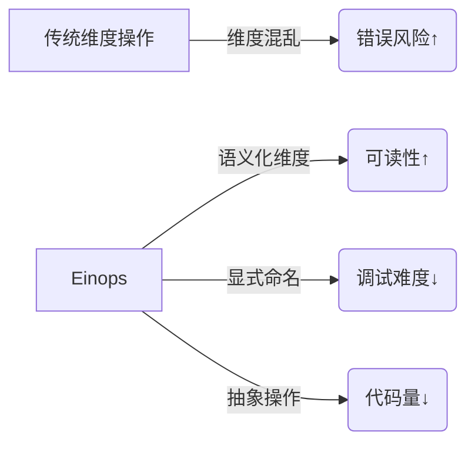

本文主要整理CS336 PyTorch, resource accounting章节的主要内容。

## 1 - Overview

### **课程目标**  
1. **掌握训练模型的核心原语（primitives）**：  
   - 从底层构建模块（张量操作）到高层结构（模型架构、优化器、训练循环）的系统性讲解。  
   - **自底向上（bottom-up）路径**：  
     ```mermaid
     graph LR
         A[张量 Tensors] --> B[模型 Models]
         B --> C[优化器 Optimizers]
         C --> D[训练循环 Training Loop]
     ```

2. **聚焦效率（efficiency）**：  
   - 重点分析如何**优化资源使用**（避免浪费算力与显存）。

---

### **两类关键资源**  
| **资源类型** | **衡量指标** | **优化意义**                  | **实际瓶颈案例**                  |
|--------------|--------------|-----------------------------|----------------------------------|
| **内存（Memory）** | GB（显存容量）  | 决定模型规模与批量大小          | 70B模型+AdamW需≥1.12TB显存（需分布式切分） |
| **计算量（Compute）** | FLOPs（浮点运算量） | 决定训练速度与硬件成本          | 6.3e24 FLOPs训练需1024块H100运行144天 |

---

### **效率优化的核心方向**  
1. **内存优化**：  
   - **技术手段**：  
     - 混合精度训练（`bf16`+`fp32`副本）  
     - 梯度检查点（Gradient Checkpointing）  
     - 优化器状态切分（如ZeRO-Offload）  
   - **目标**：在有限显存下训练更大模型或更大批次。  

2. **计算量优化**：  
   - **技术手段**：  
     - 算子融合（Kernel Fusion）减少数据搬运  
     - 分布式并行策略（数据/模型/流水并行）  
   - **目标**：提升MFU（Model FLOPs Utilization），逼近硬件理论算力。  

---

### **课程价值**  
> “理解资源约束是高效训练的基础”——课程将揭示：  
> - **为什么** 70B模型需要千卡集群？  
> - **如何** 在8卡H100上突破40B参数限制？  
> - **何时** 该优化内存 vs 计算量？  

通过剖析张量→模型→优化器→训练循环的全栈细节，学员将获得**工程落地的系统性能力**。

## 2 - motivating questions

### **问题1：训练70B模型需要多长时间？**
Question: How long would it take to train a 70B parameter model on 15T tokens on 1024 H100s?

#### **计算结果**
- **总计算量**：6.3e24 FLOPs（浮点运算次数）  
  $$
  \text{总计算量} = 6 \times (\text{模型参数量}) \times (\text{训练词元量}) = 6 \times 70 \times 10^9 \times 15 \times 10^{12} 
  $$
- **单卡算力**：H100 实测算力 ≈ 990 TFLOPS（理论值1979 TFLOPS，保守取半）  
- **集群日吞吐**：  
  $$
  \text{日吞吐量} = 1024 \text{卡} \times 990 \times 10^{12} \text{ FLOPs/秒} \times 0.5 \text{ (MFU)} \times 86400 \text{秒} ≈ 4.4 \times 10^{19} \text{ FLOPs/天}
  $$
- **训练时间**：  
  $$
  \text{天数} = \frac{\text{总计算量}}{\text{日吞吐量}} = \frac{6.3 \times 10^{24}}{4.4 \times 10^{19}} ≈ 144 \text{ 天}
  $$

#### **核心原因**
1. **公式 `6 × params × tokens` 的来源**：  
   - Transformer 模型训练时，每个词元（token）在每层需进行两次矩阵运算（前向传播 + 反向传播），且每次计算包含约 `3` 倍参数量级操作（乘加运算算作两次FLOPs）。  
   - 经验公式为：`6 × 参数量 × 词元量`（参考 https://arxiv.org/abs/2001.08361）。
2. **MFU (Model FLOPs Utilization) 取 0.5**：  
   - 实际训练中因通信延迟、数据加载、显存瓶颈等，GPU 无法100%利用理论算力。  
   - 工业界经验值：大规模分布式训练时 MFU 通常为 **30%-60%**（取 0.5 是保守估计）。

#### **单位**

- 在AI模型领域（如“70B模型”），​​B​​ 是 ​​Billion（十亿）​​ 的缩写，即10^9（国际单位制中的“吉”）。
- TFLOPS，Tera Floating-Point Operations Per Second（每秒万亿次浮点运算）。

---

### **问题2：8卡H100能训练的最大模型（AdamW优化器）？**
Question: What's the largest model that can you can train on 8 H100s using AdamW (naively)?"

#### **计算结果**
- **显存占用模型**：  
  $$
  \text{单参数内存} = \underbrace{4}_{\text{参数}} + \underbrace{4}_{\text{梯度}} + \underbrace{(4+4)}_{\text{优化器状态}} = 16 \text{ 字节/参数}
  $$
- **8卡总显存**：  
  $$
  \text{总显存} = 8 \times 80 \text{ GB} = 640 \text{ GB}
  $$
- **最大参数量**：  
  $$
  \text{参数上限} = \frac{640 \times 10^9 \text{ 字节}}{16 \text{ 字节/参数}} = 40 \times 10^9 \text{ (40B)}
  $$

#### **核心原因**
1. **AdamW 的显存开销构成**（关键限制因素）：
   | 组件         | 数据类型 | 每参数字节数 | 作用               |
   |--------------|----------|--------------|--------------------|
   | 参数 (params)    | FP32     | 4 字节        | 存储模型权重       |
   | 梯度 (grads)     | FP32     | 4 字节        | 反向传播计算结果   |
   | 动量 (momentum)  | FP32     | 4 字节        | 优化器状态         |
   | 方差 (variance) | FP32     | 4 字节        | 优化器状态         |
   - **优化器状态占大头**（8字节/参数），直接导致显存需求翻倍。

2. **混合精度训练不省显存**：  
   - 若用 BF16 存储参数/梯度（2字节/参数），仍需保留 FP32 副本（4字节/参数），总显存仍为 **16 字节/参数**（无改善）。

3. **忽略激活值的影响**：  
   - 实际训练中，**激活值（activations）** 的显存占用可能比参数更大（尤其在大批次/长序列时），此处仅为理论上限。

---

### **为什么这些计算重要？**
1. **规模化决策**：  
   - 问题1揭示大模型训练的**硬件成本与时间**（70B模型需千卡集群训练近半年）。  
   - 问题2指导**小团队选型**（8卡H100仅支持40B模型，实际因激活值限制可能更低）。

2. **优化方向**：  
   - **优化器改进**：如使用 **Lion**（显存占用减半）或 **Adafactor**（省去方差状态）。  
   - **显存压缩技术**：  
     - **ZeRO 切分优化器状态**（如 DeepSpeed）可突破单卡限制（https://arxiv.org/abs/1910.02054）。  
     - **激活检查点（Activation Checkpointing）** 降低激活值显存开销。

> 💡 **关键结论**：大模型训练的核心瓶颈是**显存带宽**（数据搬运）和**通信效率**（分布式同步），而非单纯算力。算法优化（如 LoRA 微调）和系统工程（混合并行）比堆硬件更重要。

## 3 - tensors_memory

### 张量内存占用内容概述

本节深入探讨了深度学习中的浮点数表示及其内存占用问题，核心内容包括：

#### **1. 浮点数类型与内存占用**
- **float32 (fp32)**：
  - 默认数据类型，4字节/值
  - 科学计算传统标准，但深度学习可放宽精度要求
  - 示例：GPT-3前馈层单个矩阵占用2.3GB（12288×12288×4字节）

- **float16 (fp16)**：
  - 2字节/值，内存减半
  - 动态范围有限（小数值易下溢）
  - 示例：1e-8在fp16中变为0（训练不稳定性风险）

- **bfloat16**：
  - Google Brain开发（2018）
  - 2字节/值但动态范围等同float32
  - 精度较低但适合深度学习（示例：1e-8不会下溢）

- **fp8**：
  - 2022年标准化（专为ML设计）
  - H100支持两种变体：
    - E4M3：范围[-448, 448]
    - E5M2：范围[-57344, 57344]
  - 仅1字节/值，内存极致压缩

#### **2. 内存计算原理**
```python
内存 = 元素数量 × 数据类型字节大小
```
- 验证示例：
  ```python
  x = torch.zeros(4, 8)  # 32元素
  assert get_memory_usage(x) == 128  # 32×4字节
  ```

#### **3. 训练稳定性挑战**
| 数据类型 | 内存优势 | 稳定性风险 | 典型问题 |
|---------|----------|------------|---------|
| float32 | ✗ 占用大 | ✓ 最稳定 | 无 |
| float16 | ✓ 省50% | ✗ 高风险 | 小数值下溢→梯度消失 |
| bfloat16 | ✓ 省50% | △ 中等 | 精度损失→收敛波动 |
| fp8 | ✓ 省75% | ✗ 极高风险 | 范围/精度双受限 |

---

### 核心要点总结

1. **内存-精度权衡法则**：
   - 内存占用与数据精度成反比
   - 选择公式：`内存节省倍数 = 高精度字节数 / 低精度字节数`

2. **现代训练最佳实践**：
   - 优先使用 **bfloat16**（内存减半 + 保留动态范围）
   - 避免纯float16训练（小数值下溢风险）
   - fp8适用于特定推理场景（训练需极端谨慎）

3. **解决方案预告**：
   - **混合精度训练**：关键部分用fp32，其余用bf16/fp16
   - 梯度缩放技术：防止下溢
   - 损失缩放补偿：维持收敛稳定性

> 🔍 **关键洞见**：  
> 硬件进步（如H100的fp8支持）正在推动内存效率边界，但**数值稳定性始终是低精度训练的达摩克利斯之剑**。下一讲将解析如何通过混合精度训练破解这一困局。

## 4 - tensors_on_gpus

### GPU张量操作内容概述

本节详细讲解了在GPU上操作张量的关键方法和技术，核心内容包括：

#### **1. 张量存储位置**
- **默认位置**：CPU内存
  ```python
  x = torch.zeros(32, 32)  # 默认在CPU上
  assert x.device == torch.device("cpu")
  ```
- **GPU迁移必要性**：利用GPU大规模并行计算能力加速运算
  !images/cpu-gpu.png

#### **2. GPU环境检测**
```python
# 检测GPU可用性
if torch.cuda.is_available():
    # 获取GPU数量
    num_gpus = torch.cuda.device_count()
    
    # 获取GPU详细信息
    for i in range(num_gpus):
        properties = torch.cuda.get_device_properties(i)
        # 包含：名称、显存容量、计算能力等
```

#### **3. 显存监控技术**
```python
# 记录初始显存占用
memory_allocated = torch.cuda.memory_allocated()  # 单位：字节

# 创建张量后...
new_memory_allocated = torch.cuda.memory_allocated()
memory_used = new_memory_allocated - memory_allocated
```

#### **4. 张量GPU迁移方法**
1. **显式迁移**：使用`.to()`方法
   ```python
   y = x.to("cuda:0")  # 移动到GPU 0
   ```
2. **直接创建**：指定device参数
   ```python
   z = torch.zeros(32, 32, device="cuda:0")  # 直接在GPU 0创建
   ```

#### **5. 显存占用验证**
- 单精度浮点张量：32×32矩阵 = 1024元素 × 4字节 = 4096字节
- 示例代码验证两个矩阵的显存占用：
  ```python
  assert memory_used == 2 * (32 * 32 * 4)  # 8192字节
  ```

## 5 - tensor_operations

### 5.1 tensor_storage

#### 张量存储机制内容概述

本节深入解析了PyTorch张量的底层存储原理，核心内容包括：

##### **1. 张量本质揭秘**
- **张量 = 内存指针 + 元数据**
  - **指针**：指向实际数据的内存位置
  - **元数据**：描述数据结构的维度信息
  !https://martinlwx.github.io/img/2D_tensor_strides.png

##### **2. 步幅（stride）核心机制**
对于4×4矩阵示例：
```python
x = torch.tensor([
    [ 0.,  1,  2,  3],
    [ 4,  5,  6,  7],
    [ 8,  9, 10, 11],
    [12, 13, 14, 15],
])
```
- **行步幅（dim 0）**：
  ```python
  assert x.stride(0) == 4  # 移动一行需跳过4个元素
  ```
- **列步幅（dim 1）**：
  ```python
  assert x.stride(1) == 1  # 移动一列需跳过1个元素
  ```

##### **3. 元素定位计算**
通过步幅计算内存偏移量：
```python
r, c = 1, 2  # 目标位置：第2行第3列
index = r * x.stride(0) + c * x.stride(1)  # = 1×4 + 2×1 = 6
assert x.flatten()[index] == 6  # 对应值6
```
- **内存布局**：行优先存储（Row-major）
  ```
  内存地址: [0] [1] [2] [3] [4] [5] [6] [7] ... [15]
  对应值:   0   1   2   3   4   5   6   7  ...  15
  ```

---

#### 核心要点总结

1. **张量存储双组件**：
   | **组件** | **作用** | **示例** |
   |----------|----------|----------|
   | 内存指针 | 定位物理存储位置 | `0x7F8A3C` |
   | 元数据 | 描述数据逻辑结构 | `shape=[4,4]`, `strides=[4,1]` |

2. **步幅机制三原则**：
   - **维度顺序**：`strides[0]`对应最高维（行），`strides[1]`对应次高维（列）
   - **计算规则**：$ \text{offset} = \sum_{i=0}^{n-1} \text{index}_i \times \text{stride}_i $
   - **内存优化**：连续存储时满足 `stride[i] = stride[i+1] * shape[i+1]`

3. **零拷贝操作原理**：
   - **视图操作**（如`transpose()`）通过修改stride实现，不复制数据
     ```python
     y = x.transpose(0,1)  # stride变为[1,4]
     assert y.stride() == (1,4)
     ```
   - **物理存储不变**：转置后`y[2,1]`仍访问`x.flatten()[6]`

4. **与NumPy关键差异**：
   | **特性** | **PyTorch** | **NumPy** |
   |----------|-------------|-----------|
   | 默认内存布局 | 行优先(Row-major) | 行优先 |
   | GPU支持 | 原生支持 | 需额外库 |
   | 自动微分 | 支持 | 不支持 |

### 5.2 tensor_slicing

#### 张量切片与视图操作内容概述

本节深入讲解了PyTorch张量的视图操作机制及其内存影响，核心内容包括：

##### **1. 视图操作的本质**
- **零拷贝特性**：切片、转置等操作仅修改元数据（shape, stride），**不复制底层数据**
  ```python
  y = x[0]         # 行切片：共享存储
  z = x[:, 1]      # 列切片：共享存储
  w = x.view(3, 2) # 形状变换：共享存储
  v = x.transpose(1, 0) # 转置：共享存储
  ```
- **副作用**：修改原张量会影响所有视图
  ```python
  x[0][0] = 100   # 修改原始数据
  assert y[0] == 100  # 行切片同步变化
  assert v[0][0] == 100  # 转置视图同步变化
  ```

##### **2. 连续内存与非连续张量**
- **连续内存标志**：
  ```python
  x = torch.tensor([[1.,2,3],[4,5,6]])
  assert x.is_contiguous()  # True - 内存连续
  ```
- **转置导致非连续**：
  ```python
  y = x.transpose(1, 0)
  assert not y.is_contiguous()  # False - 内存非连续
  ```
- **非连续的代价**：
  ```python
  # 尝试对非连续张量视图操作会失败
  try:
      y.view(2, 3)  # RuntimeError!
  except RuntimeError as e:
      "view size is not compatible with input tensor's size and stride"
  ```

##### **3. 强制连续化操作**
- **contiguous()方法**：创建数据副本实现内存连续
  ```python
  y_contig = y.contiguous()  # 复制数据
  assert y_contig.is_contiguous()
  assert not same_storage(x, y_contig)  # 新存储空间
  ```
- **性能开销**：
  | **操作类型** | 内存开销 | 计算开销 | 适用场景 |
  |--------------|----------|----------|----------|
  | 视图操作 | 0 | 极低 | 频繁访问的中间结果 |
  | contiguous() | 翻倍 | 中等 | 需连续内存的操作前 |

---

#### 核心要点总结

1. **视图操作三原则**：
   - **元数据变化**：仅修改shape/stride，不复制数据
   - **存储共享**：所有视图共享同一物理内存
   - **修改传播**：任意视图的修改影响所有关联张量

2. **内存连续性关键点**：
   | **特性** | 连续张量 | 非连续张量 |
   |----------|----------|------------|
   | 内存布局 | 线性连续 | 跳跃分散 |
   | 支持操作 | 所有视图/计算 | 有限操作 |
   | 检查方法 | `is_contiguous()` | `!is_contiguous()` |
   | 修复方式 | `.contiguous()` | - |

### 5.3 tensor_elementwise

- **定义**：对张量中每个元素独立应用相同操作，生成形状相同的新张量
- **基础数学运算**：
  - 幂运算：`x.pow(2)` → `[1,4,9] → [1,16,81]`
  - 平方根：`x.sqrt()` → `[1,4,9] → [1,2,3]`
  - 平方根倒数：`x.rsqrt()` → `[1,4,9] → [1,0.5,0.333]`
- **算术运算**：
  - 加法：`x + x` → 元素翻倍
  - 标量乘法：`x * 2` → 高效广播机制
  - 标量除法：`x / 0.5` → 等价于乘法
- **特殊操作**：
  - 上三角矩阵提取：`triu()`  
    ```python
    [[1,1,1], → triu() → [[1,1,1],
     [1,1,1],            [0,1,1],
     [1,1,1]]            [0,0,1]]
    ```
    - 核心应用：因果注意力掩码（位置i仅能影响j≥i的位置）

### 5.4 tensor_matmul

- **基础机制**：
  ```python
  x (16×32) @ w (32×2) → y (16×2)
  ```
  - 计算复杂度：O(n³)  
    `16×32×2 = 1024次乘加运算`
- **批处理与序列扩展**：
  - 输入形状：`[batch, seq_len, ..., features]`
  - 权重形状：`[input_feat, output_feat]`
  - 输出形状：自动广播为`[batch, seq_len, ..., output_feat]`
- **典型场景**：
  ```python
  x = torch.ones(4, 8, 16, 32)  # 4批×8序列×16位置×32特征
  w = torch.ones(32, 2)          # 32输入特征→2输出特征
  y = x @ w                      # 输出：[4,8,16,2]
  ```

## 6 - tensor_einops

### Einops与维度管理内容概述

本课程介绍了Einops库及其在张量维度管理中的应用，核心内容包括：

#### **1. 传统张量操作痛点**
```python
# 传统转置操作：易混淆维度索引
z = x @ y.transpose(-2, -1)  
```
- 问题：维度索引（如-2，-1）难以追踪
- 风险：维度错位导致计算错误或性能下降

#### **2. jaxtyping维度标注**
```python
# 新型维度标注方案
x: Float[torch.Tensor, "batch seq heads hidden"] = ...
```
- **作用**：语义化标记维度含义
- **局限**：仅文档功能（不强制执行）

#### **3. Einops三大核心操作**
| **操作** | **功能** | **示例** | **优势** |
|----------|----------|----------|----------|
| **einsum** | 命名维度矩阵乘法 | `einsum(x,y, "b s1 h, b s2 h -> b s1 s2")` | 消除转置需求 |
| **reduce** | 聚合计算 | `reduce(x, "... hidden -> ...", "sum")` | 替代`mean(dim=-1)` |
| **rearrange** | 维度重组 | `rearrange(x, "... (heads h1)->...heads h1")` | 维度拆分/合并 |

#### **4. 多头注意力实现示例**
```python
# 步骤1：拆分多头维度
x = rearrange(x, "... (heads hidden1) -> ... heads hidden1", heads=2)

# 步骤2：执行每个头的线性变换
x = einsum(x, w, "... hidden1, hidden1 hidden2 -> ... hidden2")

# 步骤3：合并多头输出
x = rearrange(x, "... heads hidden2 -> ... (heads hidden2)")
```
- **流程**：拆分→计算→合并
- **优势**：清晰表达多维变换

---

### 核心要点总结

#### **Einops核心价值**


#### **三大操作对比**
| **特性** | einsum | reduce | rearrange |
|----------|--------|--------|-----------|
| 主要功能 | 张量乘法 | 聚合计算 | 维度变换 |
| 核心优势 | 避免转置 | 明确聚合维度 | 维度拆分/合并 |
| 典型场景 | 注意力得分 | 池化层 | 多头处理 |

#### **工程实践建议**
1. **渐进采用策略**：
   - 优先在复杂维度操作处引入
   - 逐步替代`transpose`/`view`链式调用
2. **混合编程模式**：
   ```python
   # 传统 + Einops混合使用
   attn_scores = torch.softmax(
       einsum(q, k, "b h s d, b h s d -> b h s s"),
       dim=-1
   )
   ```
3. **性能注意事项**：
   - Einops操作可能引入微小开销
   - 热点代码区建议保留底层实现

> 💡 **关键洞见**：  
> Einops不是性能优化工具，而是**维度认知工具**：
> 1. 提升多维度变换的可读性  
> 2. 降低分布式训练的维度对齐难度  
> 3. 加速新成员理解复杂张量操作  
> 尤其适用于Transformer多头机制、多模态融合等高层级架构操作。