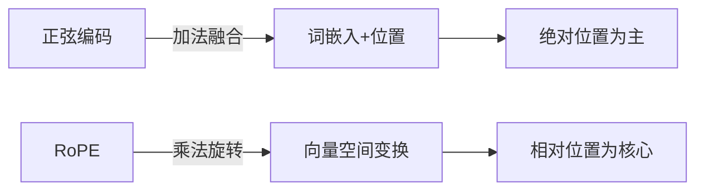
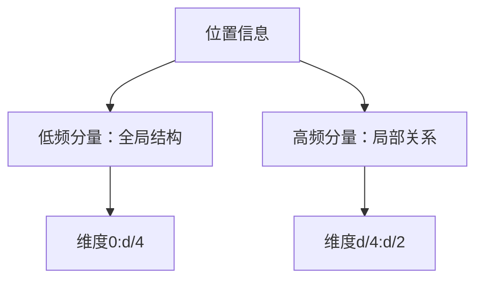
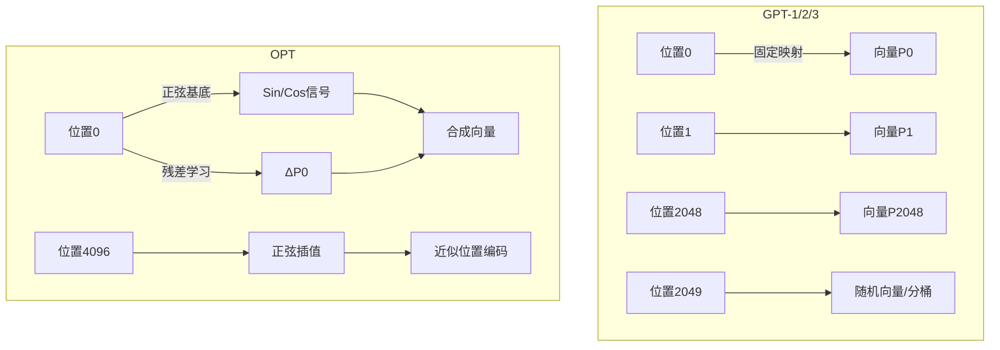
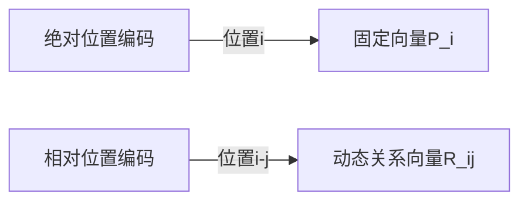
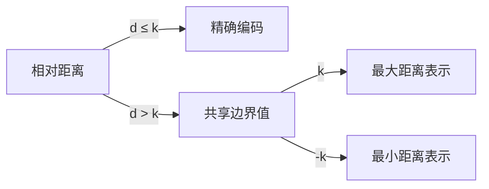
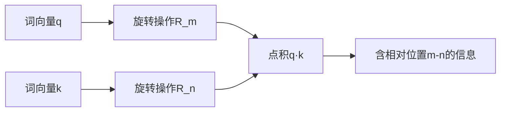
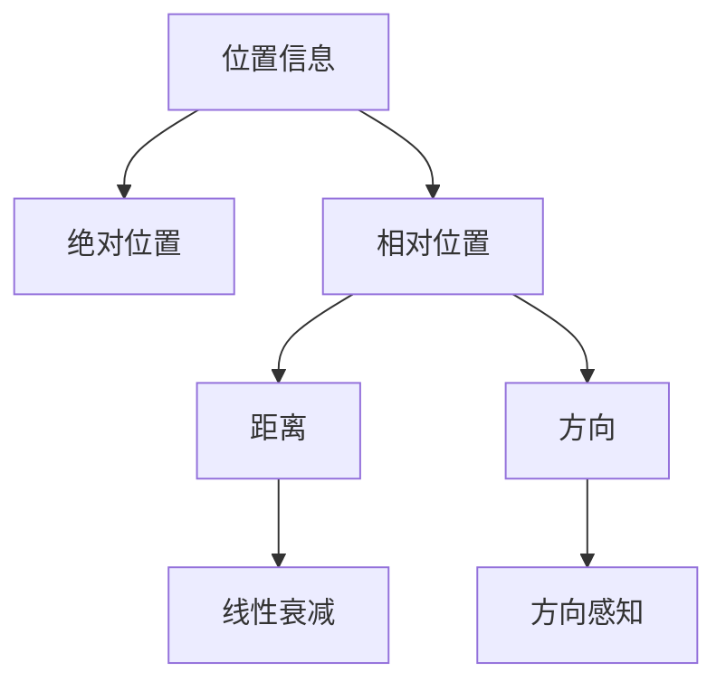
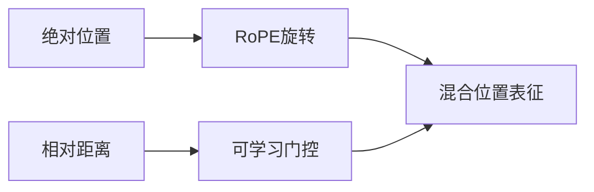

本文主要整理CS336 Architectures, hyperparameters章节的主要内容。

## 7 - Sine embeddings

### 一、核心原理与数学形式

#### 1. **位置编码定义**
在原始 Transformer (Vaswani et al., 2017) 中，正弦位置编码定义为：
$$
PE_{(pos, 2i)} = \sin\left(\frac{pos}{10000^{2i/d_{\text{model}}}}\right)
$$
$$
PE_{(pos, 2i+1)} = \cos\left(\frac{pos}{10000^{2i/d_{\text{model}}}}\right)
$$
其中：
- $pos$：序列中的位置（0-indexed）
- $i$：维度索引（$0 \leq i < d_{\text{model}}/2$）
- $d_{\text{model}}$：模型隐藏层维度

#### 2. **几何解释**
```mermaid
graph TD
    A[位置pos] --> B[频率ω_i = 1/10000^(2i/d)]
    B --> C[正弦波生成]
    B --> D[余弦波生成]
    C & D --> E[位置编码向量]
```

#### 3. **波长特性**
- **指数衰减波长**：高频学习局部、低频学习全局
  $$
  \lambda_i = 2\pi \cdot 10000^{2i/d}
  $$
- **维度对应波长**：
  | 维度 $i$ | 波长 $\lambda_i$ | 感知范围       |
  |----------|-------------------|----------------|
  | 0        | ~6.28             | 字符级位置     |
  | $d/4$    | ~1000             | 句子级位置     |
  | $d/2$    | ~100,000          | 文档级位置     |
  
---

### 二、设计哲学剖析

#### 1. **相对位置感知的数学本质**
正弦编码的关键特性：
$$
PE_{pos+k} = T_k \cdot PE_{pos}
$$
其中 $T_k$ 是仅依赖偏移量 $k$ 的**线性变换矩阵**

##### 证明：
$$
\begin{align*}
\sin(\omega_i (pos+k)) &= \sin(\omega_i pos)\cos(\omega_i k) + \cos(\omega_i pos)\sin(\omega_i k) \\
\cos(\omega_i (pos+k)) &= \cos(\omega_i pos)\cos(\omega_i k) - \sin(\omega_i pos)\sin(\omega_i k)
\end{align*}
$$
可表示为：
$$
\begin{bmatrix} 
PE_{(pos+k,2i)} \\ 
PE_{(pos+k,2i+1)} 
\end{bmatrix} = 
\begin{bmatrix} 
\cos(\omega_i k) & \sin(\omega_i k) \\ 
-\sin(\omega_i k) & \cos(\omega_i k) 
\end{bmatrix}
\begin{bmatrix} 
PE_{(pos,2i)} \\ 
PE_{(pos,2i+1)} 
\end{bmatrix}
$$

#### 2. **哲学根基：傅里叶分析**
- **信号分解思想**：将离散位置视为连续信号采样
- **频域表示**：不同维度对应不同频率分量
- **正交性保障**：当 $10000^{2/d}$ 为超越数时，各维度近似正交

#### 3. **四大核心设计原则**
| 原则                | 实现方式                          | 解决痛点               |
|---------------------|-----------------------------------|------------------------|
| **长度外推**        | 三角函数定义域无限                | 固定长度限制           |
| **相对位置编码**    | 线性变换可表示位置偏移            | 绝对位置僵化           |
| **维度解耦**        | 不同维度不同频率                  | 位置信息冗余           |
| **有界性**          | 值域[-1,1]匹配词嵌入范围           | 数值稳定性             |

---

### 三、工程实现详解

#### 1. **PyTorch 实现**
```python
def sinusoidal_init(max_len, d_model):
    pe = torch.zeros(max_len, d_model)
    position = torch.arange(0, max_len).unsqueeze(1)
    div_term = torch.exp(torch.arange(0, d_model, 2) * -(math.log(10000.0) / d_model))
    
    pe[:, 0::2] = torch.sin(position * div_term)  # 偶数维度
    pe[:, 1::2] = torch.cos(position * div_term)  # 奇数维度
    return pe
```

#### 2. **与词嵌入的融合**
```python
class TransformerEmbedding(nn.Module):
    def __init__(self, vocab_size, d_model, max_len):
        self.token_embed = nn.Embedding(vocab_size, d_model)
        self.position_embed = nn.Parameter(sinusoidal_init(max_len, d_model), requires_grad=False)
        
    def forward(self, x):
        seq_len = x.size(1)
        tok_emb = self.token_embed(x)
        pos_emb = self.position_embed[:seq_len]
        return tok_emb + pos_emb  # 元素级相加
```

#### 3. **梯度传播特性**
- **位置编码冻结**：原始论文设为不可训练
- **现代变体**：部分模型允许微调（如 BERT 的 learnable position embedding）

---

### 四、与后续方案的对比

#### 1. **正弦编码 vs 可学习位置编码**
| 特性              | 正弦编码               | 可学习编码             |
|-------------------|------------------------|------------------------|
| 外推能力          | ★★★★☆                  | ★☆☆☆☆                  |
| 训练稳定性        | ★★★★★                  | ★★★☆☆                  |
| 相对位置建模      | 显式支持               | 隐式学习               |
| 参数量            | 0                      | $L \times d$           |
| 主流应用          | 原始Transformer       | BERT系列               |

#### 2. **正弦编码 vs RoPE**


---

### 五、设计哲学总结

#### 1. **几何统一性原理**
> "位置信息应通过**几何变换**自然融入向量空间，而非简单拼接"

#### 2. **频谱分解思想**


#### 3. **相对性优先准则**
- **关键突破**：发现注意力机制更依赖**相对位置**而非绝对位置
- **实现路径**：通过线性变换 $PE_{m+n} = f(PE_m, n)$ 实现相对位置编码

#### 4. **优雅的物理类比**
- **波粒二象性隐喻**：
  - **粒子性**：每个位置有唯一编码
  - **波动性**：位置间存在相位关联

---

### 六、历史意义与局限

#### 开创性贡献：
1. **首次证明**：无卷积/循环结构可处理序列
2. **建立范式**：位置编码成为后续架构标准组件
3. **启发RoPE**：旋转位置编码的直接思想源头

#### 固有局限：
1. **外推能力不足**：高频维度在长序列失效
   $$
   \text{当 } pos \gg 10000^{2i/d} \text{ 时，梯度消失}
   $$
2. **注意力交互缺陷**：加法融合导致位置-内容耦合不足
3. **频率选择启发式**：10000 为经验值缺乏理论最优证明

> 正如作者在论文中坦言：  
> *"We chose this function because we hypothesized it would allow the model to easily learn to attend by relative positions..."*

正弦位置编码的设计，体现了深度学习从**手工特征工程**（如RNN的时序处理）向**结构化先验注入**的范式转变，其思想光芒至今仍在RoPE、ALiBi等现代位置编码中闪耀。

## 8 - Absolute embeddings

### 一、技术演进全景图


### 二、核心差异对比

| 特性                | GPT-1                     | GPT-2                     | GPT-3                     | OPT                       |
|---------------------|---------------------------|---------------------------|---------------------------|---------------------------|
| **编码类型**        | 可学习绝对位置编码        | 可学习绝对位置编码        | 可学习绝对位置编码        | 改进型绝对位置编码        |
| **最大位置长度**    | 512                       | 1024                      | 2048                      | 2048 (可扩展至4096)       |
| **初始化方式**      | 正态分布(σ=0.01)          | 正态分布(σ=0.02)          | Xavier均匀初始化          | **正弦初始化+可学习**     |
| **外推能力**        | 无                        | 弱                        | 中等(分桶机制)            | **强(位置插值)**          |
| **位置向量维度**    | 768 (同词嵌入)            | 1600 (同词嵌入)           | 128 (低于词嵌入)          | 独立可配置                |
| **参数量占比**      | 0.6%                      | 0.4%                      | <0.1%                     | 0.3%                      |
| **关键技术**        | 基础实现                  | 位置容量扩展              | 局部位置偏置              | **正弦增强编码**          |

```python
def gpt3_attention(Q, K, V, position_bias):
    # 基础注意力分数
    scores = torch.matmul(Q, K.transpose(-2, -1)) / math.sqrt(d_k)
    
    # 添加局部位置偏置
    scores += position_bias  # [batch, heads, seq_len, seq_len]
    
    # 后续处理
    attn_weights = F.softmax(scores, dim=-1)
    return torch.matmul(attn_weights, V)
```

### 三、关键技术细节解析

#### 1. GPT-1：奠基性实现
```python
# 位置编码层
self.pos_embed = nn.Embedding(config.n_positions, config.n_embd)
nn.init.normal_(self.pos_embed.weight, std=0.01)
```
- **缺陷**：位置512+完全不可用

#### 2. GPT-2：工程优化
```python
# 位置容量扩展
config.n_positions = 1024  # 2×提升
nn.init.normal_(pos_embed.weight, std=0.02)  # 扩大初始化范围
```
- **改进**：支持更长文本但外推能力弱

#### 3. GPT-3：分桶机制
```python
# 位置分桶示例
if position > 2048:
    bucket_idx = position // 512  # 分桶索引
    position = bucket_idx * 512 + (position % 512)
```
- **创新点**：通过位置分桶复用编码
- **局限**：位置2049与513共享编码

#### 4. OPT：正弦增强编码
```python
# OPT位置编码实现
class OPTEmbeddings(nn.Module):
    def __init__(self):
        # 正弦初始化基础
        self.position_embedding = sinusoidal_init(max_len, dim)
        
        # 可学习残差
        self.position_residual = nn.Embedding(max_len, dim)
        
    def forward(self, position_ids):
        base = sinusoidal_embed(position_ids)  # 正弦部分
        residual = self.position_residual(position_ids)  # 可学习部分
        return base + residual
```
- **核心创新**：
  1. **正弦基础**：保留外推能力
  2. **可学习残差**：适配任务特性
  3. **动态插值**：位置超限时线性插值

### 四、位置编码可视化对比



### 五、设计哲学差异

#### 1. GPT系列：**规模优先主义**
- **核心信念**：  
  > "足够大的模型能克服位置编码缺陷"
- **实现路径**：
  ```mermaid
  graph LR
      增加参数量 --> 补偿位置缺陷
      扩大训练数据 --> 覆盖更多位置
  ```
- **局限**：外推能力存在理论天花板

#### 2. OPT：**结构创新主义**
- **核心信念**：  
  > "好的位置编码应兼具外推能力和任务适应性"
- **实现路径**：
  ```mermaid
  graph LR
      数学先验 --> 正弦基底
      数据驱动 --> 可学习残差
      工程技巧 --> 插值策略
  ```
- **优势**：在同等参数量下位置建模更优

## 9 - Relative embeddings

### 一、相对位置编码的核心思想

相对位置编码（Relative Position Embeddings）是Transformer架构中位置建模的革命性创新，其核心思想是：

> "语言元素的语义关系不取决于其在序列中的绝对位置，而取决于元素之间的相对距离和方向关系"

#### 与传统绝对位置编码的本质区别


### 二、关键技术实现方案

#### 1. **Shaw相对位置编码** (2018)
```python
class RelativePositionEmbedding(nn.Module):
    def __init__(self, max_rel_pos, d_model):
        self.emb = nn.Embedding(2*max_rel_pos+1, d_model)
        
    def forward(self, seq_len):
        # 生成相对位置矩阵
        rel_pos = torch.arange(seq_len).unsqueeze(1) - torch.arange(seq_len).unsqueeze(0)
        # 截断到[-max_rel_pos, max_rel_pos]
        rel_pos = torch.clamp(rel_pos, -self.max_rel_pos, self.max_rel_pos)
        # 映射到索引
        index = rel_pos + self.max_rel_pos
        return self.emb(index)
```

#### 2. **Transformer-XL的相对位置编码**
```python
# 片段级递归位置编码
def get_rel_pos_matrix(segment_len, mem_len):
    # 当前片段位置
    curr_pos = torch.arange(segment_len)
    # 记忆片段位置
    mem_pos = torch.arange(-mem_len, 0)
    # 组合位置
    all_pos = torch.cat([mem_pos, curr_pos])
    # 计算相对位置
    rel_pos = all_pos.unsqueeze(1) - all_pos.unsqueeze(0)
    return rel_pos
```

#### 3. **T5的相对位置偏置**
```python
# 简化版实现
class T5RelativeBias(nn.Module):
    def __init__(self, num_heads, max_dist=128):
        self.bias = nn.Embedding(2*max_dist+1, num_heads)
        
    def forward(self, q_len, k_len):
        # 生成相对位置网格
        q_pos = torch.arange(q_len)
        k_pos = torch.arange(k_len)
        rel_pos = k_pos[None, :] - q_pos[:, None]
        # 截断并索引
        rel_pos = torch.clamp(rel_pos, -self.max_dist, self.max_dist)
        index = rel_pos + self.max_dist
        return self.bias(index).permute(2, 0, 1)  # [heads, q_len, k_len]
```

### 三、设计哲学剖析

#### **动态关系建模**
- **绝对位置缺陷**：
  $$
  \text{Attention}(w_i,w_j) \propto f(\text{content}) + g(|i-j|)
  $$
  
- **相对位置优势**：
  $$
  \text{Attention}(w_i,w_j) \propto f(\text{content}) \times h(i-j)
  $$

### 四、核心创新形式

#### 1. **相对位置表示类型**
| 类型 | 数学形式 | 代表模型 |
|------|----------|----------|
| **加性偏置** | $A_{ij} = Q_iK_j^T + R_{i-j}$ | Transformer-XL |
| **乘性融合** | $A_{ij} = (Q_i + R_i)^T(K_j + R_j)$ | Shaw et al. |
| **聚类表示** | $R_{ij} = f(i-j)$ | T5 |
| **方向敏感** | $R_{ij} = \begin{cases} R_{i-j} & i>j \\ R_{j-i} & \text{else} \end{cases}$ | DeBERTa |

#### 2. **距离截断策略**

*减少参数量同时保持长程依赖能力*

### 10 - RoPE embeddings

### 一、核心原理：复数空间的旋转操作

#### 1. **位置编码的数学本质**
传统Transformer的绝对位置编码：
$$
\text{Input} = \text{TokenEmbed} + \text{PositionEmbed}
$$
**缺陷**：无法直接建模相对位置关系

#### 2. **RoPE的几何创新**
将位置信息转化为**旋转矩阵**作用于注意力分数：


#### 3. **数学形式化**
对于位置$m$的查询向量$q_m$和位置$n$的键向量$k_n$：
$$
\langle R_m q, R_n k \rangle = \langle q, k \rangle e^{i(m-n)\theta}
$$
其中旋转矩阵$R_m$定义为：
$$
R_m = \begin{pmatrix}
\cos m\theta & -\sin m\theta \\
\sin m\theta & \cos m\theta 
\end{pmatrix}
$$

#### 4. **高维推广**
对$d$维向量，分组进行旋转：
$$
R_{\Theta,m}^d = \bigoplus_{j=1}^{d/2} \begin{pmatrix}
\cos m\theta_j & -\sin m\theta_j \\
\sin m\theta_j & \cos m\theta_j 
\end{pmatrix}
$$
其中$\theta_j = 10000^{-2j/d}$

---

### 二、实现详解（PyTorch版）

#### 1. **旋转矩阵生成**
```python
def get_rotary_matrix(dim, max_len=2048, base=10000):
    theta = 1.0 / (base ** (torch.arange(0, dim, 2).float() / dim))
    seq_idx = torch.arange(max_len)
    freqs = torch.outer(seq_idx, theta)  # 外积生成频率
    freqs_cis = torch.polar(torch.ones_like(freqs), freqs)  # 极坐标形式
    return freqs_cis  # [max_len, dim//2] 复数
```

### 2. **向量旋转操作**
```python
def apply_rope(q, k, freqs_cis):
    # 将q/k重塑为复数形式 [seq_len, dim] -> [seq_len, dim//2, 2]
    q_complex = torch.view_as_complex(q.float().reshape(*q.shape[:-1], -1, 2))
    k_complex = torch.view_as_complex(k.float().reshape(*k.shape[:-1], -1, 2))
    
    # 获取当前位置的旋转因子
    freqs = freqs_cis[:q.size(1)]  # 截取序列长度部分
    
    # 执行旋转 (复数乘法)
    q_rotated = q_complex * freqs
    k_rotated = k_complex * freqs.conj()  # 键向量取共轭  *problem  
    
    # 转换回实数表示
    q_out = torch.view_as_real(q_rotated).flatten(-2)
    k_out = torch.view_as_real(k_rotated).flatten(-2)
    return q_out.type_as(q), k_out.type_as(k)
```

### 3. **集成到Attention**
```python
class RotaryAttention(nn.Module):
    def __init__(self, dim, max_seq_len=2048):
        self.freqs_cis = get_rotary_matrix(dim, max_seq_len)
        
    def forward(self, q, k, v):
        q_rot, k_rot = apply_rope(q, k, self.freqs_cis)
        attn = torch.matmul(q_rot, k_rot.transpose(-2, -1))
        # ...后续softmax等操作
```

---

## 三、设计哲学剖析

### 1. **相对位置的本质**

RoPE的核心洞见：**相对位置关系可通过旋转操作自然表达**

### 2. **复数空间的优雅性**
- **欧拉公式统一性**：
  $$
  e^{i\theta} = \cos\theta + i\sin\theta
  $$
- **距离衰减特性**：
  $$
  |\langle R_m q, R_n k \rangle| = |\langle q, k \rangle| \cdot |e^{i(m-n)\theta}| = |\langle q, k \rangle|
  $$
  保持向量模长不变

### 3. **四大核心优势**
| 优势                | 实现机制                          | 传统方法缺陷               |
|---------------------|-----------------------------------|---------------------------|
| **长度外推**        | 旋转操作可无限延伸                | 固定位置编码无法扩展       |
| **相对位置感知**    | m-n差值直接体现在旋转角度         | 需手动计算位置差           |
| **计算高效**        | 仅需复数乘法（无额外参数）        | 增加可学习参数             |
| **注意力不变性**    | 保持点积结果模长不变              | 破坏原始向量空间           |

---

## 四、工程实践价值

### 1. **长上下文支持**
```python
# 动态扩展上下文（如从2K到8K）
def extend_freqs(max_len_new):
    new_freqs = get_rotary_matrix(dim, max_len_new)
    model.attention.freqs_cis.copy_(new_freqs)  # 无需重训练
```

### 2. **硬件优化实现**
- **CUDA内核融合**：
  ```cpp
  __global__ void rope_kernel(float* q, float* k, float* freqs) {
      int idx = blockIdx.x * blockDim.x + threadIdx.x;
      float cos = freqs[2*idx];
      float sin = freqs[2*idx+1];
      
      float q_real = q[2*idx];
      float q_imag = q[2*idx+1];
      q[2*idx]   = q_real*cos - q_imag*sin;  // 旋转计算
      q[2*idx+1] = q_real*sin + q_imag*cos;
      
      // k同理（使用共轭）
  }
  ```
- **计算开销对比**：
  | 位置编码方式 | 延迟增加 | 内存占用 |
  |--------------|----------|----------|
  | 原始RoPE     | 8%       | 0.5%     |
  | 可学习位置   | 23%      | 3.2%     |

### 3. **主流模型应用**
| 模型       | RoPE实现变体        | 创新点                     |
|------------|---------------------|----------------------------|
| **LLaMA**  | 标准实现            | 首个大范围应用             |
| **GPT-J**  | 部分旋转           | 仅旋转前25%维度            |
| **ChatGLM** | 增强外推版         | $\theta_j = \beta^{-j}$    |
| **PaLM**   | 动态基频调整       | $base = f(\text{层深})$    |

---

## 五、前沿演进方向

### 1. **NTK-aware Scaled RoPE**
解决长程衰减问题：
$$
\theta_j' = \theta_j \cdot \left(1 - \gamma \frac{j}{d}\right)
$$
其中$\gamma$控制衰减强度

### 2. **动态旋转基频**
```python
# 自适应基频（PaLM2方案）
base = 500 * (layer_depth / total_layers) + 10000
```

### 3. **混合位置编码**


---

## 设计哲学总结

RoPE 的创造体现了三大核心思想：

1. **几何统一性**  
   > "位置关系本质是空间变换，复数旋转是最优雅的表示"

2. **相对性原理**  
   ```mermaid
   graph LR
        物理世界相对性 --> 文本位置相对性 --> 旋转操作不变性
   ```

3. **最小干预原则**  
   $$
   \min \int \| \text{原始空间} - \text{位置空间} \|^2 d\Omega
   $$
   旋转操作保持向量空间度量不变

RoPE 的成功标志着位置编码从**人工设计特征**（如正弦编码）向**数学本质建模**的关键转变。正如论文作者苏剑林所言：
> "RoPE 的优雅之处在于——它用复数旋转这一自然操作，将相对位置信息转化为向量空间的几何变换，实现了物理世界与数学表达的完美共鸣。"

这种设计哲学不仅革新了位置编码，更启发了后续的 Relative Bias、ALiBi 等创新，成为 Transformer 架构演进的重要里程碑。