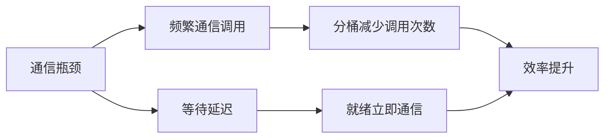

本文主要整理Assignment 2 (systems): Systems and Parallelism的主要内容。

## 2 Distributed Data Parallel Training

### 内容概况

该部分的核心主题是 **“分布式数据并行训练”** ，旨在指导学习者如何利用多个GPU来训练语言模型。内容规划了一个清晰的三步学习路径：从学习PyTorch分布式通信的基础知识开始，到研究一个基础（原生）的实现方案，最后通过实现和评估各种改进措施来优化通信效率。

### 要点总结

1.  **核心目标**：学习并实践使用**多GPU进行语言模型训练**， specifically focusing on **数据并行** 这种方法。
2.  **学习路径（三步走）**：
    *   **基础准备**：首先学习PyTorch框架下的**分布式通信**基础知识，这是实现多GPU训练的技术前提。
    *   **基础实现**：研究并理解一个**原生的分布式数据并行训练实现**，这有助于建立对核心机制和潜在性能瓶颈的直观认识。
    *   **优化与评估**：核心实践环节，即**实现并基准测试各种改进措施**，其直接目标是**提升通信效率**，这是分布式训练性能的关键。

## 2.1 Single-Node Distributed Communication in PyTorch

### 内容概况

这四张图片共同构成了一个关于 **PyTorch 单节点分布式通信** 的完整教程。它通过一个简单的“Hello World”级别的代码示例，从概念、代码实现、运行结果到技术细节，系统地讲解了如何使用 PyTorch 的分布式包（`torch.distributed`）在单个机器的多个进程（模拟分布式环境）中进行集合通信（Collective Communication），核心演示的操作是 **all-reduce**。

```python
import os
import torch
import torch.distributed as dist
import torch.multiprocessing as mp

def setup(rank, world_size):
    os.environ["MASTER_ADDR"] = "localhost"
    os.environ["MASTER_PORT"] = "29500"
    dist.init_process_group("gloo", rank=rank, world_size=world_size)

def distributed_demo(rank, world_size):
    setup(rank, world_size)
    data = torch.randint(0, 10, (3,))
    print(f"rank {rank} data (before all-reduce): {data}")
    dist.all_reduce(data, async_op=False)
    print(f"rank {rank} data (after all-reduce): {data}")

if __name__ == "__main__":
    world_size = 4
    mp.spawn(fn=distributed_demo, args=(world_size,), nprocs=world_size, join=True)
```

```python
def distributed_demo(rank, world_size):
    setup(rank, world_size)

    ## dist.broadcast
    print("####################################dist.broadcast")
    input = torch.randint(0, 10, (4,))
    output = torch.empty(4, dtype=input.dtype)  # Allocate output
    print(f"Rank {rank} [before broadcast]: input = {input}", flush=True)
    dist.broadcast(input, src=0)
    print(f"Rank {rank} [after broadcast]: input = {input}", flush=True)
    dist.barrier()

    ## all_gather
    print("###################################dist.all_gather")
    local_data = torch.randint(0, 10, (4,))
    # 准备收集列表（每个进程都需要）
    gather_list = [torch.zeros(4, dtype=local_data.dtype) for _ in range(world_size)]
    print(f"Rank {rank} local data: {local_data}")
    # 收集所有进程的数据
    dist.all_gather(gather_list, local_data)
    print(f"Rank {rank} gathered data: {gather_list}")
    dist.barrier()

    ## all_gather_into_tensor
    print("###################################dist.all_gather_into_tensor")
    input = torch.randint(0, 10, (1,))
    output = torch.empty(4, dtype=input.dtype)  # Allocate output
    print(f"Rank {rank} [before all-gather]: input = {input}, output = {output}", flush=True)
    dist.all_gather_into_tensor(output_tensor=output, input_tensor=input, async_op=False)
    print(f"Rank {rank} [after all-gather]: input = {input}, output = {output}", flush=True)
    dist.barrier()
    
    ## all_reduce
    print("###################################dist.all_reduce")
    data = torch.randint(0, 10, (3,))
    print(f"rank {rank} data (before all-reduce): {data}")
    dist.all_reduce(data, async_op=False)
    print(f"rank {rank} data (after all-reduce): {data}")
    dist.barrier()

    ## reduce
    print("###################################dist.reduce")
    data = torch.randint(0, 10, (3,))
    print(f"rank {rank} data (before all-reduce): {data}")
    dist.reduce(data, dst=0, async_op=False)
    print(f"rank {rank} data (after all-reduce): {data}")
    dist.barrier()

    ## reduce_scatter_tensor
    print("###################################dist.reduce_scatter_tensor")
    input = torch.randint(0, 10, (4,))
    output = torch.empty(1, dtype=input.dtype)  # Allocate output
    print(f"Rank {rank} [before reduce-scatter]: input = {input}, output = {output}", flush=True)
    dist.reduce_scatter_tensor(output=output, input=input, op=dist.ReduceOp.SUM, async_op=False)
    print(f"Rank {rank} [after reduce-scatter]: input = {input}, output = {output}", flush=True)
    dist.barrier()
```

### 要点总结

1.  **核心概念：All-Reduce 操作**
    -   目标：对所有工作进程（worker processes）中的张量进行某种操作（如求和），并将最终结果同步到**每一个**工作进程上。
    -   在示例中，四个进程各有一个3元素的随机整数张量，`all_reduce` 操作（求和）后，每个进程上的张量都变成了四个原始张量的和。

2.  **代码实现的关键步骤**
    -   **进程创建**：使用 `torch.multiprocessing.spawn` 启动 `world_size`（例如4）个进程，每个进程执行相同的目标函数（如 `distributed_demo`）。
    -   **Rank 和 World Size**：每个进程被分配一个唯一的 `rank`（0 到 `world_size-1`）作为标识符。`world_size` 代表进程总数。
    -   **初始化进程组**：在每个进程中调用 `dist.init_process_group` 来初始化一个“进程组”，这是进程间通信的基础。需要指定后端（如 "gloo"）和主进程的地址与端口。
    -   **执行通信操作**：在初始化后的进程中，可以调用如 `dist.all_reduce` 这样的集合通信函数。

3.  **运行结果与分布式特性**
    -   **初始数据独立**：每个进程初始持有的张量值是随机的，彼此不同。
    -   **结果一致性**：`all-reduce` 操作完成后，所有进程上的结果张量是**完全一致**的（比特级相同）。
    -   **执行顺序不确定性**：在分布式环境中，各进程打印输出的顺序是不确定的，这是正常现象。程序的正确性由通信操作本身的语义保证，而非执行顺序。

4.  **重要的技术细节与最佳实践**
    -   **后端选择**：
        -   **Gloo**：适用于 CPU 训练或在没有 GPU 的机器上进行开发调试。示例中使用了 Gloo。
        -   **NCCL**：由 NVIDIA 提供，在有多 GPU 的环境中进行分布式训练时性能更优。
    -   **多 GPU 设备设置**：当每个进程控制一个 GPU 时，必须确保它们使用不同的设备。常用方法是在设置函数中调用 `torch.cuda.set_device(rank)` 或显式指定设备字符串（如 `f"cuda:{rank}"`）。

**总结**：这组材料清晰地展示了 PyTorch 分布式数据并行训练的基础——进程间通信。它从最简单的 all-reduce 操作入手，让学习者理解 `rank`, `world_size`, 进程组初始化、后端选择等核心概念，为后续实现更复杂的分布式训练算法（如梯度同步）打下了坚实的基础。

## Terminology

### 要点总结

1.  **节点node**
    -   **定义**：网络中的一台物理或虚拟**机器**。
    -   **理解**：分布式训练的基本硬件单位。

2.  **工作进程worker**
    -   **定义**：参与分布式训练的一个**程序实例**。
    -   **注意**：在本作业中，一个工作进程对应一个操作系统进程，因此“工作进程”、“进程”和“工作进程”可互换使用。但在更复杂场景下，一个工作进程内部可能包含多个线程或进程。

3.  **全局进程数world size**
    -   **定义**：一个**进程组**中**工作进程的总数**。
    -   **理解**：代表了参与此次分布式训练任务的所有进程数量。

4.  **全局排名global rank**
    -   **定义**：在进程组中唯一标识一个工作进程的**整数ID**，范围从 `0` 到 `world_size - 1`。
    -   **示例**：排名为0的进程通常被称为**主进程**。

5.  **本地进程数local world size**
    -   **定义**：在**特定节点**上本地运行的工作进程数量。
    -   **关键区别**：
        -   **多节点场景**：如果总共有2个节点，每个节点运行4个进程，则 `world_size=8`，而每个节点的 `local_world_size=4`。
        -   **单节点场景**：`local_world_size` 与 `world_size` 相等。

6.  **本地排名local rank**
    -   **定义**：在**特定节点**上唯一标识一个本地工作进程的整数ID，范围从 `0` 到 `local_world_size - 1`。
    -   **关键区别**：
        -   **多节点场景**：每个节点上都会有自己的一套本地排名（0, 1, 2, 3）。
        -   **单节点场景**：进程的本地排名与其全局排名相同。

### 核心关系总结

| 术语 | 作用范围 | 在单节点场景下的等价关系 |
| :--- | :--- | :--- |
| **全局排名** | 整个进程组（所有节点） | 与**本地排名**相等 |
| **本地排名** | 单个节点内部 | 与**全局排名**相等 |
| **全局进程数** | 整个进程组（所有节点） | 与**本地进程数**相等 |
| **本地进程数** | 单个节点内部 | 与**全局进程数**相等 |

## 2.1.1 Best Practices for Benchmarking Distributed Applications

### 要点总结

1.  **控制实验环境**
    -   **要点**：尽可能在**同一台机器**上运行基准测试，以排除硬件差异的干扰，便于进行受控的比较。

2.  **进行预热迭代**
    -   **要点**：在正式计时前，先执行几次（例如5次）**预热**步骤。这对于初始化NCCL等通信后端尤其重要，可以避免首次运行时的额外开销（如库初始化、缓存分配）影响结果的准确性。

3.  **确保GPU操作同步**
    -   **要点**：在GPU上进行基准测试时，必须调用 **`torch.cuda.synchronize()`** 来等待所有CUDA操作真正完成。
    -   **关键细节**：即使将通信操作的 `async_op` 参数设为 `False`，该调用也仅代表操作已**加入GPU队列**，而非执行完毕。不进行同步会导致计时不准确。

4.  **聚合多进程的测量结果**
    -   **要点**：由于不同进程（Rank）的计时可能存在微小差异，常见的做法是**跨进程聚合测量结果**（例如取平均或最大值）以得到更可靠的估计。
    -   **实用工具**：可以使用 **`dist.all_gather`** 集合通信操作来收集所有进程的计时数据。

5.  **采用分阶段的调试与测试策略**
    -   **要点**：建议采用一个高效的开发流程：
        -   **阶段一（本地调试）**：在CPU上使用 **Gloo** 后端进行本地开发和调试。
        -   **阶段二（性能测试）**：在需要时，切换到GPU上使用 **NCCL** 后端进行真实的性能基准测试。
    -   **操作简便**：切换后端只需修改 `init_process_group` 调用和张量的设备类型即可。

**总结**：这套最佳实践的核心思想是**通过控制变量、排除干扰和精确测量，来获得真实、可复现的通信性能数据**，为优化分布式训练性能提供可靠的依据。

### Problem (distributed_communication_single_node): 5 points

Write a script to benchmark the runtime of the all-reduce operation in the single-node multi-process
setup. The example code above may provide a reasonable starting point. Experiment with varying the
following settings:

- Backend + device type: Gloo + CPU, NCCL + GPU.
- all-reduce data size: float32 data tensors ranging over 1MB, 10MB, 100MB, 1GB.
- Number of processes: 2, 4, or 6 processes.
- Resource requirements: Up to 6 GPUs. Each benchmarking run should take less than 5 minutes.

|   world_size | backend   |   data_size |      time |
|-------------:|:----------|------------:|----------:|
|            2 | gloo      |     1048576 |   2.52364 |
|            2 | gloo      |     2621440 |   5.70207 |
|            2 | gloo      |    26214400 |  62.2048  |
|            2 | gloo      |   262144000 | 695.814   |
|            4 | gloo      |     1048576 |   3.1842  |
|            4 | gloo      |     2621440 |   7.97548 |
|            4 | gloo      |    26214400 |  68.8933  |
|            4 | gloo      |   262144000 | 855.211   |
|            6 | gloo      |     1048576 |   4.4439  |
|            6 | gloo      |     2621440 |  10.2203  |
|            6 | gloo      |    26214400 |  92.6451  |
|            6 | gloo      |   262144000 | 852.072   |

## 2.2 A Naïve Implementation of Distributed Data Parallel Training

### 内容概况
这张图片详细阐述了分布式数据并行（DDP）训练的**基础实现原理**，重点介绍了一个"朴素"的四步实现方案。其核心目标是通过将数据和计算负载分散到多个设备（如GPU）上，实现**更大的有效批次训练规模**，从而提升训练效率。文档从初始化同步开始，完整描述了从数据分片到参数更新的整个闭环流程。

---

### 要点总结

#### 1. 核心目标：数据并行
- **核心思想**：将一个大批次（Batch）**分割**到多个设备上并行处理。
- **价值**：突破单设备内存限制，实现原本无法运行的大规模批次训练（例如，4个GPU可将有效批次大小提升4倍）。

#### 2. 朴素实现的四个关键步骤
1.  **初始化与参数同步**
    -   各设备先创建随机初始化的模型。
    -   通过 **`广播`** 操作，将主进程（Rank 0）的模型参数和优化器状态**同步到所有设备**，确保起点完全一致。

2.  **数据分片与本地计算**
    -   将整个训练批次**均匀分片**，每个设备处理其中的一部分（`n/d` 个样本）。
    -   各设备使用本地模型参数，独立完成**前向传播**和**反向传播**，计算出基于本地数据分片的**局部梯度**。

3.  **梯度同步**
    -   使用 **`all-reduce`** 集合通信操作，对所有设备上的局部梯度进行**全局平均**。
    -   此步骤完成后，每个设备上都获得了基于**整个批次**（所有`n`个样本）计算出的**平均梯度**。

4.  **参数更新**
    -   各设备使用同步后的平均梯度，独立执行**优化器步骤**，更新其本地模型参数。
    -   由于所有设备的初始状态和每次迭代的更新依据（梯度）都完全相同，因此在整个训练过程中，所有设备上的模型参数和优化器状态将**始终保持同步**。

#### 3. 关键依赖与假设
- **数据均匀分割**：文档假设批次大小`n`必须能被设备数量`d`整除，以确保负载均衡，避免进程等待，这是保证效率的关键前提。

**总结**：该"朴素实现"清晰地揭示了分布式数据并行训练的基本范式——通过"分而治之"的策略分配数据，通过"协同合作"的通信（广播、all-reduce）来同步信息，最终实现利用多设备加速模型训练的目的。理解这一基础流程是后续学习更复杂、高性能DDP实现（如PyTorch官方DDP模块）的基石。

### Problem (naive_ddp): 5 points

Deliverable: Write a script to naively perform distributed data parallel training by all-reducing
individual parameter gradients after the backward pass. To verify the correctness of your DDP imple-
mentation, use it to train a small toy model on randomly-generated data and verify that its weights
match the results from single-process training.
=> 完成

### Problem (naive_ddp_benchmarking): 3 points

In this naïve DDP implementation, parameters are individually all-reduced across ranks after each
backward pass. To better understand the overhead of data parallel training, create a script to bench-
mark your previously-implemented language model when trained with this naïve implementation of
DDP. Measure the total time per training step and the proportion of time spent on communicating
gradients. Collect measurements in the single-node setting (1 node x 2 GPUs) for the XL model size
described in §1.1.2
=> gloo ~90%

**24GB RTX 4090 seq_len: 256 num_layers: 4 d_model: 512 num_heads: 16 d_ff: 1344**

|   world_size | backend   |   step time |  communicating gradients time |
|-------------:|:----------|------------:|----------:|
|            2 | gloo      |     ~274    |   ~228    |

## 2.3 Improving Upon the Minimal DDP Implementation

### 现有最小DDP实现的两个关键局限性

1.  **通信开销大：逐参数进行All-Reduce**
    -   **问题**：对模型中的**每一个参数张量**都发起一次独立的 `all-reduce` 通信操作。
    -   **根源**：每次通信调用都有固定的开销（如延迟），大量细粒度的通信调用会累积成显著的性能瓶颈。

2.  **执行顺序串行：通信与计算无重叠**
    -   **问题**：必须**等待整个反向传播计算全部完成**后，才开始同步所有参数的梯度。
    -   **根源**：未能利用反向传播的**渐进式特性**（梯度是依次计算出来的）。当某个参数的梯度已经就绪时，由于在等待其他参数的计算，导致通信链路处于空闲状态。

### 提出的两项改进措施（优化方向）

1.  **通信批处理**
    -   **目标**：最小化通信开销。
    -   **方法**：将多个参数的梯度通信**批量**到一个或少数几个 `all-reduce` 操作中完成，从而减少通信调用的次数。

2.  **计算-通信重叠**
    -   **目标**：减少分布式训练的额外开销。
    -   **方法**：一旦某个参数的梯度在反向传播中**计算完成，就立即开始通信**（即“就绪即发送”），让梯度同步操作与该参数之后的反向计算过程**并行进行**。

## 2.3.1 Reducing the Number of Communication Calls

### 核心问题识别
- **传统方法的缺陷**：为每个参数张量单独发起通信调用会产生显著的固定开销
- **性能瓶颈**：大量细粒度的通信操作累积成为训练速度的主要限制因素

### 提出的解决方案：通信批处理
- **基本思路**：将多个梯度张量**连接/拼接**成一个大的张量
- **操作流程**：
  1. 收集所有需要执行 all-reduce 的梯度
  2. 将它们连接成单个组合张量
  3. 在所有进程间对这个组合梯度执行一次 all-reduce 操作
  4. 通信完成后，将结果拆分回原始的参数梯度格式

### 技术实现建议
- **推荐工具**：使用 PyTorch 内部工具函数
  - `torch._utils._flatten_dense_tensors`：将多个密集张量展平为单个张量
  - `torch._utils._unflatten_dense_tensors`：将展平后的张量恢复为原始形状

### 预期收益
- **减少通信调用次数**：从 O(N) 次减少到 O(1) 次（N 为参数数量）
- **降低通信开销**：通过批量处理减少固定开销的累积影响
- **提升带宽利用率**：大张量的传输通常比多个小张量更高效

### Problem (minimal_ddp_flat_benchmarking): 2 points

Modify your minimal DDP implementation to communicate a tensor with flattened gradients from
all parameters. Compare its performance with the minimal DDP implementation that issues an all-
reduce for each parameter tensor under the previously-used conditions (1 node x 2 GPUs, XL model
size as described in §1.1.2)

**24GB RTX 4090 seq_len: 256 num_layers: 4 d_model: 512 num_heads: 16 d_ff: 1344**

|   world_size | backend   |   step time |  communicating gradients time |
|-------------:|:----------|------------:|----------:|
|            2 | gloo      |     ~259    |   ~207    |

## 2.3.2 Overlapping Computation with Communication of Individual Parameter Gradients

### 内容概况

这两张图片共同探讨了**分布式训练中计算与通信重叠的优化技术**，属于深度学习分布式训练的进阶性能优化主题。第一张图提出了通过异步梯度通信来重叠计算与通信的核心思想，第二张图则详细介绍了PyTorch中异步通信的具体实现机制。

---

### 要点总结

#### 第一张图核心要点：计算-通信重叠理论

**1. 问题识别**
- **传统瓶颈**：即使批量处理通信调用，通信时间本身仍是性能瓶颈
- **串行执行**：传统方法需要等待所有反向传播计算完成后再开始梯度同步

**2. 解决方案：渐进式梯度同步**
- **核心洞察**：反向传播是逐层进行的，梯度计算具有时序性
- **优化策略**：在每个参数的梯度就绪后立即开始通信，而不是等待所有梯度
- **技术实现**：使用`register_post_accumulate_grad_hook`钩子函数触发异步通信

**3. 预期收益**
- 通过重叠计算和通信时间，有效"隐藏"通信开销
- 充分利用计算资源，减少空闲等待时间

#### 第二张图核心要点：异步通信技术实现

**1. 两种通信模式对比**
- **同步模式**(`async_op=False`)：阻塞调用，直到操作在GPU上排队
- **异步模式**(`async_op=True`)：立即返回请求句柄，不保证操作完成

**2. 异步通信关键技术**
- **通信句柄**(Handle)：异步操作返回的控制对象
- **等待机制**：通过`handle.wait()`确保操作完成
- **批量等待**：可先启动所有异步操作，最后统一等待

**3. 代码模式对比**
```python
# 同步模式：顺序执行，效率低
for tensor in tensors:
    dist.all_reduce(tensor, async_op=False)  # 阻塞等待

# 异步模式：并行执行，效率高
handles = []
for tensor in tensors:
    handle = dist.all_reduce(tensor, async_op=True)  # 立即返回
    handles.append(handle)

for handle in handles:  # 最后统一等待
    handle.wait()
```

#### 技术关联与整体价值

**理论到实践的完整链路**：
1. **理论指导**（图1）：识别计算-通信串行的性能瓶颈
2. **触发机制**（图1）：使用梯度钩子实现"就绪即发送"
3. **实现工具**（图2）：利用异步通信API实现真正的重叠执行

**性能优化价值**：
- **减少空闲时间**：计算和通信并行执行
- **提高资源利用率**：GPU计算和网络通信同时进行  
- **加速训练流程**：显著降低每次迭代的端到端时间

**适用场景**：
- 通信带宽受限的分布式环境
- 模型参数众多、梯度量大的训练任务
- 对训练速度有严格要求的生产环境

这套技术组合代表了分布式训练优化的高级阶段，是构建高性能深度学习系统的关键技术之一。

### Problem (ddp_overlap_individual_parameters): 5 points

Implement a Python class to handle distributed data parallel training. The class should wrap
an arbitrary PyTorch nn.Module and take care of broadcasting the weights before training (so all
ranks have the same initial parameters) and issuing communication calls for gradient averaging.

=> 完成

### Problem (ddp_overlap_individual_parameters_benchmarking): 1 point

(a) Benchmark the performance of your DDP implementation when overlapping backward pass com-
putation with communication of individual parameter gradients. Compare its performance with
our previously-studied settings (the minimal DDP implementation that either issues an all-reduce
for each parameter tensor, or a single all-reduce on the concatenation of all parameter tensors)
with the same setup: 1 node, 2 GPUs, and the XL model size described in §1.1.2

**24GB RTX 4090 seq_len: 256 num_layers: 4 d_model: 512 num_heads: 16 d_ff: 1344**

|   world_size | backend   |   step time |  communicating gradients time |
|-------------:|:----------|------------:|----------:|
|            2 | gloo      |     ~191    |   ~139    |

(b) Instrument your benchmarking code (using the 1 node, 2 GPUs, XL model size setup) with the
Nsight profiler, comparing between the initial DDP implementation and this DDP implementa-
tion that overlaps backward computation and communication. Visually compare the two traces,
and provide a profiler screenshot demonstrating that one implementation overlaps compute with
communication while the other doesn’t.


## 2.3.3 Overlapping Computation with Communication of Bucketed Parameter Gradients

### 1. **技术演进背景**
| 阶段 | 方法 | 优势 | 劣势 |
|------|------|------|------|
| **初期** | 逐个发送梯度 | 简单易实现 | 通信调用频繁，开销大 |
| **前期优化** | 批量发送所有梯度 | 减少通信次数 | 需等待反向传播完全结束 |
| **本方案** | **分桶参数梯度** | 平衡通信效率与计算重叠 | 需要精细的梯度就绪时间管理 |

### 2. **核心技术方案**
- **分桶策略**：将模型参数组织成多个桶（buckets）
- **动态通信**：在每个桶的组成张量就绪时立即执行All-Reduce
- **重叠优化**：实现计算与通信的最大化并行

### 3. **解决的关键问题**


### 4. **针对性的应用场景**
- **大规模Transformer模型**：参数张量数量多
- **分布式训练环境**：多GPU/多节点配置
- **通信密集型任务**：梯度同步占训练时间比重高

### Problem (ddp_overlap_bucketed): 8 points

Implement a Python class to handle distributed data parallel training, using gradient bucketing to
improve communication efficiency. The class should wrap an arbitrary input PyTorch nn.Module and
take care of broadcasting the weights before training (so all ranks have the same initial parameters) and
issuing bucketed communication calls for gradient averaging.

=> 

```python
已为参数 fc1.weight 注册钩子 bucket_idx 0 400/1677.7216
已为参数 fc1.weight 注册钩子 bucket_idx 0 400/1677.7216
已为参数 fc2.weight 注册钩子 bucket_idx 1 2000/1677.7216
已为参数 fc2.weight 注册钩子 bucket_idx 1 2000/1677.7216
已为参数 fc3.weight 注册钩子 bucket_idx 2 2000/1677.7216
已为参数 fc3.weight 注册钩子 bucket_idx 2 2000/1677.7216
已为参数 fc5.weight 注册钩子 bucket_idx 3 1000/1677.7216
已为参数 fc5.weight 注册钩子 bucket_idx 3 1000/1677.7216
```

### Problem (ddp_bucketed_benchmarking): 3 points

(a) Benchmark your bucketed DDP implementation using the same config as the previous experiments
(1 node, 2 GPUs, XL model size), varying the maximum bucket size (1, 10, 100, 1000 MB).
Compare your results to the previous experiments without bucketing—do the results align with
your expectations? If they don’t align, why not? You may have to use the PyTorch profiler as
necessary to better understand how communication calls are ordered and/or executed. What
changes in the experimental setup would you expect to yield results that are aligned with your
expectations?

=> 

**24GB RTX 4090 seq_len: 256 num_layers: 4 d_model: 512 num_heads: 16 d_ff: 1344**

|   world_size | backend   |   step time |  communicating gradients time |  bucket_size_mb | 
|-------------:|:----------|------------:|----------:| ---------:|
|            2 | gloo      |     ~197    |   ~138    | 1 |
|            2 | gloo      |     ~201    |   ~141    | 10 |
|            2 | gloo      |     ~256    |   ~198    | 100 |
|            2 | gloo      |     ~260    |   ~203    | 1000 |

(b) Assume that the time it takes to compute the gradients for a bucket is identical to the time it
takes to communicate the gradient buckets. Write an equation that models the communication
overhead of DDP (i.e., the amount of additional time spent after the backward pass) as a function
of the total size (bytes) of the model parameters (s), the all-reduce algorithm bandwidth (w,
computed as the size of each rank’s data divided by the time it takes to finish the all-reduce), the
overhead (seconds) associated with each communication call (o), and the number of buckets (nb ).
From this equation, write an equation for the optimal bucket size that minimizes DDP overhead.

在分布式数据并行（DDP）训练中，假设计算一个桶的梯度所需时间与通信该桶的时间相同，通信开销可建模为：

#### 基本参数定义
- $s$ = 模型参数总大小（字节）
- $w$ = all-reduce 算法带宽（字节/秒）
- $o$ = 每次通信调用的开销（秒）
- $n_b$ = 桶的数量
- $b$ = 单个桶的大小（字节），其中 $b = \frac{s}{n_b}$

#### 通信开销方程
反向传播后的通信开销为最后一个桶的通信时间：

$$
T_{\text{overhead}} = o + \frac{b}{w} = o + \frac{s}{n_b w}
$$

#### 最优桶大小推导

**目标函数**
最小化通信开销：

$$
\min_{n_b} T_{\text{overhead}} = o + \frac{s}{n_b w}
$$

#### 约束条件
1. $n_b \geq 1$（至少有一个桶）
2. $n_b \leq n_{\text{params}}$（模型中独立参数张量的数量）
3. $b \geq b_{\min}$（桶大小不小于最小可行值）

#### 最优解分析
由于 $T_{\text{overhead}}$ 随 $n_b$ 增加而单调递减，最优解在约束边界取得：

$$
n_b^* = \min\left(n_{\text{params}}, \frac{s}{b_{\min}}\right)
$$

#### 最优桶大小
理论最优是每个参数一个桶，但受实际限制，对应的最优桶大小为：

$$
b^* = \frac{s}{n_b^*} = \max\left(\frac{s}{n_{\text{params}}}, b_{\min}\right)
$$
