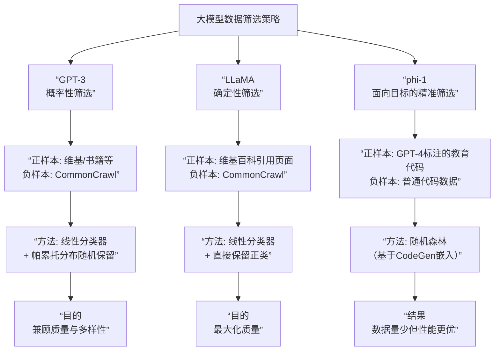

本文主要整理CS336 Lecture 14 Data章节的主要内容。

## 1. kenlm_main

### 核心概览

**KenLM** 是一个快速、轻量级的语言模型库，特别适用于需要处理大量文本的场景，如机器翻译和数据过滤。它基于 **Kneser-Ney 平滑** 技术，解决了传统 n-gram 模型中因数据稀疏（即很多词组在训练数据中未出现）而导致概率估算不准确的问题。

---

### 1. 技术原理与概念（来自第一张图）

*   **n-gram 语言模型**：其核心思想是根据前 n-1 个词来预测第 n 个词的概率。
    *   **示例**：对于一个 3-gram 模型 (n=3)，计算 $p(in | the cat)$ 的概率公式为：$count(the cat in) / count(the cat)$。
*   **问题：稀疏计数**：当 n 较大时，许多可能的 n-gram 组合在训练语料中从未出现，其计数为 0，这会导致模型无法处理未见过的词组。
*   **解决方案：Kneser-Ney 平滑**：通过“打折”和“回退”机制，将一部分概率质量分配给未出现过的 n-gram，使其概率不为零。简单来说，一个词出现的“环境”多样性也会影响其概率。

---

### 2. 代码实现详解（来自第一张图）

```python
# Use the language model
def compute(content: str):
    # Hacky preprocessing
    content = "<s> " + content.replace(",", " ,").replace(".", " .") + " </s>"

    # log p(content)
    score = model.score(content)

    # Perplexity normalizes by number of tokens to avoid favoring short documents
    num_tokens = len(list(model.full_scores(content)))
    perplexity = math.exp(-score / num_tokens)

    return score, perplexity
```

1.  **下载模型**：从 Hugging Face 下载一个预训练好的 KenLM 模型（本例中是英文维基百科的模型）。
2.  **定义计算函数**：$compute(content: str)$ 函数用于计算任意文本的指标。
    *   **预处理**：在文本开头添加 $<s>$（开始标记），结尾添加 $</s>$（结束标记），并进行简单的标点符号处理。
    *   **计算得分**：$model.score(content)$ 返回文本的 **对数概率**。概率越高（对数概率值越接近 0，即负得越少），说明文本越符合语言模型（越通顺）。
    *   **计算困惑度**：$perplexity = math.exp(-score / num_tokens)$。
        *   **困惑度**是衡量语言模型好坏的常见指标，**值越低越好**。它相当于“平均每个词的选择不确定性”。
        *   通过除以词数 ($num_tokens$)，避免了因为文本短而得分高（概率乘积大）的偏差，使得长短文本的困惑度具有可比性。

---

### 3. 应用示例与场景（来自第二张图）

*   **示例文本**：
    *   $"Stanford University was founded in 1885..."$：通顺、真实的句子，预计会有较高的分数（较低的困惑度）。
    *   $"If you believe that the course staff..."$：另一段通顺文本。
    *   $"asdf asdf asdf..."$：无意义的随机字符，预计会有很低的分数（极高的困惑度）。
    *   $"the the the the"$：重复的无效文本，虽然由常见词组成，但不符合语法，预计困惑度也会很高。
*   **核心应用：CCNet 数据过滤**
    *   这是一个经典的大规模网络文本清洗流程。
    *   **方法**：
        1.  将文本（如网页抓取内容）按段落拆分。
        2.  使用 KenLM 计算每个段落的困惑度。
        3.  将所有段落按**困惑度升序排序**（从最通顺到最不通顺）。
        4.  **保留前三分之一**困惑度最低（即最通顺、质量最高）的段落作为干净数据。
    *   **实际用途**：这种方法被用于为大型语言模型（如 **LLaMA**）的准备高质量训练数据。

## 2. fasttext_main

### 要点总结

```python
text("### Baseline: bag of words (not what they did)")
L = 32                              # Length of input
V = 8192                            # Vocabulary size
K = 64                              # Number of classes
W = nn.Embedding(V, K)              # Embedding parameters (V x K)
x = torch.randint(V, (L,))          # Input tokens (L) - e.g., ["the", "cat", "in", "the", "hat"]
y = softmax(W(x).mean(dim=0))       # Output probabilities (K)
text("Problem: V*K parameters (could be huge)")

text("### fastText classifier: bag of word embeddings")
H = 16                              # Hidden dimension
W = nn.Embedding(V, H)              # Embedding parameters (V x H)
U = nn.Linear(H, K)                 # Head parameters (H x K)
y = softmax(U(W(x).mean(dim=0)))    # Output probabilities (K)
text("Only H*(V + K) parameters")
```

1.  **核心任务**：**文本分类**，例如情感分析。图片末尾特别指出，在数据质量过滤场景下，这就是一个二分类问题（好文本 vs 坏文本）。

2.  **核心思想**：
    *   **词嵌入取平均**：将句子中所有词的词向量进行**平均**，形成一个固定的句子表示，然后输入一个线性分类器。
    *   这本质上是一个**浅层神经网络**，可以看作是词袋模型的一种更高效的升级版。

3.  **主要优势**：
    *   **速度快**：模型结构简单（线性分类器），易于并行化，训练和预测速度极快。
    *   **性能好**：在保证速度的同时，分类准确率可以与更复杂的深度学习模型相媲美。
    *   **参数效率高**：通过使用低维词嵌入（$H$远小于词汇表大小$V$），解决了传统词袋模型参数量过大的问题。

4.  **关键技术点**：
    *   **N-gram 特征**：通过加入单词序列（如bigram）作为额外特征，可以捕捉到“not good”这类关键短语，提升了模型对词序的敏感度，而不仅仅是独立的单词。
    *   **哈希技巧**：为了解决 n-gram 特征空间爆炸式增长的问题，使用哈希函数将 n-gram 映射到固定数量的桶中。这是一种用少量可能的内存冲突来换取极大可控模型复杂度的有效方法。

5.  **定位与应用场景**：
    *   **高效基线模型**：fastText 非常适合作为文本分类任务的**强基线模型**。
    *   **大规模数据过滤**：在需要快速处理海量文本的场景下（如为LLM过滤训练数据），fastText 是理想的选择。图片明确指出，当分类类别 K=2 时，fastText 就是一个高效的线性分类器。
    *   **速度与效果的平衡**：虽然更复杂的模型（如BERT、LLaMA）可能效果更好，但 fastText 在速度和效果之间提供了最佳的平衡。

## 3. dsir_main

```python
training_text = "the cat in the hat"

# Hash the n-grams
num_bins = 4
def get_hashed_ngrams(text: str):
    ngrams = text.split(" ")  # Unigram for now
    return [hash(ngram) % num_bins for ngram in ngrams]

training_hashed_ngrams = get_hashed_ngrams(training_text)  # @inspect training_hashed_ngrams

# Learn unigram model
probs = [count(training_hashed_ngrams, x) / len(training_hashed_ngrams) for x in range(num_bins)]  # @inspect probs

# Evaluate probability of any sentence
hashed_ngrams = get_hashed_ngrams("the text")  # @inspect hashed_ngrams
prob = np.prod([probs[x] for x in hashed_ngrams])  # @inspect prob
```

### 要点总结

#### 1. 核心目标
从一个大而杂的**原始数据集** 中，筛选出与一个小而精的**目标数据集** 在数据分布上最相似的子集。这有助于用更少、更精的数据训练出更强大的模型。

#### 2. 方法演变
*   **初步设想**：直接对目标数据集和原始数据集分别用语言模型拟合出分布 $p$ 和 $q$，然后进行重要性重采样。
*   **核心问题**：目标数据集通常太小，不足以训练一个可靠的语言模型来准确估计分布 $p$。
*   **关键创新**：使用**哈希n-gram** 来建模分布。将所有n-gram通过哈希函数映射到一个固定大小的桶中，将无限的特征空间压缩为有限的桶空间，从而用小数据也能稳健地估计分布。

#### 3. 技术精髓
*   **重要性重采样**：一种统计学方法，根据目标分布 $p$ 和提议分布 $q$ 的重要性权重（p/q）从原始数据中进行重采样，使筛选出的数据更符合 $p$ 的分布。
*   **哈希n-gram**：
    *   **作用**：将文本表示为n-gram（如单词）的集合，然后通过哈希函数将其映射到固定数量的桶中。
    *   **优势**：极大地降低了模型复杂度，使得即使目标数据量很小，也能有效地估计概率分布，同时计算效率非常高。

#### 4. 方法优势（与fastText等启发式方法相比）
*   **更具原则性**：DSIR基于分布匹配的统计理论，旨在直接捕捉目标数据的整体分布特性，而不仅是分类正确率，这有助于保留数据的**多样性**。
*   **效果更好**：在GLUE基准测试上，使用DSIR筛选数据训练的模型，其性能**略优于**使用fastText进行启发式过滤的模型。
*   **计算效率相当**：DSIR与fastText具有相似的计算复杂度，都非常高效。

#### 5. 核心价值
DSIR 提供了一种**原则性强、计算高效且效果优异**的数据选择方案，特别适用于为大型语言模型从网络等海量噪声数据中准备高质量训练数据。

## 4. filtering_summary

### 要点总结

#### 1. 通用框架（核心思想）

该框架将数据过滤过程抽象为两个核心步骤：

1.  **构建评分函数**：基于目标数据集 $T$ 和原始数据集 $R$ 估计一个模型，并导出一个评分函数 $score(x)$。该函数用于衡量任意数据样本 $x$ 与目标分布 $T$ 的相似度。
2.  **依据分数筛选**：根据评分函数的结果，保留原始数据 $R$ 中的样本。保留策略可以是设置一个阈值，或进行概率性重采样。

#### 2. 框架的三种具体实例化（技术对比）

下图清晰地对比了三种技术如何实例化这一通用框架：

```mermaid
flowchart TD
    A[数据过滤通用框架] --> B1[基于生成模型<br>（KenLM）]
    A --> B2[基于判别模型<br>（fastText）]
    A --> B3[基于重要性重采样<br>（DSIR）]

    B1 --> C1[评分函数：<br>score(x) = pₜ(x)]
    B2 --> C2[评分函数：<br>score(x) = p(T|x)]
    B3 --> C3[评分函数：<br>score(x) = pₜ(x) / pᵣ(x)]

    C1 --> D1[保留策略：<br>阈值过滤]
    C2 --> D2[保留策略：<br>阈值过滤]
    C3 --> D3[保留策略：<br>概率重采样]
```

如上图所示，三种方法的本质区别在于其**评分函数** 的构建逻辑：

*   **KenLM（生成模型）**：
    *   **逻辑**：直接对目标数据 $T$ 进行建模，得到其语言模型 $p_T$。分数 $score(x)$ 是样本 $x$ 在目标分布 $p_T$ 下的概率。概率越高，说明 $x$ 越像高质量数据。
    *   **优点**：直观，无需原始数据 $R$ 参与建模。

*   **fastText（判别分类器）**：
    *   **逻辑**：训练一个分类器来区分目标数据 $T$（正例）和原始数据 $R$（负例）。分数 $score(x)$ 是分类器认为 $x$ 属于目标数据 $T$ 的后验概率 $p(T|x)$。
    *   **优点**：能够学习到 $T$ 和 $R$ 之间的判别性特征。

*   **DSIR（重要性重采样）**：
    *   **逻辑**：分别对目标数据 $T$ 和原始数据 $R$ 进行分布估计。分数 $score(x)$ 是重要性权重 $p_T(x) / p_R(x)$。这个比值衡量了 $x$ 在目标分布中的“重要性”或“稀有度”。
    *   **优点**：这是一种更严格的统计方法，旨在纠正原始数据 $R$ 的分布偏差，直接重采样出一个分布最接近 $T$ 的子集。

#### 3. 核心价值

这张图精炼地揭示了一个关键见解：尽管不同数据过滤技术在具体实现上差异很大，但它们都遵循着 **“建模评分 -> 依分筛选”** 的同一套高级范式。这种归纳有助于我们更好地理解、比较和选择适合特定场景的数据过滤方法。

## 5. language_identification

### 要点总结

#### 1. 核心目标：为何需要语言识别？
在构建高质量数据集时，通常需要按语言进行数据筛选和整理。原因有二：
*   **数据质量**：为特定语言进行高质量的数据清洗和整理非常困难。
*   **计算资源**：在计算资源有限的情况下，如果将资源分散给太多语言，可能导致每个语言分配到的计算量/数据量不足，影响模型在该语言上的性能。

#### 2. 首选工具：fastText 语言识别
*   **性质**：一个**现成的、开箱即用**的分类器。
*   **支持范围**：支持 **176 种**语言。
*   **训练数据**：基于多语言网站数据训练，如维基百科、Tatoeba（翻译网站）和SETims（东南欧新闻）。
*   **应用示例**：Dolma 数据集在构建时，只保留被模型判定为英语概率大于等于 **0.5** 的页面。

#### 3. 实践与局限（关键洞察）
代码通过预测多种类型的文本，直观展示了语言识别的边界情况，并总结了以下**局限性**：
*   **短文本**：对很短的序列（如“Bonjour!”）识别困难。
*   **低资源语言**：对资源匮乏的语言识别准确率低。
*   **方言**：可能误过滤掉英语的方言。
*   **相似语言**：难以区分相似语言（如马来语和印尼语）。
*   **语码转换**：对混合语言文本（如西班牙语+英语的歌词）的识别定义不清。
*   **特殊内容**：对代码、LaTeX 公式等非自然语言内容识别不准。

#### 4. 综合应用案例：OpenMathText 项目
该项目展示了如何**组合多种过滤技术**来精确筛选专业领域文本：
*   **目标**：从 CommonCrawl 中筛选数学文本。
*   **流程**：
    1.  **规则过滤**：例如，保留包含 LaTeX 命令的文本。
    2.  **KenLM 过滤**：使用在数学语料上训练的模型，保留困惑度低于 15000 的文本。
    3.  **定制 fastText 过滤**：专门训练了一个分类器来识别数学写作，并设置差异化阈值（数学类 > 0.17，非数学类 > 0.8）。
*   **成果**：仅用 14.7B 的精选令牌训练出的模型，性能优于使用 20 倍多数据训练的模型，证明了**高质量数据筛选的巨大价值**。

### 核心结论
语言识别是构建多语言或特定语言数据集的**关键预处理步骤**。fastText 提供了一个强大且高效的基线工具，但其局限性要求使用者需谨慎设定阈值并理解其边界。在更复杂的场景下（如专业领域），将语言识别与规则过滤、困惑度过滤以及定制分类器相结合，能产生极其高质量的数据集。

## 6. quality_filtering

### 要点总结

#### 1. 核心洞察：数据质量过滤的演进
图表明确指出了一个趋势：从早期的启发式规则过滤，发展到现今广泛采用的**基于模型的、有监督的数据筛选**。这种方法通过训练一个分类器来区分“高质量”和“低质量”数据，从而更智能、更精准地筛选训练集。

#### 2. 三大模型数据筛选策略对比

下图清晰地对比了三种具有代表性的数据筛选策略：



如上图所示，这三种策略在理念和实践上有着明显的演进：

*   **GPT-3：兼顾质量与多样性**
    *   **方法**：训练一个基于词特征的线性分类器来给文档打分，但**不直接保留高分文档**，而是依据分数使用帕累托分布进行**随机保留**。
    *   **目的**：在提升整体质量的同时，避免过滤掉过多有价值但分数不极高的数据，保持数据集的多样性。

*   **LLaMA/RedPajama：更直接的质量筛选**
    *   **方法**：同样训练线性分类器，但策略是**直接保留所有被分类为“高质量”的文档**。
    *   **目的**：更激进地追求数据质量，其正样本来源（被维基百科引用的页面）被认为是经过人工间接筛选的高质量内容。

*   **phi-1：面向特定目标的“精英化”筛选**
    *   **哲学**：使用**极高质量、高针对性的小数据集**来训练小模型，以实现卓越性能。
    *   **方法创新**：
        1.  **利用更强模型（GPT-4）进行标注**：通过精心设计的提示词（如“判断教育价值”）来定义和筛选高质量数据。
        2.  **使用高级特征**：利用预训练代码模型的输出嵌入作为特征，而非简单的词汇特征。
        3.  **使用非线性模型**：采用随机森林这类更强大的分类器进行筛选。
    *   **结果**：实践证明，在其1.3B参数的模型上，使用经过此方法筛选的少量数据训练，其性能（17.68%）**远优于**使用海量但普通的原始数据（12.19%）训练的结果，且训练步数更少。

### 核心结论

这张图揭示了现代大语言模型数据准备的核心思想：**数据的质量、针对性与筛选方法的 sophistication（复杂精密程度）远比单纯的数据量更重要**。从GPT-3到phi-1，我们看到了一条向**更精准、更智能、更面向目标**的数据筛选策略演进的清晰路径。phi-1的成功尤其证明了，用强大模型（如GPT-4）赋能数据筛选过程，可以极大地提升小模型的性能上限。

## 7. toxicity_filtering

### 要点总结

#### 1. 核心目标：内容安全与质量
在从互联网（如CommonCrawl）采集数据时，会包含大量带有攻击性、侮辱性或不适直的内容。**毒性过滤**的目的是自动识别并移除这类文本，以确保训练出的语言模型**不会模仿或生成有害内容**，从而促进更健康的网络交流和更安全的AI模型。

#### 2. 关键技术方案
*   **工具**：使用 **fastText** 训练快速的文本分类器。
*   **数据基础**：基于 **Jigsaw Toxic Comments 数据集**。该数据集包含了来自维基百科对话页的评论，并被人工标注了多种毒性标签，如：
    *   $toxic$（有毒）
    *   $severe_toxic$（重度有毒）
    *   $obscene$（污言秽语）
    *   $threat$（威胁）
    *   $insult$（侮辱）
    *   $identity_hate$（身份仇恨）

#### 3. 具体过滤策略
代码展示了如何灵活组合上述标签来训练具有不同侧重点的分类器：
*   **NSFW 分类器**：
    *   **正样本**：只包含 $obscene$（污言秽语）标签的评论。
    *   **目标**：专门识别色情或粗俗内容。
*   **Hate 分类器**：
    *   **正样本**：包含 $unlabeled$（未标注，可能是干净数据）和 $obscene$（污言秽语）的评论。
    *   **负样本**：所有其他标签的评论。
    *   **说明**：这是一种更宽泛的仇恨内容过滤策略，旨在捕捉更具攻击性的言论。

#### 4. 实践演示与潜在挑战
代码最后对几条示例文本进行了预测，这揭示了毒性过滤的**复杂性**：
*   **明显毒性**：如 $"Stupid peace of shit..."$ 这类文本能被准确识别。
*   **模糊与误判**：对于 $"I hate strawberries"$ 这样的句子，虽然“hate”一词在非恶意语境下使用，但仍有可能被模型误判为有毒内容。这体现了过滤技术在**精确度**和**召回率**之间面临的权衡挑战。

### 核心结论
毒性过滤是构建负责任、安全的AI模型**数据流水线中至关重要的一环**。通过使用高质量的标注数据和高效的分类器（如fastText），可以大规模地清理网络文本。然而，这项工作极具挑战性，需要仔细设计过滤策略并持续优化模型，以尽可能准确地识别真正有害的内容，同时避免过度过滤合理的表达。

## 8.0 deduplication

### 要点总结

#### 1. 重复数据的两种类型
*   **精确重复**：内容完全一致的副本。
    *   **例子**：网站镜像（如古登堡计划镜像站）、GitHub 代码库的分支。
*   **近似重复**：内容基本相同，但存在少量令牌（token）级别的差异。
    *   **例子**：
        *   **公式化文本**：服务条款、许可证（如MIT许可证）、产品描述（图中指出C4数据集中有超过6万条高度相似的产品描述）。
        *   **生成或复制引入的差异**：模板化写作、复制粘贴时产生的格式变化、OCR识别错误。

#### 2. 去重的意义与价值
去重对于训练更好的语言模型至关重要，主要体现在三个方面：
*   **提升模型性能**：研究表明，去重后的数据训练的模型效果更好 (https://arxiv.org/pdf/2107.06499)。
*   **提高训练效率**：减少总令牌数量，意味着更快的训练速度。
*   **避免记忆与降低风险**：防止模型简单地记忆重复内容，这有助于缓解模型输出涉及版权或隐私数据的风险。

#### 3. 去重方案的设计空间
在设计去重流程时，需要明确三个核心问题：
1.  **去重单元**：什么是需要比较的“项目”？是句子、段落还是整个文档？
2.  **匹配标准**：如何定义“重复”？是要求精确匹配、存在公共子串，还是达到一定的内容重叠比例？
3.  **处理动作**：发现重复后如何处理？是删除所有重复项，还是只保留其中之一？

## 8.1 hash_functions

### 要点总结

#### 1. 哈希函数的三大核心特性
*   **映射转换**：将任意大小的数据（项目）映射为一个固定大小的值，即哈希值（通常是一个整数或字符串）。
*   **数据压缩**：生成的哈希值通常远小于原始数据项本身。
*   **哈希冲突**：指两个不同的输入项 $x$ 和 $y$ 经过哈希函数计算后，得到了相同的哈希值（即 $h(x) = h(y)$）。这是哈希函数固有的现象。

#### 2. 核心权衡：效率 vs. 抗碰撞性
设计或选择哈希函数时，一个根本的权衡在于：
*   **效率（速度）**：计算哈希值的速度有多快。
*   **抗碰撞性**：哈希函数避免产生碰撞的能力有多强。
通常，这两个目标不可兼得，需要根据应用场景进行取舍。

#### 3. 两种主要类型的哈希函数
图片明确区分了两种不同类型的哈希函数及其典型应用场景：

| 类型 | 特点 | 典型算法 | 应用场景 |
| :--- | :--- | :--- | :--- |
| **加密哈希函数** | **抗碰撞性极强**，故意设计为难以找到碰撞，且具有单向性（不可逆）。但计算速度相对较慢。 | SHA-256, MD5 | 数据完整性校验、数字签名、密码存储、区块链（比特币）等**安全关键**领域。 |
| **非加密哈希函数** | **计算速度极快**，但抗碰撞性较弱（虽然通常也足够好）。 | DJB2, MurmurHash, CityHash | 哈希表、布隆过滤器、**数据去重**等对**性能要求高**的非安全场景。 |

#### 4. 实际应用选择
图片最后明确指出，在所示代码的上下文中（例如，为数据去重生成文档指纹），将选择使用 **MurmurHash**。这是一个典型的**非加密哈希函数**，因为它为大规模数据处理提供了极佳的速度和足够的碰撞抵抗特性。

## 8.2 exact_deduplication

### 要点总结

#### 1. 核心三步流程
代码清晰地展示了精确去重的标准流程，这个过程天然符合 **MapReduce** 并行计算模型，易于扩展：
1.  **计算哈希**：为每个数据项（如字符串）计算一个哈希值（例如使用高效的 $mmh3$ 哈希函数）。这相当于 **Map** 阶段。
2.  **按哈希分组**：将所有数据项按照它们的哈希值进行分组。哈希值相同的数据项被归为同一组。
3.  **保留唯一项**：从每个分组中只保留一个数据项（如 $next(group)$），移除组内所有其他重复项。这相当于 **Reduce** 阶段。

#### 2. 方法优缺点
*   **优点**：
    *   **语义简单清晰**：逻辑直观，易于理解和实现。
    *   **高精度**：由于依赖精确匹配，只会移除**完全一致**的副本，不会误删相似但不相同的项目。
*   **缺点**：
    *   **无法处理近似重复**：这是最核心的局限。对于大小写不同、有个别单词差异或轻微修改的文本（如示例中的 $"Hello!"$ 和 $"hello"$），该方法无法识别为重复。

#### 3. 实际应用：C4数据集
图片以构建C4数据集的去重步骤为例，说明了在实际工业级应用中的考量：
*   **去重单元**：不是整个文档，而是**3个句子的文本跨度**。这样可以在更细的粒度上移除重复内容。
*   **匹配方式**：精确匹配。
*   **操作**：移除所有重复的3句跨度，只保留一个。
*   **潜在问题**：**警告**——当从一个文档的中间删除一个3句跨度时，剩余部分拼接起来的文档可能会**不连贯**，存在逻辑或语义上的断裂。

## 8.3 bloom_filter

### 要点总结

#### 1. 布隆过滤器的核心特性
*   **高效近似**：一种用于判断“某元素是否在集合中”的**概率型**数据结构。
*   **内存高效**：相比存储所有原始数据，它非常节省空间。
*   **100%准确的否定判断**：如果布隆过滤器说某个元素**不在**集合中，那么这个结果一定是正确的。
*   **可能存在误报的肯定判断**：如果布隆过滤器说某个元素**在**集合中，那么这个结果有很小的概率是错的（False Positive）。
*   **不可删除**：标准布隆过滤器不支持从集合中删除元素（尽管有变体可以支持）。

#### 2. 降低误报率的关键手段
*   **手段一：增加内存（分桶数 $m$）**：这是最直接的方法，但成本是线性的，效率不高。
*   **手段二：增加哈希函数数量（$k$）**：这是更有效的方法。使用多个独立的哈希函数，可以指数级地降低误报率。第一张图的代码演示了在内存不变的情况下，增加 $k$ 如何显著减少错误。

#### 3. 核心权衡
布隆过滤器的设计是在**三项资源**之间进行权衡：
*   **内存（$m$）**：分桶数，决定了空间开销。
*   **计算（$k$）**：哈希函数数量，决定了每次插入和查询的计算开销。
*   **误报率（$f$）**：所容忍的错误概率。

给定其中两个参数，就可以优化第三个。第二张图的核心就是推导这三者之间的关系。

---

### false_positive_rate_analysis

#### 推导步骤与代码逻辑

1.  **基本假设与参数设定**
    *   $m = 1000$：哈希表的分桶数量。
    *   $k = 10$：独立哈希函数的数量。
    *   $n = 100$：要插入集合中的元素数量。
    *   **关键假设**：所有哈希函数是独立的，并且均匀地将元素映射到各个桶中。

2.  **单次哈希插入的概率分析**
    *   **问题**：对于一个特定的测试桶 $i$，在插入一个元素并使用一个哈希函数时，这个桶被设置为1的概率是多少？
    *   **答案**：$1 / m$。因为哈希是均匀的，元素有 $1/m$ 的概率会命中桶 $i$。
    *   **反之**：该桶**未被**设置为1的概率是 $1 - 1/m$。

3.  **单元素插入后的桶状态概率**
    *   **问题**：插入一个元素，但使用 $k$ 个哈希函数后，测试桶 $i$ 仍然为0的概率是多少？
    *   **逻辑**：需要这 $k$ 个哈希函数**全部**错过桶 $i$。
    *   **公式**：$(1 - 1/m)^k$。这是单个哈希函数错过概率的 $k$ 次方。
    *   **结论**：因此，桶 $i$ 被设置为1的概率就是 $1 - (1 - 1/m)^k$。

4.  **插入n个元素后的桶状态概率**
    *   **问题**：在插入了 $n$ 个元素后，测试桶 $i$ 仍然为0的概率是多少？
    *   **逻辑**：现在相当于进行了 $k * n$ 次哈希计算（每个元素都使用k个哈希函数）。需要这所有的 $k*n$ 次计算都错过桶 $i$。
    *   **公式**：$(1 - 1/m)^(k*n)$。
    *   **结论**：因此，在插入n个元素后，桶 $i$ 被设置为1的概率是 $f = 1 - (1 - 1/m)^(k*n)$。这个 $f$ 是任意一个桶被置1的概率。

5.  **计算误报率**
    *   **场景**：现在查询一个**不在集合中**的测试元素。这个元素也会被它的 $k$ 个哈希函数映射到 $k$ 个特定的桶上。
    *   **误报条件**：当且仅当这个测试元素对应的 $k$ 个桶**全部**已经被设置为1时，布隆过滤器会错误地认为它存在于集合中。
    *   **公式**：由于假设哈希函数独立，每个桶是1的概率就是上面计算的 $f$。那么k个桶同时为1的概率就是 $f^k$。
    *   **最终误报率公式**：
        $误报率 ≈ [1 - (1 - 1/m)^(k*n)]^k$
        当 $m$ 很大时，有一个非常著名的近似公式：
        $误报率 ≈ (1 - e^(-k*n/m))^k$

6.  **最优k值的选择**
    *   **洞察**：在给定内存大小 $m$ 和预期元素数量 $n$ 的情况下，存在一个最佳的哈希函数数量 $k$，使得误报率最低。
    *   **最优公式**：$k = ln(2) * (m / n)$。这里的 $ln(2)$ 约等于0.693。这意味着当每个元素平均分到的桶数 ($m/n$) 固定时，最佳k值与之成正比。
    *   **此时误报率**：将最优k值代入公式，可得到近似误报率为 $0.5^k$。这表明可以通过选择k来精确控制误报率。

## 8.4 jaccard_minhash

```python
def minhash(S: set[str], seed: int):
    return min(mmh3.hash(x, seed) for x in S)
```

### 要点总结

#### 1. 核心问题与度量标准
*   **目标**：高效地发现海量数据中的**近似重复项**（Near Duplicates）。
*   **度量标准**：使用 **Jaccard 相似度** 来衡量两个集合（如文档的词集或 n-gram 集合）的相似性。
    *   **公式**：$Jaccard(A, B) = |A ∩ B| / |A ∪ B|$
    *   **含义**：衡量交集在并集中所占的比例，值在 0 到 1 之间。

#### 2. MinHash 的精妙思想
MinHash 的核心是提供一个高效的估算方法，其关键定理为：
> 对于一个随机的哈希函数 $h$，有 $P[h_min(A) = h_min(B)] = Jaccard(A, B)$。
> 其中 $h_min(S)$ 是集合 $S$ 中所有元素经过哈希后得到的**最小值**。

*   **颠覆直觉**：普通哈希函数追求降低不同输入的碰撞概率；而 MinHash 则**特意利用碰撞概率**来编码集合的相似性。

#### 3. 原理阐释：随机排列视角
第二张图通过“特征矩阵”和“随机排列”给出了一个更直观的解释：
*   将集合表示为一个特征矩阵，行代表元素，列代表集合。
*   一个随机哈希函数等价于对矩阵的行（元素）进行一次**随机排列**。
*   在排列后，**每个集合的 MinHash 值就是其所在列第一个值为 1 的行（元素）的索引**。
*   两个集合的 MinHash 值相等，**当且仅当**在随机排列后，两者共有的一个元素（即交集元素）排在了所有各自独有的元素（即并集中的非交集元素）之前。
*   可以证明，发生这种情况的概率正好等于 Jaccard 相似度。

#### 4. 代码验证与局限性
*   **验证**：代码通过生成 100 个随机哈希函数（不同的随机种子），统计 $minhash(A)$ 与 $minhash(B)$ 相等的次数，并计算出估计的 Jaccard 相似度。结果断言该估计值与真实 Jaccard 值的误差小于 0.01，验证了理论的正确性。
*   **直接局限性**：单一的 MinHash 虽然能估计 Jaccard 相似度，但**无法直接用于判断相似度是否超过某个阈值**。因为一次哈希碰撞本身并不能提供足够的信息。

### 核心结论与承上启下
MinHash 本身是一种**降维技术**，它将大型集合的高维信息压缩成一个单一的哈希签名（即 $h_min$），并神奇地保留了集合间的相似性信息。其伟大之处在于为后续更高效的技术（如 **局部敏感哈希 Locality-Sensitive Hashing, LSH**）奠定了基础。

## 8.5 locality_sensitive_hashing

```python
def get_prob_collision(sim, b, r):  # @inspect sim, @inspect b, @inspect r
    prob_match = sim ** r                        # Probability that a fixed band matches  @inspect prob_match
    prob_collision = 1 - (1 - prob_match) ** b   # Probability that some band matches  @inspect prob_collision
    return prob_collision
```

### 要点总结

#### 1. 解决的问题：从“估算相似度”到“寻找相似项”
*   **MinHash的局限**：单个MinHash只能估计Jaccard相似度，但结果随机性大；多个MinHash可以精确估计相似度，但无法直接判断是否超过某个阈值以进行快速相似项检索。
*   **LSH的目标**：设计一种哈希方案，使得**相似度高的项极有可能被哈希到同一个桶中（碰撞），而相似度低的项极不可能碰撞**。从而实现快速近邻搜索。

#### 2. 核心技术：Banding 技巧
LSH通过一种巧妙的“与-或”逻辑来锐化概率曲线：
*   **Band（乐队）**：将总的$n$ 个MinHash函数分成$b$ 个band，每个band包含$r$ 个函数（$n = b * r$）。
*   **Band内匹配（“与”逻辑）**：在一个band内，要求两个项的 **$r$ 个MinHash值全部相等**。这个概率是$sim^r$（$sim$ 是Jaccard相似度）。高相似度的项更容易满足此条件。
*   **Band间碰撞（“或”逻辑）**：两个项在整个LSH中发生碰撞的条件是：**在$b$ 个band中，至少有1个band匹配成功**。这个概率是$1 - (1 - sim^r)^b$。

#### 3. 参数影响与“S曲线”
第二张图的核心是展示参数$b$ 和$r$ 如何塑造碰撞概率曲线：
*   **增加$r$（每个band的哈希函数数）**：
    *   **效果**：使概率曲线变得更**陡峭**，并且向右移动。
    *   **解释**：$r$ 增大使得单个band匹配的条件更苛刻（需要更多哈希值相等），因此只有相似度非常高的项才有显著碰撞概率。这**提高了匹配的质量（精度）**。
*   **增加$b$（band的数量）**：
    *   **效果**：使概率曲线向左移动。
    *   **解释**：$b$ 增大意味着有更多“抽奖”机会，只要有一个band匹配就算成功。这使得即使相似度稍低的项也有更高概率碰撞。这**提高了匹配的召回率**。
通过调整 $b$ 和 $r$，可以设计出一条在特定相似度阈值处发生急剧变化的“S形曲线”，从而实现高效的近似匹配。

#### 4. 关键阈值公式
图片推导了一个非常重要的公式，用于估算LSH系统的“相变”阈值（即碰撞概率开始急剧上升的相似点）：
$$threshold ≈ (1/b)^(1/r)$$
这个公式可以帮助从业者根据期望的相似度阈值来反向设计LSH的参数。

#### 5. 实际应用案例
最后，图片引用了一篇重要论文（《Deduplicating Training Data Makes Language Models Better》）中的参数：
*   $n = 9000$（总哈希函数数）
*   $b = 20$（band数）
*   $r = 450$（每个band的哈希函数数）
这证明了LSH在大规模语言模型数据去重这一前沿领域中的实际效用和强大规模。
