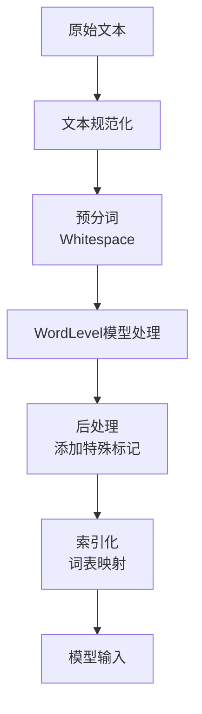

本文主要整理Transformer from scratch的主要内容。

## 1 - model源码解释

### 🔍 输入嵌入与位置编码

1.  **`InputEmbeddings` (词嵌入层)**
    这个模块负责将离散的单词索引（Token IDs）转换为连续的向量表示，这是模型理解语义的基础。
    ```python
    class InputEmbeddings(nn.Module):
        def __init__(self, d_model: int, vocab_size: int) -> None:
            super().__init__()
            self.d_model = d_model  # 嵌入向量的维度，如512
            self.vocab_size = vocab_size
            self.embedding = nn.Embedding(vocab_size, d_model) # 一个查找表

        def forward(self, x):
            # x 形状: (batch_size, seq_len) -> (batch_size, seq_len, d_model)
            return self.embedding(x) * math.sqrt(self.d_model)
    ```
    *   **原理**：`nn.Embedding` 是一个可学习的查找表，将每个单词ID映射为一个 `d_model` 维的向量。
    *   **细节**：在返回前，嵌入结果乘以了 `math.sqrt(self.d_model)`。这是为了在数值上放大嵌入向量，使其与后续的**位置编码**相加时，词嵌入信息能占据主导地位，避免被位置编码淹没 。

2.  **`PositionalEncoding` (位置编码)**
    Transformer模型本身没有循环或卷积结构，因此无法感知单词的顺序。位置编码就是为了给模型注入序列中单词的绝对或相对位置信息。
    ```python
    class PositionalEncoding(nn.Module):
        def __init__(self, d_model: int, seq_len: int, dropout: float) -> None:
            super().__init__()
            self.dropout = nn.Dropout(dropout)
            pe = torch.zeros(seq_len, d_model) # 初始化一个位置编码矩阵
            position = torch.arange(0, seq_len, dtype=torch.float).unsqueeze(1)
            div_term = torch.exp(torch.arange(0, d_model, 2).float() * (-math.log(10000.0) / d_model))
            pe[:, 0::2] = torch.sin(position * div_term)  # 偶数索引使用sin
            pe[:, 1::2] = torch.cos(position * div_term) # 奇数索引使用cos
            pe = pe.unsqueeze(0) # 增加一个批次维度 -> (1, seq_len, d_model)
            self.register_buffer('pe', pe) # 注册为缓冲区，使其不参与参数更新

        def forward(self, x):
            x = x + (self.pe[:, :x.shape[1], :]).requires_grad_(False) # 相加并断开梯度流
            return self.dropout(x)
    ```
    *   **原理**：使用不同频率的正弦和余弦函数来生成位置编码。这种方法的优点是模型能够轻松地学习到**相对位置**信息，并且能外推到比训练时更长的序列 。
    *   **细节**：`register_buffer` 用于注册不参与梯度更新的张量（如位置编码）。`requires_grad_(False)` 确保在相加时位置编码的梯度不被计算，这是一种优化手段。

### 🧠 自注意力与多头机制

1.  **`MultiHeadAttentionBlock` (多头注意力块)**
    这是Transformer的核心创新，它允许模型在处理每个单词时同时关注输入序列中所有其他单词的信息，从而捕捉长距离依赖关系。
    *   **核心公式 - 缩放点积注意力**：
        `Attention(Q, K, V) = softmax( (QK^T) / √d_k ) V`
        其中，`Q`(查询)、`K`(键)、`V`(值)都是由输入线性变换而来。除以 `√d_k` 是为了防止点积结果过大，导致Softmax函数的梯度消失 。
    *   **`attention` 静态方法**：
        ```python
        @staticmethod
        def attention(query, key, value, mask, dropout: nn.Dropout):
            d_k = query.shape[-1]
            scores = (query @ key.transpose(-2, -1)) / math.sqrt(d_k) # 计算注意力分数
            if mask is not None:
                scores.masked_fill_(mask == 0, -1e9) # 应用掩码
            attention_scores = scores.softmax(dim=-1) # 归一化为权重
            if dropout is not None:
                attention_scores = dropout(attention_scores)
            return (attention_scores @ value), attention_scores # 加权求和
        ```
        *   **掩码**：`mask` 是关键。在解码器中，使用**因果掩码**（上三角为1的矩阵）防止模型在生成时看到"未来"的信息 。`masked_fill_` 将掩码为0的位置替换为一个极小的值（-1e9），这样在Softmax后这些位置的权重就几乎为0。

    *   **多头机制**：
        ```python
        def forward(self, q, k, v, mask):
            # 1. 线性投影
            query = self.w_q(q) # (batch, seq_len, d_model)
            ...
            # 2. 分割多头
            query = query.view(query.shape[0], query.shape[1], self.h, self.d_k).transpose(1, 2)
            ...
            # 3. 计算注意力
            x, self.attention_scores = MultiHeadAttentionBlock.attention(query, key, value, mask, self.dropout)
            # 4. 合并多头
            x = x.transpose(1, 2).contiguous().view(x.shape[0], -1, self.h * self.d_k)
            return self.w_o(x) # 最终线性变换
        ```
        *   **原理**：将 `d_model` 维的输入切分成 `h` 个 `d_k` 维的"头"。每个头可以学习并关注不同方面的信息（例如，一个头关注语法关系，另一个头关注指代关系），最后将各头的输出拼接起来，通过 `W_o` 线性层融合信息 。这大大增强了模型的表达能力。

### ⛓️ 残差连接与层归一化

**`ResidualConnection` (残差连接)**
这个模块封装了"Add & Norm"操作，是训练深层Transformer模型的关键。
```python
class ResidualConnection(nn.Module):
    def __init__(self, features: int, dropout: float) -> None:
        super().__init__()
        self.dropout = nn.Dropout(dropout)
        self.norm = LayerNormalization(features) # 你的自定义LayerNorm

    def forward(self, x, sublayer):
        return x + self.dropout(sublayer(self.norm(x))) # 残差连接
```
*   **原理**：
    1.  **层归一化**：首先对输入 `x` 进行层归一化，稳定数据的分布。你的 `LayerNormalization` 类使用可学习的参数 `alpha` (缩放) 和 `bias` (平移)来保持模型的表达能力 。
    2.  **子层计算**：将归一化后的数据传入子层（如注意力或前馈网络）。
    3.  **Dropout**：对子层的输出应用Dropout，是一种正则化手段，防止过拟合。
    4.  **残差连接**：将子层的输出与原始的输入 `x` 相加。这创建了一条"高速公路"，使得梯度可以直接回传，有效缓解了深层网络中的梯度消失问题 。

### 🏗️ 编码器与解码器堆叠

1.  **`EncoderBlock` 与 `Encoder`**
    *   **`EncoderBlock`**：每个编码器层包含一个**自注意力**子层和一个**前馈神经网络**子层，每个子层都被一个 `ResidualConnection` 包裹。
        ```python
        class EncoderBlock(nn.Module):
            def forward(self, x, src_mask):
                # 自注意力子层: Q, K, V 都来自编码器自身的输入
                x = self.residual_connectionsx, lambda x: self.self_attention_block(x, x, x, src_mask)
                # 前馈网络子层: 每个位置独立进行变换
                x = self.residual_connectionsx, self.feed_forward_block
                return x
        ```
        *   **`FeedForwardBlock`**：是一个简单的两层神经网络 `Linear(d_model -> d_ff) -> ReLU -> Linear(d_ff -> d_model)`。它为每个位置的表示提供非线性变换 。
    *   **`Encoder`**：将 `N` 个（例如6个）`EncoderBlock` 堆叠起来。最后一个编码器块的输出将作为解码器**交叉注意力**的 `K` 和 `V`。

2.  **`DecoderBlock` 与 `Decoder`**
    解码器比编码器更复杂，多了一个注意力子层。
    *   **`DecoderBlock`**：
        ```python
        class DecoderBlock(nn.Module):
            def forward(self, x, encoder_output, src_mask, tgt_mask):
                # 1. 掩码自注意力：确保生成当前词时只能看到前面的词
                x = self.residual_connectionsx, lambda x: self.self_attention_block(x, x, x, tgt_mask)
                # 2. 交叉注意力：Query来自解码器，Key和Value来自编码器输出
                x = self.residual_connectionsx, lambda x: self.cross_attention_block(x, encoder_output, encoder_output, src_mask)
                # 3. 前馈网络
                x = self.residual_connectionsx, self.feed_forward_block
                return x
        ```
        *   **掩码自注意力**：使用 `tgt_mask` (因果掩码) 确保自回归性质。
        *   **交叉注意力**：这是连接编码器和解码器的桥梁。解码器利用它来"询问"编码器："根据我目前已经生成的目标序列，源序列中哪些部分是我下一步最应该关注的？" 。
    *   **`Decoder`**：同样堆叠 `N` 个 `DecoderBlock`。

### 🚀 模型组装与训练

1.  **`Transformer` 类与 `build_transformer` 函数**
    *   **`Transformer` 类**：这个类是总装车间，它按逻辑顺序（`encode` -> `decode` -> `project`）将各个模块组装起来，定义了完整的 forward 流程 。
    *   **`build_transformer` 函数**：这是一个**工厂函数**，负责创建并初始化一个配置好的Transformer模型。它简化了模型的构建过程。
    *   **参数初始化**：在 `build_transformer` 的最后，使用了 **Xavier均匀初始化** (`nn.init.xavier_uniform_`) 来初始化所有权重参数。这有助于在训练开始时保持梯度的稳定流动 。

2.  **训练流程概要**
    虽然你的代码中没有训练循环，但典型的训练过程如下：
    ```python
    # 在 build_transformer 外部
    model = build_transformer(src_vocab_size, tgt_vocab_size, ...)
    criterion = nn.CrossEntropyLoss(ignore_index=0) # 忽略填充符
    optimizer = torch.optim.Adam(model.parameters(), lr=1e-4, betas=(0.9, 0.98), eps=1e-9)

    for batch in dataloader:
        src, tgt = batch
        # 教师强制：解码器的输入是目标序列，但向右偏移一位
        tgt_input = tgt[:, :-1]   # 输入：<sos> Word1 Word2 ...
        tgt_output = tgt[:, 1:]    # 预期输出：Word1 Word2 ... <eos>

        optimizer.zero_grad()
        # 前向传播
        encoder_output = model.encode(src, src_mask)
        decoder_output = model.decode(encoder_output, src_mask, tgt_input, tgt_mask)
        output_logits = model.project(decoder_output) # (batch, seq_len, tgt_vocab_size)

        loss = criterion(output_logits.view(-1, tgt_vocab_size), tgt_output.contiguous().view(-1))
        loss.backward()
        torch.nn.utils.clip_grad_norm_(model.parameters(), max_norm=1.0) # 梯度裁剪
        optimizer.step()
    ```
    *   **教师强制**：在训练时，解码器的输入是真实的目标序列（但偏移一位），而不是它自己上一时刻的预测结果，这可以加速收敛 。
    *   **梯度裁剪**：防止梯度爆炸，是训练Transformer等深度网络的重要技巧 。

## 2 - train源码解释

### 🔧 核心组件详解

#### 1. 贪婪解码（Greedy Decode）

```python
def greedy_decode(model, source, source_mask, tokenizer_src, tokenizer_tgt, max_len, device):
    # 预计算编码器输出，每个解码步重复使用
    encoder_output = model.encode(source, source_mask)
    # 用SOS token初始化解码器输入
    decoder_input = torch.empty(1, 1).fill_(sos_idx).type_as(source).to(device)
    
    while True:
        if decoder_input.size(1) == max_len:
            break
            
        # 构建因果掩码，防止看到未来信息
        decoder_mask = causal_mask(decoder_input.size(1)).type_as(source_mask).to(device)
        
        # 解码器前向传播
        out = model.decode(encoder_output, source_mask, decoder_input, decoder_mask)
        
        # 获取下一个token（贪婪选择概率最大的）
        prob = model.project(out[:, -1])
        _, next_word = torch.max(prob, dim=1)
        
        # 将预测的token添加到解码器输入中
        decoder_input = torch.cat([decoder_input, 
                                 torch.empty(1, 1).type_as(source).fill_(next_word.item()).to(device)], dim=1)
        
        if next_word == eos_idx:  # 遇到EOS token停止
            break
```
**原理说明**：
- **自回归生成**：逐个token生成，每个步骤的预测都基于之前生成的所有token
- **因果掩码**：确保解码时只能看到当前位置及之前的信息，不能看到未来信息
- **贪婪策略**：总是选择概率最大的token，计算高效但可能不是全局最优

#### 2. 验证流程

```python
def run_validation(model, validation_ds, tokenizer_src, tokenizer_tgt, max_len, device, ...):
    model.eval()  # 切换到评估模式
    with torch.no_grad():  # 禁用梯度计算
        for batch in validation_ds:
            encoder_input = batch["encoder_input"].to(device)
            encoder_mask = batch["encoder_mask"].to(device)
            
            # 使用贪婪解码生成预测
            model_out = greedy_decode(model, encoder_input, encoder_mask, ...)
            
            # 计算评估指标
            metric = torchmetrics.CharErrorRate()
            cer = metric(predicted, expected)
            writer.add_scalar('validation cer', cer, global_step)
```
**评估指标**：
- **CER（字符错误率）**：衡量字符级别的准确度
- **WER（词错误率）**：衡量词级别的准确度  
- **BLEU**：衡量生成文本与参考文本的相似度，是机器翻译的常用指标

#### 3. 数据预处理流程

##### 3.1 Tokenizer构建
```python
def get_or_build_tokenizer(config, ds, lang):
    if not Path.exists(tokenizer_path):
        tokenizer = Tokenizer(WordLevel(unk_token="[UNK]"))
        tokenizer.pre_tokenizer = Whitespace()
        trainer = WordLevelTrainer(special_tokens=["[UNK]", "[PAD]", "[SOS]", "[EOS]"], min_frequency=2)
        tokenizer.train_from_iterator(get_all_sentences(ds, lang), trainer=trainer)
```
**特殊Token作用**：
- `[UNK]`：处理词汇表外的单词
- `[PAD]`：填充序列到统一长度
- `[SOS]`：序列开始标记
- `[EOS]`：序列结束标记

##### 3.2 数据集划分
```python
# 90%训练，10%验证
train_ds_size = int(0.9 * len(ds_raw))
val_ds_size = len(ds_raw) - train_ds_size
train_ds_raw, val_ds_raw = random_split(ds_raw, [train_ds_size, val_ds_size])
```
这种划分确保模型在未见过的数据上进行验证，防止过拟合。

#### 4. 模型训练核心

##### 4.1 训练循环结构
```python
for epoch in range(initial_epoch, config['num_epochs']):
    model.train()  # 训练模式
    for batch in batch_iterator:
        # 1. 前向传播
        encoder_output = model.encode(encoder_input, encoder_mask)
        decoder_output = model.decode(encoder_output, encoder_mask, decoder_input, decoder_mask)
        proj_output = model.project(decoder_output)
        
        # 2. 损失计算
        loss = loss_fn(proj_output.view(-1, vocab_size), label.view(-1))
        
        # 3. 反向传播
        loss.backward()
        optimizer.step()
        optimizer.zero_grad()
```

##### 4.2 损失函数细节
```python
loss_fn = nn.CrossEntropyLoss(ignore_index=tokenizer_src.token_to_id('[PAD]'), label_smoothing=0.1)
```
**关键参数**：
- `ignore_index=[PAD]`：忽略填充符的损失计算，专注于有效内容
- `label_smoothing=0.1`：正则化技术，防止模型对标签过度自信

#### 5. 关键配置参数

根据代码中的配置，主要参数包括：

| 参数 | 典型值 | 作用 |
|------|--------|------|
| `d_model` | 512 | 模型特征维度 |
| `batch_size` | 可变 | 批处理大小 |
| `num_epochs` | 可变 | 训练轮数 |
| `lr` | 可变 | 学习率 |
| `seq_len` | 可变 | 序列最大长度 |

### 🎯 核心训练技巧

#### 1. 教师强制（Teacher Forcing）
```python
# 训练时：decoder_input是完整的目标序列（右移一位）
decoder_input = batch['decoder_input']  # 包含[SOS] token
label = batch['label']  # 包含[EOS] token，相当于decoder_input右移一位
```
**原理**：训练时使用真实目标序列作为解码器输入，而不是模型自己的预测，加速收敛。

#### 2. 梯度裁剪
```python
torch.nn.utils.clip_grad_norm_(model.parameters(), max_norm=1.0)
```
防止梯度爆炸，提高训练稳定性。

#### 3. 学习率调度
虽然当前代码使用固定学习率，但通常会配合warmup策略：
```python
# 常见优化（参考）
scheduler = get_linear_schedule_with_warmup(
    optimizer, num_warmup_steps=1000, num_training_steps=10000
)
```

### 📊 训练监控与评估

```python
writer = SummaryWriter(config['experiment_name'])
writer.add_scalar('train loss', loss.item(), global_step)
```
实时监控训练损失和验证指标，便于调试和早停。

### 🔄 模型保存与恢复

```python
# 保存检查点
torch.save({
    'epoch': epoch,
    'model_state_dict': model.state_dict(),
    'optimizer_state_dict': optimizer.state_dict(),
    'global_step': global_step
}, model_filename)

# 恢复训练
state = torch.load(model_filename)
model.load_state_dict(state['model_state_dict'])
optimizer.load_state_dict(state['optimizer_state_dict'])
```
支持从中间状态恢复训练，提高训练效率。

## 3 - greedy_decode源码解释

### 🔍 函数参数说明

```python
def greedy_decode(model, source, source_mask, tokenizer_src, tokenizer_tgt, max_len, device):
```
- **model**: 训练好的Transformer模型，包含encode和decode方法
- **source**: 源语言序列的张量表示（如待翻译的英文句子）
- **source_mask**: 源序列的注意力掩码，用于忽略padding部分
- **tokenizer_src/tokenizer_tgt**: 源语言和目标语言的分词器
- **max_len**: 生成序列的最大长度，防止无限循环
- **device**: 计算设备（CPU/GPU）

### 🚀 初始化阶段

```python
sos_idx = tokenizer_tgt.token_to_id('[SOS]')
eos_idx = tokenizer_tgt.token_to_id('[EOS]')

# Precompute the encoder output and reuse it for every step
encoder_output = model.encode(source, source_mask)
# Initialize the decoder input with the sos token
decoder_input = torch.empty(1, 1).fill_(sos_idx).type_as(source).to(device)
```

**关键步骤解析**：
1. **特殊标记索引获取**：`[SOS]`（Start of Sequence）标记序列开始，`[EOS]`（End of Sequence）标记序列结束
2. **编码器输出预计算**：源序列通过编码器一次性处理，生成上下文表示，在后续所有解码步中**重复使用**，避免重复计算
3. **解码器输入初始化**：创建形状为(1, 1)的张量，填充为`[SOS]`的索引，作为解码的起始点

### 🔁 自回归生成循环

```python
while True:
    if decoder_input.size(1) == max_len:
        break
    
    # build mask for target
    decoder_mask = causal_mask(decoder_input.size(1)).type_as(source_mask).to(device)
```

**循环控制逻辑**：
- **长度限制**：当生成的序列长度达到`max_len`时强制退出，防止无限生成
- **因果掩码构建**：`causal_mask`确保解码时只能看到当前位置及之前的信息，不能"偷看"未来token

### 🧠 解码过程核心

```python
# calculate output
out = model.decode(encoder_output, source_mask, decoder_input, decoder_mask)

# get next token
prob = model.project(out[:, -1])
_, next_word = torch.max(prob, dim=1)
```

**解码细节**：
1. **解码器前向传播**：使用编码器输出、当前解码器输入和因果掩码进行计算
2. **概率分布获取**：`out[:, -1]`只取最后一个位置的输出，通过projection层映射到词汇表大小
3. **贪婪选择**：`torch.max(prob, dim=1)`选择概率最高的token作为下一个词

### 🔄 序列更新与终止条件

```python
decoder_input = torch.cat(
    [decoder_input, torch.empty(1, 1).type_as(source).fill_(next_word.item()).to(device)], dim=1
)

if next_word == eos_idx:
    break
```

**序列管理**：
- **动态拼接**：将新预测的token拼接到现有序列末尾，作为下一步的输入
- **终止条件**：当预测到`[EOS]`标记时提前结束，表示序列生成完成

### 📊 贪婪解码的优缺点

#### ✅ 优点
- **计算高效**：每一步只需选择最大概率token，速度很快
- **实现简单**：逻辑清晰，易于理解和调试

#### ❌ 缺点
- **局部最优**：可能错过全局概率更高的序列
- **错误累积**：一旦某步选错，后续生成可能完全偏离
- **缺乏多样性**：确定性策略导致生成结果可预测性较强

### 🆚 与其他解码策略对比

| 解码策略 | 核心思想 | 优点 | 缺点 |
|---------|---------|------|------|
| **Greedy Search** | 每步选概率最大token | 速度快，实现简单 | 可能非全局最优，缺乏多样性 |
| **Beam Search** | 每步保留top-k个候选 | 质量更高，找到更好序列 | 计算量大，速度慢 |
| **Sampling** | 按概率分布随机采样 | 生成多样性强 | 结果不可控，质量不稳定 |

### 💡 实际应用场景

这种贪婪解码策略特别适合：
- **实时翻译系统**：需要快速响应的场景
- **资源受限环境**：计算能力有限的设备
- **初步原型验证**：快速验证模型基本能力

在实际工业级应用中，通常会根据具体需求在**解码质量**和**推理速度**之间进行权衡，选择最适合的解码策略。

## 4 - get_or_build_tokenizer源码解释

核心思想是：**如果分词器已经存在就直接加载，不存在则训练并保存**，避免重复训练。

### 🔍 逐行详细解析

#### 1. 路径检查与构建
```python
tokenizer_path = Path(config['tokenizer_file'].format(lang))
if not Path.exists(tokenizer_path):
```
**作用**：
- 根据配置生成分词器文件路径，通常格式如：`"tokenizer_{lang}.json"`
- 检查该路径下是否已存在训练好的分词器文件
- 如果不存在，进入训练分支；否则进入加载分支

#### 2. 分词器训练流程（不存在时）
```python
# Most code taken from: https://huggingface.co/docs/tokenizers/quicktour
tokenizer = Tokenizer(WordLevel(unk_token="[UNK]"))
tokenizer.pre_tokenizer = Whitespace()
trainer = WordLevelTrainer(special_tokens=["[UNK]", "[PAD]", "[SOS]", "[EOS]"], min_frequency=2)
tokenizer.train_from_iterator(get_all_sentences(ds, lang), trainer=trainer)
tokenizer.save(str(tokenizer_path))
```

##### 2.1 分词器初始化
```python
tokenizer = Tokenizer(WordLevel(unk_token="[UNK]"))
```
- **WordLevel模型**：最简单的分词策略，将每个单词视为一个独立的token
- **unk_token="[UNK]"**：设置未知词标记，当遇到词汇表外的词时使用此标记

##### 2.2 预分词器设置
```python
tokenizer.pre_tokenizer = Whitespace()
```
- **空格分词**：基于空格进行初步分词，适合英文等以空格分隔的语言
- 对于中文等无空格语言，需要更复杂的分词策略

##### 2.3 训练器配置
```python
trainer = WordLevelTrainer(
    special_tokens=["[UNK]", "[PAD]", "[SOS]", "[EOS]"], 
    min_frequency=2
)
```
**特殊标记说明**：
- `[UNK]`：未知词标记（Unknown token）
- `[PAD]`：填充标记（Padding token），用于统一序列长度
- `[SOS]`：序列开始标记（Start of Sequence）
- `[EOS]`：序列结束标记（End of Sequence）

**min_frequency=2**：一个单词至少出现2次才会被加入词汇表，过滤低频噪声词

##### 2.4 训练与保存
```python
tokenizer.train_from_iterator(get_all_sentences(ds, lang), trainer=trainer)
tokenizer.save(str(tokenizer_path))
```
- **训练数据源**：`get_all_sentences(ds, lang)` 从数据集中提取指定语言的所有句子
- **序列化保存**：将训练好的分词器保存为JSON文件，便于后续直接加载

#### 3. 分词器加载（已存在时）
```python
else:
    tokenizer = Tokenizer.from_file(str(tokenizer_path))
```
直接从磁盘加载已训练的分词器，避免重复训练，提高效率。

### 📊 分词器工作流程

整个分词器的构建和使用遵循以下标准化流程：



### 🎯 特殊标记的重要性

每个特殊标记在模型训练中都有特定作用：

| 特殊标记 | 用途 | 示例 |
|---------|------|------|
| `[PAD]` | 填充序列到统一长度 | `["I", "love", "AI", "[PAD]", "[PAD]"]` |
| `[SOS]` | 标记序列开始 | 解码器起始输入 |
| `[EOS]` | 标记序列结束 | 生成完成信号 |
| `[UNK]` | 处理词汇表外单词 | 罕见词或拼写错误 |

### 🆚 与其他分词策略对比

WordLevel分词器简单易用，但也有局限性：

| 分词策略 | 优点 | 缺点 | 适用场景 |
|---------|------|------|---------|
| **WordLevel** | 简单直观，易于调试 | 词汇表可能很大，无法处理未登录词 | 词汇量较小的语言或领域 |
| **BPE** | 能处理未登录词，词汇表紧凑 | 可能产生不直观的子词 | 通用语言模型 |
| **WordPiece** | 平衡单词和子词的优势 | 实现相对复杂 | BERT等模型 |

### 💡 实际应用建议

在实际项目中，可以根据需求调整以下参数：

1. **min_frequency**：根据数据集大小调整，大数据集可以设高些
2. **特殊标记**：根据任务需求增减，如可以添加`[MASK]`用于掩码任务
3. **预分词策略**：对于中文等语言，需要使用不同的预分词器

## 5 - dataset源码解释

这是一个用于Transformer模型的双语数据集类，它负责将原始文本数据转换为模型训练所需的格式化张量。下面我将详细解释每个组件的原理和实现。

### 1. 类初始化（__init__方法）

```python
def __init__(self, ds, tokenizer_src, tokenizer_tgt, src_lang, tgt_lang, seq_len):
    super().__init__()
    self.seq_len = seq_len
    self.ds = ds  # 原始数据集
    self.tokenizer_src = tokenizer_src  # 源语言分词器
    self.tokenizer_tgt = tokenizer_tgt  # 目标语言分词器
    self.src_lang = src_lang  # 源语言代码（如"en"）
    self.tgt_lang = tgt_lang  # 目标语言代码（如"fr"）
    
    # 初始化特殊token
    self.sos_token = torch.tensor([tokenizer_tgt.token_to_id("[SOS]")], dtype=torch.int64)
    self.eos_token = torch.tensor([tokenizer_tgt.token_to_id("[EOS]")], dtype=torch.int64)
    self.pad_token = torch.tensor([tokenizer_tgt.token_to_id("[PAD]")], dtype=torch.int64)
```

**核心功能**：初始化数据集参数和特殊token。`seq_len`定义了模型能处理的最大序列长度，所有序列都会被填充或截断到这个长度。特殊token包括：
- `[SOS]`（Start of Sequence）：序列开始标记
- `[EOS]`（End of Sequence）：序列结束标记  
- `[PAD]`（Padding）：填充标记，用于保持序列长度一致

### 2. 数据获取核心逻辑（__getitem__方法）

#### 2.1 文本提取与分词
```python
src_target_pair = self.ds[idx]
src_text = src_target_pair['translation'][self.src_lang]  # 源文本
tgt_text = src_target_pair['translation'][self.tgt_lang]  # 目标文本

# 使用分词器将文本转换为token ID序列
enc_input_tokens = self.tokenizer_src.encode(src_text).ids  # 源语言token序列
dec_input_tokens = self.tokenizer_tgt.encode(tgt_text).ids  # 目标语言token序列
```

这部分从原始数据集中提取一对翻译文本，并通过分词器将它们转换为数字化的token ID序列，这是模型能够处理的格式。

#### 2.2 填充计算与序列构建

```python
# 计算需要添加的填充token数量
enc_num_padding_tokens = self.seq_len - len(enc_input_tokens) - 2  # 编码器：-2因为要添加<s>和</s>
dec_num_padding_tokens = self.seq_len - len(dec_input_tokens) - 1  # 解码器：-1因为只添加<s>

# 构建编码器输入：[SOS] + tokens + [EOS] + [PAD]...
encoder_input = torch.cat([
    self.sos_token,  # <s>
    torch.tensor(enc_input_tokens, dtype=torch.int64),  # 实际内容tokens
    self.eos_token,   # </s>
    torch.tensor([self.pad_token] * enc_num_padding_tokens, dtype=torch.int64)  # 填充部分
], dim=0)

# 构建解码器输入：[SOS] + tokens + [PAD]...
decoder_input = torch.cat([
    self.sos_token,  # <s>
    torch.tensor(dec_input_tokens, dtype=torch.int64),  # 实际内容tokens  
    torch.tensor([self.pad_token] * dec_num_padding_tokens, dtype=torch.int64)  # 填充部分
], dim=0)

# 构建标签：tokens + [EOS] + [PAD]...
label = torch.cat([
    torch.tensor(dec_input_tokens, dtype=torch.int64),  # 实际内容tokens
    self.eos_token,  # </s>
    torch.tensor([self.pad_token] * dec_num_padding_tokens, dtype=torch.int64)  # 填充部分
], dim=0)
```

**关键设计原理**：
- **教师强制（Teacher Forcing）**：解码器输入是目标序列向右偏移一位（添加[SOS]），而标签是原始目标序列（添加[EOS]）。这样模型在训练时使用真实的前缀来预测下一个token。
- **序列长度统一**：通过填充确保所有序列具有相同长度，便于批量处理。

### 3. 注意力掩码生成

#### 3.1 编码器掩码（encoder_mask）
```python
"encoder_mask": (encoder_input != self.pad_token).unsqueeze(0).unsqueeze(0).int()
```
这是一个**填充掩码**，用于告诉编码器忽略填充部分。它通过比较每个位置是否为[PAD]token来生成布尔掩码，然后转换为整数格式。形状为`(1, 1, seq_len)`，便于在注意力机制中广播。

#### 3.2 解码器掩码（decoder_mask）
```python
"decoder_mask": (decoder_input != self.pad_token).unsqueeze(0).int() & causal_mask(decoder_input.size(0))
```
这是**组合掩码**，结合了填充掩码和因果掩码：
- **填充掩码部分**：`(decoder_input != self.pad_token).unsqueeze(0).int()` 忽略填充token
- **因果掩码部分**：`causal_mask(decoder_input.size(0))` 防止看到未来信息

两者通过按位与操作`&`结合，确保解码器既不能看到填充位置，也不能看到当前时刻之后的未来信息。

### 4. 因果掩码函数（causal_mask）

```python
def causal_mask(size):
    mask = torch.triu(torch.ones((1, size, size)), diagonal=1).type(torch.int)
    return mask == 0
```

**实现原理**：
- `torch.ones((1, size, size))`创建全1方阵
- `torch.triu(..., diagonal=1)`取上三角部分（不包括对角线），下三角和对角线变为0
- `mask == 0`将矩阵转换为布尔掩码，其中`True`表示允许关注的位置，`False`表示被屏蔽的位置

**因果掩码的作用**是确保在生成每个token时，模型只能看到当前位置及之前的信息，而不能"偷看"未来的信息。这是实现自回归生成的关键机制。

### 5. 设计要点总结

这个数据集类的几个关键设计体现了Transformer训练的最佳实践：

1. **序列长度标准化**：通过填充确保批量处理效率
2. **教师强制策略**：使用真实目标序列作为解码器输入，加速训练收敛
3. **注意力控制**：通过组合掩码同时处理填充和因果约束
4. **错误处理**：检查序列长度避免溢出，确保数据完整性

这种设计使得数据集能够为Transformer模型提供格式规范、掩码正确的训练数据，是序列到序列任务的基础。
