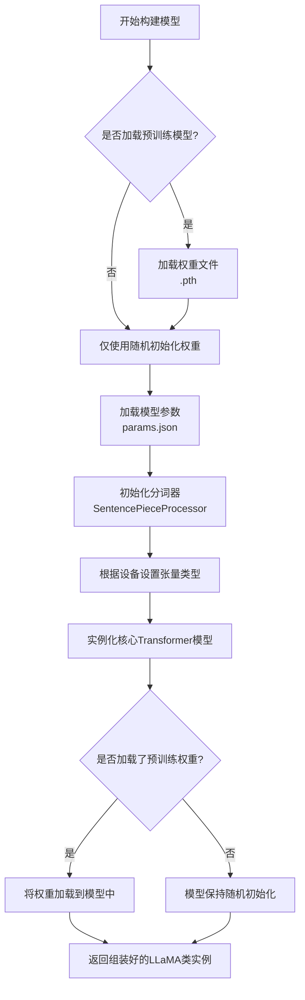
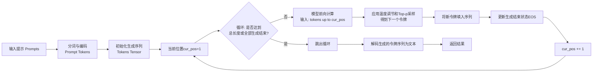

本文主要整理LLaMA from scratch的主要内容。

## 10 - apply_rotary_embeddings

这份代码实现的是Transformer中重要的**旋转位置编码（RoPE）**。它通过旋转操作将位置信息巧妙地注入到注意力机制中，使模型能够感知序列中元素的相对位置。

### 🔧 预计算频率：`precompute_theta_pos_frequencies`

这个函数的目标是预先计算好所有可能位置对应的旋转角度（以复数形式表示），供后续使用。

```python
def precompute_theta_pos_frequencies(head_dim: int, seq_len: int, device: str, theta: float = 10000.0):
    # 1. 维度检查：RoPE要求特征维度为偶数，因为需要将维度两两配对以表示复数。
    assert head_dim % 2 == 0, "Dimension must be divisible by 2"

    # 2. 计算基础频率 (theta_i)
    # 生成序列 [0, 2, 4, ..., head_dim-2]，对应公式中的 (i-1)，i从1开始
    theta_numerator = torch.arange(0, head_dim, 2).float()
    # 核心公式：theta_i = 10000^(-2(i-1)/dim)
    # 结果 theta 的形状为 (head_dim / 2)
    theta = 1.0 / (theta ** (theta_numerator / head_dim)).to(device)

    # 3. 生成位置索引 (m)
    # 生成序列 [0, 1, 2, ..., seq_len-1]，代表序列中的每个位置
    m = torch.arange(seq_len, device=device)

    # 4. 计算外积，得到每个位置每个维度对应的角度
    # 将位置向量m和频率向量theta进行外积运算
    # 结果 freqs 的形状为 (Seq_Len, Head_Dim / 2)
    # 其中 freqs[m, i] 表示在位置m、第i个维度对上的旋转角度
    freqs = torch.outer(m, theta).float()

    # 5. 转换为复数形式（极坐标表示）
    # torch.polar 根据极坐标创建复数：模长（这里设为1）和角度（freqs）
    # 其物理意义是：复数 e^(i * freqs[m, i])，即旋转freqs[m, i]弧度
    freqs_complex = torch.polar(torch.ones_like(freqs), freqs)
    return freqs_complex
```
**关键点**：该函数最终返回一个复数张量 `freqs_complex`，其维度为 `(序列长度, 头维度/2)`。这个张量编码了不同位置、不同特征维度上所需的旋转量。

### ⚙️ 应用旋转嵌入：`apply_rotary_embeddings`

这个函数利用预计算好的复数旋转因子，对查询（Query）和键（Key）向量进行实际的旋转操作。

```python
def apply_rotary_embeddings(x: torch.Tensor, freqs_complex: torch.Tensor, device: str):
    # 1. 将输入向量转换为复数形式
    # x 的形状为 (Batch, Seq_Len, Num_Heads, Head_Dim)
    # 将最后Head_Dim维度两两分组 (x1, x2), (x3, x4), ...，每组视为一个复数 x1 + i*x2
    # 重塑后形状变为 (B, Seq_Len, H, Head_Dim/2, 2)，再通过view_as_complex变为 (B, Seq_Len, H, Head_Dim/2)
    x_complex = torch.view_as_complex(x.float().reshape(*x.shape[:-1], -1, 2))

    # 2. 调整频率张量的形状以支持广播
    # freqs_complex 初始形状为 (Seq_Len, Head_Dim/2)
    # 在批次维度和头维度上增加维度，变为 (1, Seq_Len, 1, Head_Dim/2)
    # 这使得它可以与x_complex (B, Seq_Len, H, Head_Dim/2) 进行逐元素运算
    freqs_complex = freqs_complex.unsqueeze(0).unsqueeze(2)

    # 3. 执行旋转操作（复数乘法）
    # 在复数域，两个复数相乘等价于在极坐标下将它们的模长相乘、角度相加。
    # 这里模长为1，所以复数乘法仅实现旋转： (a+bi) * (cosθ + i*sinθ) = (a*cosθ - b*sinθ) + i*(a*sinθ + b*cosθ)
    # 结果 x_rotated 的形状为 (B, Seq_Len, H, Head_Dim/2)
    x_rotated = x_complex * freqs_complex

    # 4. 将旋转后的复数向量转换回实数表示
    # view_as_real 将复数转换回实数对，形状变为 (B, Seq_Len, H, Head_Dim/2, 2)
    # 最后reshape回原始输入x的形状 (B, Seq_Len, H, Head_Dim)
    x_out = torch.view_as_real(x_rotated)
    x_out = x_out.reshape(*x.shape)

    return x_out.type_as(x).to(device)
```
**关键点**：复数乘法 `x_complex * freqs_complex` 是实现旋转的核心。它将位置信息编码为向量在特征空间中的旋转，从而在计算注意力分数时，点积结果仅依赖于词元的相对位置差 `m-n`。

### 💎 核心价值与总结

1.  **相对位置编码**：RoPE的核心优势在于，它通过旋转使注意力分数 `<f_q(q_m, m), f_k(k_n, n)>` 的结果仅依赖于词元内容 `(q, k)` 和它们的相对位置 `(m-n)`，而非绝对位置 `m` 和 `n`。这更符合语言的内在逻辑。
2.  **远程衰减性**：随着相对距离 `|m-n|` 的增大，旋转角度差增大，内积的期望值会衰减，这符合自然语言中距离越远的词关联性可能越弱的先验。
3.  **实现优雅高效**：利用复数和矩阵运算，实现简洁且易于在GPU上并行计算，成为LLaMA、Mistral等众多主流大语言模型的标准配置。

## 11 - SelfAttention

这份代码实现了一个**支持分组查询注意力** 并集成了**旋转位置编码** 和**KV缓存** 的现代化自注意力模块。它广泛用于LLaMA等大型语言模型的自回归解码推理。

### 🔧 初始化参数解析

初始化函数定义了模型的核心结构参数和投影层：

```python
def __init__(self, args: ModelArgs):
    super().__init__()
    
    # 头数设置：查询头与键值头可以不同，支持分组查询注意力(GQA)
    self.n_kv_heads = args.n_heads if args.n_kv_heads is None else args.n_kv_heads
    self.n_heads_q = args.n_heads  # 查询头数量
    self.n_rep = self.n_heads_q // self.n_kv_heads  # 每个键值头重复使用的次数
    
    # 计算每个注意力头的维度
    self.head_dim = args.dim // args.n_heads
    
    # 线性投影层：将输入映射到Q、K、V空间
    self.wq = nn.Linear(args.dim, args.n_heads * self.head_dim, bias=False)
    self.wk = nn.Linear(args.dim, self.n_kv_heads * self.head_dim, bias=False)
    self.wv = nn.Linear(args.dim, self.n_kv_heads * self.head_dim, bias=False)
    self.wo = nn.Linear(args.n_heads * self.head_dim, args.dim, bias=False)  # 输出投影
    
    # KV缓存：存储历史的键值对，避免重复计算
    self.cache_k = torch.zeros((args.max_batch_size, args.max_seq_len, self.n_kv_heads, self.head_dim))
    self.cache_v = torch.zeros((args.max_batch_size, args.max_seq_len, self.n_kv_heads, self.head_dim))
```

**关键设计解析**：
- **分组查询注意力**：当 `n_kv_heads` < `n_heads_q` 时，多个查询头共享同一组键值头，大幅减少内存占用和计算量
- **KV缓存机制**：在自回归生成中缓存历史键值对，每个新token只需计算当前步的Q、K、V
- **无偏置线性层**：这是Transformer的常见设计选择，为了训练稳定性

### ⚙️ 前向传播流程详解

前向传播是自注意力机制的核心，包含以下关键步骤：

#### **1. 线性投影与张量重塑**
```python
# 将输入投影到Q、K、V空间
xq = self.wq(x)  # [batch_size, seq_len, n_heads_q * head_dim]
xk = self.wk(x)  # [batch_size, seq_len, n_kv_heads * head_dim]  
xv = self.wv(x)  # [batch_size, seq_len, n_kv_heads * head_dim]

# 重塑张量形状，分离出注意力头维度
xq = xq.view(batch_size, seq_len, self.n_heads_q, self.head_dim)
xk = xk.view(batch_size, seq_len, self.n_kv_heads, self.head_dim)
xv = xv.view(batch_size, seq_len, self.n_kv_heads, self.head_dim)
```

#### **2. 应用旋转位置编码**
```python
# 对Q和K应用旋转位置编码
xq = apply_rotary_embeddings(xq, freqs_complex, device=x.device)
xk = apply_rotary_embeddings(xk, freqs_complex, device=x.device)
```
**作用**：通过旋转操作将绝对位置信息以相对位置的方式编码到注意力机制中，使模型能够感知token间的相对距离。

#### **3. KV缓存更新与复用**
```python
# 将当前token的K、V存入缓存
self.cache_k[:batch_size, start_pos : start_pos + seq_len] = xk
self.cache_v[:batch_size, start_pos : start_pos + seq_len] = xv

# 从缓存中读取所有历史K、V（包括当前token）
keys = self.cache_k[:batch_size, :start_pos + seq_len]    # [batch_size, seq_len_kv, n_kv_heads, head_dim]
values = self.cache_v[:batch_size, :start_pos + seq_len] # [batch_size, seq_len_kv, n_kv_heads, head_dim]
```
**设计优势**：缓存机制使模型在生成每个新token时只需计算当前步的注意力，极大提升推理效率。

#### **4. 分组查询注意力实现**
```python
# 重复键值头以匹配查询头数量（分组查询注意力的核心）
keys = repeat_kv(keys, self.n_rep)    # [batch_size, seq_len_kv, n_heads_q, head_dim]
values = repeat_kv(values, self.n_rep) # [batch_size, seq_len_kv, n_heads_q, head_dim]
```
**原理**：当 `n_rep` > 1 时，每个键值头被多个查询头共享，在保持模型表达能力的同时显著减少内存占用。

#### **5. 注意力计算核心**
```python
# 调整维度顺序以进行矩阵乘法
xq = xq.transpose(1, 2)    # [batch_size, n_heads_q, seq_len, head_dim]
keys = keys.transpose(1, 2)    # [batch_size, n_heads_q, seq_len_kv, head_dim]
values = values.transpose(1, 2) # [batch_size, n_heads_q, seq_len_kv, head_dim]

# 计算缩放点积注意力分数
scores = torch.matmul(xq, keys.transpose(2, 3)) / math.sqrt(self.head_dim)

# 应用softmax得到注意力权重
scores = F.softmax(scores.float(), dim=-1).type_as(xq)

# 加权求和：注意力权重与Value相乘
output = torch.matmul(scores, values)  # [batch_size, n_heads_q, seq_len, head_dim]
```
**数学原理**：这一系列操作实现了标准的缩放点积注意力机制，其中Query和Key的点积衡量相关性，softmax归一化后作为权重对Value进行加权求和。

#### **6. 输出投影与形状恢复**
```python
# 合并多头输出并通过线性投影
output = output.transpose(1, 2).contiguous().view(batch_size, seq_len, -1)
return self.wo(output)  # [batch_size, seq_len, dim]
```
**目的**：将多个注意力头的输出合并，并通过线性变换恢复原始维度，以便后续网络层处理。

### 💡 核心机制总结

这个自注意力模块通过三项关键技术优化了大语言模型的推理效率：

1.  **分组查询注意力**：通过让多个查询头共享键值头，在基本保持模型质量的同时，**显著减少了KV缓存的大小和内存带宽需求**
2.  **旋转位置编码**：以相对位置编码的方式提供位置信息，**更好地处理长序列和外推任务**
3.  **KV缓存机制**：在自回归生成过程中避免重复计算，**极大提升推理速度**

## 12 - FeedForward

这份代码实现了一个基于 **SwiGLU 激活函数** 的现代前馈神经网络（FFN）模块，它是 Transformer 模型（特别是 LLaMA 等先进大语言模型）中的核心组件之一。下面我将从整体概况、关键要点、逐行解释和设计对比四个方面进行解读。

### 内容概况
该 `FeedForward` 类是一个**专为现代大语言模型优化**的前馈网络层。它没有采用原始 Transformer 中简单的“线性变换 → ReLU → 线性变换”结构，而是使用了更先进的 **SwiGLU（SiLU 门控线性单元）** 架构。其设计目标是在保持模型表达力的同时，实现更高的参数效率和更好的训练稳定性。

### 要点总结
1.  **核心架构：SwiGLU 门控机制**
    -   该 FFN 的核心是 **SwiGLU 激活函数**，其公式为 `SwiGLU(x) = SiLU(xW) ⊗ xV`，其中 `⊗` 是逐元素相乘。
    -   与仅使用一个权重矩阵的传统 FFN 不同，SwiGLU 使用**三个权重矩阵** (`w1`, `w2`, `w3`) 来实现一个门控结构。`SiLU(self.w1(x))` 作为“门”来控制信息流，`self.w3(x)` 提供原始信息，二者相乘实现更精细的特征调控。

2.  **隐藏层维度的精心计算**
    -   `hidden_dim` 的计算是模型效率的关键。它遵循 LLaMA 论文的设计：
        -   先扩展到 `4 * dim`（基础扩展）
        -   然后缩放 `int(2 * hidden_dim / 3)`（为三矩阵结构保持参数总量均衡）
        -   最后对齐到 `args.multiple_of` 的整数倍（优化硬件计算效率）。
    -   如果提供了 `ffn_dim_multiplier`，还会进行进一步缩放，这为模型容量调整提供了灵活性。

3.  **无偏置（Bias）的线性层**
    -   所有线性层 (`w1`, `w2`, `w3`) 都设置 `bias=False`。这是现代大模型的常见做法，有助于简化模型、提高训练稳定性，并且对最终性能影响甚微。

4.  **在 Transformer 中的角色**
    -   在 Transformer 块中，FFN 位于自注意力层之后。它的核心作用是**提供强大的非线性变换能力**。
    -   自注意力机制负责聚合全局信息（决定“关注什么”），而 FFN 则像一个“专家处理器”，对每个位置的表示进行深度加工和变换，决定“如何处理”这些信息。

### 代码解释

```python
class FeedForward(nn.Module):
    def __init__(self, args: ModelArgs):
        super().__init__()

        # 1. 计算隐藏层维度
        hidden_dim = 4 * args.dim  # 基础扩展：通常扩展4倍
        hidden_dim = int(2 * hidden_dim /  ️)  # 参数平衡：因使用3个矩阵，需调整以控制总参数量
        if args.ffn_dim_multiplier is not None:
            hidden_dim = int(args.ffn_dim_multiplier * hidden_dim)  # 灵活性：允许外部缩放因子
        # 硬件优化：将维度对齐到multiple_of的倍数，提升计算效率（如GPU内存对齐）
        hidden_dim = args.multiple_of * ((hidden_dim + args.multiple_of - 1) // args.multiple_of)

        # 2. 初始化三个线性层（无偏置）
        self.w1 = nn.Linear(args.dim, hidden_dim, bias=False)  # 升维投影（用于门控）
        self.w2 = nn.Linear(hidden_dim, args.dim, bias=False)  # 降维投影（输出投影）
        self.w3 = nn.Linear(args.dim, hidden_dim, bias=False)  # 升维投影（用于值路径）

    def forward(self, x: torch.Tensor):
        # SwiGLU前向传播
        swish = F.silu(self.w1(x))  # 对w1的投影结果应用SiLU激活函数，作为“门”
        x_V = self.w3(x)            # 独立计算值路径
        x = swish * x_V             # 核心门控操作：用门控制值路径的信息流
        x = self.w2(x)               # 最终投影回原始维度，与模块输入维度匹配
        return x
```

### 对比：与原始Transformer FFN及SwiGLU的优势

| 特性 | 原始Transformer FFN | **本代码 (SwiGLU FFN)** |
| :--- | :--- | :--- |
| **结构** | `Linear -> ReLU -> Linear`（两矩阵） | `(SiLU(Linear) * Linear) -> Linear`（三矩阵） |
| **参数量** | ~ \(2 \times d \times 4d\) = \(8d^2\) | 通过调整中间维度，总参数量与原始FFN大致相当 |
| **核心操作** | ReLU激活（简单的单路径非线性变换） | **门控机制**（双路径交互，更精细的特征控制） |
| **优势** | 结构简单，引入非线性 | **更强的表现力**和**更优的训练动态**，成为LLaMA、Gemma等现代大模型的标准选择 |

总之，这个 `FeedForward` 模块体现了大语言模型在基础组件上的精心优化。通过采用 **SwiGLU 门控结构**和**精确的维度计算**，它在模型容量和计算效率之间取得了出色的平衡。

## 13 - LLaMA Transformer

这是一个基于现代架构（如LLaMA）实现的Transformer编码器模型，它采用**仅解码器（Decoder-only）** 的自回归架构，专为文本生成任务设计。

### 🧱 核心组件概览

| 组件 | 类名 | 核心功能 | 关键特征 |
| :--- | :--- | :--- | :--- |
| **词嵌入层** | `nn.Embedding` | 将输入的词索引转换为密集向量。 | 将离散的token ID映射到连续向量空间。 |
| **编码器块** | `EncoderBlock` | 核心处理单元，包含自注意力和前馈网络。 | 使用**RMSNorm**进行归一化，采用**残差连接**。 |
| **自注意力** | `SelfAttention` | 计算序列中每个token与其他token的关联权重。 | 集成**旋转位置编码（RoPE）** 和**KV缓存**。 |
| **前馈网络** | `FeedForward` | 对每个位置的表示进行非线性变换。 | 采用**SwiGLU**激活函数，增强非线性能力。 |
| **最终归一化** | `RMSNorm` | 对最后一层所有编码器块的输出进行归一化。 | 稳定训练，为输出层做准备。 |
| **输出层** | `nn.Linear` | 将最终表示投影回词汇表大小，预测下一个词。 | 将隐藏层维度 `args.dim` 映射到 `vocab_size`。 |

### 🔍 关键代码详解

#### 1. `EncoderBlock`：编码器核心块
`EncoderBlock` 是模型的核心构建块，它顺序地应用自注意力和前馈网络。

-   **归一化策略（RMSNorm）**：与原始Transformer不同，此实现在注意力层和前馈层**之前**进行归一化（Pre-Normalization）。这种策略通常有助于训练更深的网络，提升稳定性。
-   **残差连接**：每个子层（注意力、前馈网络）的输出都会与输入相加，形成残差连接。这有助于缓解深度网络中的梯度消失问题。

```python
class EncoderBlock(nn.Module):
    def __init__(self, args: ModelArgs):
        super().__init__()
        # 注意力机制与前置归一化
        self.attention = SelfAttention(args)
        self.attention_norm = RMSNorm(args.dim, eps=args.norm_eps) # Pre-Norm

        # 前馈网络与前置归一化
        self.feed_forward = FeedForward(args)
        self.ffn_norm = RMSNorm(args.dim, eps=args.norm_eps) # Pre-Norm
    
    def forward(self, x: torch.Tensor, start_pos: int, freqs_complex: torch.Tensor):
        # 1. 注意力子层: Norm -> Attention -> 残差连接
        h = x + self.attention.forward(
            self.attention_norm(x), start_pos, freqs_complex
        )
        # 2. 前馈网络子层: Norm -> FFN -> 残差连接
        out = h + self.feed_forward.forward(self.ffn_norm(h))
        return out
```

#### 2. `Transformer`：整体模型架构
`Transformer` 类将词嵌入、多个编码器块以及输出层组合在一起，构成完整的模型。

-   **位置编码**：模型使用**旋转位置编码（RoPE）**，通过 `freqs_complex` 在注意力计算中注入位置信息。这种方式能让模型更好地理解token间的相对位置。
-   **自回归推理**：`forward` 函数设计为一次处理一个token（`seq_len == 1`），并利用 `start_pos` 参数管理KV缓存，这是典型的高效自回归文本生成方式。

```python
class Transformer(nn.Module):
    def __init__(self, args: ModelArgs):
        super().__init__()
        # 词嵌入层
        self.tok_embeddings = nn.Embedding(self.vocab_size, args.dim)

        # 堆叠N个编码器块
        self.layers = nn.ModuleList([EncoderBlock(args) for _ in range(args.n_layers)])

        # 最终输出前的归一化及线性投影层
        self.norm = RMSNorm(args.dim, eps=args.norm_eps)
        self.output = nn.Linear(args.dim, self.vocab_size, bias=False)

        # 预计算旋转位置编码所需的频率参数
        self.freqs_complex = precompute_theta_pos_frequencies(...)

    def forward(self, tokens: torch.Tensor, start_pos: int):
        # 1. 词嵌入
        h = self.tok_embeddings(tokens)

        # 2. 获取当前位置对应的旋转位置编码
        freqs_complex = self.freqs_complex[start_pos:start_pos + seq_len]

        # 3. 逐层通过编码器块
        for layer in self.layers:
            h = layer(h, start_pos, freqs_complex)

        # 4. 最终归一化并投影到词汇表空间，得到每个词的预测分数
        h = self.norm(h)
        output = self.output(h).float()
        return output
```

### 💡 设计亮点总结

这个Transformer实现体现了现代大语言模型的几项关键优化技术：

1.  **效率优化**：通过**KV缓存**和**旋转位置编码（RoPE）**，极大提升了自回归生成的推理效率。
2.  **结构优化**：采用**Pre-LN**结构和**RMSNorm**，有助于训练更深、更稳定的网络。
3.  **组件现代化**：使用**SwiGLU**激活函数等改进组件，增强了模型的非线性表达能力。

## 14 - LLaMA推理

### 🧱 核心类与初始化

这个 `LLaMA` 类是一个**外壳**，它并不直接定义网络结构，而是将**模型**、**分词器**和**配置参数**组合在一起，并提供模型构建与文本生成的便捷方法。

*   **`__init__` 方法**：非常简单，只是将三个核心组件保存为类的属性。
    *   `self.model`: 核心的 `Transformer` 模型，负责所有的计算。
    *   `self.tokenizer`: `SentencePieceProcessor` 分词器，负责在文本和令牌ID之间进行转换。
    *   `self.args`: 模型的配置参数。

### ⚙️ 模型构建：`build` 静态方法

`build` 方法是核心，它负责**从头开始组装一个LLaMA模型实例**，并可选地加载预训练的权重。其工作流程如下：



**关键步骤解析**：

1.  **加载检查点**：如果 `load_model` 为 `True`，则从 `checkpoints_dir` 目录加载第一个 `.pth` 权重文件。`params.json` 文件则包含了模型的结构超参数（如层数、维度等）。
2.  **初始化组件**：
    *   **分词器**：使用 `SentencePieceProcessor` 加载词表文件，并将词表大小设置到 `model_args` 中。
    *   **模型**：根据配置实例化 `Transformer` 模型。代码中 `torch.set_default_tensor_type` 的设置是为了**节省显存**，使用半精度（`HalfTensor` 即 `float16`）或半浮点精度（`BFloat16Tensor`）进行计算。
3.  **加载权重**：在加载预训练权重时，有一行关键操作 `del checkpoint['rope.freqs']`。这是因为 `rope.freqs`（旋转位置编码的频率）通常是在模型初始化时**动态预计算**的，而非需要保存的模型参数，因此需要从加载的检查点中移除以避免报错。

### 💬 文本生成：`text_completion` 方法

这个方法实现了**自回归生成**，即根据给定的提示（prompt），模型逐个生成后续的 token。其核心循环如下图所示：



**关键步骤解析**：

1.  **准备输入**：将文本提示转换为 token ID 序列，并填充到一个固定大小的张量 `tokens` 中，初始部分为 prompt，其余为填充符（`pad_id`）。
2.  **自回归循环**：这是生成的**核心**。在每一个生成步（`cur_pos`）：
    *   **前向计算**：将当前序列（从开始到 `cur_pos-1`）输入模型，得到下一个 token 的预测逻辑值（logits）。这里模型内部会使用 **KV缓存** 来避免重复计算，提升效率。
    *   **采样下一个 token**：
        *   **温度调节**：`temperature` 参数控制生成的随机性。温度越高（>1），分布越平缓，输出越随机、有创意；温度越低（<1），分布越尖锐，输出越确定；温度为0则退化为贪心搜索（总是选择概率最高的token）。
        *   **Top-p 采样**：调用 `_sample_top_p` 方法，又称**核采样**。它从累积概率超过 `p` 的最小 token 集合中随机抽样，能动态控制候选集的大小，有效避免生成低质量 token，是保证生成质量的关键技术。
    *   **更新序列**：将采样得到的新 token 填入序列的 `cur_pos` 位置。这里有一个巧妙设计：`torch.where(prompt_tokens_mask[:, cur_pos], tokens[:, cur_pos], next_token)`。在 prompt 范围内，它直接使用真实的 prompt token 而非模型输出，这确保了 prompt 被正确传递，也避免了在 prompt 位置进行无效的采样。
3.  **处理输出**：循环结束后，将每个序列中的 token ID 转换回文本。如果生成了结束符（`eos_id`），则提前截断。

### 🎯 辅助方法：`_sample_top_p`

这个方法是 Top-p 采样的具体实现，其流程如下：
1.  **排序**：对概率分布进行降序排序，得到有序的概率值和对应的索引。
2.  **计算累积概率**：计算排序后概率的累积和。
3.  **创建掩码**：找到第一个累积概率大于 `p` 的位置，并将其之后的所有 token 掩蔽（概率置零）。
4.  **重新归一化**：对剩余 token 的概率进行重新归一化，使其和为1。
5.  **采样**：从新的分布中进行多项式采样，得到下一个 token。

