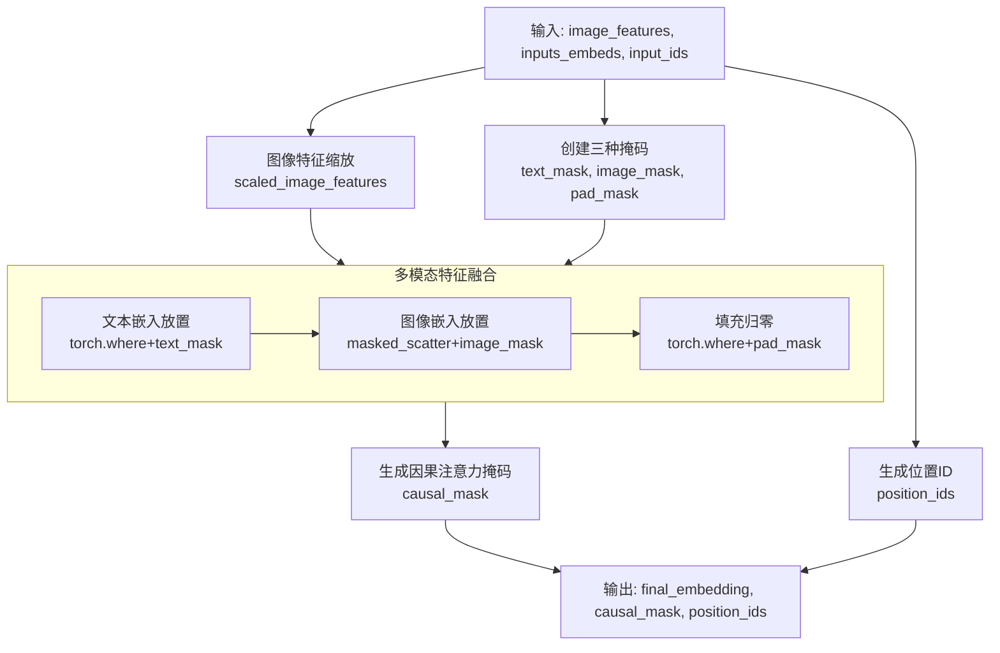
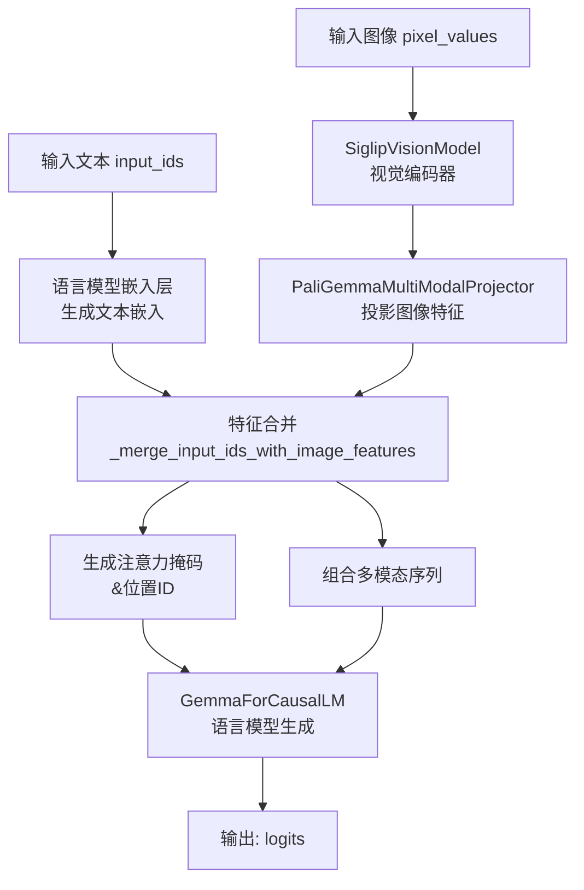

本文主要整理pytorch-paligemma的主要内容。

## 4.0 - GemmaRMSNorm源码分析

GemmaRMSNorm 是一种改进的归一化技术，通过简化计算步骤来提升效率，同时保持良好的性能。

### 🔍 RMSNorm 的核心原理

RMSNorm 的核心思想是**移除 LayerNorm 中的均值中心化操作**，仅使用**均方根** 对激活值进行缩放 。

其计算公式为：
$$
\text{输出} = \frac{\text{输入}}{\text{RMS}(\text{输入}) + \epsilon} \times \gamma
$$
其中，$\text{RMS}(\text{输入}) = \sqrt{\frac{1}{d} \sum_{i=1}^{d} x_i^2}$ 是输入向量在最后一个维度上的均方根值，$\gamma$ 是可学习的缩放参数 。

与 LayerNorm 相比，RMSNorm 省略了减去均值 $\mu$ 的步骤，计算公式简化为仅涉及平方和与均方根 。这种简化带来了两个主要优势：
*   **计算效率更高**：计算量减少，在GPU上，RMSNorm比 LayerNorm 快 7% 到 64% 不等 。
*   **更好的数值稳定性**：不涉及均值计算，避免了均值中心化可能带来的数值精度问题 。

### 🔎 代码实现详解

#### 1. 初始化 `__init__`
```python
def __init__(self, dim: int, eps: float = 1e-6):
    super().__init__()
    self.eps = eps  # 防止除零的小常数
    self.weight = nn.Parameter(torch.zeros(dim)) # 可学习的缩放参数 gamma，初始化为0
```
*   `dim`：输入特征维度。
*   `eps`：一个小常数，保证数值稳定性。
*   `weight`：即可学习参数 $\gamma$。**初始化为零**是一个重要设计 。

#### 2. 归一化计算 `_norm`
```python
def _norm(self, x):
    return x * torch.rsqrt(x.pow(2).mean(-1, keepdim=True) + self.eps)
```
这行代码高效实现了RMSNorm的核心计算：
1.  `x.pow(2)`：计算输入张量最后一个维度上每个元素的平方。
2.  `.mean(-1, keepdim=True)`：计算这些平方值的均值，得到均方值。`keepdim=True` 保持维度以便广播。
3.  `torch.rsqrt(...)`：计算均方值加上 `eps` 后的平方根的倒数，即 $ \frac{1}{\text{RMS}(x) + \epsilon} $。
4.  `x * ...`：输入张量乘以这个倒数，完成归一化缩放。

#### 3. 前向传播 `forward`
```python
def forward(self, x):
    output = self._norm(x.float())  # 步骤1: 计算RMS归一化
    output = output * (1.0 + self.weight.float())  # 步骤2: 应用可学习权重
    return output.type_as(x)  # 步骤3: 恢复原始数据类型
```
*   **步骤1**：调用 `_norm` 方法计算归一化后的张量。这里先转换到 `float32` 可能是为了在低精度训练（如 `bfloat16`）下保持计算精度 。
*   **步骤2**：施加可学习的缩放因子。这是 **Gemma 实现的一个独特之处**：它使用 `output * (1.0 + self.weight)`，而非更常见的 `output * self.weight` 。由于 `weight` 初始为0，这种写法等价于初始阶段缩放因子为1，这可能有助于训练的初始稳定性 。
*   **步骤3**：将最终输出的数据类型恢复为与输入 `x` 一致。

### ⚖️ 与 Llama 的 RMSNorm 对比

Gemma 的 RMSNorm 实现与 Llama 的 RMSNorm 在核心思想上一致，但存在细微而关键的差异 ：

| 特征 | Gemma RMSNorm | Llama RMSNorm (以T5LayerNorm为例) |
| :--- | :--- | :--- |
| **权重初始化** | `torch.zeros(dim)` | `torch.ones(hidden_size)` |
| **前向传播中的权重应用** | `output * (1.0 + self.weight.float())` | `self.weight * hidden_states` |
| **潜在优势** | 权重初始化为0，并通过 `(1 + weight)` 的方式应用，可能有助于训练初始阶段的稳定性 。 | 更直接，是大多数归一化层的标准实现方式。 |

## 4.1 - GemmaMLP源码分析

GemmaMLP 模块是 Gemma 模型中 Transformer 解码器层的核心组件之一，它采用了一种名为 **Gated Linear Unit (GLU)** 的变体结构。下

### 🔧 代码结构解析

#### 1. 初始化：定义三个线性投影层

```python
def __init__(self, config):
    super().__init__()
    self.config = config
    self.hidden_size = config.hidden_size  # 输入输出维度 (如2048)
    self.intermediate_size = config.intermediate_size  # 中间层扩展维度 (如16384)
    
    self.gate_proj = nn.Linear(self.hidden_size, self.intermediate_size, bias=False)
    self.up_proj = nn.Linear(self.hidden_size, self.intermediate_size, bias=False)  
    self.down_proj = nn.Linear(self.intermediate_size, self.hidden_size, bias=False)
```

**维度设计思路**：
- **隐藏层扩展**：中间层维度 `intermediate_size` 通常是 `hidden_size` 的 4-8 倍，这种"瓶颈结构"先扩展后压缩，增强了模型的表示能力 。
- **无偏置设计**：所有线性层均不包含偏置项，这是现代大语言模型的常见做法，有助于训练稳定性。

#### 2. 前向传播：GEGLU激活机制

下面的流程图直观展示了 GemmaMLP 前向传播中的数据变换过程，特别是GEGLU的门控机制：

```mermaid
flowchart TD
    A[输入 x] --> B[gate_proj: 投影到中间维度]
    A --> C[up_proj: 投影到中间维度]
    
    B --> D[GELU激活: 生成门控信号]
    C --> E[逐元素相乘]
    D --> E
    
    E --> F[down_proj: 投影回隐藏维度]
    F --> G[输出 MLP(x)]
```

具体到代码实现，前向传播过程如下：

```python
def forward(self, x):
    return self.down_proj(
        nn.functional.gelu(self.gate_proj(x), approximate="tanh") * self.up_proj(x)
    )
```

这行简洁的代码实现了完整的GEGLU计算，等价于以下分步操作：

```python
def forward_detailed(self, x):
    # 1. 门控路径：计算门控信号
    gate = self.gate_proj(x)  # [Batch, Seq, Hidden] -> [Batch, Seq, Intermediate]
    gate = nn.functional.gelu(gate, approximate="tanh")  # 应用GELU激活
    
    # 2. 值路径：计算原始值
    value = self.up_proj(x)  # [Batch, Seq, Hidden] -> [Batch, Seq, Intermediate]
    
    # 3. 门控相乘：选择性过滤信息
    gated_value = gate * value  # 逐元素相乘，实现门控
    
    # 4. 投影回原始维度
    output = self.down_proj(gated_value)  # [Batch, Seq, Intermediate] -> [Batch, Seq, Hidden]
    
    return output
```

### 💡 核心机制：GEGLU 详解

#### 与传统MLP的对比

| 特征 | 传统MLP (ReLU/GELU) | Gemma的GEGLU |
|------|-------------------|--------------|
| **结构** | `down_proj(activation(up_proj(x)))` | `down_proj(GELU(gate_proj(x)) * up_proj(x))` |
| **参数效率** | 标准 | **更高效**，通过门控机制实现更精细的信息控制  |
| **表达能力** | 线性变换+激活 | **非线性交互**，通过门控机制实现条件化选择 |

#### GEGU的数学原理

GEGLU 是 GLU 的变体，其核心思想是**使用门控机制来控制信息流**：

```
GEGLU(x) = GELU(x·W_gate) ⊙ (x·W_value)
```

其中 `⊙` 表示逐元素相乘。这种设计的优势在于：
- **细粒度控制**：每个维度都可以被独立地激活或抑制，而不是像传统激活函数那样对整个向量做相同操作。
- **梯度流动**：门控机制提供了更好的梯度传播路径，有助于深层网络的训练。

### ⚙️ 在Transformer中的角色

在 Gemma 的解码器层中，MLP 与自注意力机制交替堆叠 ：

```
输入 → 自注意力 → 残差连接&层归一化 → MLP → 残差连接&层归一化 → 输出
```

这种设计让每个token的表征能够：
1.  **通过自注意力**捕获序列中其他token的上下文信息
2.  **通过MLP**在每个位置上进行复杂的非线性变换，增强模型的表达能力

## 4.2 - GemmaForCausalLM源码分析

Gemma 模型采用了经典的**仅解码器（Decoder-Only）** Transformer 架构，专为因果语言建模（即下一个词预测）而设计。下面这张图清晰地展示了您提供的代码中，数据在前向传播过程中的完整流动路径：

```mermaid
flowchart TD
    A[输入: inputs_embeds] --> B[GemmaModel<br>模型主干]
    
    B --> C[嵌入后标准化<br>hidden_states * hidden_size^0.5]
    C --> D[多层解码器堆叠]
    
    subgraph DecoderStack [GemmaDecoderLayer (重复 N 层)]
        direction LR
        S1[子层1: 自注意力] --> S2[残差连接] --> S3[子层2: 前馈网络(MLP)] --> S4[残差连接]
    end

    D --> DecoderStack
    DecoderStack --> E[最终层归一化<br>GemmaRMSNorm]
    E --> F[GemmaForCausalLM<br>语言模型头]
    F --> G[输出: logits]
```

上图展示了数据流的宏观视图，下面我们来深入剖析每个核心模块的职责和关键实现细节。

### 🔧 GemmaDecoderLayer：核心变换单元

`GemmaDecoderLayer` 是构成模型深度的基本构建块，每一层都包含一个**自注意力机制**和一个**前馈神经网络**，并采用**残差连接**和**预归一化** 策略来稳定深层网络的训练。

#### 前向传播流程

其工作流程遵循严格的顺序，如下表所示：

| 步骤 | 操作 | 核心功能 | 输入/输出形状 |
| :--- | :--- | :--- | :--- |
| 1 | `self.input_layernorm(hidden_states)` | **预归一化**：对输入进行归一化，为自注意力计算做准备。 | `[Batch_Size, Seq_Len, Hidden_Size]` |
| 2 | `self.self_attn(...)` | **自注意力计算**：模型利用`GemmaAttention`（集成RoPE和GQA）捕捉序列内部依赖关系。 | `[Batch_Size, Seq_Len, Hidden_Size]` |
| 3 | `residual + hidden_states` | **残差连接**：将注意力层的输出与原始输入相加，缓解梯度消失。 | `[Batch_Size, Seq_Len, Hidden_Size]` |
| 4 | `self.post_attention_layernorm(hidden_states)` | **预归一化**：再次归一化，为前馈网络计算做准备。 | `[Batch_Size, Seq_Len, Hidden_Size]` |
| 5 | `self.mlp(hidden_states)` | **前馈变换**：通过`GemmaMLP`（GEGLU激活）进行非线性变换，增强模型表达能力。 | `[Batch_Size, Seq_Len, Hidden_Size]` |
| 6 | `residual + hidden_states` | **残差连接**：将MLP的输出与注意力层的输出相加。 | `[Batch_Size, Seq_Len, Hidden_Size]` |

**关键技术点**：
*   **预归一化**：在自注意力和MLP**之前**进行层归一化，有助于训练稳定性，是现代Transformer的常见设计。
*   **残差连接**：每个子层的输出都与输入相加，确保梯度能够有效反向传播，是训练深层网络的关键。

### 🏗️ GemmaModel：模型主干

`GemmaModel` 将多个 `GemmaDecoderLayer` 堆叠起来，并封装了嵌入层和最终的归一化层，构成了模型的骨干。

1.  **嵌入层**：`self.embed_tokens` 将输入的词符ID映射为高维向量。
2.  **嵌入标准化**：嵌入后的向量会乘以 \(\sqrt{\text{hidden\_size}}\)，这是为了在后续计算中保持数值范围稳定。
3.  **解码层堆叠**：通过 `self.layers`（一个`ModuleList`）顺序通过所有解码层，逐步提炼和抽象特征。
4.  **最终归一化**：经过所有层处理后，使用 `self.norm`（`GemmaRMSNorm`）对最终输出进行归一化。

### 🎯 GemmaForCausalLM：语言模型封装

`GemmaForCausalLM` 是最外层的封装，负责将 `GemmaModel` 输出的隐藏状态映射为词汇表上的概率分布（logits），以进行下一个词的预测。

*   **语言模型头**：`self.lm_head` 是一个线性层，将隐藏状态的维度（`hidden_size`）投影到词汇表大小（`vocab_size`），输出每个词符作为下一个词的非归一化对数概率。
*   **权重绑定**：`tie_weights()` 方法将 `lm_head` 的权重与输入嵌入层 `embed_tokens` 的权重绑定。这是一种正则化技术，可以减少模型参数数量，并在一些情况下提升性能。
*   **输出**：前向传播返回一个包含 `logits` 的字典。如果提供了 `kv_cache`，也会返回更新后的缓存，这在自回归生成中至关重要。

## 4.3 tie_weights方法

`tie_weights` 方法是现代大语言模型中一项非常重要且巧妙的技术，通常被称为**权重绑定**或**权重共享**。下面这个表格直观地展示了它最直接的影响。

| 特性 | 绑定前 | 绑定后 |
| :--- | :--- | :--- |
| **`lm_head` 的权重来源** | 独立随机初始化的矩阵 | 直接指向 `embed_tokens.weight` |
| **参数量** | 约 `2 * vocab_size * hidden_size` | 约 `1 * vocab_size * hidden_size` |
| **内存占用** | 更高 | **显著降低**（减少约一半） |
| **`lm_head` 是否需要单独保存/加载** | 是 | 否（因其与嵌入层共享） |

### 💡 核心原理

这行代码 `self.lm_head.weight = self.model.embed_tokens.weight` 的核心作用是让语言模型头部的投影层 (`lm_head`) 和输入嵌入层 (`embed_tokens`) **共享同一个权重矩阵**。

在技术上，它通过让 `lm_head.weight` 直接引用 `embed_tokens.weight` 在内存中的同一块数据来实现。这意味着：
*   **任何一方的权重更新都会立即反映在另一方**。
*   模型不再需要为 `lm_head` 单独分配和存储一个巨大的权重矩阵（对于大词汇量模型，这个矩阵可能占用数百MB甚至GB的内存）。

### 🎯 三大优势

权重绑定之所以被广泛采用（在GPT、LLaMA、Gemma等模型中常见），主要基于以下三大优势：

1.  **大幅减少参数量和内存占用**
    这是最直接的好处。对于一个典型的语言模型，其词汇表规模（`vocab_size`）可能高达数万甚至数十万，而隐藏层维度（`hidden_size`）通常为数千。`embed_tokens` 和 `lm_head` 是两个形状均为 `(vocab_size, hidden_size)` 的巨大矩阵。权重绑定使参数量几乎减半，这对于模型的存储、加载和在资源受限环境中的部署至关重要。

2.  **作为一种有效的正则化手段**
    从机器学习角度看，权重绑定是一种强大的**正则化技术**。它强制模型在同一个向量空间中对输入词符进行编码（`embed_tokens`）和对输出概率进行解码（`lm_head`）。这相当于为模型施加了一个约束，要求它学习到的词表示必须同时适用于“理解输入”和“生成输出”这两个任务。这种约束可以防止模型过拟合训练数据，从而**可能提高模型的泛化能力和最终性能**。

3.  **可能提升训练稳定性**
    通过绑定权重，模型在训练时梯度信号需要同时优化同一个权重矩阵以服务于编码和解码两个目标。这种一致性有时能够使训练过程更加平滑和稳定。

### ⚙️ 实现与细节

在代码中，权重绑定通常通过一个简单的 `tie_weights()` 方法实现，正如你所见：
```python
def tie_weights(self):
    self.lm_head.weight = self.model.embed_tokens.weight
```

在实际的模型架构（如Gemma）中，这个操作通常在模型初始化时根据配置参数（例如 `config.tie_word_embeddings`）来决定是否执行。在加载预训练模型权重时，如果启用了权重绑定，加载器会智能地跳过 `lm_head.weight`，因为它已经和 `embed_tokens.weight` 共享，从而避免重复加载。

## 5.0 _merge_input_ids_with_image_features源码分析

`_merge_input_ids_with_image_features` 方法是 PaliGemma 这类多模态大模型的核心组件，它巧妙地解决了如何将**图像特征**与**文本特征**融合成一个**统一的序列**，以便语言模型能够理解。下面这个流程图直观地展示了该方法的完整工作流程和关键步骤：



### 🔍 多模态序列构建原理

在 PaliGemma 中，输入序列 `input_ids` 是一个包含**特殊标记**、**文本标记**和可能的**填充标记**的序列。例如，一个序列可能是这样的：
`[<image>, <image>, ..., text_token_1, text_token_2, ..., <pad>]`
这里的 `<image>` 是一个特殊的占位符，表示“此处应填入图像特征”。该方法的核心任务就是识别出这些位置，并将对应的图像特征“填充”进去，构建出语言模型能够理解的、融合了多模态信息的嵌入序列。

### ⚙️ 关键步骤详解

#### 1. 图像特征缩放 (Scaling)

```python
scaled_image_features = image_features / (self.config.hidden_size**0.5)
```
这行代码对图像特征进行了缩放。这是一种**数值稳定化**技巧。因为后续语言模型可能会对输入进行归一化处理，预先缩放可以使图像特征的尺度与文本嵌入的尺度更加匹配，防止因模态间量纲差异过大导致训练不稳定或注意力机制失效。

#### 2. 掩码创建与特征融合

方法创建了三个关键的布尔掩码来区分序列中不同性质的部分：

| 掩码类型 | 生成逻辑 | 作用 |
| :--- | :--- | :--- |
| **文本掩码** (`text_mask`) | `(input_ids != image_token_index) & (input_ids != pad_token_id)` | 标识所有需要保留原始文本嵌入的位置。 |
| **图像掩码** (`image_mask`) | `input_ids == image_token_index` | 标识所有需要被图像特征替换的 `<image>` 占位符位置。 |
| **填充掩码** (`pad_mask`) | `input_ids == pad_token_id` | 标识所有填充位置，这些位置的特征应被置为零。 |

融合过程遵循一个清晰的优先级，如下表所示：

| 步骤 | 操作 | 使用的函数 | 说明 |
| :--- | :--- | :--- | :--- |
| **① 填入文本** | 在 `text_mask` 为 `True` 的位置，用 `inputs_embeds` 的值覆盖 `final_embedding` 的对应位置。 | `torch.where` | 奠定序列的文本基础。 |
| **② 填入图像** | 将 `scaled_image_features` 中的图像特征，按照 `image_mask` 为 `True` 的位置，**散射**到 `final_embedding` 中。 | `masked_scatter` | 这是将视觉信息注入序列的关键一步。由于图像特征的序列长度（num_patches）通常与序列中 `<image>` 标记的数量相同，无法使用 `torch.where`，因此选用 `masked_scatter`。 |
| **③ 处理填充** | 在 `pad_mask` 为 `True` 的位置，将 `final_embedding` 的对应位置置为零。 | `torch.where` | 确保填充部分不携带任何有效信息，干扰模型计算。 |

#### 3. 注意力掩码与位置ID生成

为了指导语言模型如何正确地关注这个新构建的多模态序列，该方法还生成了两个至关重要的组件：`causal_mask` 和 `position_ids`。

- **因果注意力掩码**：它的生成逻辑取决于当前是否处于**自回归生成**阶段（即是否使用了 `kv_cache`）。
    - **预填充阶段**：当 `kv_cache` 为空时，模型一次性处理整个输入提示。此时，`causal_mask` 被初始化为一个全零矩阵，**不屏蔽任何信息**，允许每个标记关注序列中的所有先前标记，这对于理解图像和文本的全局上下文至关重要。
    - **生成阶段**：当使用 `kv_cache` 进行逐个标记生成时，当前查询序列长度 `q_len` 为1。`causal_mask` 被构造成允许这**单个新标记**关注所有已生成的标记（包括之前缓存的KV和当前标记本身），同时保持自回归特性。

- **位置ID**：位置ID告诉模型每个标记在序列中的顺序。
    - **生成阶段**：如果使用了 `kv_cache`，则新标记的位置ID是之前序列长度的累计和，即接续之前的位置。
    - **预填充阶段**：位置ID通过计算 `attention_mask` 的累计和来生成，并为掩码为0的填充位置赋予一个默认位置（如1），以防止模型学习到无意义的位置信息。

## 5.1 PaliGemmaForConditionalGeneration源码分析

PaliGemma 是一个由 Google 开发的多模态视觉语言模型（VLM），它能够同时处理图像和文本输入，并生成文本输出。您提供的代码定义了 PaliGemma 的核心架构，包括多模态投影器和条件生成模型。下面我将详细解释这两个类的源码实现及其工作原理。

### 1. PaliGemmaMultiModalProjector 类：模态对齐的桥梁

`PaliGemmaMultiModalProjector` 是一个简单的**线性投影层**，其核心作用是将视觉编码器提取的图像特征映射到语言模型能够理解的语义空间。

```python
class PaliGemmaMultiModalProjector(nn.Module):
    def __init__(self, config: PaliGemmaConfig):
        super().__init__()
        self.linear = nn.Linear(config.vision_config.hidden_size, config.vision_config.projection_dim, bias=True)
```

- **初始化过程**：
  - `config.vision_config.hidden_size`：视觉编码器（如 SigLIP）输出的特征维度（例如 1152）。
  - `config.vision_config.projection_dim`：目标投影维度，通常与语言模型（如 Gemma）的隐藏层维度（例如 2048）一致。
  - 该线性层将视觉特征从 `vision_hidden_size` 投影到 `projection_dim`，确保视觉和文本特征在同一个向量空间中对齐。

- **前向传播**：
  ```python
  def forward(self, image_features):
      hidden_states = self.linear(image_features)  # 形状: [B, Num_Patches, vision_dim] -> [B, Num_Patches, projection_dim]
      return hidden_states
  ```
  - 输入 `image_features` 是视觉编码器输出的图像块特征（例如，将图像分割为 14x14 的块，共 256 个块，每个块编码为 1152 维向量）。
  - 输出是投影后的特征，维度与文本嵌入一致，便于后续融合。

**设计意义**：  
PaliGemma 选择简单的线性投影器而非复杂的 MLP，是因为实验表明线性层已能有效实现模态对齐，且计算更高效。这减少了模型参数量的同时，保持了强大的多模态融合能力。

### 2. PaliGemmaForConditionalGeneration 类：多模态融合与生成引擎

`PaliGemmaForConditionalGeneration` 是模型的主类，负责协调视觉编码、特征投影、多模态序列构建和文本生成的全过程。

#### 初始化组件
```python
class PaliGemmaForConditionalGeneration(nn.Module):
    def __init__(self, config: PaliGemmaConfig):
        super().__init__()
        self.config = config
        self.vision_tower = SiglipVisionModel(config.vision_config)  # 视觉编码器
        self.multi_modal_projector = PaliGemmaMultiModalProjector(config)  # 投影器
        self.language_model = GemmaForCausalLM(config.text_config)  # 语言模型
        self.pad_token_id = self.config.pad_token_id  # 填充标记ID
```
- **视觉塔（`vision_tower`）**：基于 SigLIP 的视觉编码器，将图像转换为一系列图像块特征。
- **语言模型（`language_model`）**：基于 Gemma 的因果语言模型，负责文本生成。
- **投影器（`multi_modal_projector`）**：连接视觉和语言模态的桥梁。

#### 前向传播流程
前向传播过程可分为以下几个关键步骤，其整体数据流如下图所示：



具体到代码中，每一步的实现如下：

1.  **输入验证与文本嵌入提取**
    ```python
    assert torch.all(attention_mask == 1), "The input cannot be padded"  # 确保输入无填充
    inputs_embeds = self.language_model.get_input_embeddings()(input_ids)  # 文本ID → 嵌入向量
    ```
    - 模型要求输入必须是右填充的，否则会触发断言错误，这简化了序列处理的逻辑。
    - 通过语言模型的嵌入层将离散的文本 ID 转换为连续的向量表示。

2.  **视觉特征提取与投影**
    ```python
    selected_image_feature = self.vision_tower(pixel_values.to(inputs_embeds.dtype))  # 图像编码
    image_features = self.multi_modal_projector(selected_image_feature)  # 投影对齐维度
    ```
    - 视觉编码器将图像转换为特征序列（例如，224x224 图像会得到 256 个图像块特征）。
    - 投影器将视觉特征维度对齐到文本嵌入空间（例如 1152 → 2048）。

3.  **多模态序列构建（核心）**
    ```python
    inputs_embeds, attention_mask, position_ids = self._merge_input_ids_with_image_features(
        image_features, inputs_embeds, input_ids, attention_mask, kv_cache
    )
    ```
    - 此方法（代码未完整展示，但逻辑关键）将图像特征插入到文本序列中对应 `<image>` 标记的位置。例如，输入序列可能是 `[<image>, <image>, "What", "is", "this?"]`，图像特征会被精确地替换前两个 `<image>` 标记。
    - 同时生成正确的注意力掩码和位置 ID：
        - **注意力掩码**：在预填充阶段（`kv_cache` 为空）使用全注意力，允许图像和文本 token 相互关注；在生成阶段使用因果掩码，确保自回归性。
        - **位置 ID**：为序列中的每个 token 分配位置信息，对于使用旋转位置编码的 Gemma 模型至关重要。

4.  **语言模型推理**
    ```python
    outputs = self.language_model(
        attention_mask=attention_mask,
        position_ids=position_ids,
        inputs_embeds=inputs_embeds,
        kv_cache=kv_cache,
    )
    ```
    - 将融合后的多模态序列、注意力掩码和位置 ID 输入语言模型，完成最终的理解和生成任务。


