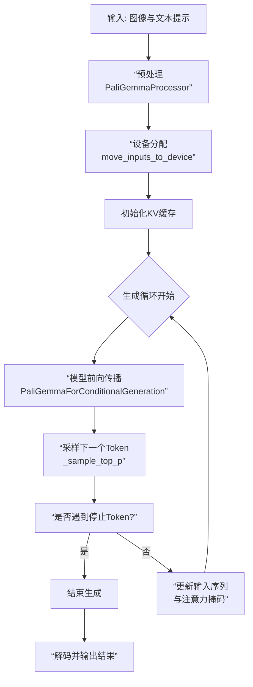

本文主要整理pytorch-paligemma的主要内容。

## 6 - PaliGemma预处理

### 图像预处理函数

图像预处理函数负责将原始图像像素值转换为模型所需的标准化张量，其整体流程遵循深度学习模型的常见图像处理范式。

#### 1. `resize` 函数：图像尺寸标准化
```python
def resize(image: Image, size: Tuple[int, int], resample: Image.Resampling = None, ...) -> np.ndarray:
    height, width = size
    resized_image = image.resize((width, height), resample=resample, ...)
    return resized_image
```
- **功能**：将输入图像调整为固定尺寸（如 224×224、448×448），确保所有输入图像具有相同空间维度，便于批量处理。
- **关键参数**：
  - `resample`：指定重采样算法（如 `Image.Resampling.BICUBIC`），平衡速度与质量。双三次插值能减少锯齿效应，适合视觉任务 。
  - `size`：目标尺寸，对应模型输入分辨率（如 PaliGemma 支持 224/448/896px ）。
- **意义**：统一图像尺寸是模型处理可变分辨率输入的基础。

#### 2. `rescale` 函数：像素值归一化
```python
def rescale(image: np.ndarray, scale: float, dtype: np.dtype = np.float32) -> np.ndarray:
    rescaled_image = image * scale  # 通常 scale=1/255.0
    return rescaled_image.astype(dtype)
```
- **功能**：将像素值从 [0, 255] 整数范围线性缩放到 [0.0, 1.0] 浮点范围。
- **原因**：浮点运算更稳定，且缩放后数据分布利于梯度下降优化 。

#### 3. `normalize` 函数：数据分布标准化
```python
def normalize(image: np.ndarray, mean: List[float], std: List[float]) -> np.ndarray:
    mean = np.array(mean)  # 例如 ImageNet 均值 [0.485, 0.456, 0.406]
    std = np.array(std)    # 例如 ImageNet 标准差 [0.229, 0.224, 0.225]
    return (image - mean) / std
```
- **功能**：使用数据集的均值和标准差对每个通道进行标准化，使输入分布接近均值为 0、标准差为 1 的正态分布。
- **意义**：加速模型收敛，避免某些通道数值过大主导训练 。

#### 4. `process_images` 函数：集成处理管道
```python
def process_images(images: List[Image.Image], size: Dict, resample: ..., rescale_factor: ..., ...) -> List[np.ndarray]:
    # 1. 调整大小
    images = [resize(image, size=(height, width), resample=resample) for image in images]
    # 2. 转换为数组并缩放像素值
    images = [np.array(image) for image in images]
    images = [rescale(image, scale=rescale_factor) for image in images]
    # 3. 标准化
    images = [normalize(image, mean=image_mean, std=image_std) for image in images]
    # 4. 调整维度顺序: [H, W, C] -> [C, H, W]
    images = [image.transpose(2, 0, 1) for image in images]
    return images
```
- **核心作用**：封装完整的图像预处理流程，输出形状为 `[Batch, Channels, Height, Width]` 的张量，符合视觉编码器（如 SigLIP）的输入要求 。
- **维度调整**：将通道维度移至最前，适配 PyTorch/TensorFlow 等框架的图像张量布局。

### 提示词构建函数分析

#### `add_image_tokens_to_prompt` 函数：多模态序列构建
```python
def add_image_tokens_to_prompt(prefix_prompt, bos_token, image_seq_len, image_token):
    return f"{image_token * image_seq_len}{bos_token}{prefix_prompt}\n"
```
- **输入组件**：
  - `image_token * image_seq_len`：图像占位符（如 `<image>`）重复 `image_seq_len` 次（对应图像分块数量，如 14×14=256 ）。
  - `bos_token`：文本序列开始标记（如 `<bos>`），标识语言输入起始。
  - `prefix_prompt`：任务描述或问题（如 “描述这张图片”）。
  - `\n`：作为分隔符（功能类似 [SEP]），区分前缀与模型待生成的答案 。
- **输出示例**：`"<image>*256<bos>这是什么图片？\n"`。
- **设计原理**：
  - **序列化融合**：将图像特征视为特殊标记与文本拼接，形成统一序列，使语言模型（Gemma）能同时处理多模态信息 。
  - **因果注意力机制**：在生成阶段，模型仅关注当前及之前的位置，确保自回归生成的正确性 。

### 预处理在 PaliGemma 工作流中的角色

1. **输入对齐**  
   - 图像通过 `process_images` 转换为视觉编码器（SigLIP）可处理的张量，输出图像块特征。
   - 文本通过分词器转换为 ID 序列，并与图像占位符组合成提示词。

2. **特征融合**  
   - 视觉编码器提取的特征通过线性投影层对齐到语言模型隐藏维度 。
   - 图像特征通过 `masked_scatter` 等操作替换提示词中的 `<image>` 占位符，形成最终输入序列 。

3. **模型推理**  
   融合后的序列输入语言模型，执行视觉问答、描述生成等任务 。

### 关键设计思想

1. **解耦单模态预处理**：图像和文本独立处理，再利用投影层对齐模态，降低设计复杂度 。
2. **可扩展性**：通过调整 `size` 参数支持多分辨率输入（如 224/448/896px），适应不同粒度任务 。
3. **训练稳定性**：标准化和归一化操作抑制输入差异导致的数值波动，提升收敛效率 。

## 7 - PaliGemmaProcessor

### 🏗️ 初始化：构建多模态词汇表

在 `__init__` 方法中，处理器为模型准备了一个**增强的词汇表**，使其能够理解并处理视觉和空间信息。

```python
def __init__(self, tokenizer, num_image_tokens: int, image_size: int):
    # ... 基础参数设置 ...
    tokens_to_add = {"additional_special_tokens": [self.IMAGE_TOKEN]}
    tokenizer.add_special_tokens(tokens_to_add)
    # 添加检测和分割专用标记
    EXTRA_TOKENS = [f"<loc{i:04d}>" for i in range(1024)]  # 边界框坐标
    EXTRA_TOKENS += [f"<seg{i:03d}>" for i in range(128)]  # 分割掩码
    tokenizer.add_tokens(EXTRA_TOKENS)
    # 禁用自动添加BOS/EOS，由处理器精确控制
    tokenizer.add_bos_token = False
    tokenizer.add_eos_token = False
```

**关键技术点**：
- **`<image>` 占位符**：作为一个特殊的标记，它在输入序列中预留出位置，后续会被真实的图像特征所替换。这相当于在文本流中为图像“预留座位”。
- **空间标记**：`<loc0000>` 到 `<loc1023>` 用于表示物体检测中的边界框坐标（通常是归一化的 y_min, x_min, y_max, x_max），而 `<seg000>` 到 `<seg127>` 则用于处理图像分割任务。这使得模型不仅能描述图像内容，还能**精确定位和分割其中的物体**。
- **序列控制**：通过 `add_bos_token = False` 和 `add_eos_token = False`，处理器**全权负责**在序列的精确位置添加开始符（`<bos>`）和换行符（`\n`），确保输入格式与模型训练时的格式完全一致，这是保证模型正确理解指令的关键。

### 🔄 调用流程：多模态数据对齐

`__call__` 方法是核心，它高效地并行处理图像和文本，并将它们对齐到同一个语义空间。其工作流程如下图所示：

```mermaid
flowchart TD
    A[原始图像<br>Image.Image] --> B[“process_images函数<br>标准化 & 归一化”]
    B --> C[“像素张量<br>pixel_values<br>shape: [1, C, H, W]”]
    
    D[原始文本<br>str] --> E[“add_image_tokens_to_prompt函数<br>添加图像占位符与特殊标记”]
    E --> F[“格式化提示词<br>e.g. &lt;image&gt;*256&lt;bos&gt;What is...n”]
    F --> G[“分词器 Tokenizer<br>转换为Token ID”]
    G --> H[“文本张量<br>input_ids & attention_mask”]
    
    C --> I[“最终返回字典<br>包含图像&文本张量”]
    H --> I
```

具体到代码中，每一步的实现如下：

**1. 图像预处理**
```python
pixel_values = process_images(images, size=(self.image_size, self.image_size), ...)
pixel_values = np.stack(pixel_values, axis=0)  # 列表 -> 批量张量
pixel_values = torch.tensor(pixel_values)
```
- **目的**：将 PIL.Image 对象转换为标准化、数值化的 PyTorch 张量，以供视觉编码器（如 SigLIP）处理。
- **过程**：这通常包括将图像缩放到固定尺寸（如 224x224）、将像素值从 [0, 255] 归一化到 [0, 1] 或使用 ImageNet 的均值和标准差进行标准化，最后调整维度顺序为 PyTorch 格式 `[Batch, Channels, Height, Width]`。

**2. 文本预处理与序列构建**
这是多模态融合最关键的一步，处理器将指令和图像信息打包成一个序列。
```python
input_strings = [ add_image_tokens_to_prompt(
    prefix_prompt=prompt,
    bos_token=self.tokenizer.bos_token,
    image_seq_len=self.image_seq_length,  # 关键：图像令牌数量
    image_token=self.IMAGE_TOKEN
) for prompt in text ]
```
- **图像令牌数量计算**：`num_image_tokens` 并非随意设定。它由公式 `(image_size / patch_size) ** 2` 决定。例如，对于 224x224 的图像和 14x14 的块大小，会生成 `(224/14)^2 = 256` 个图像块，因此需要 256 个 `<image>` 标记作为占位符。448x448 的图像则需要 1024 个。
- **序列格式化**：函数会将提示词格式化为类似 `"<image>*256<bos>What is on the flower?\n"` 的字符串。这里的换行符 `\n` 是模型训练时提示词的重要部分，用于明确区分指令和模型应生成的答案。

**3. 标记化与张量封装**
格式化后的字符串随后被分词器转换为 Token ID（`input_ids`）和注意力掩码（`attention_mask`），并与图像像素张量一起封装返回，为模型的前向计算做好准备。

## 8 - PaliGemma inference

这段代码实现了一个基于 PaliGemma 多模态模型的推理管道，支持图像和文本输入，并生成文本输出。下面我将从**代码结构、核心组件、工作流程**三个方面进行详细分析，并结合 PaliGemma 模型的原理进行解释。

### 🏗️ 代码整体架构与组件

该代码是一个完整的 PaliGemma 模型推理脚本，采用模块化设计，主要通过命令行参数控制推理过程。以下是核心组件及其作用：

| 组件/模块 | 功能描述 | 关键技术点 |
| :--- | :--- | :--- |
| **PaliGemmaProcessor** | 多模态输入处理器，负责图像预处理和文本标记化 | 将图像调整为模型指定尺寸，归一化像素值；在文本前添加图像占位符  |
| **PaliGemmaForConditionalGeneration** | 核心模型，包含视觉编码器（SigLIP）和语言模型（Gemma） | 视觉编码器提取图像特征，语言模型进行多模态理解和文本生成  |
| **KVCache** | 键值缓存机制，用于加速自回归生成 | 存储历史计算的Key和Value向量，避免重复计算  |
| **采样函数 (_sample_top_p)** | 控制文本生成多样性的解码策略 | 实现Top-p（核）采样，平衡生成质量与多样性  |

### 🔄 核心工作流程详解

下图展示了代码执行推理的完整数据流和核心步骤：



具体到代码中，每一步的实现如下：

#### 1. 初始化与输入预处理 (`main` 函数)

代码首先处理设备分配和模型加载：
```python
device = "cpu"
if not only_cpu:
    if torch.cuda.is_available(): device = "cuda"
    elif torch.backends.mps.is_available(): device = "mps"
```
模型加载后，初始化处理器 `PaliGemmaProcessor`，它需要两个关键参数：
- `num_image_tokens`: 图像被分割成的块数，由公式 `(image_size / patch_size)^2` 计算得出（例如，224x224图像，patch_size=14，则有256个块）。
- `image_size`: 模型训练时指定的输入图像分辨率（如224, 448, 896）。

在 `get_model_inputs` 函数中，处理器执行以下关键操作：
- **图像预处理**：调整大小、归一化像素值，并转换为张量 。
- **文本处理**：在提示词前添加大量 `<image>` 标记作为占位符（数量等于 `num_image_tokens`），这些占位符在模型内部会被真实的图像特征替换 。

#### 2. 自回归生成循环 (`test_inference` 函数)

这是推理的核心部分，模型以自回归方式逐个生成 token：
```python
for _ in range(max_tokens_to_generate):
    outputs = model(input_ids=input_ids, pixel_values=pixel_values, 
                    attention_mask=attention_mask, kv_cache=kv_cache)
    next_token_logits = outputs["logits"][:, -1, :] # 取最后一个位置的logits
    # ... 采样下一个token ...
    generated_tokens.append(next_token)
```
**关键技术机制**：
- **KV Cache**: 在循环开始时初始化一个空的 `KVCache`。在每一步生成中，模型会返回更新后的 `kv_cache` 并用于下一步。这避免了为每个新 token 重新计算之前所有 token 的 Key 和 Value 张量，将生成步骤的复杂度从 O(n^2) 降低到 O(n)，极大提升了长文本生成的效率 。
- **停止条件**：循环会在生成 `max_tokens_to_generate` 个 token 或遇到代表序列结束的 `eos_token_id` 时停止。

#### 3. 采样策略 (`_sample_top_p` 函数)

代码提供了两种生成模式：
- **贪婪解码** (`do_sample=False`): 直接选择概率最高的 token (`torch.argmax`)，结果确定性强。
- **随机采样** (`do_sample=True`): 使用 Top-p 采样，增加生成文本的多样性。
```python
def _sample_top_p(probs: torch.Tensor, p: float):
    # 对概率排序并计算累积概率
    probs_sort, probs_idx = torch.sort(probs, descending=True)
    probs_sum = torch.cumsum(probs_sort, dim=-1)
    # 掩码掉累积概率超过p的token
    mask = probs_sum - probs_sort > p
    probs_sort[mask] = 0.0
    # 重新归一化概率并采样
    probs_sort.div_(probs_sum.max(dim=-1, keepdim=True).values)
    next_token = torch.multinomial(probs_sort, num_samples=1)
    return torch.gather(probs_idx, -1, next_token)
```
**参数控制**：
- **Temperature (`temperature`)**: 调整 logits 的分布。值 >1.0 使分布更平坦（更随机），值 <1.0 使分布更尖锐（更确定）。
- **Top-p (`top_p`)**: 通常设为 0.9 左右，仅从累积概率刚好超过 p 的最小候选 token 集合中采样，平衡生成质量与多样性 。

### ⚙️ PaliGemma 模型的多模态融合原理

在底层，`PaliGemmaForConditionalGeneration` 模型的工作机制如下 ：
1.  **视觉编码**：`vision_tower`（基于 SigLIP 的视觉编码器）将图像分割成块并编码为图像特征。
2.  **模态对齐**：`multi_modal_projector`（一个线性层）将图像特征的维度投影到与语言模型的文本嵌入维度一致的空间。
3.  **特征融合与生成**：投影后的图像特征被插入到输入序列中对应 `<image>` 标记的位置，形成一个融合了视觉和文本信息的统一序列，然后送入 `language_model`（基于 Gemma 的因果语言模型）进行自回归文本生成。

## 9 - load_hf_model

这是一个非常实用的自定义模型加载函数，它绕过了 Hugging Face `from_pretrained` 的默认加载方式，手动实现了从本地路径加载 PaliGemma 模型的各个组件。这种方式在特定场景下（如自定义模型结构、网络限制环境或深度调试时）非常有用。下面我们来详细解析它的工作原理和每个步骤的技术细节。

### 🏗️ 函数整体设计思路

这个 `load_hf_model` 函数的核心目标是：**从一个本地目录中，分别加载分词器（Tokenizer）、模型权重（.safetensors文件）和配置文件（config.json），然后将它们组装成一个完整的、可用的 PaliGemma 模型** 。

### 🔍 分步代码解析

#### 1. 加载分词器 (Tokenizer)

```python
tokenizer = AutoTokenizer.from_pretrained(model_path, padding_side="right")
assert tokenizer.padding_side == "right"
```
*   **作用**：使用 `AutoTokenizer` 自动识别并加载指定路径下的分词器相关文件（如 tokenizer.json, tokenizer_config.json）。
*   **关键参数 `padding_side="right"`**：这是**自回归语言模型**（如 Gemma）的常见设置。它指定在批处理时对序列进行**右侧填充**。这能确保在生成文本时，新生成的 token 总是位于序列的末尾，不会因为左侧的填充 token 而影响注意力机制的计算，对保证推理的正确性至关重要 。

#### 2. 加载模型权重 (.safetensors)

```python
safetensors_files = glob.glob(os.path.join(model_path, "*.safetensors"))
tensors = {}
for safetensors_file in safetensors_files:
    with safe_open(safetensors_file, framework="pt", device="cpu") as f:
        for key in f.keys():
            tensors[key] = f.get_tensor(key)
```
*   **`glob.glob`**：用于在 `model_path` 下找到所有以 `.safetensors` 结尾的权重文件。PaliGemma 这类大模型的权重通常会被分片存储在多个这样的文件中（如 `model-00001-of-00002.safetensors`）。
*   **`safe_open` 与 `safe_open`**：这是 `safetensors` 库提供的函数，用于安全、高效地加载 `.safetensors` 格式的权重文件。这种格式相比传统的 `.bin` 文件更安全（防止恶意代码执行）且加载速度更快、内存开销更小 。
*   **`framework="pt"` 和 `device="cpu"`**：指定将权重加载为 PyTorch 张量，并先放在 CPU 内存中。这是一种稳妥的做法，后续可以通过 `.to(device)` 统一移动到目标设备（如 GPU）。

#### 3. 加载模型配置并初始化模型

```python
with open(os.path.join(model_path, "config.json"), "r") as f:
    model_config_file = json.load(f)
    config = PaliGemmaConfig(**model_config_file) # 将字典解包为配置对象
model = PaliGemmaForConditionalGeneration(config).to(device)
```
*   **`config.json`**：这个文件定义了模型的所有超参数和结构配置，例如隐藏层维度、注意力头数、层数等 。
*   **`PaliGemmaConfig`**：将读取的字典转换为模型配置对象。
*   **`PaliGemmaForConditionalGeneration(config)`**：**关键一步**。使用配置对象初始化模型架构，此时模型的权重是随机初始化的。

#### 4. 加载权重并绑定

```python
model.load_state_dict(tensors, strict=False)
model.tie_weights()
```
*   **`model.load_state_dict(tensors, strict=False)`**：将之前从文件中加载的权重字典 `tensors` 填充到刚创建的模型中。
    *   **`strict=False` 的重要性**：这个参数允许权重加载过程具有一定的容错性。当模型结构的某些层或参数在权重字典中找不到对应项，或权重字典中有一些模型结构不需要的冗余参数时，加载不会失败，只会产生警告。这在加载某些微调后的模型或处理版本差异时非常有用 。
*   **`model.tie_weights()`**：这是许多现代语言模型（包括 PaliGemma）的一个常见优化技巧。它将解码器最顶部的**语言模型头** 的权重与输入**词嵌入层**的权重**共享**。这样做可以显著减少模型参数量（对于大词表来说非常可观），并且在一定程度上有助于提升训练稳定性和模型性能 。

### 💡 与标准用法的对比

通常，使用 Hugging Face 的 Transformers 库加载模型只需一行代码：
```python
model = PaliGemmaForConditionalGeneration.from_pretrained(model_path)
tokenizer = AutoTokenizer.from_pretrained(model_path)
```
这个内置方法会自动完成上述函数中的所有步骤。

