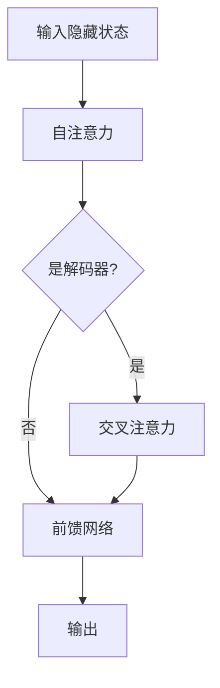
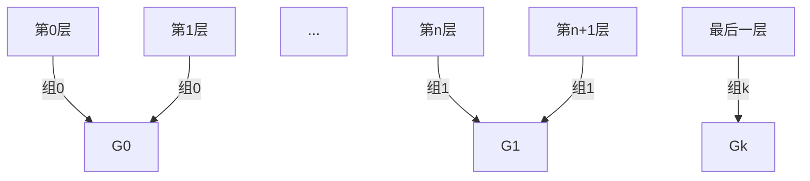
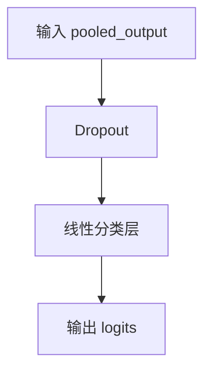
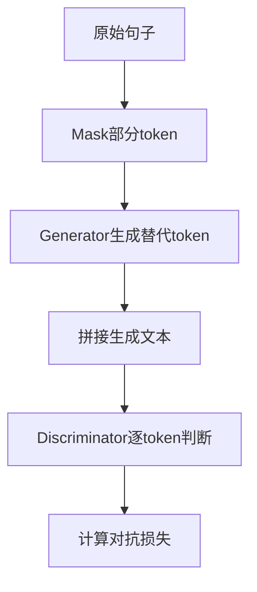
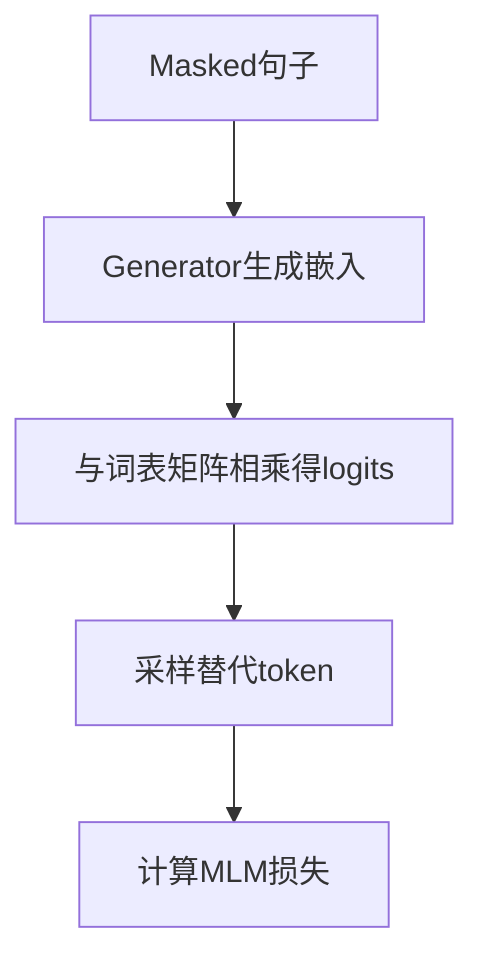
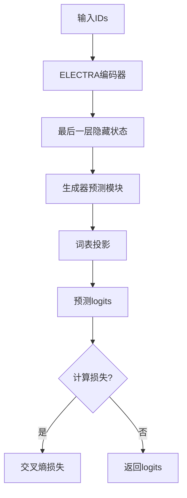
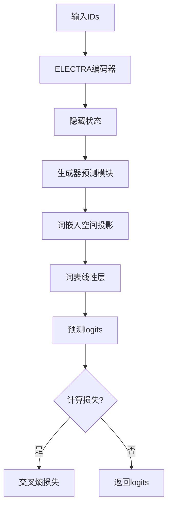

本文主要整理Hugging Face Bert模型定义。

## 1. Bert模型结构

### 1.1 BertSelfAttention

BERT自注意力机制是Transformer架构的核心组件，负责捕捉序列内部的上下文依赖关系。以下是对`BertSelfAttention`模块源码的逐层解析：

#### **1. 初始化阶段 (`__init__`)**
- **参数校验**：确保隐藏层维度`hidden_size`能被注意力头数`num_heads`整除，保证多头拆分后维度一致。
- **线性投影层**：初始化`query`、`key`、`value`三个线性变换矩阵，将输入映射为多头注意力所需的子空间。
- **位置编码配置**：支持绝对位置编码和相对位置编码（`relative_key`或`relative_key_query`），后者通过`distance_embedding`嵌入相对位置差。
```python
  self.position_embedding_type = position_embedding_type or getattr(config, "position_embedding_type", "absolute")
  if self.position_embedding_type == "relative_key" or self.position_embedding_type == "relative_key_query":
      self.max_position_embeddings = config.max_position_embeddings
      self.distance_embedding = nn.Embedding(2 * config.max_position_embeddings - 1, self.attention_head_size)
```
- **解码器标识**：`is_decoder`标记模块是否用于解码，决定是否缓存历史Key/Value以支持自回归生成。


#### **2. 张量形状变换 (`transpose_for_scores`)**
- **目的**：将`(batch, seq_len, hidden_size)`的输入张量转换为`(batch, num_heads, seq_len, head_size)`，以适配多头计算。
- **操作**：
  ```python
  new_shape = x.size()[:-1] + (num_heads, head_size)
  x = x.view(new_shape).permute(0, 2, 1, 3)  # 调整维度顺序
  ```

#### **3. 前向传播 (`forward`)**
**a. 查询、键、值投影**  
- 输入`hidden_states`通过线性层生成`query`、`key`、`value`：
  ```python
  mixed_query = self.query(hidden_states)  # (batch, seq_len, all_head_size)
  key_layer = self.transpose_for_scores(self.key(hidden_states))  # (batch, num_heads, seq_len, head_size)
  value_layer = self.transpose_for_scores(...)  # 类似key_layer
  ```

**b. Cross-Attention与缓存处理**  
- **Cross-Attention**：若`encoder_hidden_states`存在（如Encoder-Decoder结构），则Key/Value来自编码器输出。
- **缓存机制**：解码时通过`past_key_value`拼接历史Key/Value，避免重复计算：
  ```python
  key_layer = torch.cat([past_key, current_key], dim=2)  # 扩展序列维度
  ```

**c. 注意力分数计算**  
- **点积缩放**：计算查询与键的点积，缩放避免梯度消失：
  ```python
  scores = torch.matmul(query, key.transpose(-1, -2)) / sqrt(head_size)
  ```
- **相对位置编码**：若启用，通过`distance_embedding`将相对位置差编码为注意力偏置：
  ```python
  # 计算位置差并嵌入
  distance = position_ids_l - position_ids_r
  pos_embed = self.distance_embedding(distance + max_pos - 1)
  # 添加到注意力分数
  scores += einsum("bhld,lrd->bhlr", query, pos_embed)
  ```
- **BertSelfAttention 不显式处理绝对位置编码的原因**：绝对位置信息已通过输入嵌入传递到隐藏状态中，自注意力机制隐式利用这些信息，无需重复添加。若需增强位置建模（如相对位置），则通过自注意力层的扩展实现。

**d. 掩码与归一化**  
- **注意力掩码**：应用`attention_mask`（如填充token掩码），通过加极大负数抑制无效位置：
- **Softmax与Dropout**：归一化为概率分布并随机失活：
  ```python
  attention_scores = attention_scores / math.sqrt(self.attention_head_size)
  if attention_mask is not None:
      # Apply the attention mask is (precomputed for all layers in BertModel forward() function)
      attention_scores = attention_scores + attention_mask

  # Normalize the attention scores to probabilities.
  attention_probs = nn.functional.softmax(attention_scores, dim=-1)

  # This is actually dropping out entire tokens to attend to, which might
  # seem a bit unusual, but is taken from the original Transformer paper.
  attention_probs = self.dropout(attention_probs)
  ```

**e. 上下文聚合与输出**  
- **值加权求和**：注意力概率与Value矩阵相乘，融合上下文信息：
  ```python
  context = torch.matmul(probs, value_layer)  # (batch, num_heads, seq_len, head_size)
  ```
- **形状还原**：合并多头输出，恢复为`(batch, seq_len, hidden_size)`：
  ```python
  context = context.permute(0, 2, 1, 3).contiguous().view(new_shape)
  ```
  
**f. 输出组装**  
- 返回上下文张量，可选包含注意力概率（如可视化）及更新的`past_key_value`（解码器）。


**g. attention_mask和head_mask**  

| **特性**               | **`attention_mask`**                  | **`head_mask`**                     |
|------------------------|---------------------------------------|-------------------------------------|
| **作用维度**           | 序列位置（屏蔽某些token间的注意力）    | 注意力头（屏蔽整个头的输出）         |
| **主要用途**           | 处理填充、实现因果注意力               | 头剪枝、动态调整、模型分析           |
| **应用阶段**           | 注意力分数计算前（Softmax前）          | 注意力概率计算后（Softmax后）        |
| **典型值**             | 0或负无穷（无效位置），1（有效位置）   | 0（关闭头），1（保留头）             |
| **形状**               | `(batch_size, seq_len, seq_len)`      | `(num_heads,)` 或广播兼容形状        |
| **示例**               | 屏蔽填充符`[PAD]`                     | 关闭无关的注意力头                   |

```python
if attention_mask is not None:
  # Apply the attention mask is (precomputed for all layers in BertModel forward() function)
  attention_scores = attention_scores + attention_mask

# Mask heads if we want to
if head_mask is not None:
  attention_probs = attention_probs * head_mask
```

#### **4. 关键机制总结**
- **多头注意力**：并行化拆分为独立子空间，增强模型捕捉多样化模式的能力。
- **位置编码**：支持绝对/相对位置编码，后者通过相对距离建模位置关系，提升长序列泛化。
- **缓存优化**：解码时缓存历史状态，减少自回归生成的计算冗余。
- **灵活扩展**：通过`is_decoder`和`cross-attention`支持Encoder-Decoder架构。


### 1.2 BertSdpaSelfAttention

#### **1. 类继承与设计动机**
- **继承关系**：`BertSdpaSelfAttention` 继承自 `BertSelfAttention`，旨在利用 PyTorch 的优化注意力机制 `scaled_dot_product_attention`（SDPA）提升计算效率。
- **核心目标**：  
  在满足特定条件时（如绝对位置编码、无`head_mask`、不输出注意力权重），通过调用底层优化的 SDPA 函数（如 Flash Attention）加速计算，否则回退到原始实现。

#### **2. 初始化阶段 (`__init__`)**
- **关键参数**：
  - `dropout_prob`：直接保存 `config.attention_probs_dropout_prob`，用于 SDPA 函数的 `dropout_p` 参数。
  - `require_contiguous_qkv`：根据 PyTorch 版本判断是否需要强制 `query/key/value` 张量连续（解决 Torch 2.1.2 的 GPU 非连续张量计算 Bug）。


#### **3. 前向传播 (`forward`)**
**a. 条件回退机制**
- **触发条件**：若存在以下情况之一，回退到父类 `BertSelfAttention` 的原始实现：
  - 使用相对位置编码（`position_embedding_type != "absolute"`）
  - 需要输出注意力权重（`output_attentions=True`）
  - 应用头掩码（`head_mask is not None`）
- **原因**：  
  PyTorch 的 `scaled_dot_product_attention` 目前不支持上述特性（如自定义位置编码、头剪枝），需通过警告提示用户。

**b. Query/Key/Value 投影**
- **投影与形状变换**：与父类一致，通过 `transpose_for_scores` 将线性投影后的张量调整为多头形状：
  ```python
  query_layer = self.transpose_for_scores(self.query(hidden_states))  # (batch, num_heads, seq_len, head_size)
  ```

**c. 跨注意力与缓存处理**
- **跨注意力逻辑**：若 `encoder_hidden_states` 存在（Cross-Attention），则 Key/Value 来自编码器输出。
- **缓存拼接**：在解码器中，将当前步的 Key/Value 与历史缓存拼接，支持自回归生成：
  ```python
  key_layer = torch.cat([past_key_value[0], key_layer], dim=2)  # 序列维度扩展
  ```

**d. 连续性强制（版本兼容）**
- **触发条件**：PyTorch < 2.2.0 且使用 CUDA 设备时，确保 `query/key/value` 张量内存连续：
  ```python
  query_layer = query_layer.contiguous()  # 避免非连续张量引发计算错误
  ```

**e. 因果掩码推断**
- **判断逻辑**：仅当以下条件**同时满足**时启用因果掩码（`is_causal=True`）：
  1. 模块为解码器（`self.is_decoder=True`）
  2. 非跨注意力（`is_cross_attention=False`）
  3. 未显式提供 `attention_mask`（`attention_mask is None`）
  4. 目标序列长度 > 1（避免单 token 生成时的冗余掩码）
- **作用**：自动生成下三角掩码，确保解码时当前位置仅关注历史信息。

**f. 调用优化注意力函数**
- **核心调用**：使用 `torch.nn.functional.scaled_dot_product_attention` 替代原始手动计算：
  ```python
  attn_output = F.scaled_dot_product_attention(
      query_layer, key_layer, value_layer,
      attn_mask=attention_mask,
      dropout_p=self.dropout_prob if self.training else 0.0,
      is_causal=is_causal
  )
  ```
  - **优势**：内部可能使用 Flash Attention 或 Memory-Efficient Attention 等优化实现，显著降低显存占用并加速计算。
  - **掩码融合**：自动处理 `attention_mask` 与 `is_causal` 的逻辑兼容性。

**g. 输出重塑**
- **形状还原**：将多头输出合并为原始隐藏维度：
  ```python
  attn_output = attn_output.transpose(1, 2).reshape(bsz, tgt_len, self.all_head_size)
  ```

#### **4. 关键优化点总结**
| **优化维度**         | **原始实现 (`BertSelfAttention`)**                     | **SDPA 优化 (`BertSdpaSelfAttention`)**               |
|----------------------|-------------------------------------------------------|------------------------------------------------------|
| **计算效率**         | 手动计算注意力分数，逐步骤操作                        | 调用底层优化内核（如 Flash Attention），算子融合      |
| **显存占用**         | 显式存储注意力矩阵（O(n²)）                           | 隐式计算，内存占用 O(n)（序列长度线性增长）           |
| **掩码处理**         | 手动处理 `attention_mask` 和位置编码                  | 依赖 `attn_mask` 和 `is_causal` 参数自动优化          |
| **硬件加速**         | 通用实现，无特殊优化                                  | 针对 NVIDIA GPU 等硬件优化，利用 Tensor Cores         |
| **功能支持**         | 支持所有特性（如相对位置编码、头剪枝）                | 仅支持绝对位置编码、无头掩码、不输出注意力权重的场景  |


#### **5. 使用场景与限制**
- **推荐场景**：
  - 序列较长（显存节省显著）
  - 使用绝对位置编码的 Encoder 或 Decoder（无交叉注意力）
  - 无需输出注意力权重或应用头掩码
- **限制条件**：
  - 相对位置编码需回退到原始实现
  - PyTorch 版本需兼容 SDPA 的优化路径（如 >=2.0.0）


#### **6. 版本兼容性处理**
- **非连续张量问题**：针对 Torch 2.1.2 及以下版本的 CUDA 设备，强制 `query/key/value` 连续：
  ```python
  if self.require_contiguous_qkv and query_layer.device.type == "cuda":
      query_layer = query_layer.contiguous()
  ```
- **未来兼容**：代码中预留警告提示，未来版本可能要求显式指定 `attn_implementation="eager"` 以使用原始实现。


#### **7. 总结**
`BertSdpaSelfAttention` 是 BERT 自注意力模块的高效实现变体，通过集成 PyTorch 的优化注意力函数，在特定条件下大幅提升计算性能。其核心设计是在保持功能兼容性的前提下，优先利用硬件加速特性，同时通过条件回退机制确保模型灵活性。这一改进特别适合大规模预训练或长序列推理任务，体现了深度学习框架与模型代码协同优化的实践。

### 1.3 BertSelfOutput / BertIntermediate / BertOutput

`BertSelfOutput` 并不是传统的 **FFN（Feed-Forward Network）**，而是 **自注意力层后的残差连接模块**。

#### **1. BertSelfOutput模块功能解析**
- **输入**：`hidden_states`（自注意力层的输出）和 `input_tensor`（自注意力层的原始输入）。
- **操作流程**：
  1. **线性投影**：通过 `dense` 层（单层全连接）对自注意力输出进行变换。
  2. **Dropout**：随机失活以防止过拟合。
  3. **残差连接 + LayerNorm**：将处理后的结果与原始输入 `input_tensor` 相加，并进行层归一化。

#### **2. 与标准 FFN 的区别**
| **特性**          | **FFN（Feed-Forward Network）**                     | **BertSelfOutput**                            |
|-------------------|----------------------------------------------------|-----------------------------------------------|
| **结构**          | 两个线性层 + 激活函数（如GELU/ReLU）               | 单线性层 + Dropout + 残差连接 + LayerNorm     |
| **位置**          | 通常位于自注意力层之后                             | 直接处理自注意力层的输出                      |
| **核心作用**       | 引入非线性变换，增强模型表达能力                   | 调整自注意力输出维度，稳定训练（残差 + 归一化）|
| **典型公式**       | `FFN(x) = Linear2(Activation(Linear1(x)))`         | `Output = LayerNorm(Dropout(Linear(x)) + x)`  |


#### **3. BERT 中的 FFN 实现**
在 BERT 的 Transformer 层中，**真正的 FFN 由两个独立模块组成**：
- **`BertIntermediate`**：包含第一线性层和激活函数（如GELU）。
- **`BertOutput`**：包含第二线性层、Dropout、残差连接和 LayerNorm。

#### **代码示例**：
```python
# FFN 第一部分（引入非线性）
class BertIntermediate(nn.Module):
    def __init__(self, config):
        super().__init__()
        self.dense = nn.Linear(config.hidden_size, config.intermediate_size)
        if isinstance(config.hidden_act, str):
            self.intermediate_act_fn = ACT2FN[config.hidden_act]
        else:
            self.intermediate_act_fn = config.hidden_act

    def forward(self, hidden_states: torch.Tensor) -> torch.Tensor:
        hidden_states = self.dense(hidden_states)
        hidden_states = self.intermediate_act_fn(hidden_states)
        return hidden_states

# FFN 第二部分（维度恢复 + 残差）
class BertOutput(nn.Module):
    def __init__(self, config):
        super().__init__()
        self.dense = nn.Linear(config.intermediate_size, config.hidden_size)
        self.LayerNorm = nn.LayerNorm(config.hidden_size, eps=config.layer_norm_eps)
        self.dropout = nn.Dropout(config.hidden_dropout_prob)

    def forward(self, hidden_states: torch.Tensor, input_tensor: torch.Tensor) -> torch.Tensor:
        hidden_states = self.dense(hidden_states)
        hidden_states = self.dropout(hidden_states)
        hidden_states = self.LayerNorm(hidden_states + input_tensor)
        return hidden_states
```

#### **4. BertSelfOutput 的作用**
- **维度对齐**：自注意力层的输出可能经过线性变换（如多头注意力合并），需通过 `dense` 层调整回 `hidden_size`。
- **训练稳定性**：残差连接缓解梯度消失，LayerNorm 加速收敛。
- **与 FFN 分工**：  
  - `BertSelfOutput` 处理自注意力机制的输出。
  - `BertIntermediate + BertOutput` 共同构成 FFN，进一步提取高层特征。

#### **5. 完整 BERT 层的流程**
1. **自注意力层** (`BertSelfAttention`)  
   → 计算注意力上下文。
2. **自注意力输出处理** (`BertSelfOutput`)  
   → 调整维度 + 残差归一化。
3. **FFN 第一部分** (`BertIntermediate`)  
   → 升维 + 激活函数。
4. **FFN 第二部分** (`BertOutput`)  
   → 降维回 `hidden_size` + 残差归一化。

#### **6. 总结**
- **`BertSelfOutput` ≠ FFN**：它是自注意力层的后处理模块，负责调整输出并稳定训练。
- **FFN 是独立结构**：在 BERT 中由两个子模块分步实现，专门用于非线性特征变换。  
- **设计动机**：通过分离自注意力与 FFN 的残差路径，增强模型的模块化和训练鲁棒性。

### 1.4 BertLayer

这段代码实现了BERT模型的一个Transformer层，支持作为编码器或解码器使用。
#### 1. 类初始化 (__init__)
```python
class BertLayer(nn.Module):
    def __init__(self, config):
        super().__init__()
        self.chunk_size_feed_forward = config.chunk_size_feed_forward  # 前馈分块大小
        self.seq_len_dim = 1  # 序列长度维度
        self.attention = BertAttention(config)  # 自注意力模块
        self.is_decoder = config.is_decoder  # 是否是解码器
        self.add_cross_attention = config.add_cross_attention  # 是否添加交叉注意力
        
        # 交叉注意力校验与初始化
        if self.add_cross_attention:
            if not self.is_decoder:
                raise ValueError("解码器才允许交叉注意力")
            self.crossattention = BertAttention(config, position_embedding_type="absolute")  # 绝对位置编码
            
        self.intermediate = BertIntermediate(config)  # 中间层（线性+激活）
        self.output = BertOutput(config)  # 输出层（线性+LayerNorm）
```

#### 2. 前向传播 (forward)
**2.1 自注意力处理**  
```python
self_attn_past_key_value = past_key_value[:2] if past_key_value else None
self_attention_outputs = self.attention(
    hidden_states,
    attention_mask,
    head_mask,
    output_attentions=output_attentions,
    past_key_value=self_attn_past_key_value
)
attention_output = self_attention_outputs[0]
```

**流程说明：**
1. 从`past_key_value`获取自注意力的历史键值对
2. 执行自注意力计算，输出包含：
   - `attention_output`: 自注意力后的隐藏状态
   - 可能的注意力权重
   - 当前时间步的键值对（解码器用）

**2.2 解码器处理**
```python
if self.is_decoder:
    outputs = self_attention_outputs[1:-1]
    present_key_value = self_attention_outputs[-1]
else:
    outputs = self_attention_outputs[1:]
```

**分支逻辑：**
- **解码器模式**：保存当前键值对 (`present_key_value`) 用于后续时间步
- **编码器模式**：仅保留注意力权重（如果需要）

**2.3 交叉注意力处理**
```python
if self.is_decoder and encoder_hidden_states:
    cross_attn_past_key_value = past_key_value[-2:] if past_key_value else None
    cross_attention_outputs = self.crossattention(
        attention_output,
        ...  # 编码器相关输入
    )
    attention_output = cross_attention_outputs[0]
    present_key_value += cross_attention_outputs[-1]
```

**核心功能：**
- 使用编码器输出 (`encoder_hidden_states`) 进行交叉注意力计算
- 合并自注意力与交叉注意力的键值对缓存

**2.4 前馈网络**
```python
layer_output = apply_chunking_to_forward(
    self.feed_forward_chunk, 
    self.chunk_size_feed_forward,
    self.seq_len_dim,
    attention_output
)
```

**关键技术：**
- `apply_chunking_to_forward`：将前馈计算分块进行，防止大矩阵内存溢出
- `feed_forward_chunk`实际执行：
  ```python
  def feed_forward_chunk(self, attention_output):
      intermediate_output = self.intermediate(attention_output)  # 线性层+GeLU激活
      layer_output = self.output(intermediate_output, attention_output)  # 线性层+残差连接+LayerNorm
      return layer_output
  ```

#### 3. 输出处理
```python
outputs = (layer_output,) + outputs
if self.is_decoder:
    outputs = outputs + (present_key_value,)
return outputs
```

**输出结构：**
- 主输出：经过所有处理的隐藏状态
- 可选输出：注意力权重、当前时间步键值对（解码器）

#### 4. 结构示意图


### 1.5 BertEncoder

#### **1. 类定义与初始化**
**核心成员**
- **`self.layer`**：由多个 `BertLayer` 实例组成的列表，构成 BERT 的堆叠 Transformer 层。
  ```python
  self.layer = nn.ModuleList([BertLayer(config) for _ in range(config.num_hidden_layers)])
  ```
- **`self.gradient_checkpointing`**：梯度检查点标志，用于训练时节省显存（以时间换空间）。

**设计目标**
- 封装多层 Transformer 结构，支持前向传播时的灵活控制（如缓存、掩码、中间结果输出）。

#### **2. 前向传播 (`forward`) 流程**
**a. 初始化输出容器**
- **`all_hidden_states`**：存储所有层的隐藏状态（若 `output_hidden_states=True`）。
- **`all_self_attentions`**：存储所有层的自注意力权重（若 `output_attentions=True`）。
- **`all_cross_attentions`**：存储交叉注意力权重（若启用跨注意力）。

**b. 梯度检查点兼容性**
- **冲突处理**：若同时启用梯度检查点和缓存（`use_cache=True`），强制禁用缓存以避免计算冲突：
  ```python
  if self.gradient_checkpointing and self.training:
      if use_cache:
          logger.warning_once("`use_cache=True` 与梯度检查点冲突，自动禁用缓存")
          use_cache = False
  ```

**c. 逐层处理循环**
遍历每个 `BertLayer` 模块，逐步更新隐藏状态：

- **记录中间隐藏状态**
```python
if output_hidden_states:
    all_hidden_states += (hidden_states,)  # 记录当前层输入
```
- **准备层特定参数**:**`layer_head_mask`**、**`past_key_value`**。
- **梯度检查点模式**：通过 `_gradient_checkpointing_func` 分段计算梯度，减少显存占用。
- **常规模式**：直接调用 `layer_module` 前向传播。
  ```python
  layer_outputs = layer_module(
      hidden_states,
      attention_mask,
      layer_head_mask,
      encoder_hidden_states,
      encoder_attention_mask,
      past_key_value,
      output_attentions
  )
  ```
- **更新隐藏状态**：`hidden_states = layer_outputs[0]`（主输出传递至下一层）。
- **缓存管理**：若启用缓存（`use_cache=True`），将当前层的新键值对加入 `next_decoder_cache`。
- **注意力权重收集**：若需输出注意力权重，记录自注意力和交叉注意力结果。

**d. 最终输出处理**
- **补录最后一层隐藏状态**（若需输出）：
  ```python
  if output_hidden_states:
      all_hidden_states += (hidden_states,)
  ```
- **返回格式适配**：根据 `return_dict` 标志返回 PyTorch 标准元组或 Hugging Face 自定义数据类 `BaseModelOutputWithPastAndCrossAttentions`。

#### **3. 关键机制详解**
**a. 梯度检查点（Gradient Checkpointing）**
- **原理**：在训练时，不保存所有中间激活值，而是在反向传播时重新计算部分激活，大幅减少显存占用。
- **实现**：通过 `torch.utils.checkpoint` 实现，仅在 `self.training=True` 时激活。
- **代价**：增加约 30% 的计算时间，适合显存不足的大模型训练。

**b. 缓存机制（`past_key_values`）**
- **用途**：在自回归生成（如文本续写）时缓存历史键值对，避免重复计算。
- **数据结构**：每层缓存为一个元组 `(key_layer, value_layer)`，所有层的缓存组成 `next_decoder_cache`。
- **更新逻辑**：每层处理后将当前步的键值对追加到缓存中。

**c. 注意力掩码与头掩码**
- **`attention_mask`**：作用于所有层，屏蔽填充位置或未来位置（解码器）。
- **`head_mask`**：可逐层指定需要屏蔽的注意力头（如 `head_mask[i]` 为第 `i` 层的头掩码）。

**d. 中间结果输出**
- **调试与分析**：通过 `output_hidden_states` 和 `output_attentions` 获取中间结果，用于可视化或模型诊断。
- **计算代价**：保存这些结果会略微增加显存和计算时间。

### 1.6 BertPooler

#### **1. 功能概述**
`BertPooler` 是 BERT 模型中用于 **生成句子/序列级别表示** 的模块，其核心操作是从 Transformer 编码器的最终输出中提取 **[CLS] Token 的隐藏状态**，并通过线性变换与激活函数生成聚合表示。该表示通常用于下游任务（如分类、句子相似度）。

#### **2. 代码逐层解析**
**a. 初始化 (`__init__`)**
```python
def __init__(self, config):
    super().__init__()
    self.dense = nn.Linear(config.hidden_size, config.hidden_size)
    self.activation = nn.Tanh()
```
- **`dense` 层**：  
  输入和输出维度均为 `hidden_size`，目的是对 [CLS] Token 的原始隐藏状态进行非线性变换，增强其特征表达能力。
- **`activation`**：  
  使用 **双曲正切函数 (Tanh)** 作为激活函数，将输出值压缩到 [-1, 1] 范围，符合 BERT 预训练任务的优化目标（如下一句预测）。

**b. 前向传播 (`forward`)**
```python
def forward(self, hidden_states: torch.Tensor) -> torch.Tensor:
    first_token_tensor = hidden_states[:, 0]  # 提取 [CLS] Token
    pooled_output = self.dense(first_token_tensor)
    pooled_output = self.activation(pooled_output)
    return pooled_output
```

- **提取 [CLS] Token**：  
  `hidden_states[:, 0]` 选取每个序列的第一个 Token（即 [CLS]），其形状从 `(batch_size, seq_len, hidden_size)` 变为 `(batch_size, hidden_size)`。
- **特征变换**：  
  通过 `dense` 层调整特征分布，再经 Tanh 激活，最终输出形状为 `(batch_size, hidden_size)`。

#### **3. 设计原理与关键点**
**a. [CLS] Token 的特殊作用**
- **预训练任务适配**：  
  在 BERT 的预训练中，[CLS] Token 被设计用于聚合整个序列的语义信息，尤其是在 **下一句预测 (NSP)** 任务中，直接作为二分类的输入特征。
- **下游任务兼容性**：  
  即使在下游任务（如文本分类、情感分析）中，[CLS] Token 的表示仍作为默认的序列级特征，因其经过自注意力机制充分交互后蕴含全局信息。

**b. 为何使用线性层 + Tanh？**
- **特征增强**：  
  虽然 [CLS] Token 的隐藏状态已包含丰富信息，但通过线性层可进一步学习任务相关的特征变换，提升模型灵活性。
- **值域限制**：  
  Tanh 将输出限制在 [-1, 1]，有助于稳定训练过程，避免梯度爆炸，并与预训练阶段的优化目标一致。

**c. 与其他池化方式的对比**
| **池化方法**       | **操作**                          | **优点**                          | **缺点**                          |
|--------------------|-----------------------------------|-----------------------------------|-----------------------------------|
| **BERT Pooler**     | 取 [CLS] + 线性层 + Tanh         | 任务自适应、特征交互充分          | 依赖 [CLS] 初始化和预训练目标     |
| **平均池化**       | 对所有 Token 隐藏状态取平均       | 简单、稳定                        | 可能受噪声 Token 影响             |
| **最大池化**       | 取每个特征维度的最大值            | 突出显著特征                      | 忽略序列整体分布                  |
| **首尾拼接**       | 拼接 [CLS] 和最后一个 Token       | 结合起始与结束信息                | 增加特征维度                      |


#### **4. 典型应用场景**
- **单句分类**：  
  直接将 `pooled_output` 输入分类器（如 `nn.Linear(hidden_size, num_labels)`）。
- **句子对任务**：  
  对两个句子的 `pooled_output` 计算余弦相似度或拼接后分类。
- **特征提取**：  
  作为句子的固定维度表示，用于检索、聚类等任务。

#### **5. 注意事项**
- **依赖预训练**：  
  [CLS] Token 的有效性高度依赖预训练质量，若任务与预训练差异较大，可考虑微调池化方式。
- **替代方案**：  
  对于长文本或特定领域任务，可尝试其他池化策略（如动态加权平均）作为补充。

### 1.7 BertLMPredictionHead / BertOnlyMLMHead / BertOnlyNSPHead / BertPreTrainingHeads

#### **1. BertLMPredictionHead**
**功能**：掩码语言模型（MLM）预测头，用于预测被遮蔽的Token。
```python
class BertLMPredictionHead(nn.Module):
    def __init__(self, config):
        super().__init__()
        self.transform = BertPredictionHeadTransform(config)  # 特征增强
        self.decoder = nn.Linear(config.hidden_size, config.vocab_size, bias=False)  # 解码层（权重共享）
        self.bias = nn.Parameter(torch.zeros(config.vocab_size))  # 独立偏置
        self.decoder.bias = self.bias  # 绑定偏置

    def forward(self, hidden_states):
        hidden_states = self.transform(hidden_states)  # 非线性变换
        hidden_states = self.decoder(hidden_states)    # 映射到词表空间
        return hidden_states
```
- **关键点**：
  - **权重共享**：`self.decoder.weight` 与输入词嵌入矩阵共享，减少参数量。
  - **独立偏置**：通过 `self.bias` 增强模型灵活性，不与嵌入层共享。
  - **特征增强**：通过 `BertPredictionHeadTransform`（包含线性层、激活函数和LayerNorm）提升隐藏状态表达能力。


#### **2. BertOnlyMLMHead**
**功能**：封装 MLM 预测头，用于单独执行掩码预测任务。
```python
class BertOnlyMLMHead(nn.Module):
    def __init__(self, config):
        super().__init__()
        self.predictions = BertLMPredictionHead(config)  # 集成预测头

    def forward(self, sequence_output: torch.Tensor) -> torch.Tensor:
        return self.predictions(sequence_output)  # 输出各位置Token预测分数
```
- **输入**：`sequence_output`（编码器输出的所有Token隐藏状态，形状 `(batch, seq_len, hidden_size)`）。
- **输出**：每个位置Token的预测分数 `(batch, seq_len, vocab_size)`。


#### **3. BertOnlyNSPHead**
**功能**：下一句预测（NSP）头，判断两段文本是否连续。
```python
class BertOnlyNSPHead(nn.Module):
    def __init__(self, config):
        super().__init__()
        self.seq_relationship = nn.Linear(config.hidden_size, 2)  # 二分类层

    def forward(self, pooled_output):
        return self.seq_relationship(pooled_output)  # 输出NSP分类分数
```
- **输入**：`pooled_output`（[CLS] Token的池化表示，形状 `(batch, hidden_size)`）。
- **输出**：二分类分数 `(batch, 2)`，表示是否为连续文本。


#### **4. BertPreTrainingHeads**
**功能**：联合MLM与NSP的预训练任务头。
```python
class BertPreTrainingHeads(nn.Module):
    def __init__(self, config):
        super().__init__()
        self.predictions = BertLMPredictionHead(config)  # MLM头
        self.seq_relationship = nn.Linear(config.hidden_size, 2)  # NSP头

    def forward(self, sequence_output, pooled_output):
        mlm_scores = self.predictions(sequence_output)       # 生成MLM预测
        nsp_scores = self.seq_relationship(pooled_output)    # 生成NSP预测
        return mlm_scores, nsp_scores
```
- **输入**：
  - `sequence_output`：编码器的Token级输出（用于MLM）。
  - `pooled_output`：[CLS]的池化输出（用于NSP）。
- **输出**：MLM和NSP的预测分数，用于计算联合损失。


#### **5. 各类关系与协作**
| **类名**               | **依赖组件**                | **输入来源**                | **任务类型**       |
|------------------------|---------------------------|---------------------------|-------------------|
| `BertLMPredictionHead`  | `BertPredictionHeadTransform` | 编码器的 `sequence_output` | MLM（Token级预测） |
| `BertOnlyMLMHead`       | `BertLMPredictionHead`       | 同上                      | 纯MLM任务         |
| `BertOnlyNSPHead`       | 无                         | `pooled_output`（[CLS]）  | 纯NSP任务         |
| `BertPreTrainingHeads`  | 上述两者                    | `sequence_output` + `pooled_output` | MLM + NSP联合训练 |


#### **6. 权重共享机制详解**
- **实现方式**：在BERT模型初始化时，将词嵌入矩阵与MLM解码层权重显式绑定：
  ```python
  model.cls.predictions.decoder.weight = model.bert.embeddings.word_embeddings.weight
  ```
- **优点**：
  - **参数效率**：避免为大型词表（如30k+）重复存储权重。
  - **训练稳定性**：嵌入层与解码层梯度协同更新，提升收敛速度。
- **独立偏置**：解码层保留独立偏置项，增强模型灵活性。


#### **7. 典型应用场景**
**预训练阶段**
- 使用 `BertPreTrainingHeads` 同时计算MLM和NSP损失：
  ```python
  mlm_scores, nsp_scores = pretraining_heads(sequence_output, pooled_output)
  loss = mlm_loss(mlm_scores, masked_labels) + nsp_loss(nsp_scores, nsp_labels)
  ```

**微调阶段**
- **文本分类**：仅使用 `pooled_output` 输入自定义分类器。
- **序列标注**：使用 `sequence_output` 直接进行Token级预测。
- **句子对任务**：结合两个句子的 `pooled_output` 计算相似度。

#### **8. 设计总结**
- **模块化**：通过分离MLM和NSP头，支持任务灵活组合。
- **高效性**：权重共享减少参数量，适合大规模预训练。
- **扩展性**：可轻松添加新任务头（如实体识别）进行多任务学习。
通过这种设计，BERT在预训练阶段有效学习通用语言表示，为下游任务提供强大的特征基础。

### 1.8 BertForPreTraining

#### **1. 类定义与初始化**  

```python
class BertForPreTraining(BertPreTrainedModel):
```
- **`BertPreTrainedModel`**：Hugging Face 模型基类，负责参数初始化、配置管理及预训练权重加载。

**初始化逻辑**  
```python
def __init__(self, config):
    super().__init__(config)
    self.bert = BertModel(config)           # BERT主干网络（编码器）
    self.cls = BertPreTrainingHeads(config) # 预训练任务头（MLM + NSP）
    self.post_init()                        # 权重初始化与绑定
```
- **`self.bert`**：完整的 BERT 编码器，包含嵌入层、多层 Transformer 和池化层。
- **`self.cls`**：预训练任务头，联合处理 MLM（掩码语言模型）和 NSP（下一句预测）。

**权重绑定声明**  
```python
_tied_weights_keys = ["predictions.decoder.bias", "cls.predictions.decoder.weight"]
```
- **作用**：指定需要绑定的权重名称，确保 MLM 解码层的权重与输入词嵌入层共享。
- **绑定实现**：在 `post_init()` 中通过 `_tie_weights()` 方法完成实际绑定。这是因为嵌入层（embedding layer）、输出层（output layer）的操作在本质上是互逆的：一个将词汇索引映射到向量空间，另一个将向量空间映射回词汇索引。通过共享权重，模型减少了需要存储的参数数量，从而降低了内存占用。


#### **2. 核心方法解析**  
**a. 输出嵌入管理**  
```python
def get_output_embeddings(self):
    return self.cls.predictions.decoder  # 返回MLM解码层（用于权重共享）

def set_output_embeddings(self, new_embeddings):
    self.cls.predictions.decoder = new_embeddings  # 更新解码层权重
    self.cls.predictions.bias = new_embeddings.bias  # 同步更新偏置
```
- **目的**：允许外部访问和修改 MLM 解码层权重，维护与输入词嵌入的一致性。

**b. 前向传播 (`forward`)**  
**输入参数**  
- **标准输入**：`input_ids`, `attention_mask`, `token_type_ids` 等常规 BERT 输入。
- **任务标签**：
  - `labels`：MLM 任务的目标 Token ID（形状 `(batch_size, seq_len)`）。
  - `next_sentence_label`：NSP 任务标签（形状 `(batch_size,)`，0/1 表示是否连续）。

#### **3. 处理流程**
1. **编码器前向**：
   ```python
   outputs = self.bert(...)  # 获取编码器输出
   sequence_output, pooled_output = outputs[:2]  # Token级输出与[CLS]池化输出
   ```
   - `sequence_output`：各 Token 的隐藏状态 `(batch, seq_len, hidden_size)`。
   - `pooled_output`：[CLS] 的池化表示 `(batch, hidden_size)`。

2. **任务头预测**：
   ```python
   prediction_scores, seq_relationship_score = self.cls(sequence_output, pooled_output)
   ```
   - **MLM 预测**：`prediction_scores` 形状 `(batch, seq_len, vocab_size)`。
   - **NSP 预测**：`seq_relationship_score` 形状 `(batch, 2)`。

3. **损失计算**：
   ```python
   masked_lm_loss = loss_fct(prediction_scores.view(-1, vocab_size), labels.view(-1))
   next_sentence_loss = loss_fct(seq_relationship_score.view(-1, 2), next_sentence_label.view(-1))
   total_loss = masked_lm_loss + next_sentence_loss  # 联合损失
   ```

4. **输出格式**
- **字典模式** (`return_dict=True`)：返回 `BertForPreTrainingOutput` 对象，包含损失、预测分数、隐藏状态等。
- **元组模式**：返回损失与预测分数的元组（兼容旧版本代码）。


#### **4. 关键设计机制**
**a. 权重共享（Weight Tying）**
- **实现方式**：  
  `self.cls.predictions.decoder.weight` 与 `self.bert.embeddings.word_embeddings.weight` 共享内存。
- **代码触发**：  
  在 `post_init()` 中调用 `_tie_weights()`，根据 `_tied_weights_keys` 自动绑定指定权重。
- **优点**：  
  减少模型参数量，提升训练稳定性（尤其对大规模词表）。

**b. 多任务联合训练**
- **任务整合**：  
  MLM 与 NSP 损失直接相加，通过反向传播同步优化两个目标。
- **梯度流动**：  
  联合损失促使模型同时学习 Token 级语义理解和句子间关系推理。

**c. 灵活的输出控制**
- **中间状态输出**：  
  支持返回各层隐藏状态 (`output_hidden_states=True`) 和注意力权重 (`output_attentions=True`)，便于可视化或分析。
- **返回格式兼容**：  
  通过 `return_dict` 参数切换新旧输出格式，增强代码兼容性。


#### **5. 预训练任务流程示例**
假设输入为句子对 `[ [CLS] A [SEP] B [SEP] ]`：
1. **MLM**：随机遮蔽 A 或 B 中的部分 Token，预测被遮蔽的原始 Token。
2. **NSP**：判断 B 是否为 A 的下一句（50% 正样本，50% 随机负样本）。

**计算步骤**
1. 编码器生成 `sequence_output` 和 `pooled_output`。
2. `BertPreTrainingHeads` 分别计算 MLM 和 NSP 分数。
3. 计算交叉熵损失并反向传播更新参数。

## 2. Bert下游任务

### 2.1 BertForMaskedLM

#### **1. 类定义与初始化**
```python
class BertForMaskedLM(BertPreTrainedModel):
```
- **`BertPreTrainedModel`**：Hugging Face 的 BERT 预训练模型基类，负责参数初始化与权重管理。

```python
def __init__(self, config):
    super().__init__(config)
    # 检查是否为解码器配置（MLM需双向注意力，与解码器冲突）
    if config.is_decoder:
        logger.warning("若使用MLM任务，需确保 `config.is_decoder=False`")
    self.bert = BertModel(config, add_pooling_layer=False)  # 禁用池化层
    self.cls = BertOnlyMLMHead(config)  # MLM任务头
    self.post_init()  # 权重初始化与绑定
```

- **`add_pooling_layer=False`**：MLM 任务不需要 [CLS] 的池化输出，仅保留序列各位置的隐藏状态。
- **`BertOnlyMLMHead`**：仅包含 MLM 预测头的模块。


#### **2. 核心方法解析**
**a. 输出嵌入管理**
```python
def get_output_embeddings(self):
    return self.cls.predictions.decoder  # 返回MLM解码层（共享词嵌入）

def set_output_embeddings(self, new_embeddings):
    self.cls.predictions.decoder = new_embeddings  # 更新解码层权重
    self.cls.predictions.bias = new_embeddings.bias  # 同步更新偏置
```
- **目的**：维护 MLM 头与输入词嵌入的权重共享关系。


**b. 前向传播 (`forward`)**
**输入参数**
- **常规输入**：`input_ids`, `attention_mask`, `token_type_ids` 等 BERT 标准输入。
- **标签**：`labels` 形状为 `(batch_size, seq_len)`，标记被遮蔽的 Token 目标 ID，`-100` 表示忽略位置。

**处理流程**
1. **编码器前向**：
   ```python
   outputs = self.bert(...)  # 获取编码器输出（无池化层）
   sequence_output = outputs[0]  # 形状 (batch, seq_len, hidden_size)
   ```
2. **MLM 预测**：
   ```python
   prediction_scores = self.cls(sequence_output)  # 形状 (batch, seq_len, vocab_size)
   ```
3. **损失计算**：
   ```python
   masked_lm_loss = CrossEntropyLoss()(prediction_scores.view(-1, vocab_size), labels.view(-1))
   ```

**输出格式**
- **字典模式** (`return_dict=True`)：返回 `MaskedLMOutput` 对象，包含损失、预测分数、隐藏状态等。
- **元组模式**：返回损失与预测分数的元组。


#### **3. 关键设计机制**
**a. 权重共享（Weight Tying）**
- **实现方式**：  
  MLM 头的解码器权重 `self.cls.predictions.decoder.weight` 与输入词嵌入 `self.bert.embeddings.word_embeddings.weight` 共享内存。
- **代码触发**：  
  在 `post_init()` 中通过 `_tie_weights()` 自动绑定，依赖 `_tied_weights_keys` 声明。

**b. 池化层禁用**
- **原因**：  
  MLM 任务需预测每个位置的 Token，而非整体序列分类，故禁用池化层以减少计算开销。

**c. 生成方法限制**
```python
@classmethod
def can_generate(cls) -> bool:
    return False  # 明确声明不支持自回归生成
```
- **背景**：  
  MLM 是填充式任务（预测被遮蔽的 Token），非自回归生成（如 GPT），因此禁用 `generate()` 方法。


#### **4. 输入预处理（生成场景）**
尽管模型不支持生成，但保留 `prepare_inputs_for_generation` 方法：
```python
def prepare_inputs_for_generation(self, input_ids, attention_mask=None, **model_kwargs):
    # 添加虚拟 Token 对齐注意力掩码
    dummy_token = torch.full(..., self.config.pad_token_id)  
    input_ids = torch.cat([input_ids, dummy_token], dim=1)
    attention_mask = torch.cat([attention_mask, ...], dim=-1)
    return {"input_ids": input_ids, "attention_mask": attention_mask}
```
- **潜在用途**：  
  为兼容某些需要动态调整输入长度的场景，但实际因 `can_generate=False` 未被调用。


#### **5. 与预训练模型的区别**
| **特性**               | **BertForPreTraining**              | **BertForMaskedLM**               |
|------------------------|-------------------------------------|-----------------------------------|
| **任务头**             | MLM + NSP 双任务头                  | 仅 MLM 任务头                     |
| **池化层**             | 启用（用于 NSP）                    | 禁用                              |
| **生成支持**           | 无                                  | 明确禁用                          |
| **权重共享**           | MLM 解码器与词嵌入绑定              | 同左                              |
| **典型应用**           | BERT 预训练                         | 纯 MLM 任务微调或继续预训练       |

#### **6. 使用示例**
```python
from transformers import AutoTokenizer, BertForMaskedLM

tokenizer = AutoTokenizer.from_pretrained("google-bert/bert-base-uncased")
model = BertForMaskedLM.from_pretrained("google-bert/bert-base-uncased")

inputs = tokenizer("The capital of France is [MASK].", return_tensors="pt")
labels = tokenizer("The capital of France is Paris.", return_tensors="pt")["input_ids"]

outputs = model(**inputs, labels=labels)
loss = outputs.loss  # MLM 损失
logits = outputs.logits  # 预测分数
```

#### **7. 总结**
`BertForMaskedLM` 是 BERT 的掩码语言模型专用实现，其设计特点包括：
1. **高效参数共享**：通过权重绑定减少模型体积。
2. **任务专注性**：仅保留 MLM 头，禁用无关组件（如池化层）。
3. **训练友好**：支持灵活损失计算与中间状态输出。
4. **生成限制**：明确禁止自回归生成，保持任务纯粹性。
该模型适用于需要基于上下文预测被遮蔽 Token 的场景，如文本纠错、数据增强或继续预训练。

### 2.2 BertForNextSentencePrediction

#### **1. 类定义与初始化**
**继承关系**
```python
class BertForNextSentencePrediction(BertPreTrainedModel):
```
- **`BertPreTrainedModel`**：Hugging Face 的 BERT 预训练模型基类，负责参数初始化与权重管理。

**初始化逻辑**
```python
def __init__(self, config):
    super().__init__(config)
    self.bert = BertModel(config)          # BERT 主干网络（含池化层）
    self.cls = BertOnlyNSPHead(config)     # NSP 任务头
    self.post_init()                       # 权重初始化
```

**关键组件**：
  - **`self.bert`**：完整的 BERT 编码器，包含嵌入层、多层 Transformer 和池化层（`add_pooling_layer=True`）。
  - **`self.cls`**：NSP 任务头，通过线性层将 [CLS] 池化表示映射为二分类分数。

**`BertOnlyNSPHead` 结构**
```python
class BertOnlyNSPHead(nn.Module):
    def __init__(self, config):
        super().__init__()
        self.seq_relationship = nn.Linear(config.hidden_size, 2)  # 二分类层

    def forward(self, pooled_output):
        return self.seq_relationship(pooled_output)  # 形状 (batch_size, 2)
```

#### **2. 核心方法解析**
**前向传播 (`forward`)**
- **标准输入**：`input_ids`, `attention_mask`, `token_type_ids` 等 BERT 标准输入。
- **标签**：`labels` 形状为 `(batch_size,)`，值为 0 或 1，表示句子 B 是否为句子 A 的下一句。

**处理流程**
1. **编码器前向**：
   ```python
   outputs = self.bert(...)  # 获取编码器输出
   pooled_output = outputs[1]  # [CLS] 池化输出 (batch_size, hidden_size)
   ```
2. **NSP 预测**：
   ```python
   seq_relationship_scores = self.cls(pooled_output)  # 形状 (batch_size, 2)
   ```
3. **损失计算**：
   ```python
   next_sentence_loss = CrossEntropyLoss()(seq_relationship_scores.view(-1, 2), labels.view(-1))
   ```

**输出格式**
- **字典模式** (`return_dict=True`)：返回 `NextSentencePredictorOutput` 对象，包含损失、预测分数、隐藏状态等。
- **元组模式**：返回损失与预测分数的元组。


#### **3. 关键设计机制**
**a. 输入格式要求**
- **句子对输入**：  
  输入需包含两个句子，格式为 `[CLS] A [SEP] B [SEP]`，由 `token_type_ids` 区分句子 A 和 B。
- **标签语义**：
  - **0**：B 是 A 的下一句（正样本）。
  - **1**：B 是随机选取的句子（负样本）。

**b. 池化层的必要性**
- **依赖 [CLS] 表示**：  
  BERT 的池化层（`BertPooler`）对 [CLS] Token 的隐藏状态进行非线性变换，生成汇总整个序列信息的表示，用于 NSP 分类。

**c. 参数兼容性处理**
```python
if "next_sentence_label" in kwargs:
    warnings.warn("`next_sentence_label` 已弃用，请使用 `labels` 参数")
    labels = kwargs.pop("next_sentence_label")
```
- **目的**：保持参数命名一致性，过渡旧代码至新接口。


#### **4. 与预训练模型的区别**
| **特性**               | **BertForPreTraining**              | **BertForNextSentencePrediction** |
|------------------------|-------------------------------------|-----------------------------------|
| **任务头**             | MLM + NSP 双任务头                  | 仅 NSP 任务头                     |
| **池化层**             | 启用（用于 NSP）                    | 同左                              |
| **输出维度**           | MLM (vocab_size) + NSP (2)          | NSP (2)                           |
| **典型应用**           | BERT 预训练                         | 纯 NSP 任务微调或分析             |


#### **5. 使用示例**
```python
from transformers import AutoTokenizer, BertForNextSentencePrediction

tokenizer = AutoTokenizer.from_pretrained("google-bert/bert-base-uncased")
model = BertForNextSentencePrediction.from_pretrained("google-bert/bert-base-uncased")

# 句子对输入
prompt = "In Italy, pizza served in formal settings is presented unsliced."
next_sentence = "The sky is blue due to Rayleigh scattering."
inputs = tokenizer(prompt, next_sentence, return_tensors="pt")

# 标签：1 表示非连续句子
outputs = model(**inputs, labels=torch.LongTensor([1]))
loss = outputs.loss          # NSP 损失
logits = outputs.logits      # 二分类分数 (batch_size, 2)
```

#### **6. 总结**
`BertForNextSentencePrediction` 是 BERT 的下一句预测任务专用实现，其设计特点包括：
1. **任务专注性**：仅保留 NSP 头，利用池化的 [CLS] 表示进行二分类。
2. **输入格式适配**：要求句子对输入，通过 `token_type_ids` 区分。
3. **兼容性处理**：支持旧参数名过渡，确保代码平滑迁移。

该模型适用于需要判断两个文本片段逻辑连续性的场景，如：
- **预训练数据构造**：生成正负样本对。
- **对话系统**：评估回复与上下文的连贯性。
- **文档排序**：判断段落间的顺序合理性。

### 2.3 BertForMultipleChoice

#### **1. 类定义与初始化**
**功能定位**  
专为 **多项选择任务**（如 SWAG、RocStories）设计，通过 BERT 编码输入选项并计算每个选项的匹配分数。

**初始化逻辑**
```python
def __init__(self, config):
    super().__init__(config)
    self.bert = BertModel(config)  # BERT主干网络（含池化层）
    self.dropout = nn.Dropout(config.classifier_dropout)  # 分类器前Dropout
    self.classifier = nn.Linear(config.hidden_size, 1)    # 单神经元输出选项分数
    self.post_init()  # 权重初始化
```
- **关键组件**：
  - **`self.bert`**：完整 BERT 模型，输出池化的 [CLS] 表示。
  - **`self.classifier`**：单层线性分类器，将 [CLS] 表示映射为标量分数。


#### **2. 前向传播 (`forward`) 流程**
**输入张量重塑**
- **原始形状**：  
  `input_ids` 形状为 `(batch_size, num_choices, seq_len)`，表示每个样本有 `num_choices` 个选项。
- **重塑目标**：  
  合并 `batch_size` 和 `num_choices`，转化为 `(batch_size * num_choices, seq_len)`，使 BERT 并行处理所有选项。
  ```python
  input_ids = input_ids.view(-1, input_ids.size(-1))  # (batch*num_choices, seq_len)
  attention_mask = attention_mask.view(-1, attention_mask.size(-1))  # 同左
  ```

**BERT 编码**
```python
outputs = self.bert(input_ids, attention_mask, ...)  # 输出包含池化的 [CLS]
pooled_output = outputs[1]  # 形状 (batch*num_choices, hidden_size)
```

**分类得分计算**
1. **Dropout 正则化**：
   ```python
   pooled_output = self.dropout(pooled_output)  # 防止过拟合
   ```
2. **线性投影**：
   ```python
   logits = self.classifier(pooled_output)  # 形状 (batch*num_choices, 1)
   ```
3. **得分重塑**：
   ```python
   reshaped_logits = logits.view(-1, num_choices)  # (batch, num_choices)
   ```

**损失计算**
```python
loss = CrossEntropyLoss()(reshaped_logits, labels)  # labels形状 (batch,)
```

#### **3. 关键设计机制**
**a. 输入重塑策略**
- **并行处理**：  
  将 `batch_size` 与 `num_choices` 维度合并，BERT 一次性处理所有选项，提升计算效率。
- **维度还原**：  
  计算得分后通过 `view` 恢复 `(batch, num_choices)`，便于应用 Softmax 和计算交叉熵损失。

**b. 分类器简化设计**
- **单神经元输出**：  
  每个选项的得分通过单个线性层生成，通过比较得分大小确定最优选项。
- **Softmax 隐式应用**：  
  交叉熵损失函数内部自动对 `reshaped_logits` 应用 Softmax，无需显式调用。

**c. Dropout 位置**
- **作用阶段**：  
  在池化输出后、分类器前应用 Dropout，防止过拟合，增强泛化能力。
- **概率选择**：  
  使用 `classifier_dropout`（若未配置则用 `hidden_dropout_prob`），允许任务特定调整。


#### **4. 输入输出数据流**
**输入结构**
| **参数名**       | **形状**                          | **说明**                     |
|------------------|----------------------------------|-----------------------------|
| `input_ids`      | `(batch, num_choices, seq_len)` | 每个选项的 Token ID          |
| `attention_mask` | `(batch, num_choices, seq_len)` | 各选项的注意力掩码           |
| `labels`         | `(batch,)`                      | 正确选项索引（0 到 num_choices-1） |

**输出对象**
- **`MultipleChoiceModelOutput`** 包含：
  - **`logits`**：形状 `(batch, num_choices)`，各选项得分。
  - **`loss`**：交叉熵损失（若提供标签）。
  - **`hidden_states`** / **`attentions`**：中间层输出（可选）。


#### **5. 与标准分类模型的区别**
| **特性**           | **BertForSequenceClassification**       | **BertForMultipleChoice**         |
|--------------------|-----------------------------------------|-----------------------------------|
| **任务类型**       | 单句/句对分类（如情感分析）              | 多项选择（选项间比较）             |
| **输入结构**       | `(batch, seq_len)`                     | `(batch, num_choices, seq_len)`  |
| **分类器输入**     | 单个句子的 [CLS] 表示                   | 所有选项的 [CLS] 表示             |
| **输出处理**       | 直接输出类别概率                         | 重塑后比较选项得分                 |


#### **6. 使用示例**
```python
from transformers import AutoTokenizer, BertForMultipleChoice
import torch

tokenizer = AutoTokenizer.from_pretrained("google-bert/bert-base-uncased")
model = BertForMultipleChoice.from_pretrained("google-bert/bert-base-uncased")

# 假设 batch_size=2, num_choices=3, seq_len=128
input_ids = torch.randint(0, 30522, (2, 3, 128))  # 模拟输入
attention_mask = torch.ones((2, 3, 128))          # 全1掩码
labels = torch.tensor([0, 2])                     # 正确选项索引

outputs = model(input_ids, attention_mask=attention_mask, labels=labels)
loss = outputs.loss          # 分类损失
logits = outputs.logits      # 形状 (2, 3)
```


#### **7. 总结**
`BertForMultipleChoice` 的设计特点包括：
1. **高效并行处理**：通过维度合并，BERT 一次性编码所有选项。
2. **得分比较机制**：单神经元输出简化计算，依赖交叉熵隐式 Softmax。
3. **灵活扩展性**：适配不同数量的选项（`num_choices` 可变）。
4. **训练稳定性**：分类器前 Dropout 防止过拟合。
该模型适用于需从多个候选答案中选择最佳选项的场景，如常识推理、对话响应选择等任务。

### 2.4 BertForQuestionAnswering

#### **1. 类定义与初始化**
专为 **抽取式问答任务** 设计，通过预测答案片段的 **起始位置** 和 **结束位置** 来确定答案范围。

```python
def __init__(self, config):
    super().__init__(config)
    self.num_labels = config.num_labels  # 通常为 2（start/end）
    self.bert = BertModel(config, add_pooling_layer=False)  # 禁用池化层
    self.qa_outputs = nn.Linear(config.hidden_size, config.num_labels)  # 双logits输出
    self.post_init()  # 权重初始化
```
- **`self.bert`**：禁用池化层的 BERT 编码器，输出每个 Token 的隐藏状态。
- **`self.qa_outputs`**：线性层，将每个 Token 的表示映射为两个 logits（起始和结束）。


#### **2. 前向传播 (`forward`) 流程**
- **标准输入**：`input_ids`, `attention_mask`, `token_type_ids` 等 BERT 标准输入。
- **标签**：
  - `start_positions`：答案起始位置的 Token 索引（形状 `(batch_size,)`）。
  - `end_positions`：答案结束位置的 Token 索引（形状 `(batch_size,)`）。

1. **BERT 编码**：
   ```python
   outputs = self.bert(...)  # 输出每个 Token 的隐藏状态
   sequence_output = outputs[0]  # 形状 (batch_size, seq_len, hidden_size)
   ```
2. **双 logits 生成**：
   ```python
   logits = self.qa_outputs(sequence_output)  # 形状 (batch_size, seq_len, 2)
   start_logits, end_logits = logits.split(1, dim=-1)  # 拆分为两个张量
   start_logits = start_logits.squeeze(-1)  # 形状 (batch_size, seq_len)
   end_logits = end_logits.squeeze(-1)      # 形状 (batch_size, seq_len)
   ```
3. **损失计算**：
   ```python
   # 标签越界处理（超出序列长度的位置设为 seq_len）
   start_positions = start_positions.clamp(0, ignored_index=seq_len)
   end_positions = end_positions.clamp(0, ignored_index=seq_len)
   
   # 交叉熵损失（忽略越界位置）
   loss_fct = CrossEntropyLoss(ignore_index=seq_len)
   start_loss = loss_fct(start_logits, start_positions)
   end_loss = loss_fct(end_logits, end_positions)
   total_loss = (start_loss + end_loss) / 2  # 平均损失
   ```

#### **3. 关键设计机制**
**a. 双 logits 输出**
- **并行预测**：  
  通过单一线性层同时生成起始和结束位置的 logits，而非两个独立层，减少参数并提升计算效率。
- **维度拆分**：  
  使用 `split(1, dim=-1)` 将最后一个维度拆分为两个独立张量，对应起始和结束位置。

**b. 标签越界处理**
- **`clamp` 操作**：  
  将超出序列长度的标签值限制在 `[0, seq_len]` 范围内，避免无效索引。
- **`ignore_index`**：  
  交叉熵损失忽略索引为 `seq_len` 的标签，这些位置不参与损失计算。

**c. 池化层禁用**
- **必要性**：  
  问答任务需每个 Token 的细粒度表示，而非整体序列的 [CLS] 表示，因此禁用池化层。


#### **4. 输入输出数据流**
**输入结构**
| **参数名**         | **形状**                     | **说明**                     |
|--------------------|-----------------------------|-----------------------------|
| `input_ids`        | `(batch_size, seq_len)`     | 问题与上下文拼接后的 Token ID |
| `token_type_ids`   | `(batch_size, seq_len)`     | 区分问题与上下文的段标记      |
| `start_positions`  | `(batch_size,)`             | 答案起始位置索引（训练时需提供）|
| `end_positions`    | `(batch_size,)`             | 答案结束位置索引（训练时需提供）|

**输出对象**
- **`QuestionAnsweringModelOutput`** 包含：
  - **`start_logits`**：形状 `(batch_size, seq_len)`，各 Token 作为答案起始的得分。
  - **`end_logits`**：形状 `(batch_size, seq_len)`，各 Token 作为答案结束的得分。
  - **`loss`**：起始和结束位置损失的平均值（若提供标签）。


#### **5. 推理阶段答案解码**
1. **选择候选范围**：  
   对每个样本，从 `start_logits` 和 `end_logits` 中选取 top-k 的起始和结束位置。
2. **有效组合筛选**：  
   确保 `start ≤ end` 且位置在合理范围内（如不超过最大答案长度）。
3. **得分计算**：  
   组合得分通常为 `start_logit + end_logit`，选择最高得分的合法组合作为最终答案。

#### **6. 与标准分类模型的区别**
| **特性**           | **BertForSequenceClassification**       | **BertForQuestionAnswering**         |
|--------------------|-----------------------------------------|--------------------------------------|
| **输出类型**       | 单一分类标签                            | 两个序列位置标签（起始/结束）         |
| **池化层**         | 启用（[CLS] 表示）                      | 禁用（需要每个 Token 的表示）         |
| **损失计算**       | 单交叉熵损失                            | 双交叉熵损失平均                      |
| **应用场景**       | 情感分析、文本分类                      | 抽取式问答（如 SQuAD）                |

#### **7. 使用示例**
```python
from transformers import AutoTokenizer, BertForQuestionAnswering
import torch

tokenizer = AutoTokenizer.from_pretrained("google-bert/bert-base-uncased")
model = BertForQuestionAnswering.from_pretrained("google-bert/bert-base-uncased")

# 输入格式：问题与上下文拼接
question = "What is the capital of France?"
context = "The capital of France is Paris."
inputs = tokenizer(question, context, return_tensors="pt")

# 假设标签（实际应用中需从标注数据获取）
start_positions = torch.tensor([12])  # "Paris" 的起始位置
end_positions = torch.tensor([12])    # "Paris" 的结束位置

outputs = model(**inputs, start_positions=start_positions, end_positions=end_positions)
start_logits = outputs.start_logits  # 形状 (1, seq_len)
end_logits = outputs.end_logits      # 形状 (1, seq_len)
```

#### **8. 总结**
`BertForQuestionAnswering` 的设计特点包括：
1. **细粒度位置预测**：通过双 logits 分别捕捉答案的起止位置。
2. **高效计算**：单线性层同时生成起止分数，减少参数量。
3. **鲁棒性处理**：标签越界屏蔽与损失忽略机制增强训练稳定性。
4. **灵活推理**：支持多种解码策略（如 top-k 筛选、最大得分组合）。
该模型适用于需要从文本中精确提取答案片段的场景，是阅读理解类任务的核心组件。


### 2.5 BertForSequenceClassification

#### **1. 类定义与初始化**
用于 **序列级分类任务**，如情感分析、文本分类（单标签或多标签）、回归任务（如评分预测），基于 BERT 的 [CLS] 池化表示进行分类。

```python
def __init__(self, config):
    super().__init__(config)
    self.num_labels = config.num_labels  # 分类类别数或回归输出维度
    self.bert = BertModel(config)        # BERT 主干网络（含池化层）
    self.dropout = nn.Dropout(config.classifier_dropout)  # 分类器前 Dropout
    self.classifier = nn.Linear(config.hidden_size, config.num_labels)  # 分类/回归层
    self.post_init()  # 权重初始化
```

- **`self.bert`**：包含池化层的 BERT 编码器，输出 [CLS] 的池化表示。
- **`self.classifier`**：线性层，将池化后的特征映射到标签空间。

#### **2. 前向传播 (`forward`) 流程**
- **标准输入**：`input_ids`, `attention_mask`, `token_type_ids` 等 BERT 标准输入。
- **标签**：`labels` 形状根据任务类型变化：
  - **单标签分类**：`(batch_size,)`，每个元素为类别索引（0 到 `num_labels-1`）。
  - **多标签分类**：`(batch_size, num_labels)`，每个元素为 0/1（多热编码）。
  - **回归任务**：`(batch_size,)`，每个元素为连续值（`num_labels=1`）。

1. **BERT 编码**：
   ```python
   outputs = self.bert(...)  # 获取编码器输出
   pooled_output = outputs[1]  # [CLS] 池化表示 (batch_size, hidden_size)
   ```
2. **分类/回归预测**：
   ```python
   pooled_output = self.dropout(pooled_output)  # Dropout 正则化
   logits = self.classifier(pooled_output)      # 形状 (batch_size, num_labels)
   ```
3. **损失计算**（若提供标签）：
   ```python
   # 自动推断任务类型（若未显式设置 problem_type）
   if self.config.problem_type is None:
       if self.num_labels == 1:
           self.config.problem_type = "regression"
       elif labels 为整数类型:
           self.config.problem_type = "single_label_classification"
       else:
           self.config.problem_type = "multi_label_classification"

   # 根据任务类型选择损失函数
   if problem_type == "regression":
       loss = MSELoss()(logits.squeeze(), labels)  # 均方误差
   elif problem_type == "single_label_classification":
       loss = CrossEntropyLoss()(logits.view(-1, num_labels), labels.view(-1))  # 交叉熵
   elif problem_type == "multi_label_classification":
       loss = BCEWithLogitsLoss()(logits, labels)  # 二元交叉熵
   ```

#### **3. 关键设计机制**
**a. 任务类型自动推断**
- **逻辑**：
  - **回归任务**：`num_labels == 1`。
  - **单标签分类**：`num_labels > 1` 且 `labels` 为整数类型（`torch.long` 或 `torch.int`）。
  - **多标签分类**：`num_labels > 1` 且 `labels` 为浮点类型（多热编码）。
- **用户显式设置**：可通过 `config.problem_type` 直接指定任务类型。

**b. 池化层的必要性**
- **依赖 [CLS] 表示**：  
  BERT 的池化层对 [CLS] Token 的隐藏状态进行非线性变换，生成汇总整个序列信息的表示，用于分类/回归。

**c. 灵活的损失函数**
- **多任务支持**：  
  通过动态选择损失函数，同一模型可适配回归、单标签分类、多标签分类任务。

#### **4. 输入输出数据流**
**输入结构**
| **参数名**       | **形状**                     | **说明**                     |
|------------------|-----------------------------|-----------------------------|
| `input_ids`      | `(batch_size, seq_len)`     | 输入序列的 Token ID          |
| `attention_mask` | `(batch_size, seq_len)`     | 注意力掩码（区分有效内容与填充）|
| `labels`         | 任务相关（见上文）           | 标签数据                     |

**输出对象**
- **`SequenceClassifierOutput`** 包含：
  - **`logits`**：形状 `(batch_size, num_labels)`，分类/回归分数。
  - **`loss`**：计算出的损失值（若提供标签）。
  - **`hidden_states`** / **`attentions`**：中间层输出（可选）。

#### **5. 任务类型与配置示例**
| **任务类型**               | **`num_labels`** | **`problem_type`**              | **`labels` 格式**            |
|---------------------------|------------------|---------------------------------|-----------------------------|
| 情感分析（单标签）         | 2                | `single_label_classification`   | `(batch_size,)` 整数         |
| 文本回归（评分预测）       | 1                | `regression`                    | `(batch_size,)` 浮点数       |
| 多标签主题分类             | 5                | `multi_label_classification`    | `(batch_size, 5)` 0/1 矩阵   |


#### **6. 使用示例**
**单标签分类（情感分析）**
```python
from transformers import AutoTokenizer, BertForSequenceClassification
import torch

tokenizer = AutoTokenizer.from_pretrained("google-bert/bert-base-uncased")
model = BertForSequenceClassification.from_pretrained("google-bert/bert-base-uncased", num_labels=2)

inputs = tokenizer("I love this movie!", return_tensors="pt")
labels = torch.tensor([1])  # 正面情感

outputs = model(**inputs, labels=labels)
logits = outputs.logits  # 形状 (1, 2)
loss = outputs.loss
```

**回归任务（评分预测）**
```python
model = BertForSequenceClassification.from_pretrained("google-bert/bert-base-uncased", num_labels=1)
labels = torch.tensor([4.5])  # 评分

outputs = model(**inputs, labels=labels)
logits = outputs.logits  # 形状 (1, 1)
```

**多标签分类（新闻主题）**
```python
model = BertForSequenceClassification.from_pretrained("google-bert/bert-base-uncased", num_labels=5)
labels = torch.tensor([[1, 0, 1, 0, 0]])  # 多热编码

outputs = model(**inputs, labels=labels)
logits = outputs.logits  # 形状 (1, 5)
```

#### **7. 总结**
`BertForSequenceClassification` 的设计特点包括：
1. **多功能适配**：通过动态损失选择支持回归、单标签/多标签分类。
2. **灵活配置**：自动推断任务类型或显式指定，适应不同场景。
3. **高效特征提取**：利用 [CLS] 池化表示捕获全局语义。
4. **鲁棒性增强**：分类器前 Dropout 防止过拟合。
该模型广泛应用于需整体文本理解的场景，是文本分类、情感分析、质量评分等任务的核心解决方案。

### 2.6 BertForTokenClassification

#### **1. 类定义与初始化**
专为 **Token 级别分类任务** 设计，如命名实体识别（NER）、词性标注（POS）等，对输入序列的每个 Token 进行分类。

```python
def __init__(self, config):
    super().__init__(config)
    self.num_labels = config.num_labels  # 分类类别数
    self.bert = BertModel(config, add_pooling_layer=False)  # 禁用池化层
    self.dropout = nn.Dropout(config.classifier_dropout)  # 分类器前 Dropout
    self.classifier = nn.Linear(config.hidden_size, config.num_labels)  # Token 分类层
    self.post_init()  # 权重初始化
```
- **关键组件**：
  - **`self.bert`**：禁用池化层的 BERT 编码器，输出每个 Token 的隐藏状态。
  - **`self.classifier`**：线性分类层，将每个 Token 的表示映射到标签空间。

#### **2. 前向传播 (`forward`) 流程**
- **标准输入**：`input_ids`, `attention_mask`, `token_type_ids` 等 BERT 标准输入。
- **标签**：`labels` 形状为 `(batch_size, seq_len)`，每个位置为类别索引（0 到 `num_labels-1`）。

1. **BERT 编码**：
   ```python
   outputs = self.bert(...)  # 输出每个 Token 的隐藏状态
   sequence_output = outputs[0]  # 形状 (batch_size, seq_len, hidden_size)
   ```
2. **分类预测**：
   ```python
   sequence_output = self.dropout(sequence_output)  # Dropout 正则化
   logits = self.classifier(sequence_output)        # 形状 (batch_size, seq_len, num_labels)
   ```
3. **损失计算**：
   ```python
   loss = CrossEntropyLoss()(logits.view(-1, num_labels), labels.view(-1))
   ```
   - **标签处理**：`labels` 展平为 `(batch_size * seq_len)`，忽略值为 `-100` 的位置（如填充部分）。


#### **3. 关键设计机制**
**a. 池化层禁用**
- **必要性**：  
  Token 分类任务依赖每个位置的独立表示，而非整体序列的 [CLS] 汇总，因此禁用池化层。

**b. Dropout 正则化**
- **作用位置**：  
  在 BERT 输出后、分类器前应用，防止过拟合，增强模型泛化能力。
- **概率配置**：  
  使用 `classifier_dropout`（若未配置则用 `hidden_dropout_prob`），允许任务特定调整。

**c. 标签掩码处理**
- **忽略索引**：  
  标签中 `-100` 标记的位置不参与损失计算（如填充 Token），通过 `CrossEntropyLoss(ignore_index=-100)` 实现。

#### **4. 输入输出数据流**
**输入结构**
| **参数名**       | **形状**                     | **说明**                     |
|------------------|-----------------------------|-----------------------------|
| `input_ids`      | `(batch_size, seq_len)`     | 输入序列的 Token ID          |
| `attention_mask` | `(batch_size, seq_len)`     | 注意力掩码（区分有效内容与填充）|
| `labels`         | `(batch_size, seq_len)`     | 每个 Token 的类别索引         |

**输出对象**
- **`TokenClassifierOutput`** 包含：
  - **`logits`**：形状 `(batch_size, seq_len, num_labels)`，各 Token 的类别分数。
  - **`loss`**：交叉熵损失（若提供标签）。
  - **`hidden_states`** / **`attentions`**：中间层输出（可选）。

#### **5. 与标准分类模型的区别**
| **特性**           | **BertForSequenceClassification**       | **BertForTokenClassification**         |
|--------------------|-----------------------------------------|----------------------------------------|
| **输出类型**       | 单一标签（整个序列分类）                 | 每个 Token 的独立标签                  |
| **池化层**         | 启用（[CLS] 表示）                      | 禁用（需要每个 Token 的表示）           |
| **应用场景**       | 文本分类、情感分析                      | NER、词性标注、语义角色标注等           |


#### **6. 使用示例**
```python
from transformers import AutoTokenizer, BertForTokenClassification
import torch

tokenizer = AutoTokenizer.from_pretrained("google-bert/bert-base-uncased")
model = BertForTokenClassification.from_pretrained("google-bert/bert-base-uncased", num_labels=5)

# 输入序列与标签（假设 NER 任务，标签为 0-4）
inputs = tokenizer("Hugging Face is a company based in New York.", return_tensors="pt")
labels = torch.tensor([[0, 1, 0, 0, 0, 0, 0, 0, 2, 3, 4]])  # 示例标签

outputs = model(**inputs, labels=labels)
logits = outputs.logits  # 形状 (1, 11, 5)
loss = outputs.loss       # 分类损失
```

#### **7. 总结**
`BertForTokenClassification` 的设计特点包括：
1. **细粒度预测**：为每个 Token 生成独立分类结果，适合序列标注任务。
2. **灵活掩码处理**：通过标签中的 `-100` 忽略填充或无效位置。
3. **高效正则化**：分类器前 Dropout 提升模型鲁棒性。
4. **易扩展性**：通过调整 `num_labels` 适配不同类别数的任务。
该模型广泛应用于需要 Token 级别语义理解的任务，是信息抽取、句法分析等场景的核心组件。

## 3. Bert衍生模型

### 3.1 RobertaForCausalLM

#### **1. 类定义与功能定位**
- **继承关系**：
  ```python
  class RobertaForCausalLM(RobertaPreTrainedModel, GenerationMixin)
  ```
  - **`RobertaPreTrainedModel`**：RoBERTa 预训练模型的基类，提供参数初始化与加载能力。
  - **`GenerationMixin`**：为模型注入自回归生成能力（如 `generate()` 方法），支持束搜索、采样等解码策略。
- **功能**：基于 RoBERTa 架构的 **因果语言模型**，用于生成式任务（如文本续写、对话生成），通过预测下一个 Token 进行训练和推理。

#### **2. 关键组件初始化**
**模型结构**
```python
def __init__(self, config):
    super().__init__(config)
    # 检查是否为解码器模式（生成任务必需）
    if not config.is_decoder:
        logger.warning("若需独立使用，需设置 `is_decoder=True`")
    
    # RoBERTa 主干网络（无池化层）
    self.roberta = RobertaModel(config, add_pooling_layer=False)
    # 语言模型头（LM Head）
    self.lm_head = RobertaLMHead(config)
```
- **`RobertaLMHead`**：通常为线性层 + 激活函数（如 Gelu） + LayerNorm，将隐藏状态映射到词表空间。
- **`_tied_weights_keys`**：声明权重绑定，词嵌入矩阵与 LM Head 共享参数以节省内存。

**输出嵌入管理**
```python
def get_output_embeddings(self):
    return self.lm_head.decoder  # 返回 LM Head 的解码器（词表投影层）

def set_output_embeddings(self, new_embeddings):
    self.lm_head.decoder = new_embeddings  # 更新解码器权重
```
- **权重共享**：通过绑定 `lm_head.decoder.weight` 与 `roberta.embeddings.word_embeddings.weight`，减少参数量并提升训练稳定性。

#### **3. 前向传播 (`forward`)**
**输入参数**
- **生成控制**：
  - `past_key_values`：缓存历史层的键值对，加速自回归生成。
  - `use_cache`：是否启用缓存（训练时通常关闭，推理时开启）。
- **标签处理**：
  - `labels`：形状 `(batch_size, sequence_length)`，计算从左到右的语言模型损失（交叉熵），`-100` 表示忽略位置。

**处理流程**
**a. 禁用缓存（若提供标签）**：
   ```python
   if labels is not None:
       use_cache = False  # 训练时无需缓存
   ```
**b. RoBERTa 编码**：
   ```python
   outputs = self.roberta(...)  # 输出包含隐藏状态、注意力权重、缓存等
   sequence_output = outputs[0]  # 最终层隐藏状态 (batch_size, seq_len, hidden_size)
   ```
**c. LM Head 预测**：
   ```python
   prediction_scores = self.lm_head(sequence_output)  # (batch_size, seq_len, vocab_size)
   ```
**d. 损失计算**（若提供标签）：
   ```python
   lm_loss = self.loss_function(prediction_scores, labels, ...)  # 通常为带掩码的交叉熵
   ```

**输出格式**
- **字典模式** (`return_dict=True`)：返回 `CausalLMOutputWithCrossAttentions` 对象，包含损失、logits、缓存等。
- **元组模式**：返回 `(loss, logits, ...)` 元组。

#### **4. 生成相关功能**
**缓存重排序 (`_reorder_cache`)**
```python
def _reorder_cache(self, past_key_values, beam_idx):
    # 按 beam_idx 重新排列各层的缓存键值对
    reordered_past = ()
    for layer_past in past_key_values:
        reordered_past += (tuple(past_state.index_select(0, beam_idx) for past_state in layer_past),)
    return reordered_past
```
- **作用**：在束搜索（Beam Search）中，根据选中的候选路径（`beam_idx`）调整缓存，保持生成一致性。
- **示例**：束宽为 3 时，`beam_idx` 可能为 `[2, 0, 1]`，将缓存按此顺序重排。

#### **5. 与标准 RoBERTa 的差异**
| **特性**               | **RobertaForCausalLM**               | **标准 RoBERTa (RobertaForMaskedLM)** |
|------------------------|---------------------------------------|----------------------------------------|
| **任务类型**           | 因果语言建模（生成下一个 Token）       | 掩码语言建模（预测被遮蔽 Token）        |
| **注意力掩码**         | 因果掩码（下三角矩阵）                 | 双向注意力（全连接）                    |
| **模型配置**           | `is_decoder=True`                     | `is_decoder=False`                     |
| **缓存机制**           | 支持 `past_key_values` 加速生成        | 无                                      |
| **输出头**             | LM Head（单向预测）                    | MLM Head（随机位置预测）                |

#### **6. 关键设计解析**
**a. 因果注意力掩码**
- **实现方式**：在 RoBERTa 的 Self-Attention 层中，生成下三角矩阵掩码，确保每个位置仅关注左侧上下文。
- **作用**：防止未来信息泄露，确保生成过程的自回归特性。

**b. 缓存机制优化**
- **`past_key_values`**：存储历史计算的键值对，避免重复计算已生成 Token 的中间结果。
- **内存效率**：缓存维度为 `(batch_size, num_heads, past_seq_len, head_size)`，随生成步数递增。

**c. 损失计算细节**
- **掩码处理**：`labels` 中 `-100` 的位置被忽略，仅计算有效 Token 的交叉熵损失。
- **偏移对齐**：预测目标为输入序列右移一位（标准 CLM 训练方式）。

#### **7. 使用示例**
```python
from transformers import AutoTokenizer, RobertaForCausalLM, AutoConfig

tokenizer = AutoTokenizer.from_pretrained("roberta-base")
config = AutoConfig.from_pretrained("roberta-base", is_decoder=True)  # 强制设为解码器
model = RobertaForCausalLM.from_pretrained("roberta-base", config=config)

# 编码输入
inputs = tokenizer("Hello, my dog is", return_tensors="pt")

# 自回归生成
outputs = model.generate(**inputs, max_length=20)
print(tokenizer.decode(outputs[0]))  # 输出续写结果，如 "Hello, my dog is cute and playful."
```

#### **8. 总结**
`RobertaForCausalLM` 通过以下设计适配生成任务：
1. **解码器模式**：启用因果注意力掩码，确保自回归生成。
2. **缓存机制**：加速长序列生成，减少重复计算。
3. **权重共享**：词嵌入与 LM Head 绑定，提升参数效率。
4. **生成接口集成**：通过 `GenerationMixin` 支持多样化的解码策略。

### 3.2 AlbertTransformer

#### **1. 模块功能概述**
`AlbertTransformer` 是 ALBERT 模型的**核心堆叠结构**，实现了两大核心特性：
1. **参数跨层共享**：通过层组（Layer Group）复用显著减少参数量
2. **嵌入维度压缩**：通过线性投影将词嵌入维度（embedding_size）映射到隐藏维度（hidden_size）

#### **2. 初始化解析 (`__init__`)**
```python
class AlbertTransformer(nn.Module):
    def __init__(self, config: AlbertConfig):
        super().__init__()
        self.config = config
        # 嵌入维度映射：将较小的词嵌入映射到更大的隐藏空间
        self.embedding_hidden_mapping_in = nn.Linear(config.embedding_size, config.hidden_size)
        # 创建层组：核心参数共享结构
        self.albert_layer_groups = nn.ModuleList([
            AlbertLayerGroup(config) 
            for _ in range(config.num_hidden_groups)
        ])
```
**关键参数说明：**
- `num_hidden_groups`：层组数量（通常远小于总层数）
- `num_hidden_layers`：总Transformer层数
- `embedding_size`：ALBERT特有的小维度词嵌入（典型值：128）
- `hidden_size`：实际隐藏层维度（典型值：768）

#### **3. 前向传播逻辑 (`forward`)**  
**输入预处理**
```python
hidden_states = self.embedding_hidden_mapping_in(hidden_states)  # [B, L, E] => [B, L, H]
```
**设计意义**：  
ALBERT 通过分离词嵌入维度（E）与隐藏维度（H），使得：
- 词嵌入矩阵参数量从 `V×H` 降为 `V×E`（V为词表大小）
- 后续所有层共享更大的隐藏空间（H），提升表征能力

**层组调度机制**
```python
for i in range(self.config.num_hidden_layers):
    # 计算当前层所属的层组索引
    layers_per_group = self.config.num_hidden_layers // self.config.num_hidden_groups
    group_idx = i // layers_per_group  # 整数除法
    
    # 调用对应层组
    layer_group_output = self.albert_layer_groups[group_idx](
        hidden_states,
        ...  # 其他参数
    )
    hidden_states = layer_group_output[0]
    
```
**动态路由示意图**


**参数共享示例**
当 `num_hidden_layers=12`，`num_hidden_groups=2` 时：
- 组0处理第0-5层
- 组1处理第6-11层
- 实际参数量 = 2 × 单组参数量（而非12×）

**输出收集**
```python
# 收集各层隐藏状态
if output_hidden_states:
    all_hidden_states = all_hidden_states + (hidden_states,)

# 收集注意力矩阵
if output_attentions:
    all_attentions = all_attentions + layer_group_output[-1]
```

#### **4. 关键技术解析**
**参数共享机制**
| 对比项          | BERT            | ALBERT                |
|----------------|-----------------|-----------------------|
| 参数共享方式      | 无共享           | 层组内共享             |
| 12层模型参数量比 | 100%            | ≈ (组数/总层数)×100%   |
| 典型配置         | 12独立层         | 12层共享2个组（参数量≈16.7%）|

**维度分离策略**
```python
self.embedding_hidden_mapping_in 结构：
Embedding Table       Projection           Transformer Layers
[V×E]          →     [E×H]         →       [H×H] (共享)
```

#### **5. 与BERT的差异总结**
| 特性                | AlbertTransformer          | BertTransformer            |
|---------------------|---------------------------|---------------------------|
| 参数共享             | 层组内共享                 | 无共享                    |
| 词嵌入维度           | E < H（投影映射）          | E = H                     |
| 层间独立性           | 强耦合（共享参数）          | 完全独立                  |
| 内存占用             | 低（主要节省embedding参数） | 高                        |
| 适合场景             | 大规模预训练/资源受限       | 小规模数据集/需要独立调参   |


### 3.3 AlbertSOPHead

#### **1. 模块定位**
这是 ALBERT 模型中专门用于 **句子顺序预测 (Sentence Order Prediction, SOP)** 任务的分类头，属于预训练阶段的核心组件。与 BERT 的 NSP (Next Sentence Prediction) 不同，SOP 任务需要模型判断两个连续段落是否被调换顺序，能更好地学习句子间逻辑关系。

#### **2. 代码逐层解析**
**a. 初始化方法 (`__init__`)**
```python
class AlbertSOPHead(nn.Module):
    def __init__(self, config: AlbertConfig):
        super().__init__()
        self.dropout = nn.Dropout(config.classifier_dropout_prob)  # 分类器专用Dropout
        self.classifier = nn.Linear(config.hidden_size, config.num_labels)  # 二分类层
```
**关键参数说明**：
- `classifier_dropout_prob`：分类层的随机失活率（通常比普通层更高，ALBERT 默认值为 0.1）
- `num_labels`：固定为2（对应 "顺序正确" vs "顺序错误"）

**b. 前向传播 (`forward`)**
```python
def forward(self, pooled_output: torch.Tensor) -> torch.Tensor:
    dropout_pooled_output = self.dropout(pooled_output)  # [B, H]
    logits = self.classifier(dropout_pooled_output)      # [B, 2]
    return logits
```
**c. 输入输出流**：
```
(Batch Size, Hidden Size) → Dropout → Linear → (Batch Size, 2)
```

#### **3. 关键技术点**
**与BERT NSP的区别**
| 特性              | ALBERT SOP Head              | BERT NSP Head               |
|-------------------|------------------------------|-----------------------------|
| 任务目标          | 判断段落顺序是否调换          | 判断是否为上下文连续段落      |
| 输入特征          | 两个段落拼接后的[CLS]向量      | 两个句子拼接后的[CLS]向量     |
| 数据构造          | 50%正样本（顺序正确）          | 50%正样本（真实上下文）       |
| 任务难度          | 更高（需理解逻辑顺序）          | 较低（易通过主题词匹配作弊）  |

**结构设计解析**
- **Dropout位置**：在分类器之前应用，增强泛化能力（ALBERT 论文中强调分类层的高Dropout率）
- **无激活函数**：直接输出 logits，与标准分类任务设计一致
- **轻量化设计**：仅包含两个线性操作，保持预训练高效性

#### **4. 执行流程图解**


#### **5. 与其他模块的交互**
**上游输入**
- **pooled_output** 来源：
  ```python
  # 来自 AlbertModel 的池化输出
  pooled_output = self.pooler(hidden_states[:, 0])  # 取[CLS]标记
  ```

**下游连接**
- **损失计算**：
  ```python
  loss_fct = CrossEntropyLoss()
  sop_loss = loss_fct(logits.view(-1, 2), labels.view(-1))
  ```

#### **6. 配置参数示例**
```python
# 对应 AlbertConfig 的关键参数
AlbertConfig(
    classifier_dropout_prob = 0.1,  # 分类器Dropout率
    hidden_size = 768,              # 隐藏层维度
    num_labels = 2                  # 固定为二分类
)
```

### **7. 扩展应用场景**
虽然主要设计用于预训练，但该模块的结构也可迁移到以下任务：
1. **文本相似度判断**：微调后用于句子对相似度打分
2. **对话连贯性检测**：判断对话轮次是否逻辑连贯
3. **文档结构验证**：检测段落顺序是否合理


### 3.4 ElectraDiscriminatorPredictions / ElectraGeneratorPredictions

#### **1. 模块定位对比**
| 模块名称                     | 功能定位                                                                 | 任务类型           |
|------------------------------|--------------------------------------------------------------------------|--------------------|
| `ElectraDiscriminatorPredictions` | 判断每个token是否为真实数据（区分生成器替换的假token）                     | 二分类判别任务     |
| `ElectraGeneratorPredictions`     | 生成被掩盖token的替代表示（用于替换原始token以欺骗判别器）                  | 生成式掩码预测任务 |

#### **2. ElectraDiscriminatorPredictions 解析**
**代码结构**
```python
class ElectraDiscriminatorPredictions(nn.Module):
    def __init__(self, config):
        super().__init__()
        self.dense = nn.Linear(config.hidden_size, config.hidden_size)  # 维度保持
        self.activation = get_activation(config.hidden_act)  # 可配置激活函数
        self.dense_prediction = nn.Linear(config.hidden_size, 1)  # 二分类输出

    def forward(self, discriminator_hidden_states):
        hidden_states = self.dense(discriminator_hidden_states)
        hidden_states = self.activation(hidden_states)
        logits = self.dense_prediction(hidden_states).squeeze(-1)  # [B, L]
        return logits
```

**关键技术点**
- **二分类设计**：输出每个token位置的得分（sigmoid后为真实概率）
- **参数复用**：与ELECTRA共享token embeddings，不单独引入新参数
- **激活函数灵活性**：支持通过配置选择不同激活函数（如GELU/ReLU）

**数据流动**
```
[B, L, H] → Dense(H→H) → Activation → Dense(H→1) → Squeeze → [B, L]
```

#### **3. ElectraGeneratorPredictions 解析**
**代码结构**
```python
class ElectraGeneratorPredictions(nn.Module):
    def __init__(self, config):
        super().__init__()
        self.activation = get_activation("gelu")  # 固定GELU激活
        self.LayerNorm = nn.LayerNorm(config.embedding_size, eps=config.layer_norm_eps)
        self.dense = nn.Linear(config.hidden_size, config.embedding_size)  # 维度映射

    def forward(self, generator_hidden_states):
        hidden_states = self.dense(generator_hidden_states)  # [B, L, H] → [B, L, E]
        hidden_states = self.activation(hidden_states)
        hidden_states = self.LayerNorm(hidden_states)
        return hidden_states  # [B, L, E]
```

**关键技术点**
- **维度压缩**：将隐藏层维度（H）映射到词嵌入维度（E），通常 E < H
- **归一化设计**：使用LayerNorm提升训练稳定性
- **激活函数固定**：强制使用GELU保证梯度平滑性

**数据流动**
```
[B, L, H] → Dense(H→E) → GELU → LayerNorm → [B, L, E]
```

#### **4. 核心差异对比表**
| 特性                | Discriminator                          | Generator                          |
|---------------------|----------------------------------------|------------------------------------|
| **输出维度**         | 1（二分类得分）                        | E（词嵌入维度）                    |
| **激活函数**         | 可配置（默认GELU）                     | 固定GELU                           |
| **归一化层**         | 无                                     | LayerNorm                          |
| **参数共享**         | 与判别器其他部分共享参数               | 输出连接词表嵌入矩阵（需矩阵相乘）  |
| **目标函数**         | 二元交叉熵                             | 带权重的交叉熵                     |
| **计算复杂度**       | 低（每个token单个得分）                | 高（需生成完整embedding）          |

#### **5. 执行流程图示**
**Discriminator 工作流**


**Generator 工作流**


### 3.5 ElectraForCausalLM

#### **1. 模块功能定位**
该模型是 ELECTRA 的 **因果语言模型（Causal LM）** 变体，专为 **自回归生成任务**（如文本生成、代码补全）设计。其核心特点包括：
1. **单向注意力机制**：通过掩码实现仅关注历史信息
2. **生成优化支持**：集成 `GenerationMixin` 实现 beam search 等解码策略
3. **参数复用**：共享生成器与判别器的底层参数

#### **2. 关键代码解析**
**a. 类初始化 (`__init__`)**
```python
class ElectraForCausalLM(ElectraPreTrainedModel, GenerationMixin):
    _tied_weights_keys = ["generator_lm_head.weight"]  # 权重绑定标识

    def __init__(self, config):
        super().__init__(config)
        # 校验解码器配置
        if not config.is_decoder:
            logger.warning("需设置 is_decoder=True 以独立使用")
        
        # 主干网络
        self.electra = ElectraModel(config)  # 共享的ELECTRA编码器
        
        # 生成头结构
        self.generator_predictions = ElectraGeneratorPredictions(config)  # 维度转换
        self.generator_lm_head = nn.Linear(config.embedding_size, config.vocab_size)  # 词表投影
        
        self.init_weights()  # 权重初始化
```
**核心设计：**
- **权重绑定**：通过 `_tied_weights_keys` 声明生成器输出层与输入词嵌入共享权重（需在外部实现绑定）
- **解码器强制**：要求配置 `is_decoder=True` 以启用因果掩码

**b. 前向传播 (`forward`)**
```python
def forward(...):
    # 禁用缓存当计算损失时
    if labels is not None:
        use_cache = False
    
    # 主干网络前向
    outputs = self.electra(
        input_ids,
        attention_mask=attention_mask,
        ...  # 其他参数
    )
    
    # 获取最后一层隐藏状态
    sequence_output = outputs[0]  # [B, L, H]
    
    # 生成预测
    predictions = self.generator_predictions(sequence_output)  # [B, L, E]
    prediction_scores = self.generator_lm_head(predictions)    # [B, L, V]
    
    # 损失计算
    lm_loss = None
    if labels is not None:
        lm_loss = self.loss_function(prediction_scores, labels)
    
    # 返回结果
    return CausalLMOutputWithCrossAttentions(
        loss=lm_loss,
        logits=prediction_scores,
        ...  # 其他中间结果
    )
```
**数据流图示：**


#### **3. 核心技术机制**
**a. 因果注意力掩码**
- **实现方式**：在 `ElectraModel` 内部根据 `is_decoder` 自动生成下三角布尔矩阵
- **作用**：确保每个位置只能关注当前位置及之前的信息

**b. 生成优化**
- **缓存机制**：通过 `past_key_values` 存储历史计算的键值对，避免重复计算
- **波束搜索**：继承 `GenerationMixin` 获得 `generate()` 方法支持

**b. 权重共享**
- **绑定方式**：若实现绑定，`generator_lm_head.weight` 与 `electra.embeddings.word_embeddings.weight` 共享
- **优势**：减少参数量并提升训练稳定性

#### **4. 与标准ELECTRA的差异**
| 特性                | ElectraForCausalLM          | 标准ELECTRA               |
|---------------------|-----------------------------|--------------------------|
| **任务目标**         | 自回归语言建模               | 替换token检测             |
| **注意力模式**       | 单向因果掩码                 | 双向全注意力              |
| **输出头结构**       | 生成器预测+LM头              | 判别器二分类头            |
| **典型应用**         | 文本生成、代码补全           | 文本分类、语义理解        |

#### **5. 执行流程示例**
以输入序列 `["The", "quick", "brown"]` 生成下一个token为例：
1. **输入处理**：tokenize并添加 [CLS]/[SEP]
2. **编码阶段**：逐层计算隐藏状态（使用因果掩码）
3. **预测生成**：取最后一个位置的隐藏状态 → 生成器预测 → LM头投影
4. **采样输出**：选择概率最高的token（如 "fox"）加入输入序列
5. **迭代生成**：重复直到达到最大长度或生成 [SEP]

### 3.6 ElectraForMaskedLM

#### **1. 代码结构解析**
**a. 类初始化 (`__init__`)**
```python
class ElectraForMaskedLM(ElectraPreTrainedModel):
    _tied_weights_keys = ["generator_lm_head.weight"]  # 声明权重绑定

    def __init__(self, config):
        super().__init__(config)
        self.electra = ElectraModel(config)  # 共享的ELECTRA主干
        self.generator_predictions = ElectraGeneratorPredictions(config)  # 生成器专用转换层
        self.generator_lm_head = nn.Linear(config.embedding_size, config.vocab_size)  # 词表投影
        self.post_init()  # 权重初始化与绑定
```
**关键设计：**
- **权重绑定**：`generator_lm_head.weight` 与输入词嵌入矩阵共享参数（需在外部实现）
- **轻量化生成器**：通常配置比判别器小的隐藏层维度（如1/4尺寸）

**b. 前向传播 (`forward`)**
```python
def forward(...):
    # 主干网络前向
    generator_hidden_states = self.electra(...)  # [B, L, H]
    generator_sequence_output = generator_hidden_states[0]
    
    # 生成预测
    prediction_scores = self.generator_predictions(generator_sequence_output)  # [B, L, E]
    prediction_scores = self.generator_lm_head(prediction_scores)  # [B, L, V]
    
    # 损失计算
    loss = None
    if labels is not None:
        loss = cross_entropy(prediction_scores.view(-1, V), labels.view(-1))
    
    return MaskedLMOutput(...)
```
**数据流动图示：**


#### **2. 与BERT-MLM的差异对比**
| 特性                | ElectraForMaskedLM              | BERT-MLM                        |
|---------------------|----------------------------------|---------------------------------|
| **目标任务**         | 生成对抗样本                     | 直接预测掩码token               |
| **模型结构**         | 轻量化生成器                     | 完整尺寸模型                    |
| **训练目标**         | 辅助对抗训练                     | 主训练目标                      |
| **参数共享**         | 与判别器共享底层参数             | 独立参数                        |
| **掩码策略**         | 更小的掩码比例（如15% vs 30%）   | 标准15%掩码                     |
