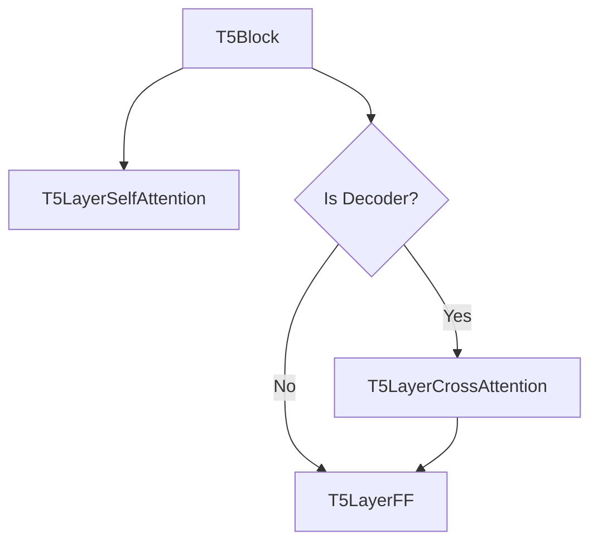

本文主要整理Hugging Face中T5及BART的代码实现要点。

## 1. T5

### 1.1 T5Tokenizer

在T5模型中，`<extra_id_0>`到`<extra_id_99>`是预定义的**哨兵标记(sentinel tokens)**，专门用于处理Span Corruption（文本段遮蔽）任务。以下是它们的完整使用指南：

**预训练阶段**（Span Corruption）
- **遮蔽过程**：
  ```python
  # 原始文本
  text = "T5模型通过替换连续文本段进行预训练"

  # 遮蔽后的输入（示例）
  input_text  = "T5模型<extra_id_0>进行预训练"
  target_text = "<extra_id_0>通过替换连续文本段<extra_id_1>"
  ```
- **遮蔽策略**：随机选择15%的token
    - 连续遮蔽平均长度=3的文本段（噪声比例15%）
    - 用哨兵标记替代遮蔽段（`<extra_id_0>`, `<extra_id_1>`, ...）

**生成阶段**
模型需要按顺序预测哨兵标记后的内容：
```python
输入：T5模型<extra_id_0>进行预训练
输出：<extra_id_0>通过替换连续文本段<extra_id_1>
```

```
graph TD
    A[原始文本] --> B{随机选择遮蔽位置}
    B -->|遮蔽连续文本段| C[替换为哨兵标记]
    C --> D[输入模型]
    D --> E[生成带哨兵标记的序列]
    E --> F[用预测文本替换哨兵]
    F --> G[最终修复文本]
```

### 1.2 T5 / BERT对比

T5（Text-to-Text Transfer Transformer）和BERT（Bidirectional Encoder Representations from Transformers）虽然都基于Transformer架构，但在模型设计、训练目标和应用范式上存在显著差异。

#### **1. 整体架构对比**
| 特性                | BERT                          | T5                            |
|---------------------|-------------------------------|-------------------------------|
| **架构类型**         | 仅编码器（Encoder-Only）       | 编码器-解码器（Encoder-Decoder）|
| **参数量分布**       | 所有参数用于理解任务           | 编码器侧重理解，解码器侧重生成  |
| **输入/输出形式**    | 固定长度文本 → 标签/位置概率    | 任意文本 → 任意文本            |

#### **2. 核心结构改动详解**
**编码器-解码器架构**
- **BERT**：  
  12/24层Transformer编码器堆叠，仅支持双向注意力（全词掩码）。
  
- **T5**：  
  - **编码器**：处理输入文本，使用**全局自注意力**（可看到全部输入）  
  - **解码器**：逐层生成输出，采用**因果掩码自注意力**（仅能看到历史信息）+ **交叉注意力**（关注编码器输出）  
  - **示例**：  
    ```python
    # T5的编码器层
    encoder_layer = TransformerBlock(
        self_attention=FullAttention(),  # 无掩码
        feed_forward=GatedFFN()
    )
    
    # T5的解码器层
    decoder_layer = TransformerBlock(
        self_attention=CausalAttention(),  # 下三角掩码
        cross_attention=EncoderDecoderAttention(),  # 关注编码器输出
        feed_forward=GatedFFN()
    )
    ```

**预训练任务改进**
| 任务类型        | BERT                          | T5                            |
|-----------------|-------------------------------|-------------------------------|
| **主要任务**     | MLM（掩码语言模型）           | Span Corruption（段落遮蔽）    |
| **遮蔽策略**     | 随机遮蔽15%单词               | 遮蔽连续文本段（平均长度=3）    |
| **特殊标记**     | [MASK]标记                    | `<extra_id_0>`等哨兵标记       |
| **目标形式**     | 预测被遮蔽的原始单词           | 生成带哨兵标记的完整序列        |

**T5的Span Corruption示例**：
```python
输入: "T5 improves <extra_id_0> pretraining"
目标输出: "<extra_id_0> upon BERT's <extra_id_1>"
```

**文本到文本统一框架**
- **BERT**：  
  为不同任务设计不同头部（如`BertForClassification`、`BertForQA`）。
  
- **T5**：  
  所有任务统一为文本到文本格式：
  ```python
  # 文本分类任务
  输入: "mnli premise: 他喜欢音乐 hypothesis: 他对艺术感兴趣"
  输出: "entailment"
  
  # 翻译任务
  输入: "translate English to German: Hello world"
  输出: "Hallo Welt"
  ```

**归一化与残差连接优化**
- **LayerNorm位置**：  
  - BERT：**Post-LayerNorm**（残差连接后）  
  - T5：**Pre-LayerNorm**（残差连接前）→ 训练更稳定  
  ```python
  # T5的Pre-LayerNorm实现
  class T5LayerNorm(nn.Module):
      def forward(self, x):
          return self.weight * (x - x.mean(-1, keepdim=True)) / (x.std(-1, keepdim=True) + 1e-6) + self.bias
  ```

**相对位置编码**
- **BERT**：  
  使用绝对位置编码（`position_embeddings`），直接加到词嵌入。
  
- **T5**：  
  采用**相对位置偏置**（Relative Position Bias）：  
  ```python
  # 计算注意力分数时添加相对位置偏置
  attention_scores = query @ key.transpose(-2, -1)  
  attention_scores += relative_position_bias  # [batch, heads, q_len, k_len]
  ```

**参数共享策略**
- **BERT**：  
  无跨层参数共享。
  
- **T5**：  
  - 可选**跨层参数共享**（默认不共享）  
  - 编码器与解码器的**词嵌入矩阵共享**  
  ```python
  # 在T5初始化时设置
  self.shared = nn.Embedding(vocab_size, d_model)
  self.encoder.embed_tokens = self.shared
  self.decoder.embed_tokens = self.shared
  ```

#### **3. 性能影响分析**
| 改进点                | 带来的优势                     | 潜在代价                     |
|-----------------------|-------------------------------|-----------------------------|
| 编码器-解码器架构      | 支持生成任务（翻译、摘要）      | 参数量增加约30%              |
| Span Corruption        | 更好的长距离依赖建模能力        | 生成结果可能包含冗余信息      |
| 文本到文本统一框架     | 多任务统一处理，扩展性强        | 需要设计任务特定的输入格式    |
| Pre-LayerNorm          | 训练稳定性提升，收敛更快        | 前向计算量略微增加            |

#### **4. 典型应用场景对比**
| 任务类型          | BERT更优                      | T5更优                      |
|-------------------|------------------------------|-----------------------------|
| 文本分类          | ✔️（直接使用[CLS]向量）         | 需生成标签文本               |
| 问答（SQuAD）     | ✔️（精确边界预测）              | 生成答案字符串               |
| 文本生成          | ❌（无解码器）                  | ✔️（可控生成）                |
| 多语言翻译        | ❌（需额外设计）                | ✔️（统一框架直接支持）         |

#### **5. 代码示例：T5 vs BERT**
**掩码预测对比**
```python
# BERT的MLM预测
from transformers import BertForMaskedLM, BertTokenizer
model = BertForMaskedLM.from_pretrained("bert-base-uncased")
input_text = "Paris is the [MASK] of France."
inputs = tokenizer(input_text, return_tensors="pt")
outputs = model(**inputs)
predicted_token = tokenizer.decode(outputs.logits[0].argmax(-1)[4])  # → "capital"

# T5的Span Corruption预测
from transformers import T5ForConditionalGeneration, T5Tokenizer
model = T5ForConditionalGeneration.from_pretrained("t5-small")
input_text = "translate English to French: Hello world"
inputs = tokenizer(input_text, return_tensors="pt")
outputs = model.generate(inputs.input_ids)
decoded = tokenizer.decode(outputs[0])  # → "Bonjour le monde"
```

**微调对比**
```python
# BERT分类微调
class BertClassifier(BertPreTrainedModel):
    def __init__(self, config):
        super().__init__(config)
        self.bert = BertModel(config)
        self.classifier = nn.Linear(config.hidden_size, num_labels)

# T5文本生成微调
class T5Generator(T5PreTrainedModel):
    def forward(self, input_ids, labels=None):
        outputs = self.t5(input_ids, labels=labels)
        return outputs  # 直接使用原生文本到文本结构
```

#### **6. 选择建议**
- **选择BERT**：  
  ✔️ 需要快速部署文本理解任务  
  ✔️ 资源受限（GPU内存<8GB）  
  ✔️ 任务输出是离散标签（分类、NER）

- **选择T5**：  
  ✔️ 需要统一处理多种任务  
  ✔️ 涉及文本生成（摘要、翻译）  
  ✔️ 希望减少任务特定的代码修改

### 1.3 T5Block

#### **1. 模块结构**
```python
class T5Block(nn.Module):
    def __init__(self, config, ...):
        self.layer = nn.ModuleList([
            T5LayerSelfAttention(...),  # 自注意力层
            (可选) T5LayerCrossAttention(...),  # 解码器的交叉注意力层
            T5LayerFF(...)  # 前馈网络层
        ])
```
**组成示意图**：


**初始化参数**
| 参数                     | 类型    | 说明                                                                 |
|--------------------------|---------|----------------------------------------------------------------------|
| `has_relative_attention_bias` | bool  | 是否使用相对位置偏置（首层通常为True）                                |
| `layer_idx`              | int     | 当前层索引（用于缓存管理）                                            |


#### **2. 自注意力阶段**
```python
self_attention_outputs = self.layer[0](  # T5LayerSelfAttention
    hidden_states,
    attention_mask,
    position_bias,          # 自注意力的相对位置偏置
    layer_head_mask,        # 注意力头掩码
    past_key_value,         # 缓存的键值对
    use_cache               # 是否缓存当前键值对
)
hidden_states, past_key_value = self_attention_outputs[:2]
```
**关键处理**：
- **相对位置编码**：通过 `position_bias` 实现T5的Relative Position Bias
- **混合精度优化**：对FP16的hidden_states进行数值截断（clamp）

#### **3. 交叉注意力阶段（仅解码器）**
```python
if self.is_decoder and encoder_hidden_states:
    cross_attention_outputs = self.layer[1](  # T5LayerCrossAttention
        hidden_states,
        key_value_states=encoder_hidden_states,  # 编码器输出
        encoder_attention_mask,                  # 编码器侧掩码
        encoder_decoder_position_bias,           # 交叉注意力相对位置偏置
        query_length=cache_position[-1] + 1      # 当前解码位置
    )
    hidden_states = cross_attention_outputs[0]
```
**核心机制**：
- **位置偏移管理**：`query_length` 确保生成时位置索引正确
- **交叉位置编码**：使用独立的 `encoder_decoder_position_bias`

#### **4. 前馈网络阶段**
```python
hidden_states = self.layer[-1](hidden_states)  # T5LayerFF
```
**结构特点**：
- **Gated Linear Unit (GLU)**：T5采用门控前馈网络
  ```python
  class T5LayerFF(nn.Module):
      def __init__(self, config):
          self.DenseReluDense = T5DenseGatedActDense(config)
  
  class T5DenseGatedActDense:
      def forward(self, x):
          gate = self.wi_0(x).sigmoid()  # 门控信号
          return self.wo(gate * self.wi_1(x))  # 门控加权
  ```

#### **5. 相对位置编码实现**
```python
# T5LayerSelfAttention内部
query = self.q(hidden_states)  # [B, L, d]
key = self.k(hidden_states)    # [B, L, d]

# 计算相对位置偏置
position_bias = self.compute_bias(query.shape[1], key.shape[1])  # [1, H, L, L]

# 注意力分数计算
scores = torch.matmul(query, key.transpose(-2, -1))  # [B, H, L, L]
scores += position_bias  # 添加相对位置偏置
```

```python
@staticmethod
def _relative_position_bucket(relative_position, bidirectional, num_buckets, max_distance):
    # 处理双向/单向
    if bidirectional:
        num_buckets //= 2
        relative_buckets += (relative_position > 0).long() * num_buckets
        relative_position = relative_position.abs()
    else:
        relative_position = -torch.min(relative_position, torch.zeros_like(relative_position))
    
    # 分桶逻辑
    max_exact = num_buckets // 2
    is_small = relative_position < max_exact
    
    # 对数分桶
    relative_position_if_large = max_exact + (
        torch.log(relative_position.float() / max_exact) 
        / math.log(max_distance / max_exact) 
        * (num_buckets - max_exact)
    ).long().clamp(max=num_buckets-1)
    
    return torch.where(is_small, relative_position, relative_position_if_large) + relative_buckets
```

**分桶策略**：
- **精确分桶**：前50%的桶用于小距离精确映射（0~63）
- **对数分桶**：后50%的桶按对数间隔分配（64~127）
- **最大距离截断**：超过`max_distance`（默认128）的位置映射到最后一个桶

**方向处理**：
| 模式        | 桶分配策略                            | 应用场景       |
|-------------|--------------------------------------|----------------|
| 双向（编码器） | 前64桶：负向位置<br>后64桶：正向位置 | 全可见注意力   |
| 单向（解码器） | 所有位置取绝对值                     | 因果掩码注意力 |


#### **6. 与标准Transformer的差异**
| 特性                | 标准Transformer              | T5Block                          |
|---------------------|------------------------------|----------------------------------|
| **位置编码**         | 绝对位置嵌入                  | 相对位置偏置（Attention Bias）   |
| **前馈网络**         | ReLU+Linear                  | Gated Linear Unit (GLU)          |
| **层归一化位置**     | Post-LayerNorm               | Pre-LayerNorm                    |
| **解码器结构**       | 单向自注意力+交叉注意力       | 同左，但位置编码实现方式不同      |

## 2. BART

### 2.1 BartTokenizer

BART Tokenizer 是基于 **字节级 BPE (Byte-Pair Encoding)** 的分词器，其核心设计继承自 RoBERTa，但有以下关键区别：
1. **特殊标记配置**：使用 `<s>` 和 `</s>` 作为序列控制标记
2. **空格敏感处理**：通过 `add_prefix_space` 参数控制前缀空格行为
3. **双序列格式**：使用双 `</s>` 分隔两个输入序列

| 特性            | RoBERTa Tokenizer         | BART Tokenizer             |
|-----------------|---------------------------|----------------------------|
| 特殊标记         | [CLS], [SEP]              | `<s>`, `</s>`              |
| 序列格式         | [CLS] A [SEP] B [SEP]     | `<s> A </s></s> B </s>`    |
| 掩码标记         | [MASK]                    | `<mask>`                   |
| 空格处理         | 同 BART                   | 同 RoBERTa                 |
| 预训练任务       | MLM                       | 文本去噪（Denoising）       |

### 2.2 BART / BERT对比

BERT 和 BART 是 NLP 领域两个里程碑式的预训练模型，尽管都基于 Transformer 架构，但在设计目标、模型结构和应用场景上存在显著差异。

#### **1. 架构设计对比**
| **特性**               | **BERT**                              | **BART**                              |
|------------------------|---------------------------------------|---------------------------------------|
| **模型类型**           | 纯编码器 (Encoder-Only)               | 编码器-解码器 (Encoder-Decoder)       |
| **注意力机制**         | 双向全注意力 (无掩码)                 | 编码器：双向全注意力<br>解码器：因果掩码注意力 |
| **参数量**             | 更少 (仅编码器)                       | 更多 (编码器+解码器)                  |
| **典型配置**           | BERT-base: 12层编码器 (110M参数)      | BART-base: 6层编码器 + 6层解码器 (139M参数) |

#### **2. 预训练任务对比**
| **任务类型**           | **BERT**                              | **BART**                              |
|------------------------|---------------------------------------|---------------------------------------|
| **核心任务**           | 掩码语言模型 (MLM)                    | 去噪自编码 (Denoising Autoencoder)    |
| **具体操作**           | 随机遮盖15%的单词并预测                | 多种文本破坏方式：<br>- 删除文本段<br>- 替换词序<br>- 掩码填充<br>- 文档旋转 |
| **目标函数**           | 预测被遮盖的原始单词                   | 重构原始完整文本                      |
| **上下文利用**         | 双向上下文 (全词掩码)                  | 编码器：双向上下文<br>解码器：单向生成 |

#### **3. 输入输出格式对比**
| **特性**               | **BERT**                              | **BART**                              |
|------------------------|---------------------------------------|---------------------------------------|
| **输入处理**           | `[CLS] A [SEP] B [SEP]`               | `<s> A </s></s> B </s>`               |
| **特殊标记**           | `[CLS]` (分类)<br>`[SEP]` (分隔)       | `<s>` (开始)<br>`</s>` (结束)          |
| **输出形式**           | 固定长度向量 (分类) 或标记概率         | 可变长度生成文本                      |
| **典型任务适配**       | 文本分类、问答、NER                    | 文本生成、摘要、翻译                  |

#### **4. 应用场景对比**
**BERT 更优的场景**
1. **文本分类**  
   ```python
   # BERT 文本分类输出
   [CLS] This movie is great! [SEP] → 正面情感
   ```
2. **命名实体识别 (NER)**  
   ```python
   # BERT 序列标注
   John [PER] lives in Paris [LOC]
   ```
3. **问答系统 (QA)**  
   ```python
   # BERT 抽取式问答
   Context: ... Answer: [start:15, end:20]
   ```

**BART 更优的场景**
1. **文本摘要**  
   ```python
   # BART 生成式摘要
   Input: <s> Long article... </s></s>  
   Output: </s> Short summary... </s>
   ```
2. **文本生成**  
   ```python
   # BART 对话生成
   Input: <s> Hello, how are you? </s></s>  
   Output: </s> I'm fine, thank you! </s>
   ```
3. **文本修复**  
   ```python
   # BART 去噪示例
   Corrupted Input: <s> The ███ was shining brightly. </s>  
   Output: </s> The sun was shining brightly. </s>
   ```

### 2.3 BartEncoderLayer / BartDecoderLayer

#### **与标准 Transformer结构差异**

```mermaid
graph TD
    subgraph Standard Transformer
        A[Encoder Layer] --> A1[Self-Attention]
        A1 --> A2[Add & Norm]
        A2 --> A3[FFN]
        A3 --> A4[Add & Norm]
        
        B[Decoder Layer] --> B1[Masked Self-Attention]
        B1 --> B2[Add & Norm]
        B2 --> B3[Cross-Attention]
        B3 --> B4[Add & Norm]
        B4 --> B5[FFN]
        B5 --> B6[Add & Norm]
    end
    
    subgraph BART
        C[Encoder Layer] --> C1[Enhanced Self-Attention]
        C1 --> C2[Add & Norm]
        C2 --> C3[GeGLU FFN]
        C3 --> C4[Add & Norm]
        
        D[Decoder Layer] --> D1[Causal Self-Attn]
        D1 --> D2[Add & Norm]
        D2 --> D3[Enhanced Cross-Attn]
        D3 --> D4[Add & Norm]
        D4 --> D5[GeGLU FFN]
        D5 --> D6[Add & Norm]
    end
```


#### **关键参数对比**
| 参数                 | 标准 Transformer      | BART                  |
|----------------------|----------------------|-----------------------|
| 注意力类型           | 绝对位置编码          | 相对位置偏置           |
| FFN 激活函数         | ReLU                 | GeLU                  |
| 层归一化位置         | Post-LN              | Post-LN               |
| 解码器缓存           | 基础实现              | 优化键值对管理         |
| 最大序列长度         | 512                  | 1024                  |


