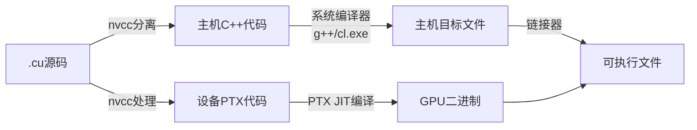

本文主要整理PMPP Chapter 2  Heterogeneous data parallel computing的要点。

## 2.0 前言

本节主要介绍了**数据并行 (Data Parallelism)** 的核心概念及其在并行编程中的重要性。它指出，数据并行是指可以对数据集的不同部分进行独立且并行的计算。许多应用都富含数据并行性，这使得它们非常适合进行可扩展的并行执行。因此，了解数据并行概念及相关的编程语言结构对并行程序员至关重要。最后，段落指明本章将使用 **CUDA C** 语言结构来开发一个简单的数据并行程序作为实践。

### 要点总结

1.  **核心定义**：**数据并行 (Data Parallelism)** 是指对数据集的不同部分执行的计算工作可以**相互独立**地进行，因此这些计算可以**同时（并行）** 完成。
2.  **主要优势**：应用中的大量数据并行性使其能够进行**可扩展的并行执行 (scalable parallel execution)**，即通过增加计算资源（如更多的处理器核心）来有效提升处理更大规模数据的能力。
3.  **对程序员的要求**：并行程序员必须熟悉数据并行的概念，并掌握使用**并行编程语言结构 (parallel programming language constructs)** 来编写能利用数据并行性的代码。
4.  **实践工具**：本章将使用 **CUDA C** 的语言结构来实现一个简单的数据并行程序示例。CUDA 是 NVIDIA 推出的一个广泛使用的并行计算平台和编程模型。

## 2.1 Data parallelism

### 内容概括

本节通过具体示例深入阐述了**数据并行 (Data Parallelism)** 的概念。它首先指出，现代软件性能的瓶颈通常来自于需要处理**过于庞大的数据量**，并列举了图像处理、科学计算、分子动力学和航空调度等多个领域的实例。这些应用的核心特点是，其海量的数据点（如像素、原子、网格点、航班）大多可以**被独立处理**。

文章随后以**彩色图像转灰度图**为例，详细说明了数据并行的执行方式：每个像素的转换（根据公式 `L = r*0.21 + g*0.72 + b*0.07` 计算亮度值）完全不依赖于其他像素的计算结果。因此，所有像素的处理操作都可以同时、独立地进行，从而完美地展现了数据并行性。

最后，文章指出，虽然这个例子很简单，但实际应用中的数据并行可能更复杂，并点明本书的核心目标是教授如何发现并利用这种并行性。

### 要点总结

1.  **问题根源**：应用程序运行缓慢的主要原因是需要处理**数据量过大 (too much data)**。
2.  **广泛应用**：数据并行性普遍存在于众多领域，如图像处理（像素）、科学计算（网格点）、分子动力学（原子）和商业应用（航班、资源）等。
3.  **核心思想**：数据并行基于这样一个事实：对数据集中**不同部分的计算可以完全独立 (independently)** 进行。
4.  **关键方法**：编写数据并行代码需要围绕数据（重新）组织计算，使得大量**独立的计算可以同时执行 (execute in parallel)**，从而大幅缩短总完成时间。
5.  **具体示例**：**彩色转灰度**是数据并行的经典范例：
    *   每个输出像素的计算仅依赖于输入图像中对应的一个像素（或一个小邻域）。
    *   所有像素的处理过程相同（执行相同的公式），且互不依赖。
6.  **复杂性与目标**：现实应用中的数据并行可能更复杂，本书旨在培养读者发现和利用数据并行性所需的**并行思维 (parallel thinking)**。

## 2.1 Task Parallelism vs. Data Parallelism

### 内容概述

本节对比了并行编程中两种主要的并行类型：**数据并行 (Data Parallelism)** 和**任务并行 (Task Parallelism)**。

*   **任务并行**是指将应用程序分解为多个不同的、可以独立执行的**任务**（如向量加法、矩阵乘法、I/O操作等）。这些任务可以同时运行，从而加快整体执行速度。
*   **数据并行**则是指对大量数据集中的不同部分**执行相同的操作**。

文章指出，虽然两者都重要，但**数据并行是程序实现可扩展性（Scalability）的主要源泉**，因为它能利用海量数据来充分发挥大规模并行处理器（如GPU）的性能。而**任务并行在提升整体性能方面也扮演着重要角色**，并将在后续介绍“流”（Streams）的概念时详细讨论。

### 要点总结

1.  **两种并行类型**：并行编程主要包含两种范式：
    *   **数据并行 (Data Parallelism)**：对数据的不同部分执行**相同的操作**。
    *   **任务并行 (Task Parallelism)**：同时执行**不同的操作或函数**（即任务）。

2.  **任务并行的来源**：
    *   通过**任务分解**来暴露，例如将应用分解为向量加法和矩阵乘法两个独立任务。
    *   **I/O操作和数据传输**也是常见的任务来源。
    *   大型应用（如分子动力学模拟）中存在更多自然任务，因此具有更丰富的任务并行性。

3.  **两者的角色与重要性**：
    *   **数据并行是 Scalability（可扩展性）的核心**：庞大的数据集能提供丰富的数据并行性，使得程序能够充分利用不断增长的硬件并行资源（如更多核心的处理器），让性能随硬件代际更新而提升。
    *   **任务并行是性能补充**：它在实现性能目标中也扮演着**重要角色**，可以与数据并行协同工作。

4.  **后续内容**：文中提到“流（Streams）”将是后续深入介绍任务并行的一个重要概念。

## 2.2 CUDA C program structure

### 内容概括

本节介绍了 **CUDA C 程序的基本结构**及其执行模型。CUDA C 是 ANSI C 的扩展，通过少量新语法和库函数，使程序员能够编写在包含 CPU 和 GPU 的异构系统上运行的程序。

一个 CUDA C 程序由**主机代码 (Host Code)**（在 CPU 上串行执行）和**设备代码 (Device Code)**（在 GPU 上并行执行）混合组成。设备代码通过特殊关键字标记，其核心是**内核函数 (Kernels)**。

程序的执行从主机代码开始。当调用一个内核函数时，会在设备上启动大量**线程 (Threads)** 来并行执行该内核。一次内核调用启动的所有线程集合称为一个**网格 (Grid)**。网格中的线程是并行执行的主要载体。一个网格完成后，控制权返回主机，继续执行后续代码，如此反复。

文中还强调了 CUDA 线程的轻量级特性，其创建和调度开销极低，这与传统的 CPU 线程形成鲜明对比，使得启动海量线程来处理数据并行任务成为可能。

### 要点总结

1.  **语言定位**：CUDA C 是 ANSI C 的扩展，用于**异构计算**（CPU + GPU），由 NVIDIA CUDA 平台支持，拥有成熟的工具链（编译器、调试器、分析器）。

2.  **程序结构**：
    *   **主机代码 (Host Code)**：在 **CPU** 上运行的传统 C 代码，负责串行部分和流程控制。
    *   **设备代码 (Device Code)**：在 **GPU** 上运行的代码，通过特殊关键字标识。
    *   **内核函数 (Kernel)**：设备代码的核心，是被启动到 GPU 上、由**大量线程并行执行**的函数。

3.  **执行模型**：
    *   程序从主机代码开始执行。
    *   调用内核函数时，在设备上启动一个**网格 (Grid)** 的线程。
    *   网格中的所有线程完成内核执行后，网格终止，控制流返回主机。
    *   CPU 和 GPU 的执行可以重叠（图中简化模型未显示），以充分利用异构计算优势。

4.  **线程概念**：
    *   线程是 CUDA 中**并行执行的基本单位**。
    *   一次内核调用产生的所有线程组成一个**网格 (Grid)**。
    *   线程数量通常根据**数据规模**设定（如一个线程处理一个像素/一个数组元素）。
    *   CUDA 线程是**轻量级**的，创建和调度开销极低，这是实现细粒度大规模并行的关键。

5.  **示例**：文中提及将使用**向量加法**作为简单示例来具体说明这些概念。

## 2.2 Thread

### 内容概述

本节阐述了**线程 (Thread)** 的基本概念，并对比了传统编程中的线程与 CUDA 编程中线程的关键区别。

线程是对处理器如何顺序执行程序的一种抽象，它包含了程序代码、当前执行点以及变量和数据结构的值。对用户而言，线程的执行是顺序的。

在传统编程中，程序员需要通过线程库或特殊语言来手动创建和管理多个线程以实现并行。而在 CUDA 编程中，并行性通过调用**内核函数 (Kernel Function)** 来启动。这一调用会由底层运行时机制自动生成一个由大量线程组成的**网格 (Grid)**，这些线程会并行处理数据的不同部分，从而隐藏了手动管理线程的复杂性。

### 要点总结

1.  **线程的定义**：线程是执行程序的**一个逻辑序列**，包含三大要素：
    *   要执行的**程序代码**。
    *   当前执行的**位置（程序计数器）**。
    *   运行时**变量和数据结构的当前值**。

2.  **线程的执行特性**：从用户视角看，单个线程的执行是**顺序的 (Sequential)**。可以使用调试器进行单步跟踪，观察执行流程和变量值的变化。

3.  **传统线程 vs. CUDA 线程**：
    *   **传统线程**：由程序员**显式地创建和管理**，用于实现程序中的并行部分。
    *   **CUDA 线程**：由调用**内核函数自动且隐式地启动**。程序员指定并行任务的规模，运行时系统会自动生成和管理海量的线程（一个网格）来并行处理数据。

4.  **CUDA 并行执行的核心**：通过调用**内核函数**来启动**网格 (Grid)**，从而发起大规模的数据并行处理。程序员无需手动创建单个线程，只需关注如何将计算任务分解为可供大量线程并行处理的形式。

## 2.3 Thread

### 内容概述

本节以**向量加法 (Vector Addition)** 这一最简单的数据并行计算为例，演示了如何将一个传统的顺序执行的 C 函数改造为在 GPU 上并行执行的 CUDA C 程序结构。

首先回顾了传统的在 CPU 上执行的向量加法函数（`vecAdd`），它通过一个 for 循环顺序处理每个数组元素。随后，重点介绍了修改后的 `vecAdd` 函数，该函数充当一个“外包代理”，其工作流程分为三个部分：
1.  **数据传输到设备**：在 GPU 上分配内存，并将输入数据（数组 A, B）从主机内存复制到设备内存。
2.  **内核调用**：调用实际的向量加法**内核 (Kernel)** 函数，在设备上启动一个**网格 (Grid)** 的线程来并行执行计算。
3.  **结果取回主机**：将计算结果（数组 C）从设备内存复制回主机内存，并释放设备上的内存。

文章最后指出，这种为了清晰而介绍的“透明”数据来回拷贝模型在实际中可能效率低下，更高效的做法是将主要数据长期保留在设备上。

### 要点总结

1.  **示例选择**：向量加法是数据并行计算中最简单的例子，相当于并行编程中的 **“Hello World”**。

```c
 01    void vecAdd(float* A, float* B, float* C, int n) {
 02        int  size = n* sizeof(float); 
 03        float  *d_A *d_B, *d_C;
 04
 05        // Part 1: Allocate device memory for A, B, and C
 06        // Copy A and B to device memory
 07        ...
 08    
 09        // Part 2: Call kernel –to launch a grid of threads
 10        // to perform the actual vector addition
 11        ...
 12
 13        // Part 3: Copy C from the device memory
 14        // Free device vectors
 15        ...
 16    }
```

2.  **传统顺序实现**：
    *   使用一个 **for 循环**顺序遍历数组。
    *   在每次迭代中计算一个输出元素（`C[i] = A[i] + B[i]`）。

3.  **CUDA 并行实现结构（修改后的 `vecAdd` 函数）**：
    *   **Part 1: 数据准备与传输**
        *   在 **Device (GPU)** 上为输入输出数组（`A_d`, `B_d`, `C_d`）分配内存。
        *   将输入数据从 **Host (CPU)** 内存（`A_h`, `B_h`）**拷贝**到 Device 内存。
    *   **Part 2: 启动并行计算**
        *   **调用内核函数**，在 GPU 上启动大量线程来**并行地**执行实际的向量加法运算。
    *   **Part 3: 取回与清理**
        *   将计算结果从 Device 内存（`C_d`）**拷贝**回 Host 内存（`C_h`）。
        *   **释放**在 Device 上分配的临时内存。

4.  **编程模型角色**：
    *   修改后的 `vecAdd` 函数像一个**外包代理**，负责,：
        1.  将数据发送到设备。
        2.  启动设备上的计算。
        3.  取回结果。
    *   这种设计对调用者（如 `main` 函数）是**透明的**，它无需知道计算实际在 GPU 上完成。

5.  **重要说明（实际应用考量）**：
    *   文中介绍的**透明模型（频繁来回拷贝数据）在实际中效率不高**，主要用于教学演示基本概念。
    *   **高性能实践**通常是让主要数据**常驻**在设备内存中，主机代码只调用设备函数对这些数据进行操作，避免不必要的拷贝开销。

## 2.4 Device global memory and data transfer

### 内容概述

本节详细介绍了在 CUDA 系统中，如何在 **主机 (CPU)** 和 **设备 (GPU)** 之间进行 **设备全局内存 (Device Global Memory)** 的管理与数据传输，这是执行 CUDA 内核（如向量加法）前的关键准备工作。它解释了使用 **CUDA API 函数**（主要是 `cudaMalloc`, `cudaMemcpy`, `cudaFree`）来完成这些任务的机制、语法和注意事项，并最终展示了将图 2.5 中 `vecAdd` 函数的 Part 1 和 Part 3 具体实现的完整代码结构。

```c
01    void vecAdd(float* A_h, float* B_h, float* C_h, int n) { 
02        int size = n * sizeof(float);  
03        float *A_d, *B_d, *C_d; 
04     
05        cudaMalloc((void **) &A_d, size); 
06        cudaMalloc((void **) &B_d, size); 
07        cudaMalloc((void **) &C_d, size); 
08 
09        cudaMemcpy(A_d, A_h, size, cudaMemcpyHostToDevice); 
10        cudaMemcpy(B_d, B_h, size, cudaMemcpyHostToDevice); 
11 
12        // Kernel invocation code – to be shown later 
13        ... 
14 
15        cudaMemcpy(C_h, C_d, size, cudaMemcpyDeviceToHost); 
16 
17        cudaFree(A_d); 
18        cudaFree(B_d); 
19        cudaFree(C_d); 
20    } 
```

### 要点总结

1.  **设备全局内存 (Device Global Memory)**：
    *   设备（通常是 GPU 硬件卡）配备有自己专属的 DRAM，称为**全局内存**（如 NVIDIA V100 有 16GB 或 32GB）。
    *   “全局”意指它是设备上对程序员可访问的**主要内存类型**（区别于其他设备内存类型），用于存储需要在 CPU 和 GPU 之间传输或由 GPU 内核直接处理的数据（如向量加法中的 A, B, C 数组）。

2.  **内核执行前的关键步骤**：
    *   **分配设备内存**：在设备全局内存中为数据对象（如输入数组 A, B，输出数组 C）**分配空间**。
    *   **数据传输 (Host → Device)**：将输入数据**从主机内存拷贝**到已分配的设备全局内存中。
    *   这两步对应于图 2.5 中 `vecAdd` 函数的 **Part 1**。

3.  **核心 CUDA 内存管理 API 函数**：
    *   **`cudaMalloc`**:
        *   **功能**：在设备全局内存中**分配指定大小**的连续内存块。
        *   **参数**：
            *   `void** devPtr`：指向**指针变量地址**的指针（需强制转换为 `void **` 类型），该指针变量在函数返回后将被设置指向分配区域的起始地址。**后缀 `_d` 用于指示设备指针**（如 `A_d`）。
            *   `size_t size`：要分配的**内存字节数**（计算方式：`元素个数 * sizeof(元素类型)`）。
        *   **相似性**：设计上刻意**模仿标准 C 的 `malloc`**，降低学习曲线。
    *   **`cudaMemcpy`**:
        *   **功能**：**拷贝数据** 主机内存与设备内存之间，或设备内存内部。
        *   **参数**：
            *   `void* dst`：**目标**内存指针地址。
            *   `const void* src`：**源**内存指针地址。
            *   `size_t count`：要复制的**字节数**。
            *   `cudaMemcpyKind kind`：**复制方向标识符**（关键常量：`cudaMemcpyHostToDevice`, `cudaMemcpyDeviceToHost`, `cudaMemcpyDeviceToDevice`, `cudaMemcpyHostToHost`）。
    *   **`cudaFree`**:
        *   **功能**：**释放**之前通过 `cudaMalloc` 在设备全局内存中分配的**空间**。
        *   **参数**：`void* devPtr`：指向要释放的内存块的**设备指针**（如 `A_d` 本身的值）。**注意：传递的是指针值，不是指针的地址**。
        *   **相似性**：设计上刻意**模仿标准 C 的 `free`**。

4.  **内核执行后的关键步骤**：
    *   **数据传输 (Device → Host)**：将计算结果数据**从设备全局内存拷贝**回主机内存，使主机代码可以访问。
    *   **释放设备内存**：释放在设备全局内存中分配的、不再需要的空间。
    *   这两步对应于图 2.5 中 `vecAdd` 函数的 **Part 3**。

5.  **重要注意事项**：
    *   **设备指针 (`A_d`, `B_d`, `C_d`)**：
        *   这些指针指向**设备内存地址**，**主机代码（CPU）无法直接解引用（dereference）或访问其指向的内容**（会导致运行时错误）。它们仅用于传递给 CUDA API 函数和内核函数。
    *   **透明模型的效率警告**：
        *   文中演示的数据来回拷贝模型（Host↔Device）是为了清晰展示概念，**实际应用中频繁拷贝会产生显著性能开销**。
        *   **高性能实践**：应尽可能让**重要的大数据结构常驻设备内存**，减少不必要的来回传输。
    *   **API 设计的理念**：CUDA C API 函数（如 `cudaMalloc`/`cudaFree`）**刻意模仿标准 C 内存函数（`malloc`/`free`）的接口**，最大限度地降低 C 程序员的学习负担。

6.  **`vecAdd` 函数完整流程 (图 2.8/2.9)**：
    *   **Part 1**：调用 `cudaMalloc` 为 `A_d`, `B_d`, `C_d` 分配设备内存；调用 `cudaMemcpy`（带 `cudaMemcpyHostToDevice`）将 `A_h` 数据复制到 `A_d`，将 `B_h` 数据复制到 `B_d`。
    *   **Part 2**：调用向量加法内核进行计算（在设备上运行）。
    *   **Part 3**：调用 `cudaMemcpy`（带 `cudaMemcpyDeviceToHost`）将 `C_d` 的计算结果复制回 `C_h`；调用 `cudaFree` 释放 `A_d`, `B_d`, `C_d` 所占用的设备内存。**该函数充当主机调用设备执行实际计算的“外包代理（Stub）”。**

## 2.5 Kernel functions and threading

### 内容概括

本节深入探讨了 CUDA C 的**内核函数 (Kernel Function)** 及其调用时产生的**线程层次结构 (Thread Hierarchy)**。它解释了当主机代码调用一个内核时，CUDA 运行时系统会启动一个由大量线程组成的**网格 (Grid)**，这些线程以**单程序多数据 (SPMD)** 的模式并行执行相同的内核代码。

网格被组织成一个两层的层次结构：**网格 (Grid) → 线程块 (Thread Block)**。每个线程块包含多个线程，线程通过内置变量 `threadIdx`, `blockIdx`, 和 `blockDim` 来识别自己在网格中的唯一位置，并据此计算全局索引，从而决定处理哪部分数据。

内核函数使用 `__global__` 关键字声明，并通过特定的线程索引计算来替代原始顺序代码中的循环，实现**循环并行化 (Loop Parallelism)**。最后，文章强调了使用条件判断（如 `if (i < n)`）来处理数据规模不是线程块大小整数倍的情况的重要性，以确保程序的正确性。

### 要点总结

1.  **执行模型：SPMD**
    *   所有线程执行**相同的**内核函数代码，是典型的**单程序多数据 (SPMD)** 并行编程模式。

2.  **线程层次结构**
    *   线程被组织成两层结构：
        *   **网格 (Grid)**：一次内核调用启动的所有线程的集合。
        *   **线程块 (Thread Block)**：网格由多个线程块组成。每个块可包含多达 1024 个线程。块内的线程可以通过共享内存进行协作和同步。
    *   这种结构提供了灵活的线程组织方式，能够映射不同维度的数据。

```c
01    // Compute vector sum C = A + B 
02    // Each thread performs one pair-wise addition 
03    __global__ 
04    void vecAddKernel(float* A, float* B, float* C, int n) { 
05     int i = threadIdx.x + blockDim.x * blockIdx.x; 
06     if (i < n) { 
07          C[i] = A[i] + B[i]; 
08     } 
09    }
```

3.  **内置变量（线程的“坐标”）**
    *   这些变量由运行时系统自动提供，每个线程看到的值都不同：
        *   `blockDim`：一个结构体（含 x, y, z 字段），表示**每个线程块的维度**（即每个块有多少个线程）。对于一维组织，主要使用 `blockDim.x`。
        *   `threadIdx`：一个结构体（含 x, y, z 字段），表示线程在**其所属线程块内**的索引（“本地电话号码”）。
        *   `blockIdx`：一个结构体（含 x, y, z 字段），表示线程块在**整个网格中**的索引（“区号”）。

4.  **计算全局索引**
    *   线程通过组合这些内置变量来计算其在处理全局数据时的**唯一索引 `i`**。
    *   对于一维数据和一维线程组织：**`i = blockIdx.x * blockDim.x + threadIdx.x`**
    *   这个公式确保了所有线程的索引 `i` 能够**连续地覆盖**整个数据范围（如数组的所有元素）。

5.  **函数声明关键字**
    *   `__global__`：用于声明**内核函数**。在设备上执行，由主机调用，调用时会**启动一个网格的线程**。
    *   `__device__`：用于声明**设备函数**。在设备上执行，只能被其他内核函数或设备函数调用。**不会启动新线程**。
    *   `__host__`：用于声明**主机函数**（传统 C 函数）。在主机上执行，只能被其他主机函数调用。**默认情况下所有函数都是主机函数**。

6.  **循环并行化**
    *   内核函数中**没有显式的循环**。原始顺序代码中的循环被**替换为了网格的并行线程**。
    *   每个线程相当于执行了原循环中的**一次迭代**。

7.  **边界检查**
    *   由于数据长度可能不是线程块大小的整数倍，最后启动的线程块可能会有**多余的线程**。
    *   必须在内核代码中使用**条件判断**（如 `if (i < n)`）来确保这些多余的线程不会访问超出范围的数据，从而保证程序的正确性。

## 2.6 Calling kernel functions

### 内容概括

本节详细说明了如何在主机代码中**调用内核函数**以启动并行计算网格，完成了向量加法示例的最后一步。它介绍了通过**执行配置参数**来设置网格和线程块维度的方法，并解释了如何根据数据总量计算所需的线程块数量以确保覆盖所有数据。文中还通过具体例子（如处理1000个元素）演示了计算过程，并再次强调了内核中边界检查（`if (i < n)`）的重要性。最后，文章客观地指出了该简单示例在实际中可能存在的性能开销问题，并解释了为何在真实应用中CUDA编程依然能带来巨大性能提升。

### 要点总结

```c
01    int vectAdd(float* A, float* B, float* C, int n) { 
02        // A_d, B_d, C_d allocations and copies omitted
03        ...
04        // Launch ceil(n/256) blocks of 256 threads each 
05        vecAddKernel<<<ceil(n/256.0), 256>>>(A_d, B_d, C_d, n);
06    }
```

```c
01  void vecAdd(float* A, float* B, float* C, int n) { 
02     float *A_d, *B_d, *C_d; 
03     int size = n * sizeof(float);  
04     cudaMalloc((void **) &A_d, size); 
05     cudaMalloc((void **) &B_d, size);
06     cudaMalloc((void **) &C_d, size); 
07     cudaMemcpy(A_d, A, size, cudaMemcpyHostToDevice); 
08     cudaMemcpy(B_d, B, size, cudaMemcpyHostToDevice); 
09     vecAddKernel<<<ceil(n/256.0), 256>>>(A_d, B_d, C_d, n); 
10     cudaMemcpy(C, C_d, size, cudaMemcpyDeviceToHost); 
11     cudaFree(A_d); 
12     cudaFree(B_d); 
13     cudaFree(C_d);    
14  } 
```

1.  **调用内核与执行配置**：
    *   主机代码通过在内核函数名和参数列表之间插入 **`<<< >>>`** 语法来调用内核并配置执行参数。
    *   执行配置参数包括：
        *   **网格维度**：第一个参数，定义了网格中包含的**线程块数量**。
        *   **块维度**：第二个参数，定义了每个线程块中包含的**线程数量**。

2.  **计算网格大小（线程块数量）**：
    *   为确保所有数据都被处理，线程总数（线程块数 × 每块线程数）应**不少于**数据元素数量（n）。
    *   所需线程块数通过 **向上取整除法** 计算：`ceil(n / blockDim)`。
    *   例如，处理 n=1000 个元素，使用 256 线程/块，则需要 `ceil(1000 / 256.0) = 4` 个线程块，共启动 1024 个线程。

3.  **边界检查的重要性**：
    *   由于启动的线程总数可能略多于实际数据量（如1024线程处理1000个元素），内核代码中**必须**使用条件判断（如 `if (i < n)`）来防止多余的线程访问无效数据。

4.  **可扩展性与执行顺序**：
    *   线程块之间**没有固定的执行顺序**。程序不能对它们的执行顺序有任何依赖。
    *   CUDA 程序的性能具有**可扩展性**：相同的代码在拥有更多计算资源（能并行执行更多线程块）的大型GPU上会自动运行得更快，而在小型GPU上则较慢。

5.  **关于性能的重要说明（现实考量）**：
    *   **向量加法是一个“Hello World”式的简单示例**，其计算强度（计算操作/数据访问量）很低。
    *   因此，**内存分配、数据传输等开销很可能掩盖并行计算带来的收益**，导致最终加速比不佳甚至变慢。
    *   **真实应用**通常更能体现优势，因为它们具有：
        *   **更高的计算强度**：内核中对数据的计算操作远比简单的加法复杂。
        *   **数据驻留**：数据在多个内核调用之间**常驻于设备内存**，分摊了单次数据传输的开销，使得计算时间远大于通信时间。

## 2.7 Compilation

### 内容概述

本节简要介绍了 CUDA C 程序的**编译过程**。由于 CUDA C 使用了大量标准 C 所没有的扩展语法（如 `__global__` 关键字），因此无法使用传统 C 编译器进行编译，必须使用 NVIDIA 提供的 **NVCC (NVIDIA C Compiler)**。

NVCC 在编译时会根据 CUDA 关键字将代码分离：**主机代码**（纯 ANSI C）交由系统的标准 C/C++ 编译器编译，生成在 CPU 上运行的程序；**设备代码**（包含内核函数等）则由 NVCC 首先编译为一种称为 **PTX** 的虚拟二进制文件，然后在程序运行时再由驱动将其编译为特定 GPU 的实际机器码并执行。

### 要点总结

1.  **需要专用编译器**：CUDA C 的扩展语法决定了它必须使用 **NVCC** 来编译，而不能使用传统的 C 编译器。
2.  **分离编译**：NVCC 的核心作用是**将主机代码和设备代码分离开**，并采用不同的编译路径进行处理。
3.  **主机代码编译路径**：主机代码是标准的 ANSI C 代码，被 NVCC 提取出来，交由主机上的**标准 C/C++ 编译器**（如 gcc, clang, MSVC）进行编译，最终生成在 CPU 上执行的二进制代码。
4.  **设备代码编译路径**：设备代码（被 CUDA 关键字标记的部分）由 NVCC 处理：
    *   首先被编译为 **PTX**，这是一种虚拟的、架构中立的指令集（类似于字节码）。
    *   在程序运行时，PTX 代码再由驱动程序**即时编译 (JIT)** 为当前 GPU 专用的真实机器码，从而保证兼容性并发挥硬件最佳性能。
5.  **NVCC 的角色**：NVCC 是一个**驱动工具链的编译器**，它协调了主机编译器（处理主机代码）和自身的后端（处理设备代码），最终生成一个完整的、包含主机和设备两部分代码的可执行文件。

## cuda编译示例

以下是CUDA程序的完整编译流程及示例：

### CUDA编译核心原理
1. **专用编译器**：必须使用NVIDIA的`nvcc`（NVIDIA CUDA Compiler）
2. **分离编译**：
   - **主机代码**（Host Code）→ 交给系统C++编译器（如g++）
   - **设备代码**（Device Code）→ 由`nvcc`处理为PTX虚拟指令，运行时由GPU驱动编译为机器码

---

### 编译步骤示例（以Linux为例）
#### 1. 创建CUDA程序文件 `vector_add.cu`
```cpp
#include <iostream>

__global__ void vecAddKernel(float* A, float* B, float* C, int n) {
    int i = blockIdx.x * blockDim.x + threadIdx.x;
    if (i < n) C[i] = A[i] + B[i];
}

int main() {
    int n = 1000;                                  // 向量长度
    size_t size = n * sizeof(float);
    
    // 主机内存分配
    float *h_A = new float[n], *h_B = new float[n], *h_C = new float[n];
    
    // 初始化数据
    for (int i = 0; i < n; ++i) {
        h_A[i] = rand() / (float)RAND_MAX;
        h_B[i] = rand() / (float)RAND_MAX;
    }

    // 设备内存分配
    float *d_A, *d_B, *d_C;
    cudaMalloc(&d_A, size);
    cudaMalloc(&d_B, size);
    cudaMalloc(&d_C, size);

    // 主机->设备数据传输
    cudaMemcpy(d_A, h_A, size, cudaMemcpyHostToDevice);
    cudaMemcpy(d_B, h_B, size, cudaMemcpyHostToDevice);

    // 内核调用配置
    int blockSize = 256;
    int numBlocks = (n + blockSize - 1) / blockSize;
    vecAddKernel<<<numBlocks, blockSize>>>(d_A, d_B, d_C, n);

    // 设备->主机结果回传
    cudaMemcpy(h_C, d_C, size, cudaMemcpyDeviceToHost);

    // 资源释放
    cudaFree(d_A); cudaFree(d_B); cudaFree(d_C);
    delete[] h_A; delete[] h_B; delete[] h_C;
}
```

#### 2. 编译命令
```bash
nvcc -o vector_add vector_add.cu 
```

#### 3. 关键选项说明
| 选项 | 用途示例 | 说明 |
|------|----------|------|
| `-arch=compute_XX` | `-arch=compute_61` | 指定GPU架构（如GTX 10系列） |
| `-o <output>` | `-o vec_add` | 指定输出文件名 |
| `-Xcompiler '<flags>'` | `-Xcompiler '-O3 -Wall'` | 向主机编译器传递参数 |
| `--ptx` | `nvcc --ptx vector_add.cu` | 生成PTX中间文件（用于调试） |

#### 4. 执行程序
```bash
./vector_add
```

---

### 常见问题处理
1. **架构不匹配**：添加GPU计算能力声明  
   ```bash
   nvcc -arch=compute_86 -o vector_add vector_add.cu  # RTX 30系列使用
   ```

2. **多文件编译**：
   ```bash
   nvcc -c kernel.cu       # 编译设备代码 → kernel.o
   nvcc -c main.cpp        # 编译主机代码 → main.o
   nvcc -o app kernel.o main.o  # 链接生成可执行文件
   ```

3. **Windows编译（Visual Studio集成）**：
   - 创建`CUDA Toolkit`项目
   - `.cu`文件自动关联nvcc编译器
   - 按F5即可编译调试

---

### 编译过程图示


> **注意**：实际运行时GPU驱动程序会将PTX代码动态编译为当前GPU的本地指令（SASS），因此同一可执行文件可在不同架构GPU上运行（需CUDA版本兼容）

## 2.8 Summary

### 内容概述

本章对 CUDA C 编程模型进行了简要且简化的概述。CUDA C 通过扩展 C 语言来支持并行计算。本章讨论了这些扩展的核心子集，并将其总结为四个主要方面：函数声明、内核调用与网格启动、内置变量以及运行时 API。本章的目标是介绍 CUDA C 的核心概念和用于编写简单程序的基本扩展，并非所有功能的全面说明，更多细节需参考 CUDA C 编程指南。

### 要点总结

#### 1. 函数声明 (Function Declarations)
CUDA C 扩展了 C 函数声明语法以支持异构并行计算。其扩展关键字包括：
*   `__global__`：用于声明**内核函数**。在设备上执行，由主机调用，调用时会**启动一个网格的线程**。
*   `__device__`：用于声明**设备函数**。在设备上执行，只能被其他内核函数或设备函数调用。**不会启动新线程**。
*   `__host__`：用于声明**主机函数**（传统 C 函数）。在主机上执行，只能被其他主机函数调用。
*   **默认行为**：所有没有上述任何关键字的函数都默认为主机函数。
*   **双重编译**：可以同时使用 `__host__` 和 `__device__` 声明一个函数，编译器将同时生成该函数的主机版本和设备版本。

#### 2. 内核调用与网格启动 (Kernel Call and Grid Launch)
*   CUDA C 使用独特的 `<<< >>>` 语法来扩展 C 函数调用。
*   这些**执行配置参数**仅在调用内核函数以启动网格时使用。
*   参数用于定义**网格的维度**和**每个线程块的维度**。

#### 3. 内置变量 (Built-in Variables)
CUDA 内核可以访问一组内置的、预定义的只读变量，这些变量允许线程区分彼此并确定要处理的数据区域。
*   `threadIdx`：线程在其**线程块内**的索引。
*   `blockDim`：线程块的**维度**（每个块有多少个线程）。
*   `blockIdx`：线程块在**网格中**的索引。
*   这些变量共同用于计算每个线程的**全局唯一索引**，是数据并行处理的基础。

#### 4. 运行时API (Runtime API)
CUDA 提供了一组 API 函数为程序提供服务。本章讨论的核心内存管理函数包括：
*   `cudaMalloc`：在**设备全局内存**中分配空间。
*   `cudaFree`：释放由 `cudaMalloc` 分配的设备内存。
*   `cudaMemcpy`：在**主机内存**和**设备内存**之间传输数据。传输方向由参数（如 `cudaMemcpyHostToDevice`) 指定。

#### 5. 总体目标
本章旨在介绍 CUDA C 的**核心概念**和最基本的扩展，以便读者能够开始编写简单的 CUDA 程序。书中后续章节将侧重于这些功能所支持的**关键并行计算概念**，并仅介绍代码示例所需的 CUDA C 特性。对于完整和详细的特性说明，读者应始终查阅 **《CUDA C Programming Guide》**。