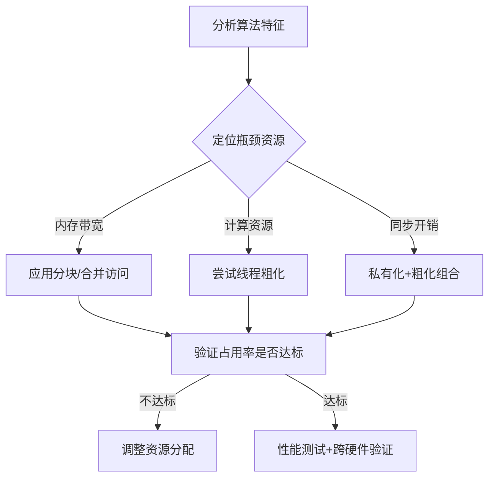

本文主要整理PMPP Chapter 6 Performance considerations的要点。

## 6.3 Thread coarsening

### **内容概括**  
本节系统阐述 **线程粒度粗化** 的核心思想：通过 **减少并行线程数量** 并 **增加单线程工作量**，在保持计算效率的同时降低并行化开销（如数据冗余加载、同步成本）。以矩阵乘法为例，分析粗化策略的实现方法、性能收益及潜在风险，揭示其在资源受限场景下的优化价值。

---

### **核心要点总结**

#### **1. 线程粗化的动机**
- **精细粒度的代价**：  
  传统细粒度并行（如单线程处理1个输出元素）虽能最大化并行度，但存在隐性开销：  
  - **数据冗余加载**：相邻线程块重复加载相同输入数据（如矩阵乘法的输入矩阵M）。  
  - **硬件资源压力**：高并行度导致资源竞争（寄存器/共享内存），降低占用率（Occupancy）。  
- **粗化的本质**：  
  将多个细粒度任务合并给单个线程处理，**以部分串行化换取开销降低**。

```c
#define TILE_WIDTH 32
#define COARSE_FACTOR 4  // 线程粗化因子（单线程处理4个输出元素）

__global__ void matrixMulKernel(float* M, float* N, float* P, int width) {
    // 声明共享内存分块（Tile）
    __shared__ float Mds[TILE_WIDTH][TILE_WIDTH];
    __shared__ float Nds[TILE_WIDTH][TILE_WIDTH];

    // 计算线程/块索引
    int bx = blockIdx.x; 
    int by = blockIdx.y;
    int tx = threadIdx.x; 
    int ty = threadIdx.y;

    // 计算当前线程负责的首行索引（输出矩阵P）
    int row = by * TILE_WIDTH + ty;
    
    // 计算当前线程负责的首列索引（考虑粗化因子）
    int colStart = bx * (TILE_WIDTH * COARSE_FACTOR) + tx;
    
    // 声明局部累加器（每个线程处理COARSE_FACTOR个输出元素）
    float Pvalue[COARSE_FACTOR];
    for (int i = 0; i < COARSE_FACTOR; i++) {
        Pvalue[i] = 0.0f;  // 初始化累加器
    }

    // 分块循环：遍历输入矩阵的宽度方向
    for (int ph = 0; ph < width / TILE_WIDTH; ph++) {
        // 协作加载M的分块到共享内存（行优先）
        Mds[ty][tx] = M[row * width + (ph * TILE_WIDTH + tx)];
        
        // 协作加载N的分块到共享内存（需粗化处理）
        for (int i = 0; i < COARSE_FACTOR; i++) {
            int col = colStart + i * TILE_WIDTH;
            Nds[ty][tx] = N[(ph * TILE_WIDTH + ty) * width + col];
        }
        __syncthreads();  // 等待所有线程完成加载

        // 计算当前分块的贡献（利用共享内存加速）
        for (int k = 0; k < TILE_WIDTH; k++) {
            for (int i = 0; i < COARSE_FACTOR; i++) {
                Pvalue[i] += Mds[ty][k] * Nds[k][tx];  // 核心计算
            }
        }
        __syncthreads();  // 等待计算完成，避免数据竞争
    }

    // 将结果写回全局内存（P矩阵）
    for (int i = 0; i < COARSE_FACTOR; i++) {
        int col = colStart + i * TILE_WIDTH;
        P[row * width + col] = Pvalue[i];
    }
}
```

#### **2. 矩阵乘法的粗化实现（图6.12-6.13）**
- **问题场景**：  
  相邻输出块（如水平相邻的P矩阵块）需重复加载相同的M矩阵块 → 冗余开销。  
- **解决方案**：  
  - **粗化因子（COARSE_FACTOR）**：单线程处理多个输出元素（如横向相邻的2个元素）。  
  - **关键改造**：  
    ```c
    // 原代码：单线程处理1个元素
    int col = blockIdx.x * TILE_WIDTH + threadIdx.x;

    // 粗化后：单线程处理COARSE_FACTOR个元素
    int colStart = blockIdx.x * (TILE_WIDTH * COARSE_FACTOR) + threadIdx.x;
    for (int i = 0; i < COARSE_FACTOR; i++) {
        int col = colStart + i * TILE_WIDTH; // 计算第i个元素的列索引
        // 加载数据并计算
    }
    ```
  - **优势**：  
    - **数据复用**：单线程块加载一次M矩阵块，用于计算多个输出块（减少全局内存访问）。  
    - **资源优化**：降低线程总数，缓解寄存器/共享内存压力。

#### **3. 粗化的适用场景与收益**
- **适合粗化的场景**：  
  - 存在**可复用的数据加载**（如矩阵乘法的输入矩阵）。  
  - 高并行度导致**同步开销显著**（如原子操作竞争）。  
  - 线程间存在**冗余计算**。  
- **性能收益**：  
  - 减少数据加载量 → 提升内存带宽利用率。  
  - 降低线程调度开销 → 提升指令吞吐效率。

#### **4. 粗化的三大陷阱与规避策略**
| **陷阱**                | **原因**                                                                 | **规避策略**                                                                 |
|-------------------------|--------------------------------------------------------------------------|-----------------------------------------------------------------------------|
| **过度粗化**            | 并行度不足 → 硬件资源闲置（如SM未满载）                                  | 动态调整粗化因子（COARSE_FACTOR），平衡并行度与开销                          |
| **无效粗化**            | 无显著并行开销（如向量加法）→ 粗化无收益                                 | 分析内核特性：仅对存在冗余开销的计算应用粗化                                |
| **资源占用激增**        | 单线程处理更多任务 → 寄存器/共享内存需求增加 → 可能降低占用率             | 监控资源使用：确保粗化后占用率（Occupancy）不低于临界值（如50%）           |

---

### **关键结论**
1. **粗化是权衡艺术**：  
  在 **并行度** 与 **并行开销** 间寻求平衡，通过增加单线程工作量降低系统总开销。  
2. **场景特异性**：  
  最优粗化因子需结合 **硬件资源**（SM数量、寄存器总量）和 **问题规模** 动态调整。  
3. **与透明可扩展性的冲突**：  
  粗化减少暴露的并行度 → 削弱硬件自动适应资源的能力 → 需手动调优适配不同设备。

---

### **总结**  
线程粒度粗化通过 **任务合并** 和 **数据复用** 优化并行效率，是解决冗余开销的有效手段。其成功应用需满足三要素：  
1. **识别高开销场景**（如数据冗余加载）；  
2. **精细控制粗化程度**（避免过度或无效粗化）；  
3. **资源占用量化监控**（确保不牺牲占用率）。  
在矩阵乘法等计算密集型任务中，合理粗化可带来显著性能提升，但需警惕其对透明可扩展性的负面影响。

## 6.4 A checklist of optimizations

### **内容概况**  
本节系统整合了**CUDA性能优化的六大核心策略**，形成通用检查清单（表6.1）。这些策略贯穿全书，将在后续并行模式（如规约、扫描、排序等）中具体应用。清单强调优化需结合硬件特性与算法特点，避免盲目应用。

---

### **优化清单详解**

#### **1. 最大化SM线程占用率（Maximize Occupancy）**
- **目标**：  
  确保SM有足够线程隐藏计算/内存延迟（第4章）。
- **方法**：  
  - 调优内核资源使用（寄存器/共享内存），避免限制线程块数量。  
  - 高占用率 → 更多内存请求 → 更好隐藏内存延迟（第6章）。
- **关键**：资源占用与并行度的平衡。

#### **2. 全局内存合并访问（Coalesced Global Memory Access）**
- **目标**：  
  减少DRAM请求次数，提升带宽利用率（第6.1节）。
- **方法**：  
  - 确保线程束内访问连续地址 → 硬件合并请求。  
  - **非常规访问模式优化策略**：  
    - **共享内存中转**（如Corner Turning、归并/排序模式）。  
    - **线程-数据映射重构**（如规约模式）。  
    - **数据布局重构**（如稀疏矩阵ELL/JDS格式）。

#### **3. 最小化控制分支（Minimize Control Divergence）**
- **目标**：  
  避免线程束内分支 → 提升SIMD效率（第4章）。
- **方法**：  
  - **任务/数据重分布**：  
    - 确保线程束内任务连续（规约/扫描模式）。  
    - 均衡线程负载（图遍历中的顶点/边中心方案）。  
  - **数据布局重构**：  
    相邻数据分配至同线程束 → 相似负载（稀疏矩阵JDS格式）。

#### **4. 数据分块与复用（Tiling for Data Reuse）**
- **目标**：  
  减少全局内存访问 → 利用共享内存/寄存器复用数据（第5章）。
- **方法**：  
  - **共享内存分块**：线程块协作加载输入/输出块（矩阵乘法）。  
  - **寄存器分块**：存储高频访问数据（模板计算）。  
- **挑战**：  
  输入/输出块尺寸差异（卷积/模板计算）。

#### **5. 私有化（Privatization）**
- **目标**：  
  减少全局数据竞争开销 → 避免原子操作瓶颈。
- **方法**：  
  - 创建线程私有副本 → 局部更新 → 最终合并到全局数据。  
  - **应用场景**：  
    - 直方图统计（多个线程更新同一计数器）。  
    - 图遍历（多线程写入同一队列）。

#### **6. 线程粒度粗化（Thread Coarsening）**
- **目标**：  
  降低并行开销（如冗余加载/同步）→ 以串行化换效率（第6.3节）。
- **方法**：  
  单线程处理多任务（通过`COARSE_FACTOR`控制）。  
- **应用场景**：  
  | **场景**               | **优化收益**                     |
  |------------------------|----------------------------------|
  | 矩阵乘法/模板计算      | 减少输入数据冗余加载             |
  | 直方图统计             | 降低私有副本合并开销             |
  | 规约/扫描              | 减少同步与分支开销               |
  | 归并/排序              | 减少二分搜索操作，提升合并访问   |

---

### **优化原则与陷阱**
1. **非普适性**：  
   - 部分优化仅适用于特定场景（如向量加法无需粗化）。
2. **过度优化风险**：  
   - 过度粗化 → 并行度不足 → 硬件资源闲置。  
   - 资源占用激增（寄存器/共享内存）→ 反降低占用率。
3. **设备相关性**：  
   最优参数（如粗化因子）需针对硬件/数据集调优。

---

### **总结**
该优化清单提供了一套**系统化性能调优框架**：
1. **基础层**：最大化占用率 + 合并访问（硬件友好）。  
2. **核心层**：控制分支优化 + 数据复用（算法适配）。  
3. **高阶层**：私有化 + 线程粗化（降低并行开销）。  
后续章节将通过具体模式（卷积、规约、排序等）演示这些策略的组合应用，并引入场景专属优化（如常量内存、双缓冲）。


## 6.5 Knowing your computation’s bottleneck

### **内容概况**  
本节强调 **性能优化的核心前提是精准识别瓶颈资源**，通过硬件特性与计算模式的匹配分析，避免盲目优化导致的性能反噬。结合GPU架构差异性与Profiler工具的使用，建立系统化的瓶颈诊断方法论。

---

### **核心要点总结**

#### **1. 瓶颈资源的本质**
- **定义**：限制程序性能的**关键硬件资源**（如全局内存带宽、寄存器容量、SM占用率）。  
- **动态性**：  
  - 同一算法在不同硬件上可能呈现不同瓶颈（如高端卡带宽瓶颈 → 低端卡计算瓶颈）。  
  - 算法不同阶段可能切换瓶颈（如初始化阶段内存瓶颈 → 计算阶段ALU瓶颈）。

#### **2. 优化策略的双刃剑效应**
| **优化手段**          | **资源置换关系**                | **误用风险**                                  |
|------------------------|---------------------------------|---------------------------------------------|
| 共享内存分块 (Tiling) | 用共享内存换全局内存带宽        | 共享内存过量 → 降低占用率（Occupancy）       |
| 线程粗化 (Coarsening) | 用串行化换并行开销（如同步/冗余） | 过度粗化 → SM资源闲置，并行度不足           |
| 私有化 (Privatization) | 用私有存储换原子操作竞争        | 副本过多 → 寄存器溢出或共享内存耗尽         |

#### **3. 瓶颈诊断方法论**
- **Profiler工具的核心指标**：  
  - **内存瓶颈**：全局内存访问效率（Coalesced Access Ratio）、DRAM吞吐量。  
  - **计算瓶颈**：SM活跃周期占比、指令发射率（IPC）。  
  - **资源瓶颈**：占用率（Occupancy）、寄存器/共享内存使用量。  
- **硬件差异的影响**：  
  - 架构A（如Ampere）的Tensor Core可缓解计算瓶颈 → 可能暴露内存瓶颈。  
  - 架构B（如Pascal）的显存带宽较低 → 相同算法更易出现内存瓶颈。

#### **4. 优化决策流程**


#### **5. 典型案例分析**
- **矩阵乘法优化陷阱**：  
  - **正确场景**：大矩阵 → 分块复用数据 → 缓解内存带宽瓶颈。  
  - **错误场景**：小矩阵 + 高占用率需求 → 分块加重共享内存压力 → 性能下降。  
- **线程粗化的平衡点**：  
  - 粗化因子需满足：`新线程数 ≥ SM最大并行线程数`，避免SM闲置。

---

### **关键结论**
1. **没有普适优化**：  
   同一优化在不同硬件/数据规模下可能效果相反，需动态调整。  
2. **工具驱动决策**：  
   NVIDIA Nsight Compute/nsys等Profiler工具是瓶颈诊断的黄金标准。  
3. **资源置换原则**：  
   优化本质是 **用富裕资源置换稀缺资源**，需确保目标资源确实是瓶颈。  

> **警示**：盲目应用“教科书式优化”可能导致性能倒退。例如在寄存器紧张的架构（如Maxwell）强行分块，会触发寄存器溢出（Register Spilling），反而增加全局内存访问。

## 6.6 Summary

### **内容概况**  
本章作为**GPU硬件架构与性能优化**的阶段性总结，系统梳理了三大核心主题：  
1. **片外内存（DRAM）架构特性**及其性能约束；  
2. **线程粒度粗化（Thread Coarsening）** 的优化原理与实践；  
3. **通用优化清单**的整合与后续应用方向。  
为后续并行计算模式（如卷积、规约、排序）的优化奠定理论基础。

---

### **核心要点总结**

#### **1. DRAM架构与性能约束**
- **关键机制**：  
  - **内存合并（Coalescing）**：线程束内连续地址访问 → 合并DRAM突发请求（6.1节）。  
  - **延迟隐藏（Latency Hiding）**：多Bank/通道并行 + 高线程占用率 → 覆盖访问延迟（6.2节）。  
- **硬件瓶颈**：  
  DRAM带宽是全局内存密集型任务的**首要性能限制**，需通过软件优化充分释放。

#### **2. 线程粒度粗化（Thread Coarsening）**
- **本质**：  
  单线程处理多任务 → **以串行化换取并行开销降低**（6.3节）。  
- **适用场景**：  
  - 数据复用（如矩阵乘法的输入矩阵复用）。  
  - 冗余操作显著（如相邻线程块重复加载相同数据）。  
- **平衡点**：  
  粗化因子需兼顾 **资源占用率** 与 **并行度**，避免过度粗化导致SM闲置。

#### **3. 优化清单的全局视角**
- **六大核心策略**（6.4节）：  
  ```mermaid
  graph LR
    A[最大化占用率] --> B[内存合并访问]
    B --> C[最小化控制分支]
    C --> D[数据分块复用]
    D --> E[私有化]
    E --> F[线程粗化]
  ```
- **优化逻辑链**：  
  先确保硬件资源高效利用（A/B）→ 再减少算法开销（C/D/E/F）。

#### **4. 性能瓶颈的辩证性**
- **瓶颈识别优先**（6.5节）：  
  优化前必须通过Profiler工具（如Nsight Compute）定位**真实瓶颈资源**。  
- **反例警示**：  
  - 在共享内存受限时强行分块 → 进一步降低占用率。  
  - 计算瓶颈场景盲目粗化 → 加剧ALU资源竞争。

---

### **承上启下的学习路径**
1. **基础篇完结**：  
   已完成GPU架构（计算单元/内存层次/DRAM）与核心优化技术的系统学习。  
2. **应用篇启航**：  
   后续章节将聚焦**并行模式实战**（如卷积、规约、排序），在具体场景中深化：  
   - 优化清单的组合应用  
   - 瓶颈资源的动态识别  
   - 硬件差异的适配策略  

---

### **总结**  
本章提炼了GPU性能优化的**方法论框架**：  
- **底层逻辑**：理解DRAM访问机制是高效内存操作的基础。  
- **核心工具**：线程粗化是平衡并行开销与资源占用的关键手段。  
- **高阶思维**：所有优化需以瓶颈识别为前提，避免“为优化而优化”。  
后续学习将从理论转向实践，在典型并行模式中验证与升华这些原则。