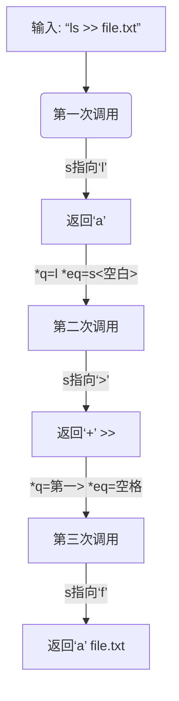
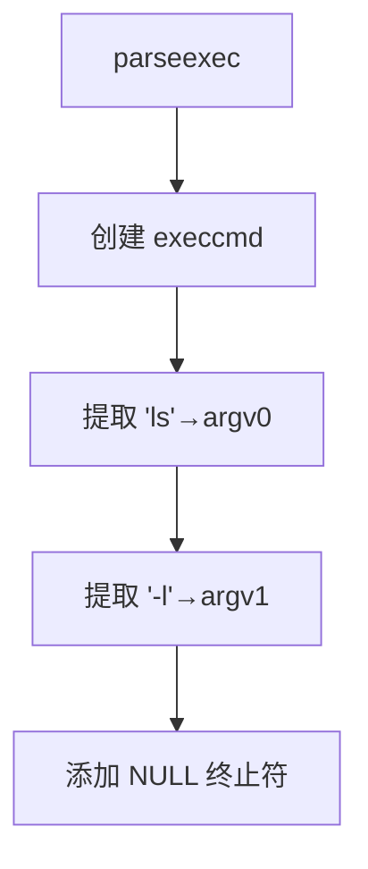
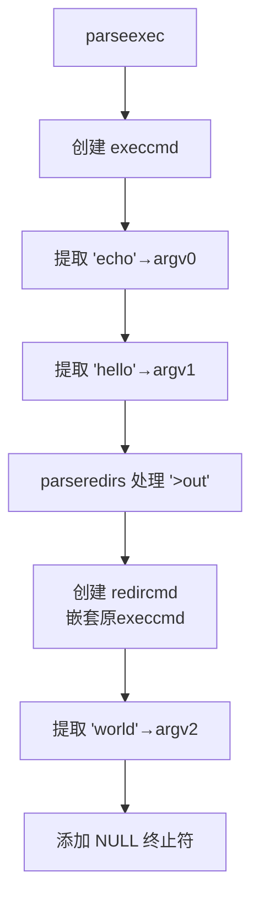
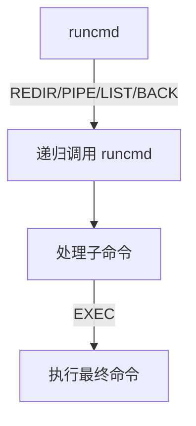

本文主要整理XV6 sh.c的源码解析。

## 一、词法分析gettoken函数解析

这段代码实现了一个词法分析器（lexer）的核心函数 `gettoken()`，用于在 Shell 命令解析中提取下一个标记（token）。以下是逐部分详细解释：

---

### **函数签名**
```c
int gettoken(char **ps, char *es, char **q, char **eq)
```
- `ps`: 指向当前解析位置指针的指针（输入/输出参数）
- `es`: 字符串结束位置指针
- `q`: 用于返回当前 token 起始位置的指针（输出）
- `eq`: 用于返回当前 token 结束位置的指针（输出）
- **返回值**: 标记类型（见下节）

---

### **返回值类型说明**
| 返回值 | 含义               | 示例输入        |
|--------|--------------------|---------------|
| `0`    | 字符串结束         | `""`          |
| `|`    | 管道符号           | `|`           |
| `(`    | 左括号             | `(`           |
| `)`    | 右括号             | `)`           |
| `;`    | 命令分隔符         | `;`           |
| `&`    | 后台运行符号       | `&`           |
| `<`    | 输入重定向         | `<`           |
| `>`    | 输出重定向         | `>`           |
| `+`    | 追加重定向（>>）   | `>>`          |
| `'a'`  | 参数(字母)         | `ls`, `file1` |

---

### **代码执行流程**

#### **1. 跳过空白字符**
```c
s = *ps;
while(s < es && strchr(whitespace, *s))
    s++;
```
- 跳过空格、制表符等空白字符
- `whitespace` 定义为: `" \t\r\n\v"`

#### **2. 记录 token 起始位置**
```c
if(q)
    *q = s;  // 设置 token 开始位置
```

#### **3. 核心标记识别**
```c
ret = *s;  // 临时存储当前字符
switch(*s){
```
- **情况 1: 结束符 (0)**
  ```c
  case 0:
      break;  // 直接返回0
  ```

- **情况 2: 单字符标记**
  ```c
  case '|': case '(': case ')': case ';': case '&': case '<':
      s++;    // 前进一位
      break;  // 返回该字符
  ```

- **情况 3: 输出重定向 (> 或 >>)**
  ```c
  case '>':
      s++;  // 吃掉 '>'
      if(*s == '>') {  // 检查下一个字符
          ret = '+';   // 标记为追加重定向
          s++;         // 再前进一位
      }
      break;
  ```

- **情况 4: 参数（默认情况）**
  ```c
  default:
      ret = 'a';  // 标记为字母
      // 持续读取直到遇到分隔符
      while(s < es && !strchr(whitespace, *s) && !strchr(symbols, *s))
          s++;
      break;
  }
  ```
  - `symbols` 定义为: `"<|>&;()"`

#### **4. 记录 token 结束位置**
```c
if(eq)
    *eq = s;  // 设置 token 结束位置
```

#### **5. 再次跳过空白**
```c
while(s < es && strchr(whitespace, *s))
    s++;
```

#### **6. 更新解析位置并返回**
```c
*ps = s;   // 更新外部指针
return ret;
```

---

### **关键机制图解**


---

### **设计特点**
1. **增量解析**：
   - 通过 `**ps` 指针推进实现流式解析
   - 不修改原始字符串，仅记录位置指针

2. **精确边界控制**：
   - 使用 `*q` 和 `*eq` 输出 token 起止位置
   - 不破坏原字符串（后续需调用 `nulterminate()` 添加结束符）

3. **高效性**：
   - 单次遍历，时间复杂度 O(n)
   - 使用 `strchr` 快速检查字符类别

4. **语法扩展性**：
   - 特殊符号 `>>` 被映射为 `+`（避免占用新字符类型）
   - 符号表 `symbols` 可扩展支持新操作符

---

### **典型调用示例**
```c
char *s = "ls | grep x";
char *es = s + strlen(s);
char *q, *eq;

// 第一次调用：识别"ls"
int type1 = gettoken(&s, es, &q, &eq);
// type1='a', q→"ls", eq→空格后位置

// 第二次调用：识别"|"
int type2 = gettoken(&s, es, &q, &eq);
// type2='|', q→"|", eq→下一空格

// 第三次调用：识别"grep"
int type3 = gettoken(&s, es, &q, &eq);
...
```

## 二、token匹配peek函数解析

### `peek` 函数深度解析

`peek` 函数是 XV6 Shell 解析器的关键辅助函数，用于**前瞻性检查**下一个有效字符是否匹配预期类型。以下是逐行解析：

---

#### **函数签名**
```c
int peek(char **ps, char *es, char *toks)
```
- **输入参数**：
  - `ps`: 指向当前解析位置指针的指针（用于更新）
  - `es`: 命令字符串结束位置
  - `toks`: 待匹配的字符集合（字符串形式）
- **返回值**：
  - `1`：下一个有效字符在 `toks` 中
  - `0`：字符串结束或字符不匹配

---

#### **执行流程分解**

1. **获取当前解析位置**
   ```c
   s = *ps;
   ```
   - `s` 指向当前扫描位置

2. **跳过空白字符**
   ```c
   while(s < es && strchr(whitespace, *s))
       s++;
   ```
   - 跳过所有空白符（空格/制表符/换行符等）
   - `whitespace` 定义为 `" \t\r\n\v"`

3. **更新解析指针**
   ```c
   *ps = s;  // 将外部指针推进到有效位置
   ```

4. **最终匹配判断**
   ```c
   return *s && strchr(toks, *s);
   ```
   - **双重检查**：
     - `*s` 非空（确保未到字符串末尾）
     - `strchr(toks, *s)` 判断当前字符是否在目标字符集中
   - 等价逻辑：
     ```c
     if(*s == '\0') // 字符串结束
         return 0;
     if(strchr(toks, *s) != NULL) // 字符匹配
         return 1;
     else
         return 0;
     ```

---

### **关键设计特点**

1. **前瞻(Lookahead)机制**
   ```c
   // 示例：检查是否遇到管道符
   if(peek(&s, es, "|")) {
       // 处理管道逻辑
   }
   ```
   - 不会实际消耗字符（无 `s++` 操作）
   - 仅返回匹配状态

2. **副作用更新**
   - 更新 `*ps` 指向首个非空白字符
   - 下次调用 `gettoken()` 将从此位置继续

3. **多字符匹配支持**
   ```c
   // 检查终止符
   peek(&s, es, "|)&;"); 
   // 检查重定向符
   peek(&s, es, "<>");
   ```

4. **高效性**
   - 时间复杂度 O(n) - 仅单次扫描
   - `strchr` 使用汇编优化（GLIBC 实现）

---

### **执行示例剖析**

#### 案例 1：检查管道符
```c
char *str = "   | next"; // 带前导空格的字符串
char *s = str;           // s → 开头
char *es = str + strlen(str);

int result = peek(&s, es, "|"); 
// 执行后:
//   s 指向 "| next" 中的 '|'
//   result = 1 (匹配成功)
```

#### 案例 2：不匹配情况
```c
char *str = "   ; cmd";
int result = peek(&s, es, "<>");
// 执行后:
//   s 指向 "; cmd" 中的 ';'
//   result = 0 (';'不在"<>"中)
```

#### 案例 3：字符串结束
```c
char *str = "    "; // 纯空格
int result = peek(&s, es, "(");
// 执行后:
//   s 指向结束符'\0'
//   result = 0 (无有效字符)
```

---

### **在解析器中的典型使用场景**

1. **命令序列检查 (; &)**
   ```c
   // 在parseline()中
   if(peek(ps, es, "&")) {
       // 后台命令处理
   }
   if(peek(ps, es, ";")) {
       // 命令序列处理
   }
   ```

2. **管道检测**
   ```c
   // 在parsepipe()中
   if(peek(ps, es, "|")) {
       gettoken(ps, es, 0, 0); // 消耗'|'
       // 构建pipecmd
   }
   ```

3. **重定向检测**
   ```c
   // 在parseredirs()中
   while(peek(ps, es, "<>")) {
       // 循环处理连续重定向
   }
   ```

4. **结束符检查**
   ```c
   // 在parseexec()中
   while(!peek(ps, es, "|)&;")) {
       // 持续读取参数直到遇到结束符
   }
   ```

## 三、基础命令解析parseexec函数解析

### `parseexec` 函数深度解析

`parseexec` 是 XV6 Shell 解析器的核心函数，负责解析基础命令和参数。以下是逐部分分析：

---

#### **1. 整体功能**
```c
struct cmd* parseexec(char **ps, char *es)
```
- **输入**： 
  - `ps`：指向当前解析位置的指针（用于推进）
  - `es`：命令字符串的结束位置
- **输出**：解析后的命令结构（可能嵌套重定向）

---

#### **2. 括号块处理**
```c
if(peek(ps, es, "("))
    return parseblock(ps, es);
```
- **功能**：检测是否遇到命令块 `( ... )`
- **逻辑**：
  1. 使用 `peek` 预读下一个字符
  2. 若发现 `(` 则调用 `parseblock` 解析括号内的子命令
  3. 将括号内命令作为整体返回

---

#### **3. 命令初始化**
```c
ret = execcmd();
cmd = (struct execcmd*)ret;
```
- 创建基础命令结构 `struct execcmd`
- 类型标记为 `EXEC`（基础执行命令）
- 初始化参数列表指针为 NULL

---

#### **4. 重定向预解析**
```c
argc = 0;
ret = parseredirs(ret, ps, es);
```
- **作用**：处理命令前的重定向（如 `>out ls`）
- **示例**：  
  `>out ls` → 被解析为 `redircmd(execcmd(ls))`
- **特点**：重定向可出现在命令名前

---

#### **5. 核心参数解析循环**
```c
while(!peek(ps, es, "|)&;")){
    if((tok=gettoken(ps, es, &q, &eq)) == 0)
        break;
    if(tok != 'a')
        panic("syntax");
    
    cmd->argv[argc] = q;
    cmd->eargv[argc] = eq;
    argc++;
    
    if(argc >= MAXARGS)
        panic("too many args");
        
    ret = parseredirs(ret, ps, es);
}
```
- **循环条件**：未遇到管道/结束符 (`|) & ;`)
- **关键步骤**：
  1. **获取 token**：
     - 通过 `gettoken` 提取参数
     - 若返回 0（字符串结束）则退出
     - 非字母类型则报语法错误（`panic`）
  2. **存储参数**：
     - `q`：参数起始位置
     - `eq`：参数结束位置
     - 存入 `argv/eargv` 数组
  3. **参数计数**：
     - `argc` 自增
     - 超过 `MAXARGS`（10）报错
  4. **再次检查重定向**：
     - 允许重定向出现在参数间（如 `echo hello >out world`）

---

#### **6. 参数列表封尾**
```c
cmd->argv[argc] = 0;
cmd->eargv[argc] = 0;
```
- **作用**：在参数数组末尾添加 NULL 终止符
- **必要性**：为后续 `exec()` 系统调用准备标准参数列表格式

---

#### **7. 返回最终命令结构**
```c
return ret;
```
- **可能返回的类型**：
  1. 纯 `execcmd`：无重定向的简单命令  
     （如 `ls -l`）
  2. `redircmd` 嵌套 `execcmd`：带重定向  
     （如 `>out.txt echo hello`）
  3. `parseblock` 的结果：括号命令块  
     （如 `(ls; cat)`）

---

### **解析示例分析**
#### 案例 1：基础命令 `ls -l`


#### 案例 2：含重定向 `echo hello >out world`


#### 案例 3：非法命令 `echo <`
```c
// 解析步骤：
1. 提取 'echo' 存入 argv0
2. parseredirs 发现 '<' 
3. 但 gettoken 无法获取文件名 → panic("syntax")
```

## 四、参数字符串​​完整转换nulterminate函数解析

### `nulterminate` 函数深度解析

这个函数是 XV6 Shell 解析器的终结处理阶段，负责将解析树中的参数字符串**完整转换为标准 C 字符串**（以 `\0` 结尾）。以下是逐部分剖析：

---

#### **核心功能**
- **输入**：语法解析生成的命令树（含未终结的分词）
- **输出**：可执行命令树（所有字符串被 `\0` 终结）
- **关键操作**：修改原始命令字符串（就地添加 `\0`）

---

#### **执行流程分析**

1. **通用入口**
   ```c
   if(cmd == 0)
       return 0;
   ```
   - 空命令安全处理
   - 递归操作的基础出口

2. **EXEC 命令处理**
   ```c
   case EXEC:
       ecmd = (struct execcmd*)cmd;
       for(i=0; ecmd->argv[i]; i++)
           *ecmd->eargv[i] = 0;  // 关键操作
       break;
   ```
   - 遍历所有参数（直到 NULL 指针）
   - 将每个参数的结束位置 `eargv[i]` 设为 `\0`
   - 示例转换：
     ```
     原始分词： ['l','s',' ', '-','l']
     转换后：   ['l','s','\0','-','l','\0']
     ```

3. **REDIR 命令处理**
   ```c
   case REDIR:
       rcmd = (struct redircmd*)cmd;
       nulterminate(rcmd->cmd);  // 递归处理子命令
       *rcmd->efile = 0;         // 终结文件名
       break;
   ```
   - 典型命令示例：
     ```
     echo hello > output.txt
     ```
   - 操作顺序：
     1. 递归终结子命令 `echo hello`
     2. 终结文件名 `output.txt`

4. **PIPE/LIST/BACK 命令处理**
   ```c
   // PIPE
   nulterminate(pcmd->left);
   nulterminate(pcmd->right);

   // LIST/BACK
   nulterminate(lcmd->left);
   nulterminate(lcmd->right);
   ```
   - 递归处理所有子节点
   - 深度优先遍历整个命令树

---

### **底层数据结构说明**

#### **execcmd 关键字段**
```c
struct execcmd {
    // ...
    char *argv[MAXARGS]; // 参数起始指针数组
    char *eargv[MAXARGS]; // 参数结束位置指针数组
};
```
- **内存布局示例**：
  ```
  原始输入： "ls -l"
  分词后：
      argv[0] → 'l'   eargv[0] → 空格位置
      argv[1] → '-'   eargv[1] → 字符串末尾
  ```
- 经过 `nulterminate`:
  ```
  *eargv[0] = 0 → "ls\0 -l"
  *eargv[1] = 0 → "ls\0 -l\0"
  ```

#### **其他命令的字符串字段**
| 命令类型   | 字段          | 说明                     |
|------------|---------------|--------------------------|
| `redircmd` | `char *efile` | 重定向文件名的结束位置   |
| 所有命令   | 递归结构      | 确保子命令也被完全处理   |

---

### **执行示例演练**

#### **案例：`echo "hello" > log.txt`**
1. **解析后结构**:
   ```mermaid
   graph TD
       R[REDIRCMD] --> |cmd| E[EXECCMD: echo hello]
       R --> |file| F["log.txt"]
   ```

2. **处理过程**:
   ```c
   nulterminate(R):
     递归调用 nulterminate(E)
        将 'hello' 后空格设为 \0 → "echo\0hello"
     将文件名字符串结尾设为 \0 → "log.txt\0"
   ```

3. **最终内存变化**：
   ```
   原始输入： echo hello > log.txt
   处理后：
        echo\0hello\0> log.txt\0
        ↑         ↑        ↑
        argv[0]   eargv[1] efile
   ```

---

### **设计意图解析**

1. **高效内存利用**：
   - 避免复制字符串（直接修改输入缓冲区）
   - 极小的内存开销（仅添加 `\0`）

2. **系统调用兼容**：
   - `exec()` 要求参数为 NULL 结尾数组
   - `open()` 等需要规范的文件名字符串

3. **语法树完整性**：
   - 深度优先遍历确保所有节点被处理
   - 递归统一处理不同命令类型

## 五、cmd执行runcmd函数解析

### `runcmd` 函数深度解析

`runcmd` 是 XV6 Shell 的执行引擎核心，负责递归执行解析后的命令树。以下是逐部分详细分析：

---

#### **整体结构**
```c
void runcmd(struct cmd *cmd) {
  // 变量声明
  if(cmd == 0) exit(1);  // 空命令检查
  
  switch(cmd->type) {
    // 处理不同命令类型
  }
  exit(0);  // 执行完成退出
}
```
- **永不返回**：函数标记为 `noreturn`
- **递归执行**：通过类型分发处理不同命令结构

---

### **命令类型处理详解**

#### **1. EXEC（基础命令）**
```c
case EXEC:
    ecmd = (struct execcmd*)cmd;
    if(ecmd->argv[0] == 0)
        exit(1);
    exec(ecmd->argv[0], ecmd->argv);
    fprintf(2, "exec %s failed\n", ecmd->argv[0]);
    break;
```
- **执行流程**：
  1. 检查命令是否有效（`argv[0]` 非空）
  2. 调用 `exec()` 加载程序
  3. 若 `exec` 失败（返回），打印错误信息
- **关键特性**：
  - 无 `fork()`：当前进程直接被替换
  - 错误处理：打印错误但继续执行（后续 `exit(0)`）

---

#### **2. REDIR（重定向）**
```c
case REDIR:
    rcmd = (struct redircmd*)cmd;
    close(rcmd->fd);  // 关闭原文件描述符
    if(open(rcmd->file, rcmd->mode) < 0) {
        fprintf(2, "open %s failed\n", rcmd->file);
        exit(1);
    }
    runcmd(rcmd->cmd);  // 递归执行子命令
    break;
```
- **执行流程**：
  1. 关闭目标文件描述符（如 stdout）
  2. 打开新文件（覆盖原描述符）
  3. 递归执行子命令
- **关键特性**：
  - 文件描述符继承：子命令自动使用新重定向
  - 错误处理：文件打开失败立即退出

---

#### **3. LIST（命令序列）**
```c
case LIST:
    lcmd = (struct listcmd*)cmd;
    if(fork1() == 0)
        runcmd(lcmd->left);  // 子进程执行左命令
    wait(0);                 // 等待左命令完成
    runcmd(lcmd->right);     // 当前进程执行右命令
    break;
```
- **执行流程**：
  1. 创建子进程执行左侧命令
  2. 父进程等待子进程完成
  3. 父进程执行右侧命令
- **典型示例**：
  `ls; cat file` → 先执行 `ls`，完成后执行 `cat`

---

#### **4. PIPE（管道）**
```c
case PIPE:
    pcmd = (struct pipecmd*)cmd;
    if(pipe(p) < 0) panic("pipe");
    
    // 左命令进程（写端）
    if(fork1() == 0) {
        close(1); dup(p[1]);  // 重定向stdout到管道写端
        close(p[0]); close(p[1]);
        runcmd(pcmd->left);
    }
    
    // 右命令进程（读端）
    if(fork1() == 0) {
        close(0); dup(p[0]);  // 重定向stdin到管道读端
        close(p[0]); close(p[1]);
        runcmd(pcmd->right);
    }
    
    // 父进程清理
    close(p[0]); close(p[1]);
    wait(0); wait(0);  // 等待两个子进程
    break;
```
- **执行流程**：
  1. 创建管道 `p[2]`（`p[0]`读端，`p[1]`写端）
  2. 创建左进程：
     - 将 stdout 重定向到管道写端
     - 关闭所有管道描述符
     - 执行左命令
  3. 创建右进程：
     - 将 stdin 重定向到管道读端
     - 关闭所有管道描述符
     - 执行右命令
  4. 父进程：
     - 关闭管道两端
     - 等待两个子进程结束
- **关键细节**：
  - 描述符管理：使用 `dup()` 复制而非直接赋值
  - 资源泄漏防护：显式关闭所有未用描述符
  - 执行顺序：左→右进程顺序创建，但执行可能并行

---

#### **5. BACK（后台命令）**
```c
case BACK:
    bcmd = (struct backcmd*)cmd;
    if(fork1() == 0)
        runcmd(bcmd->cmd);  // 子进程执行命令
    break;
```
- **执行流程**：
  1. 创建子进程
  2. 子进程执行后台命令
  3. 父进程立即返回（不等待）
- **特性**：
  - 无等待：父进程继续执行
  - 无僵尸进程处理：XV6 无进程回收机制

---

### **关键技术点分析**

#### **1. 文件描述符管理**
- **管道示例**：
  ```c
  close(1);         // 关闭标准输出
  dup(p[1]);        // 复制管道写端到最小可用fd（即1）
  close(p[1]);      // 关闭原管道写端
  ```
  等效于：
  ```c
  dup2(p[1], 1);    // 更简洁方式（但XV6未提供dup2）
  ```

#### **2. 进程创建模式**
| 命令类型 | 进程模型                  | 等待机制       |
|----------|---------------------------|----------------|
| EXEC     | 无fork（直接exec）        | 无             |
| REDIR    | 无fork（当前进程执行）     | 无             |
| LIST     | 左命令fork，右命令不fork   | 等待左命令     |
| PIPE     | 双fork（左右各一）        | 等待两个子进程 |
| BACK     | 单fork（后台执行）        | 不等待         |

#### **3. 错误处理策略**
- **致命错误**：`panic()` 直接退出进程
- **可恢复错误**：打印错误但继续执行（如 EXEC）
- **资源错误**：文件/管道操作失败立即退出

#### **4. 递归执行机制**


---

### **执行示例分析**

#### **案例：`ls | grep x > out`**
1. **解析结构**：
   ```mermaid
   graph TD
       P[PIPECMD] --> L[EXECCMD: ls]
       P --> R[REDIRCMD: grep x > out]
       R --> G[EXECCMD: grep x]
       R --> F[file: out]
   ```

2. **执行流程**：
   ```mermaid
   sequenceDiagram
       Parent->>+Pipe: 创建管道
       Parent->>+LeftProc: fork (ls)
       LeftProc->>LeftProc: 重定向stdout到管道
       LeftProc->>LeftProc: 执行ls
       Parent->>+RightProc: fork (grep)
       RightProc->>RightProc: 重定向stdin到管道
       RightProc->>RightProc: 处理重定向(>out)
       RightProc->>RightProc: 执行grep
       Parent->>Parent: 关闭管道
       Parent->>Parent: 等待两个子进程
   ```

---


这个函数完美展示了 UNIX 进程控制和文件描述符操作的核心原理，虽然仅 80 行代码，但实现了完整的 Shell 执行引擎功能，是理解操作系统进程模型的经典范例。
