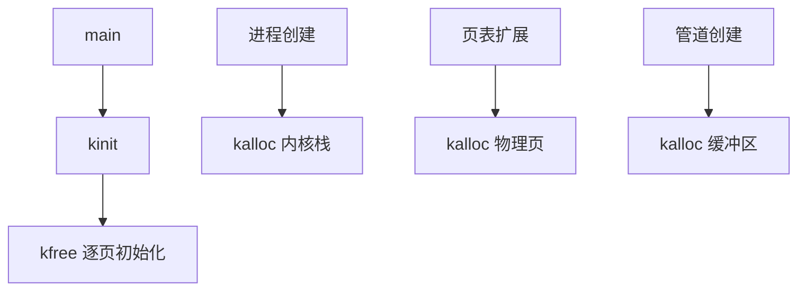

本文主要整理Chapter 3 Page tables的要点。

## 3.0 前言

本章概括了操作系统中页表的核心作用，重点阐述了其在xv6系统中的功能和应用。以下是关键要点的总结：

1.  **核心功能：隔离的私有地址空间**
    *   页表是操作系统为每个进程提供**私有、隔离的虚拟地址空间**的主要机制。
    *   它们定义了**虚拟内存地址的映射关系**（即虚拟地址对应哪个物理地址），并**控制进程可以访问哪些物理内存区域**。

2.  **核心机制：间接性与灵活性**
    *   页表通过引入**地址转换的间接层**来实现上述功能。
    *   这种间接性为操作系统提供了巨大的**灵活性**，允许它实现各种“技巧”（tricks）。

3.  **在xv6中的具体应用**
    *   **地址空间复用：** 将多个进程的虚拟地址空间**复用（multiplex）** 到单一的物理内存上。
    *   **共享内存（蹦床页 - Trampoline）：** 将同一块物理内存（蹦床页）**映射到多个进程的虚拟地址空间**中（通常用于在用户态和内核态之间安全切换）。
    *   **栈保护：** 在**内核栈和用户栈的末端设置一个未映射页（Guard Page）**，以检测栈溢出错误（访问未映射页会触发异常/错误）。

4.  **后续内容预告**
    *   **RISC-V硬件提供的页表机制**（架构层面的支持）。
    *   **xv6操作系统如何具体使用**这些硬件提供的页表功能。

## 3.1 Paging hardware

### **核心机制与背景**
1.  **地址空间操作**：RISC-V CPU（用户态/内核态）**仅操作虚拟地址**，物理内存通过**物理地址**访问。页表负责二者映射。
2.  **Sv39 分页模式**：
    *   仅使用 64 位虚拟地址的 **低 39 位**（高 25 位未用）。
    *   物理地址通过 PTE（页表项）中的 **44 位物理页号（PPN） + 虚拟地址低 12 位** 生成（共 56 位）。
    *   虚拟地址空间上限：2³⁹ = **512 GB**（满足应用需求），物理地址支持扩展（预留 10 位增长空间）。
3.  **多级页表结构**：
    *   采用**三级页表树**（Sv39），存储于物理内存中。
    *   **每级页表**：大小为 4KB（= 2¹²字节），包含 **512 项 PTE**（2⁹）。
    *   **地址翻译流程**：
        *   **步骤 1**：虚拟地址高 9 位索引根页表（Level 2），获取下一级页表地址。
        *   **步骤 2**：中间 9 位索引中间页表（Level 1），获取末级页表地址。
        *   **步骤 3**：低 9 位索引末级页表（Level 0），获取目标物理页号（PPN） + 标志位。
        *   最终物理地址 = `(PPN << 12) | (原虚拟地址低 12 位)`。

---

### **核心优势与设计考量**
1.  **内存效率优化**：
    *   相比单级页表（需 2²⁷ 项），三级结构**仅在实际使用的地址区域分配页表**。
    *   稀疏地址空间下可节省大量内存（例：仅使用低区地址时，省去 511 个中间目录和 261,632 个底层目录页）。
2.  **硬件加速**：
    *   **TLB（快表）**：缓存近期使用的 PTE，避免频繁访问物理内存，加速地址翻译。
3.  **异常处理**：
    *   任一 PTE 不存在时，硬件触发**缺页异常**（由内核处理）。

---

### **页表项（PTE）结构与权限控制**
1.  **PTE 标志位**：
    *   `PTE_V`：页表项是否有效（无效则触发异常）。
    *   `PTE_R`：是否允许**读**。
    *   `PTE_W`：是否允许**写**。
    *   `PTE_X`：是否允许**执行**（解释为指令）。
    *   `PTE_U`：是否允许**用户态访问**（若未设置，仅内核态可访问）。
2.  **权限作用**：
    *   实现**内存保护**（如内核页限制用户访问）。
    *   支撑隔离性（xv6 用户栈/内核栈的未映射保护页即依赖此机制）。

---

### **内核操作与关键寄存器**
1.  **satp 寄存器**：
    *   存储**根页表的物理地址**。
    *   每个 CPU 核有独立 satp，支持多进程并发运行（每个进程有私有页表）。
2.  **内核角色**：
    *   以树形数据结构管理页表，动态创建/修改 PTEs。
    *   响应缺页异常，实现按需分配。

---

### **重要术语定义**
1.  **物理内存 (Physical Memory)**：RAM 存储单元，通过**物理地址**访问。
2.  **虚拟内存 (Virtual Memory)**：管理页表的技术，实现隔离、共享等目标。
3.  **地址空间 (Address Space)**：某页表下有效的**虚拟地址集合**。
    *   xv6 每个进程有**独立用户地址空间**，内核有单独地址空间。
4.  **用户内存 (User Memory)**：进程地址空间 + 页表允许访问的物理内存。

---

### **总结**
RISC-V Sv39 通过**三级页表树**将 39 位虚拟地址映射为 56 位物理地址，利用 PTE 标志位（`V/R/W/X/U`）实现细粒度内存权限控制。多级设计显著提升稀疏地址空间的内存效率，TLB 加速翻译流程。xv6 内核通过 satp 寄存器控制页表切换，结合缺页异常处理，为进程提供**隔离地址空间**，并支撑关键功能（如蹦床页共享和栈保护）。

## 3.2 Kernel address space

```c
// 00001000 -- boot ROM, provided by qemu
// 02000000 -- CLINT
// 0C000000 -- PLIC
// 10000000 -- uart0 
// 10001000 -- virtio disk 
// 80000000 -- boot ROM jumps here in machine mode
//             -kernel loads the kernel here
// unused RAM after 80000000.

// the kernel uses physical memory thus:
// 80000000 -- entry.S, then kernel text and data
// end -- start of kernel page allocation area
// PHYSTOP -- end RAM used by the kernel

// the kernel expects there to be RAM
// for use by the kernel and user pages
// from physical address 0x80000000 to PHYSTOP.
#define KERNBASE 0x80000000L
#define PHYSTOP (KERNBASE + 128*1024*1024)

// map the trampoline page to the highest address,
// in both user and kernel space.
#define TRAMPOLINE (MAXVA - PGSIZE)

// map kernel stacks beneath the trampoline,
// each surrounded by invalid guard pages.
#define KSTACK(p) (TRAMPOLINE - ((p)+1)* 2*PGSIZE)

```

### **内核地址空间布局核心设计**
1. **双页表结构**  
   - **用户页表**：每个进程独立拥有，描述其私有用户地址空间。  
   - **内核页表**：**全局唯一**，描述内核地址空间，所有进程共享（通过 `satp` 切换）。  

2. **直接映射（主体部分）**  
   - **映射原则**：内核虚拟地址 = 物理地址（简化内核访问逻辑）。  
   - **关键区域**：  
     - **内核代码**：位于 `KERNBASE=0x80000000`（虚拟与物理地址相同）。  
     - **物理内存（RAM）**：范围 `0x80000000` 至 `PHYSTOP (≥0x88000000)`。  
     - **内存映射设备寄存器**：位于物理地址 `<0x80000000`，内核通过直接映射访问。  
   - **优势**：  
     - 内核读写物理内存时无需转换（如 `fork` 复制用户内存时可直接用物理地址作为虚拟地址）。  

3. **非直接映射的特殊区域**  
   - **蹦床页面（Trampoline）**：  
     - 位于**虚拟地址空间最高处**（用户/内核页表均包含此映射）。  
     - **双重映射**：同一物理页在内核地址空间中映射两次：  
       - 一次在虚拟地址顶部（供用户态切换使用）。  
       - 一次通过直接映射（内核可访问）。  
   - **内核栈（Per-Process Kernel Stack）**：  
     - 每个进程拥有独立内核栈，映射在**高位虚拟地址**。  
     - 下方设置**未映射的保护页（Guard Page）**：  
       - `PTE_V` 无效，触发栈溢出异常（引发 `panic` 避免内存覆盖）。  
   - **保护页作用**：防止内核栈溢出破坏其他内存（崩溃优于不可控错误）。  

---

### **权限控制策略**  
| **内存区域**       | **PTE 标志位** | **权限说明**                     |  
|---------------------|----------------|----------------------------------|  
| 蹦床页 & 内核代码   | `PTE_R + PTE_X` | 允许读取和执行指令              |  
| 其他内核数据/栈     | `PTE_R + PTE_W` | 允许读写数据（不可执行）        |  
| 保护页             | **无效**        | 无权限，访问触发异常            |  

---

### **关键地址范围（QEMU 模拟环境）**  
- **物理内存（RAM）**：`0x80000000 – 0x88000000`。  
- **设备寄存器**：物理地址 `<0x80000000`，通过内存映射访问。  
- **内核入口**：`KERNBASE=0x80000000`（代码起始位置）。  

---

### **设计思想与技术价值**  
1. **直接映射的取舍**：  
   - **牺牲高地址空间**，换取内核代码简洁性（免地址转换）。  
2. **保护页机制**：  
   - 主动利用无效 PTE 实现栈溢出检测，提升内核稳定性。  
3. **蹦床页双重映射**：  
   - 物理页复用（节省内存） + 统一切换逻辑（用户/内核入口一致）。  
4. **全局内核页表**：  
   - 所有进程共享同一内核视图，确保硬件资源访问一致性。  

## 3.3 Code: creating an address space

### **核心数据结构与函数**
1. **`pagetable_t`**  
   - **本质**：指向 RISC-V **根页表页（root page-table page）的指针**。  
   - **用途**：可表示内核页表或任一进程的页表。

2. **关键函数分类**  
   | **函数前缀** | **作用对象**         | **代表函数**              | **核心功能**                                |  
   |--------------|----------------------|---------------------------|-------------------------------------------|  
   | `kvm*`       | 内核页表             | `kvminit`, `kvmmap`       | 初始化内核页表、建立内核映射              |  
   | `uvm*`       | 用户页表             | `uvmalloc`, `uvmfree`     | 管理进程用户空间内存                      |  
   | **通用函数** | 两类页表均可操作     | `walk`, `mappages`        | PTE 查找、地址映射建立                    |  
   |              |                      | `copyout`, `copyin`       | 在用户/内核虚拟地址间复制数据（需显式地址翻译） |  

---

### **内核页表初始化流程 (`kvminit` & `kvmmake`)**  
1. **调用时机**：`main` 在**启用分页前**调用 `kvminit()`。  
2. **物理内存直接访问**：此时地址即物理地址（分页未开启）。  
3. **步骤**：  
   - `kvmmake()`：  
     - 分配物理页作为**根页表页**。  
     - 调用 `kvmmap` 建立内核关键映射：  
       - 内核代码/数据 (`KERNBASE=0x80000000`)  
       - 物理内存 (`0x80000000` ~ `PHYSTOP`)  
       - 内存映射设备寄存器（物理地址 `<0x80000000`）  
     - `proc_mapstacks()`：为每个进程分配**内核栈**，通过 `kvmmap` 映射到 `KSTACK` 区域（预留**保护页空间**）。  

---

### **核心函数实现机制**  
1. **`mappages()`**  
   - **作用**：为一组连续虚拟地址建立物理页映射。  
   - **流程**：  
     - 对范围内**每个虚拟页**（4KB 对齐）单独处理。  
     - 调用 `walk()` 查找该地址的 **PTE 地址**。  
     - 初始化 PTE：写入物理页号（**PPN**）、权限标志（`PTE_W`/`PTE_X`/`PTE_R`）及 **`PTE_V`**。  

```c
int
mappages(pagetable_t pagetable, uint64 va, uint64 size, uint64 pa, int perm)
{
  uint64 a, last;
  pte_t *pte;

  if((va % PGSIZE) != 0)
    panic("mappages: va not aligned");

  if((size % PGSIZE) != 0)
    panic("mappages: size not aligned");

  if(size == 0)
    panic("mappages: size");
  
  a = va;
  last = va + size - PGSIZE;
  for(;;){
    if((pte = walk(pagetable, a, 1)) == 0)
      return -1;
    if(*pte & PTE_V)
      panic("mappages: remap");
    // PA2PTE(pa)：将物理地址转换为 ​​PPN 格式​​（右移 12 位）
    // perm：添加权限标志（如可读/写）
    *pte = PA2PTE(pa) | perm | PTE_V;
    if(a == last)
      break;
    a += PGSIZE;
    pa += PGSIZE;
  }
  return 0;
}
```

2. **`walk()`**  
   - **作用**：模拟 RISC-V 硬件行为，查找虚拟地址对应的 **PTE 地址**。  
   - **流程**：  
     - 逐级解析页表树（3级）：  
       - 用虚拟地址高 9 位索引 L2（根页表）→ 中间 9 位索引 L1 → 低 9 位索引 L0（最终 PTE）。  
     - 若中间 PTE **无效且 `alloc==1`**：分配新页表页，更新 PTE。  
     - **依赖直接映射**：函数中直接使用 **PTE 中的物理地址作为虚拟地址**访问下一级页表。  

```c
// The risc-v Sv39 scheme has three levels of page-table
// pages. A page-table page contains 512 64-bit PTEs.
// A 64-bit virtual address is split into five fields:
//   39..63 -- must be zero.
//   30..38 -- 9 bits of level-2 index.
//   21..29 -- 9 bits of level-1 index.
//   12..20 -- 9 bits of level-0 index.
//    0..11 -- 12 bits of byte offset within the page.
pte_t *
walk(pagetable_t pagetable, uint64 va, int alloc)
{
  if(va >= MAXVA)
    panic("walk");

  for(int level = 2; level > 0; level--) {
    // PX(level, va)：宏函数，​​从 va 中提取当前层级对应的 9 位索引​​
    pte_t *pte = &pagetable[PX(level, va)];
    if(*pte & PTE_V) {
    // PTE2PA(*pte)：​​从 PTE 中提取下一级页表的物理地址​​（PPN 左移 12 位）。
      pagetable = (pagetable_t)PTE2PA(*pte);
#ifdef LAB_PGTBL
      if(PTE_LEAF(*pte)) {
        return pte;
      }
#endif
    } else {
      // kalloc()：分配​​新物理页​​用于下一级页表
      if(!alloc || (pagetable = (pde_t*)kalloc()) == 0)
        return 0;
      memset(pagetable, 0, PGSIZE);
      // PA2PTE(pagetable)：将物理地址​​转换为 PTE 格式​​（右移 12 位存入 PPN）。
      // *pte = ... | PTE_V：设置当前 PTE ​​指向新页表​​并标记为有效
      *pte = PA2PTE(pagetable) | PTE_V;
    }
  }
  // 循环结束后（处理完 L2 和 L1），处理 ​​L0 级页表​​
  // 返回​​最终 PTE 的地址​​（指向目标物理页的 PTE）
  return &pagetable[PX(0, va)];
}
```

---

### **分页启用与 TLB 管理**  
1. **启用内核页表**：  
   - `kvminithart()`：将根页表**物理地址写入 `satp` 寄存器**，CPU 后续使用该页表翻译地址。  
2. **TLB 一致性维护**：  
   - **问题**：CPU 缓存 PTE（TLB），页表修改后需刷新缓存。  
   - **解决**：执行 **`sfence.vma` 指令**刷新当前 CPU 的 TLB：  
     - 位置 1：`kvminithart()` 重载 `satp` **后**。  
     - 位置 2：**返回用户空间前**（`trampoline` 代码中，切换用户页表时）。  
   - **关键细节**：修改 `satp` **前**需 `sfence.vma`，确保此前内存操作已完成且使用旧页表。  
   - **优化**：RISC-V 支持 **ASID** 避免全局刷新 TLB，但 **xv6 未使用**。  

```c
// flush the TLB.
static inline void
sfence_vma()
{
  // the zero, zero means flush all TLB entries.
  // ​​全局刷新当前 CPU 的 TLB， ​​S-mode（监督模式）指令​​，需在内核态执行
  // ​​TLB 是 CPU 缓存​​：存储近期使用的虚拟→物理地址映射。
  asm volatile("sfence.vma zero, zero");
}


// Switch h/w page table register to the kernel's page table,
// and enable paging.
void
kvminithart()
{
  // 写入前屏障：确保​​页表完整性​
  // wait for any previous writes to the page table memory to finish.
  sfence_vma();

  w_satp(MAKE_SATP(kernel_pagetable));

  // 写入后屏障：确保 ​​TLB 实时失效​
  // flush stale entries from the TLB.
  sfence_vma();
}
```

---

### **总结**  
xv6 通过 **`vm.c`** 实现页表核心操作：  
- **`walk` 和 `mappages`** 提供 PTE 查找与映射建立的底层能力。  
- **直接映射**简化内核访问物理内存的逻辑。  
- `kvminit` 构建内核地址空间布局（含设备寄存器和进程内核栈）。  
- **TLB 一致性**由 `sfence.vma` 在关键路径（`satp` 更新、进程切换）上保证。  
此机制为进程隔离（用户页表）和内核稳定运行（内核页表 + 保护页）奠定了硬件级支持。

## 3.5 Code: Physical memory allocator

#### **1. 核心数据结构**
- **空闲页链表 (Free List)**：
  - 管理所有可用物理页的单向链表
  - **节点载体**：`struct run { struct run *next; }`
  - **零元数据开销**：直接存储在**空闲页自身**（首 8 字节）
  - **内存状态**：
    | **页状态** | **首 8 字节用途**       | **空间利用率** |
    |------------|-------------------------|----------------|
    | 空闲       | 存储 `next` 指针        | 存储元数据     |
    | 已分配     | 存储用户数据/内核结构   | 100% 可用      |

- **并发保护机制**：
  ```c
  struct {
    struct spinlock lock;  // 自旋锁
    struct run *freelist;  // 链表头指针
  } kmem;
  ```
  - 锁保护链表操作（多核安全）

---

#### **2. 初始化流程 (`kinit`)**  
```c
void kinit() {
  initlock(&kmem.lock, "kmem");
  freerange(end, (void*)PHYSTOP);  // 关键初始化
}
```
- **内存范围**：
  - **起点**：`end`（内核代码结束位置，由链接器定义）
  - **终点**：`PHYSTOP`（硬编码为 **128MB**，实际应探测硬件）
- **对齐处理**：
  ```c
  freerange(void *pa_start, void *pa_end) {
    char *p = (char*)PGROUNDUP((uint64)pa_start);
    for(; p + PGSIZE <= (char*)pa_end; p += PGSIZE)
      kfree(p);  // 逐页释放以加入链表
  }
  ```
  - `PGROUNDUP` 确保地址 **4KB 对齐**（硬件要求）

---

#### **3. 内存释放 (`kfree`)**  
```c
void kfree(void *pa) {
  // 1. 内存消毒（安全防护）
  memset(pa, 1, PGSIZE);  // 填充垃圾值 0x0101... 

  // 2. 加入空闲链表
  struct run *r = (struct run*)pa;
  acquire(&kmem.lock);
  r->next = kmem.freelist;  // 新节点指向原头
  kmem.freelist = r;        // 更新链表头
  release(&kmem.lock);
}
```
- **安全设计**：
  - 填充 **0x01** 暴露悬垂指针（访问已释放内存立即出错）
  - 比未初始化（随机值）更易调试

---

#### **4. 内存分配 (`kalloc`)**  
```c
void* kalloc() {
  acquire(&kmem.lock);
  struct run *r = kmem.freelist;
  if(r) kmem.freelist = r->next;  // 移除头节点
  release(&kmem.lock);
  
  if(r) memset((char*)r, 5, PGSIZE); // 可选：分配后填充
  return (void*)r;
}
```
- **操作语义**：
  - 移除链表头节点（LIFO 策略）
  - 返回物理页起始地址
- **调试支持**：
  - 分配后填充 **0x05**（可选，便于检测未初始化使用）

---

#### **5. 关键技术细节**
1. **地址双重解释**：
   ```c
   // 整数运算（地址计算）
   uint64 aligned_va = PGROUNDUP(va); 
   // 指针访问（操作链表）
   struct run *r = (struct run*)pa;
   r->next = ...;
   ```
   - 同一物理地址既作**整数**又作**指针**
   - 需频繁类型转换（`(char*)`, `(struct run*)`）

2. **对齐约束**：
   - PTE 要求物理地址 **4KB 对齐**
   - `PGROUNDUP`/`PGROUNDDOWN` 确保边界合规

3. **硬件抽象缺失**：
   - **硬编码 128MB RAM**（未解析硬件信息表）
   - 真实 OS 需探测内存映射（如 UEFI/ACPI）

---

#### **6. 设计哲学剖析**
| **特点**          | **教学价值**                          | **生产局限**               |
|--------------------|---------------------------------------|----------------------------|
| 空闲页自存储链表   | 展示零开销元数据设计                 | 实际分配器需更复杂结构     |
| 整页分配           | 简化碎片管理                         | 需支持小对象分配（slab）  |
| 锁保护全局链表     | 引入并发控制概念                     | 应分每核缓存+全局后备     |
| 内存填充           | 演示安全防御技术                     | 性能敏感场景禁用          |

---

#### **7. 典型调用关系**


---

### **总结**
xv6 物理内存分配器 (`kalloc.c`)：
1. **核心机制**：空闲页自存储链表实现 **O(1)** 分配/释放
2. **安全加固**：释放后内存填充 **0x01** 加速悬垂指针暴露
3. **硬件适配**：强制 4KB 对齐，硬编码 128MB 内存范围
4. **并发基础**：自旋锁保护全局空闲链表（多核扩展基础）
5. **教学价值**：展示**物理地址直接操作**与**极简设计取舍**

## 3.6 Process address space

### **一、进程地址空间结构**
| **区域**         | **起始地址** | **权限标志**              | **内容/作用**                              |
|-------------------|--------------|---------------------------|--------------------------------------------|
| **代码段 (Text)** | 0            | `PTE_R`+`PTE_X`+`PTE_U`   | 程序指令（可读、可执行）                   |
| **数据段 (Data)**  | -            | `PTE_R`+`PTE_W`+`PTE_U`   | 初始化全局变量/静态数据（可读写）          |
| **堆 (Heap)**     | -            | `PTE_R`+`PTE_W`+`PTE_U`   | 动态分配内存（`sbrk` 扩展）                |
| **栈 (Stack)**    | 高位向下增长 | `PTE_R`+`PTE_W`+`PTE_U`   | 函数调用栈（含命令行参数）                 |
| **保护页**        | 栈下方       | **无权限** (`PTE_V=0`)    | 检测栈溢出（访问触发缺页）                 |
| **蹦床页**        | `MAXVA` 顶部 | `PTE_R`+`PTE_X`（无 `U`） | 内核-用户切换代码（所有进程共享）          |

- **地址范围**：虚拟地址 `0` → `MAXVA`（**256 GB**，Sv39 理论最大值）
- **隔离性**：不同进程页表映射到**不同物理页**，实现私有内存

---

### **二、权限控制的核心作用**
#### **1. 代码段保护 (`PTE_W=0`)**
- **禁止写入**：防止程序意外修改自身指令（如空指针写 `0x0`）
- **错误检测**：非法写入触发**缺页异常** → 内核终止进程并报错
- **安全加固**：抵御通过代码注入的**漏洞利用攻击**（如缓冲区溢出）

#### **2. 数据段保护 (`PTE_X=0`)**
- **禁止执行**：防止恶意跳转到数据区执行（**反代码注入**）
- **典型攻击场景**：黑客构造输入触发程序 bug，将数据区转为代码执行

#### **3. 用户权限分离 (`PTE_U`)**
- **用户态专属**：标记用户可访问页（内核页无此标志）
- **保护页实现**：栈下方页清除 `PTE_U` → 用户访问触发异常

---

### **三、关键安全机制**
#### **1. 栈溢出防护**
- **保护页设计**：栈底下方设置**未映射页**（`PTE_V=0`）
- **溢出检测**：栈溢出访问保护页 → **硬件触发缺页** → 内核终止进程
- **对比现实**：生产级 OS（如 Linux）支持**自动扩展栈**（分配新页）

#### **2. 堆动态扩展**
- **扩展流程**：
  1. `kalloc()` 分配物理页
  2. `mappages()` 添加 PTE（`PTE_W`+`PTE_R`+`PTE_U`+`PTE_V`）
- **稀疏映射**：未使用区域 PTE 标记为无效（`PTE_V=0`）

#### **3. 地址空间随机化 (ASLR)**
- **文中提及**：随机化布局可**增加攻击难度**
- **xv6 现状**：未实现（教学简化），生产系统必备

---

### **四、页表设计精妙之处**
| **特性**                | **实现方式**                          | **价值**                     |
|--------------------------|---------------------------------------|------------------------------|
| **地址连续性幻觉**       | 页表映射零地址起始                   | 简化程序加载与内存访问       |
| **物理内存非连续**       | PTE 指向分散物理页                   | 高效利用碎片内存             |
| **蹦床页共享**           | 同一物理页映射到所有进程地址空间顶部 | 安全的内核-用户切换入口      |
| **按需分配**             | 未使用区域 `PTE_V=0`                 | 节省页表内存                 |

---

### **五、典型场景分析**
#### **进程启动初始化 (`exec`)**
- **栈初始内容**：
  - 栈顶：命令行参数字符串 + 指针数组 (`argv[]`)
  - 下方：模拟 `main(argc, argv)` 调用帧
- **权限继承**：代码段只读可执行，数据段可读写

#### **用户栈溢出**
```c
void recursive() { 
    char buf[1024]; 
    recursive(); // 无限递归 → 栈溢出
}
```
- **结果**：访问保护页 → 缺页异常 → 进程终止

## 3.8 Code: exec

### **函数签名与初始化**
```c
int exec(char *path, char **argv) {
  char *s, *last;
  int i, off;
  uint64 argc, sz = 0, sp, ustack[MAXARG], stackbase;
  struct elfhdr elf;
  struct inode *ip;
  struct proghdr ph;
  pagetable_t pagetable = 0, oldpagetable;
  struct proc *p = myproc();  // 获取当前进程
```
- **输入**：
  - `path`：可执行文件路径
  - `argv`：命令行参数数组
- **关键变量**：
  - `sz`：累计内存大小（从 0 开始）
  - `ustack[MAXARG]`：存储参数指针的临时数组
  - `pagetable`：新页表（初始为 0）

---

### **步骤 1：打开并验证 ELF 文件**
```c
begin_op();  // 文件系统事务开始
if((ip = namei(path)) == 0) {  // 通过路径查找 inode
  end_op();
  return -1;  // 文件不存在
}
ilock(ip);  // 锁定 inode

// 读取 ELF 头
if(readi(ip, 0, (uint64)&elf, 0, sizeof(elf)) != sizeof(elf)) 
  goto bad;
if(elf.magic != ELF_MAGIC)  // 校验魔数 (0x7F+'ELF')
  goto bad;
```
- **关键操作**：
  - `namei()`：解析路径获取文件 inode
  - `readi()`：读取 ELF 头到 `elf` 结构
  - 魔数校验失败跳转 `bad` 标签

---

### **步骤 2：创建新页表**
```c
if((pagetable = proc_pagetable(p)) == 0)  // 分配空白页表
  goto bad;
```
- `proc_pagetable()`：创建仅包含蹦床和陷阱帧的新页表（无用户映射）

---

### **步骤 3：加载程序段**
```c
for(i=0, off=elf.phoff; i<elf.phnum; i++, off+=sizeof(ph)) {
  // 读取程序段头
  if(readi(ip, 0, (uint64)&ph, off, sizeof(ph)) != sizeof(ph))
    goto bad;
  if(ph.type != ELF_PROG_LOAD)  // 仅加载 LOAD 类型段
    continue;
  
  // 段头校验
  if(ph.memsz < ph.filesz) goto bad;          // 内存大小 < 文件大小
  if(ph.vaddr + ph.memsz < ph.vaddr) goto bad; // 地址溢出检查
  if(ph.vaddr % PGSIZE != 0) goto bad;        // 地址未对齐

  // 分配内存
  uint64 sz1;
  if((sz1 = uvmalloc(pagetable, sz, ph.vaddr + ph.memsz, flags2perm(ph.flags))) == 0)
    goto bad;
  sz = sz1;  // 更新内存大小

  // 加载段内容
  if(loadseg(pagetable, ph.vaddr, ip, ph.off, ph.filesz) < 0)
    goto bad;
}
```
- **循环处理每个段头**：
  1. 读取 `proghdr` (`ph`)
  2. 跳过非 `LOAD` 段（如调试信息）
  3. 严格校验段头合法性
  4. `uvmalloc()`：分配物理页并添加 PTE
  5. `loadseg()`：从文件读取内容到内存

---

### **步骤 4：初始化用户栈**
```c
// 对齐内存边界并分配栈空间
sz = PGROUNDUP(sz);
uint64 sz1;
if((sz1 = uvmalloc(pagetable, sz, sz + (USERSTACK+1)*PGSIZE, PTE_W)) == 0)
  goto bad;
sz = sz1;

// 设置保护页（栈底下方）
uvmclear(pagetable, sz - (USERSTACK+1)*PGSIZE); // 清除 PTE_U
sp = sz;  // 栈顶 = 分配空间顶端
stackbase = sp - USERSTACK*PGSIZE;  // 栈底（保护页上方）
```
- **栈结构**：
  - 分配 `USERSTACK+1` 页：
    - 1 页保护页（不可访问）
    - `USERSTACK` 页有效栈空间
  - `uvmclear()`：清除保护页的 `PTE_U` 标志（用户态不可访问）

---

### **步骤 5：复制命令行参数**
```c
// 压入参数字符串
for(argc = 0; argv[argc]; argc++) {
  if(argc >= MAXARG) goto bad;  // 参数过多
  
  sp -= strlen(argv[argc]) + 1;  // 预留字符串空间
  sp -= sp % 16;  // RISC-V 栈 16 字节对齐
  if(sp < stackbase) goto bad;  // 栈溢出检查
  
  // 复制字符串到用户栈
  if(copyout(pagetable, sp, argv[argc], strlen(argv[argc]) + 1) < 0)
    goto bad;
  
  ustack[argc] = sp;  // 记录字符串地址
}
ustack[argc] = 0;  // 终止符（argv[argc]=NULL）

// 压入 argv[] 指针数组
sp -= (argc+1) * sizeof(uint64);
sp -= sp % 16;  // 对齐
if(sp < stackbase) goto bad;
if(copyout(pagetable, sp, (char *)ustack, (argc+1)*sizeof(uint64)) < 0)
  goto bad;
```
- **栈布局构建**：
  1. **字符串**：从栈顶向下压入参数字符串（如 `"ls"`、`"-l"`）
  2. **指针数组**：压入 `argv[]` 数组（元素为字符串地址）
  3. **终止标记**：数组末尾置 `NULL`

---

### **步骤 6：设置执行上下文**
```c
// 传递参数给 main()
p->trapframe->a1 = sp;  // argv 指针存入 a1 寄存器

// 保存程序名（调试用）
for(last=s=path; *s; s++)
  if(*s == '/') last = s+1;
safestrcpy(p->name, last, sizeof(p->name));  // 如 "init"

// 提交新地址空间
oldpagetable = p->pagetable;
p->pagetable = pagetable;  // 切换页表
p->sz = sz;                // 更新进程内存大小
p->trapframe->epc = elf.entry;  // 入口点（如 main 函数）
p->trapframe->sp = sp;     // 栈指针

// 释放旧资源
proc_freepagetable(oldpagetable, oldsz);
return argc;  // argc 通过 a0 返回
```
- **关键寄存器**：
  - `a1`：`argv` 指针（用户栈地址）
  - `epc`：程序入口地址（ELF 头指定）
  - `sp`：用户栈顶
- **原子切换**：先更新页表和寄存器，再释放旧页表

---

### **错误处理 (`bad` 标签)**
```c
bad:
if(pagetable)
  proc_freepagetable(pagetable, sz);  // 释放新页表
if(ip){
  iunlockput(ip);  // 解锁并释放 inode
  end_op();         // 结束文件操作
}
return -1;
```
- **回滚原则**：
  - 释放已分配的新页表
  - 关闭文件但不修改原进程状态
  - 返回 -1 通知失败

---

### **关键设计亮点**
1. **原子性提交**  
   - 新页表完全构建成功后，才替换旧页表并释放资源  
   - 错误时仅回滚新资源，不影响原进程  

2. **安全校验**  
   - ELF 魔数校验  
   - 段头完整性检查（大小/对齐/溢出）  
   - 栈溢出检测（`sp < stackbase`）  

3. **栈精确构建**  
   - 16 字节对齐满足 RISC-V ABI  
   - 保护页防御栈溢出  
   - `copyout` 自动检查目标页可写性  

4. **资源清理**  
   - 错误路径释放所有临时资源（页表/inode）  
   - 文件操作始终配对（`begin_op`/`end_op`）  

---

### **总结**
xv6 的 `exec` 实现通过严格步骤：
1. **验证并加载 ELF**：解析段头，分配内存，加载内容
2. **构建用户栈**：精确布局参数和指针数组
3. **设置执行上下文**：更新页表、入口点、栈指针
4. **安全提交**：原子切换后释放旧资源
5. **全面回滚**：错误时清理所有临时分配
