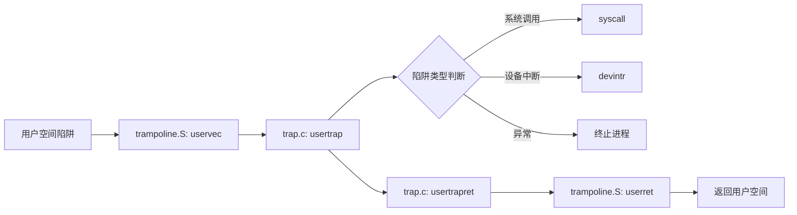
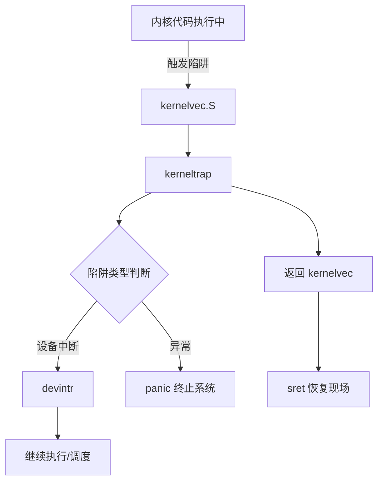

本文主要整理Chapter 4 Traps的要点。

## 4.0 前言

### **核心概念定义**
1. **陷阱（Trap）**  
   三类事件的统称：  
   ✅ **系统调用**（用户程序执行 `ecall` 指令）  
   ✅ **异常**（非法操作，如除零、无效地址访问）  
   ✅ **设备中断**（硬件请求处理，如磁盘 I/O 完成）  
   **关键特性**：透明性——被中断的程序应能无感知恢复执行。

---

### **xv6 的设计选择**
2. **陷阱处理权归属**  
   → **所有陷阱均由内核处理**（不交付用户程序），原因：  
   - **系统调用**：需内核权限执行操作  
   - **设备中断**：内核负责设备隔离与多进程共享  
   - **用户态异常**：xv6 统一终止违规程序  

---

### **陷阱处理流程（四阶段）**
> **通用流程**：  
   **1. 硬件响应**（RISC-V CPU 自动动作）  
   **2. 汇编准备**（保存状态，切换至内核环境）  
   **3. C 路由函数**（判定陷阱类型，分配处理逻辑）  
   **4. 服务执行**（系统调用实现/设备驱动）  

> **关键细化**：  
   → 区分 **用户空间陷阱** 与 **内核空间陷阱** 的处理路径  
   → **初始处理代码**：称为 **向量（vector）**（汇编实现，直接响应陷阱入口）  

---

### **关键术语解析**
- **处理程序（Handler）**：处理陷阱的内核代码（汇编或 C）  
- **向量（Vector）**：陷阱的初始入口点（通常为汇编代码）  

---

### **总结框架图示**
``` 
        触发事件
            │
            ▼
    系统调用 | 异常 | 中断
            │
            ▼
        [陷阱 (Trap)]
            │
            ▼
   ┌──────────────────┐
   │  硬件自动响应     │ (RISC-V CPU)
   └──────────────────┘
            │
            ▼
   ┌──────────────────┐
   │ 汇编预处理        │ (保存寄存器/状态)
   └──────────────────┘
            │
            ▼
   ┌──────────────────┐
   │ C 函数路由决策    │ (识别类型并分发)
   └──────────────────┘
            │
   ┌───────┴───────┐
   ▼               ▼
用户空间陷阱      内核空间陷阱
   │               │
   ▼               ▼
服务例程        服务例程
(系统调用/驱动)   (异常/中断处理)
```

## 4.1 RISC-V trap machinery

### **一、关键控制寄存器**
RISC-V CPU通过一组内核可配置的寄存器管理陷阱：  
| **寄存器**  | **功能**                                                                 |
|-------------|--------------------------------------------------------------------------|
| `stvec`     | 内核写入陷阱处理程序入口地址；陷阱触发时CPU跳转至此执行。                  |
| `sepc`      | 陷阱发生时保存原程序计数器（PC）；`sret` 指令将 `sepc` 值写回 PC 以恢复执行。 |
| `scause`    | 存储陷阱原因编码（如系统调用、中断或异常类型）。                           |
| `sscratch`  | 为陷阱处理程序提供临时存储，避免在保存用户寄存器前覆盖它们。               |
| `sstatus`   | <br>• **SIE位**：控制设备中断使能（0=禁用，1=启用）。<br>• **SPP位**：记录陷阱发生前的模式（用户态/内核态），决定 `sret` 的返回模式。 |

> **访问权限**：**仅内核态**可读写这些寄存器；多核系统中各CPU独立维护自身寄存器集。

---

### **二、陷阱触发时CPU的硬件行为（8步流程）**
无论陷阱类型（系统调用/异常/中断），RISC-V硬件均**自动执行**以下操作：  
1. **中断屏蔽检查**：若为设备中断且 `sstatus.SIE=0`，**忽略后续所有步骤**。  
2. **全局中断禁用**：清除 `sstatus.SIE`（确保原子性）。  
3. **保存现场指针**：将当前 `pc` 存入 `sepc`。  
4. **记录特权级**：当前模式（用户/内核）写入 `sstatus.SPP`。  
5. **记录陷阱原因**：设置 `scause` 值标识触发原因。  
6. **切换特权级**：进入监督模式（内核态）。  
7. **跳转至处理程序**：将 `stvec` 的值载入 `pc`。  
8. **执行入口代码**：从新 `pc` 处开始执行陷阱处理程序。  

> ⚠️ **关键限制**：CPU **不自动切换页表**、**不切换内核栈**、**不保存除PC外的寄存器**——这些必须由软件（内核）补全。

---

### **三、硬件简化设计的原因与风险**
1. **设计动机**：  
   → 赋予软件灵活性（例：特定场景跳过页表切换以提升性能）。  
2. **省略步骤的风险**：  
   → **反面案例**：若硬件不切换PC，用户态陷阱进入内核态后仍执行用户指令，可能破坏隔离性（如篡改 `satp` 寄存器接管物理内存）。  
   → **核心结论**：必须通过 `stvec` 强制跳转至内核可控的安全入口地址。

---

### **总结框架**
``` 
陷阱触发
    │
    ▼
[硬件自动处理]  <─────────┐
    │                    │
    ├─1. 检查SIE与中断类型   │
    ├─2. 禁用全局中断(SIE=0)  │
    ├─3. PC → sepc        │
    ├─4. 当前模式 → sstatus.SPP│
    ├─5. 原因编码 → scause    │
    ├─6. 切换至内核模式       │
    ├─7. stvec → PC        │
    └─8. 执行stvec入口代码    │
         ┌─────────────────┘ 
         ▼
[软件必须补充]  
    ├─ 切换内核页表  
    ├─ 切换内核栈      
    └─ 保存所有寄存器    
```

**核心要旨**：RISC-V仅提供**最小化硬件支持**，确保安全隔离的基础（强制跳转至内核入口），而关键上下文保存与恢复由软件实现，平衡了灵活性与安全性。

## 4.2 Traps from user space

### **一、用户空间陷阱处理路径**


---

### **二、关键设计约束与解决方案**
1. **硬件限制**：  
   RISC-V **不自动切换页表** → 陷阱入口代码需在**用户页表**中映射。  
   **矛盾**：内核处理程序需在**内核页表**下执行。  

2. **xv6的创新方案**：**Trampoline Page（蹦床页）**  
   - **映射位置**：  
     - 用户页表 & 内核页表 **相同虚拟地址** `TRAMPOLINE`（虚拟地址空间顶部）  
   - **核心作用**：  
     ✅ 用户态触发陷阱时，CPU通过用户页表执行 `uservec`  
     ✅ 切换到内核页表后，相同地址指向内核映射 → 无缝继续执行  

---

### **三、陷阱处理四阶段详解**
#### **阶段1：uservec（汇编） - 上下文保存**  
- **寄存器困境**：  
  32个用户寄存器需保存，但无空闲寄存器可用 → 利用 `sscratch` 破局：  
  1. `csrw` 指令暂存 `a0` 到 `sscratch`（腾出1个寄存器）  
  2. 加载 `TRAPFRAME` 地址到 `a0`（位于用户页表，低于 `TRAMPOLINE`）  
  3. 将**所有用户寄存器**保存至陷阱帧（`trapframe`）  
     - 包括从 `sscratch` 恢复的原始 `a0`  

- **切换内核环境**：  
  - 从 `trapframe` 读取：  
    - 内核栈地址 → 切换栈指针  
    - 内核页表地址 → 写入 `satp` 寄存器  
    - `usertrap` 函数地址 → 跳转执行  

#### **阶段2：usertrap（C函数） - 路由与处理**  
1. **安全准备**：  
   - 修改 `stvec` 为 `kernelvec`（后续内核陷阱由独立程序处理）  
   - 保存 `sepc`（防止进程切换导致丢失）  
2. **类型处理**：  
   - **系统调用** → `syscall()`，并修正 `sepc += 4`（跳过 `ecall` 指令）  
   - **设备中断** → `devintr()`  
   - **异常** → 终止当前进程  
3. **返回前检查**：  
   - 进程是否被终止？  
   - 是否为定时器中断需让出CPU？  

#### **阶段3：usertrapret（C函数） - 返回准备**  
- **重置陷阱环境**：  
  - 设置 `stvec = uservec`（下一次用户陷阱入口）  
  - 更新 `trapframe` 中的内核栈/CPU ID等字段（供下次 `uservec` 使用）  
  - 恢复原始 `sepc`（用户程序返回点）  
- **触发返回**：  
  调用 `userret`（位于恒等映射的蹦床页）并传入用户页表地址  

#### **阶段4：userret（汇编） - 恢复用户态**  
1. 切换页表 → 将用户页表地址写入 `satp`  
2. 从 `trapframe` **恢复所有用户寄存器**  
3. 执行 `sret`：  
   - 跳转至 `sepc` 指向的用户地址  
   - CPU模式降级为**用户态**（根据 `sstatus.SPP`）  

---

### **四、关键数据结构：trapframe**
```c
struct trapframe {
  uint64 kernel_satp;   // 内核页表地址
  uint64 kernel_sp;     // 内核栈指针
  uint64 kernel_trap;   // usertrap函数地址
  uint64 epc;           // 保存的用户程序计数器
  uint64 kernel_hartid; // CPU核心ID
  // ... 保存的32个用户寄存器
};
```
**双重映射**：  
- **用户视角**：虚拟地址 `TRAPFRAME`（由用户页表映射）  
- **内核视角**：物理地址直接访问（`p->trapframe`）  

---

### **总结：xv6用户陷阱机制全景图**
``` 
用户程序
  │
  ├─ 触发陷阱 → CPU跳转至 stvec(uservec) 
  │    │
  │    ├─ [硬件] 保存PC/模式/原因，禁用中断
  │    └─ [软件] 在用户页表下保存寄存器至TRAPFRAME
  │         │
  │         └─ 切换内核页表/栈 → 跳转usertrap
  │              │
  │              ├─ 路由处理 → 调用服务例程
  │              └─ 准备返回 → usertrapret
  │                   │
  │                   └─ 调用userret → 切回用户页表
  │                        │
  │                        ├─ 从TRAPFRAME恢复寄存器
  │                        └─ sret → 返回用户程序
  │
  └─ 继续执行
```
**设计精髓**：  
1. **Trampoline恒等映射** → 跨越用户/内核页表边界  
2. **trapframe集中管理** → 实现寄存器快照与内核环境传递  
3. **分层处理** → 汇编保存上下文，C语言路由逻辑，兼顾效率与灵活性

## 4.5 Traps from kernel space

### **一、内核陷阱处理核心路径**


---

### **二、与用户陷阱的本质差异**
1. **执行环境不变**：  
   - 页表保持**内核页表**（无需切换 `satp`)  
   - 栈使用**当前线程的内核栈**（无需切换栈指针）  
2. **入口设置**：  
   - `usertrap` 进入内核时修改 `stvec = kernelvec`  
3. **错误处理**：内核异常直接触发 `panic`（用户陷阱仅终止进程）  

---

### **三、处理流程关键阶段**
#### **阶段1：kernelvec（汇编） - 保存现场**  
- **寄存器保存**：  
  ✅ 将**所有32个寄存器**压入**当前内核线程的栈**  
  ✅ 目的：确保中断线程可被完整恢复（即使发生线程切换）  
- **跳转路由**：调用 `kerneltrap`（C函数）  

#### **阶段2：kerneltrap（C函数） - 陷阱路由**  
1. **类型处理**：  
   | **陷阱类型**      | **处理动作**                     |
   |-------------------|--------------------------------|
   | 设备中断          | 调用 `devintr()` 处理           |
   | **异常**          | **直接触发 `panic` 终止系统**   |  
2. **定时器中断特殊逻辑**：  
   - 若发生在**进程内核线程**（非调度线程）→ 调用 `yield()` **主动让出CPU**  
   - 被调度后恢复执行时从 `yield` 返回点继续  
3. **环境保存**：  
   - 提前备份 `sepc` 和 `sstatus`（防止 `yield` 修改）  
   - 返回前恢复二者以保证正确执行流  

#### **阶段3：恢复执行**  
1. **返回 kernelvec**：  
   - 从栈中**弹出所有寄存器**恢复中断前状态  
2. **执行 `sret`**：  
   - 将 `sepc` 载入 `pc`，继续被中断的内核代码  

---

### **四、关键设计精要**
1. **栈保存策略的深远影响**：  
   - 寄存器保存在**当前线程栈** → 线程切换后新线程从自身栈恢复  
   - **重要性**：实现线程调度时状态隔离（如定时器中断触发 `yield`）  

2. **安全窗口机制**：  
   - **潜在风险点**：  
     - 从用户态进入内核时（`usertrap` 中），`stvec` 暂未从 `uservec` 切至 `kernelvec`  
   - **防御措施**：  
     ✅ RISC-V 陷阱发生时**自动禁用中断**  
     ✅ `usertrap` 在设置 `stvec=kernelvec` **后才重新启用中断**  
   - **效果**：完全规避内核初始化窗口期内的设备中断  

---

### **五、流程对比：内核vs用户陷阱**
| **特性**               | **用户空间陷阱**                  | **内核空间陷阱**                |
|------------------------|---------------------------------|--------------------------------|
| **入口程序**           | uservec (trampoline.S)         | kernelvec (kernelvec.S)       |
| **页表切换**           | 需切换至内核页表                 | 保持内核页表不变               |
| **寄存器保存位置**     | 进程的 trapframe 结构           | 当前线程的内核栈               |
| **栈切换**             | 切换至内核栈                     | 保持当前内核栈                 |
| **异常处理**           | 终止当前进程                    | **触发 panic 停止整个系统**    |
| **定时器中断响应**     | 可能终止或 yield                | **强制当前线程 yield**        |

---

### **总结：内核陷阱的核心逻辑**
``` 
内核执行中发生陷阱
    │
    ▼
[自动硬件动作]  // 禁用中断, 保存 pc→sepc, 跳转至 stvec(kernelvec)
    │
    ▼
kernelvec: 
    ├─ 保存32寄存器到当前线程栈 
    └─ 调用 kerneltrap
        │
        ├─ 设备中断 → devintr 处理
        ├─ 异常     → panic (致命错误)
        ├─ 定时器中断且非调度线程 → yield() 让出CPU
        │    │
        │    └─ 重新调度后恢复执行
        │
        └─ 恢复 sepc/sstatus → 返回 kernelvec
            │
            ▼
kernelvec: 
    ├─ 从栈恢复32寄存器
    └─ sret → 返回原执行点
```
**设计哲学**：  
- **轻量保存**：利用现有内核环境，最小化冗余操作  
- **零容忍错误**：内核异常直接崩溃，确保系统安全可控  
- **协作式调度**：通过陷阱机制实现线程主动让出CPU

## 4.6 Page-fault exceptions

### **一、核心技术：页故障机制基础**
- **触发条件**：
  - 虚拟地址无页表映射
  - `PTE_V` 标志未设置
  - 权限不足（如写只读页）
- **RISC-V分类**：
  | **类型**          | **寄存器**         |
  |------------------|-------------------|
  | 加载页故障        | `scause` 标识      |
  | 存储页故障        | `stval` 存故障地址 |
  | 指令页故障        |                   |

---

### **二、页故障的创新应用场景**
#### **1. 写时复制（Copy-on-Write, COW） Fork**
- **传统 `fork` 痛点**：  
  xv6直接复制物理内存 → 效率低下（如 `fork` + `exec` 场景浪费复制资源）

- **COW 实现原理**：  
  ```mermaid
  sequenceDiagram
      父进程 ->> 子进程： fork()共享所有物理页（PTE_W=0）
      子进程 ->> CPU： 尝试写共享页
      CPU ->> 内核： 触发存储页故障
      内核 -->> 物理内存： 分配新页，复制原内容
      内核 -->> 子进程： 更新PTE指向新页（PTE_W=1）
      子进程 ->> CPU： 重执行写指令 → 成功
  ```
- **优势**：  
  ✅ 减少内存复制（仅实际修改页需复制）  
  ✅ 透明优化（无需修改应用）  
  ✅ 引用计数：仅在最后引用释放时回收物理页  

#### **2. 惰性分配（Lazy Allocation）**
- **传统 `sbrk` 问题**：  
  立即分配物理内存 → 浪费未使用空间（如预分配1GB实际只用10MB）

- **实现流程**：  
  1. `sbrk` 仅扩展虚拟地址范围，**不分配物理页**  
  2. 首次访问新地址 → 触发页故障  
  3. 内核实时分配物理页并映射  
  ```c
  // 伪代码示例
  void handle_page_fault() {
      if (fault_addr in lazy_area) {
          alloc_page();     // 分配物理页
          map_page();       // 建立映射
          return;
      }
      // 其他错误处理...
  }
  ```
- **价值**：  
  ⏱️ 延迟分配成本 → 分摊开销  
  📉 减少零页初始化浪费  

#### **3. 按需分页（Demand Paging）**
- **优化场景**：`exec` 加载大型程序  
- **传统方式**：启动前完整加载程序 → 延迟高  
- **按需加载**：  
  1. 创建全无效PTE的页表  
  2. 程序访问指令/数据 → 触发页故障  
  3. 内核从磁盘加载对应页到内存  
  4. 更新PTE后继续执行  
- **效益**：  
  🚀 加速应用启动（仅加载必要页）  
  💾 降低内存峰值占用  

#### **4. 磁盘分页（Paging to Disk）**
- **问题背景**：物理内存不足  
- **解决方案**：  
  ```mermaid
  graph LR
    A[活跃页] --> B[驻留内存]
    C[非活跃页] --> D[交换至磁盘]
    D -->|页故障触发| E[换入内存]
    E -->|无空闲页| F[换出另一页]
  ```
- **关键机制**：  
  - **换出（Eviction）**：  
    选择非活跃页写回磁盘 → 标记PTE无效  
  - **换入（Page-in）**：  
    访问无效PTE → 触发故障 → 从磁盘读回  
- **挑战**：  
  ⚠️ 频繁换页（抖动）显著降低性能 → 依赖**局部性原理**优化  

---

### **三、技术本质与共性优势**
| **技术**        | **核心思想**                     | **共性优势**                     |
|-----------------|----------------------------------|----------------------------------|
| COW Fork        | 共享→写入时复制                  | ✅ 透明优化<br>✅ 减少无效复制     |
| 惰性分配        | 承诺即分配→实际访问才分配        | ⏱️ 分摊开销<br>📉 避免预分配浪费  |
| 按需分页        | 全量加载→故障时按需加载          | 🚀 加速启动<br>💾 降低内存占用     |
| 磁盘分页        | 内存不足→冷数据换出              | 🔄 突破物理内存限制               |

**统一技术根基**：  
> 利用页故障实现**执行流中断 → 内核动态修补资源状态 → 透明恢复**

---

### **四、扩展应用场景**
1. **自动栈扩展**：  
   - 栈溢出访问未映射页 → 故障处理程序分配新栈页  
2. **内存映射文件（`mmap`）**：  
   ```c
   void* addr = mmap(file, PROT_READ);
   load(addr); // 首次访问触发页故障 → 从文件读取数据
   ```

---

### **五、性能权衡与挑战**
| **场景**              | **收益**                          | **代价**                     |
|-----------------------|-----------------------------------|------------------------------|
| 稀疏写操作（COW）      | 避免大量内存复制                  | 单页复制开销                 |
| 惰性分配              | 节省未使用内存                    | 多次故障处理开销             |
| 按需加载程序          | 快速启动                          | 运行中加载延迟               |
| 磁盘分页              | 支持超物理内存应用                | 换页抖动大幅降低性能         |

**优化方向**：  
- 批处理页故障（如连续预取多页）  
- 专用内核路径（加速高频页故障响应）  

> **洞见**：现代OS将页故障转化为资源动态调配的触发器，在时空开销间取得精妙平衡。
