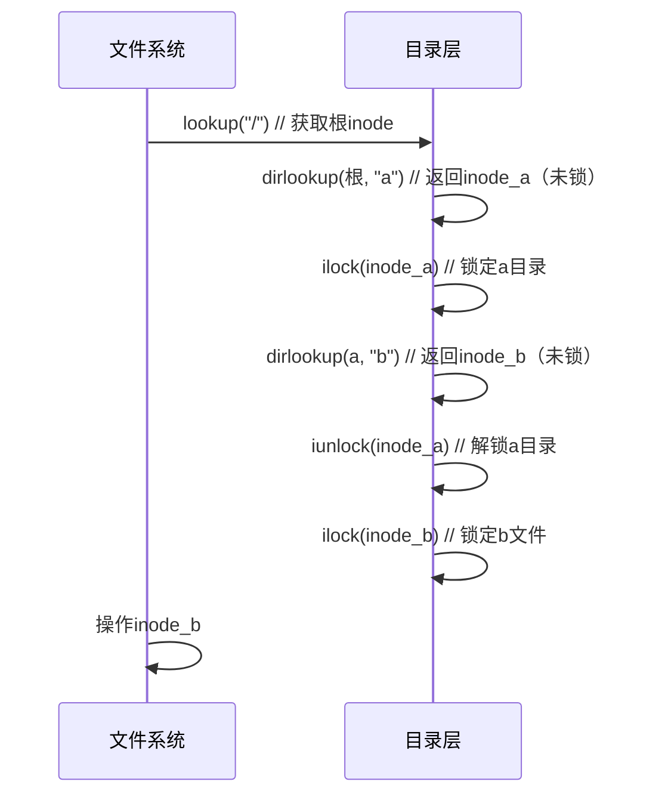

本文主要整理Chapter 8 Directory layer的要点。

## 8.11 Code: directory layer

### **目录的本质**
- **特殊类型文件**：inode类型为 `T_DIR`
- **数据结构**：由连续 `struct dirent` 条目组成
```c
struct dirent {
  ushort inum;       // inode编号（0表示空闲条目）
  char name[DIRSIZ]; // 文件名（最多14字符，以\0结尾）
};
```

- **块号** = inode_start_block + (inum / IPB)
- **块内偏移** = (inum % IPB) * sizeof(struct dinode)

---

### **核心函数解析**
#### 🔍 1. **`dirlookup()`：目录项查找**
```c
// kernel/fs.c:552
struct inode*
dirlookup(struct inode *dp, char *name, uint *poff)
{
  uint off, inum;
  struct dirent de;

  if(dp->type != T_DIR)
    panic("dirlookup not DIR");

  for(off = 0; off < dp->size; off += sizeof(de)){
    if(readi(dp, 0, (uint64)&de, off, sizeof(de)) != sizeof(de))
      panic("dirlookup read");
    if(de.inum == 0) // 跳过空闲项
      continue;
    if(namecmp(name, de.name) == 0){
      // entry matches path element
      if(poff)
        *poff = off;  // 记录条目偏移
      
      // 核心是获取对应inode num
      inum = de.inum;
      return iget(dp->dev, inum);
    }
  }

  return 0;
}
```

#### ➕ 2. **`dirlink()`：添加目录项**
```c
// kernel/fs.c:580
int dirlink(struct inode *dp, char *name, uint inum) {
  int off;
  struct dirent de;
  struct inode *ip;

  // Check that name is not present.
  if((ip = dirlookup(dp, name, 0)) != 0){
    iput(ip);
    return -1;
  }

  // Look for an empty dirent. 空闲目录项，需要读取dp->addrs
  for(off = 0; off < dp->size; off += sizeof(de)){
    if(readi(dp, 0, (uint64)&de, off, sizeof(de)) != sizeof(de))
      panic("dirlink read");
    if(de.inum == 0)
      break;
  }

  strncpy(de.name, name, DIRSIZ);
  de.inum = inum;
  if(writei(dp, 0, (uint64)&de, off, sizeof(de)) != sizeof(de))
    return -1;

  return 0;
}
```

---

### **死锁避免机制**
#### ⚠️ 典型死锁场景
```c
// 危险代码（可能死锁）
ilock(parent);             // 锁定父目录
child = dirlookup(parent, ".");
ilock(child);              // 尝试锁定子目录（实际是同一inode！）
```
- **原因**：`child` 可能是 `parent` 自身（`.`）或父目录（`..`）
- **结果**：尝试重入锁 → 永久阻塞

#### ✅ xv6解决方案
```c
// 安全模式
ilock(dp);                          // 锁定目录inode
ip = dirlookup(dp, name, &off);     // 返回未加锁inode
iunlock(dp);                        // 先解锁目录
ilock(ip);                          // 再锁定目标inode
```
- **解锁顺序**：  
  `解锁父目录` → `锁定子项`  
- **保障**：同一时间只持有一个inode锁

---

### **目录操作流程**
#### 🔄 路径解析示例（`/a/b`）


---

### **设计亮点**
1. **轻量目录项**  
   - 16字节/条目（2字节inum + 14字节name）  
   - 高空间利用率（对比现代文件系统的扩展属性）  

2. **高效查找**  
   - 线性扫描（适合小目录）  
   - 依赖缓存加速（`bread` 缓冲磁盘块）  

3. **无重名保障**  
   `dirlink` 显式检查重名 → 确保目录项唯一性  

4. **动态扩展**  
   - 目录大小按需增长（以目录项为单位）  
   - 无需预分配固定大小  

---

### **局限性**
| **问题**         | **xv6方案**       | **现代优化**               |
|------------------|-------------------|--------------------------|
| **大目录性能**   | O(n)线性扫描      | 哈希表/B树索引            |
| **文件类型**     | 无独立标记         | dirent含文件类型字段       |
| **硬链接计数**   | 手动维护nlink      | 目录项删除自动更新         |
| **原子性**       | 依赖事务包裹       | 日志内建目录操作原子性     |

---

### **总结**
xv6目录层通过：
1. **统一文件抽象**：目录作为特殊文件处理  
2. **简单条目结构**：固定大小dirent数组  
3. **安全锁协议**：返回未锁inode + 显式锁顺序控制  
4. **唯一性强制**：添加时检查重名  
实现了基础但可靠的目录管理功能，为路径解析和文件组织提供核心支持，其死锁避免方案是操作系统设计的经典范例。

## 8.12 Code: Path names

### **核心函数分工**
| **函数**          | **功能**                                     | **返回值**                     |
|--------------------|---------------------------------------------|-------------------------------|
| `namei(path)`     | 解析完整路径 → 返回目标inode（加锁状态）      | 目标文件/目录的锁定inode       |
| `nameiparent(path, name)` | 解析路径 → 返回父目录inode + 末位名称       | 父目录锁定inode + 末位名称复制 |
| `namex()`         | 路径解析核心引擎（被前两者调用）              | 根据参数返回不同结果           |

---

```c
static struct inode*
namex(char *path, int nameiparent, char *name)
{
  struct inode *ip, *next;

  if(*path == '/')  
    ip = iget(ROOTDEV, ROOTINO);  // 根目录
  else
    ip = idup(myproc()->cwd);     // 当前目录

  // 示例：path="/a/b" → name="a", path="b"
  while((path = skipelem(path, name)) != 0){
    ilock(ip);

    // 路径分量必须指向目录
    if(ip->type != T_DIR){
      iunlockput(ip);
      return 0;
    }

    // namex("/a/b", 1, name)→ 返回/a的inode，name="b", path='\0'
    if(nameiparent && *path == '\0'){
      // Stop one level early.
      iunlock(ip);
      return ip;
    }
    // 此时取b的inode
    if((next = dirlookup(ip, name, 0)) == 0){
      iunlockput(ip);
      return 0;
    }
    iunlockput(ip);
    ip = next;
  }
  // 释放多余引用，此处为错误路径
  if(nameiparent){
    iput(ip);
    return 0;
  }
  return ip;
}
```

---

### **关键设计细节**
#### 1. **起点确定（`namex`行:656-659）**
```c
if(*path == '/') 
  ip = iget(ROOTDEV, ROOTINO); // 绝对路径→根目录
else 
  ip = idup(cp->cwd);         // 相对路径→当前目录
```
- **根目录固定**：`ROOTINO=1`（由`mkfs`预设）
- **进程上下文**：`cp->cwd`来自进程控制块

#### 2. **路径分量分解（`skipelem`）**
```c
// 示例：path="/usr/rtm/fs.c"
skipelem(&path, name) → name="usr", path="rtm/fs.c"
skipelem(&path, name) → name="rtm", path="fs.c"
skipelem(&path, name) → name="fs.c", path="" 
```
- **智能截断**：处理连续`/`、`.`、`..`（xv6未实现`..`）
- **名称存储**：`name`缓冲区大小`DIRSIZ+1`（15字节）

#### 3. **安全锁定协议**
```c
ilock(ip); // 锁定当前目录
if(ip->type != T_DIR) 
  panic("not a directory"); // 必须为目录
...
next = dirlookup(ip, name, 0); // 返回未锁inode
iunlock(ip); // 立即解锁当前目录
ilock(next); // 再锁定下一级
```
- **防死锁**：避免嵌套锁定（如`.`指向自身）
- **必要性**：目录类型检查需在锁定后（确保数据加载）

#### 4. **末位分量特殊处理**
```c
if(nameiparent && *path == '\0') {
  iunlock(ip);
  return ip; // 返回未锁父目录
}
```
- **场景**：`nameiparent`模式且无剩余路径
- **示例**：`nameiparent("/a/b", name)` → 返回`/a`目录 + `name="b"`

---

### **并发与崩溃安全**
#### 🔄 并发优化
- **目录锁独立**：不同路径可并行查找（如`/a`和`/b`）
- **缓冲区缓存**：热目录快速访问（减少磁盘I/O）

#### 🛡️ 崩溃安全机制
1. **引用计数保护**：
   ```c
   next = dirlookup(ip, name); // iget增加ref
   iunlock(ip);                // 解锁目录但不释放
   ```
   - 即使其他进程删除目录，`ref>0`保证inode存活

2. **数据一致性**：
   - `ilock`确保加载最新目录数据
   - 目录操作（增删）需事务包裹

#### ⚠️ 潜在风险
- **目录树并发修改**：
  - 场景：进程A查找`/a/b`时，进程B删除`/a`
  - 防御：`dirlookup`返回的inode因`ref>0`不被立即释放
- **悬挂目录项**：
  - 查找后目标被删除 → 返回的inode可能已无目录项
  - 调用方需处理`ip->nlink==0`的情况

---

### **性能考量**
1. **磁盘I/O瓶颈**：
   - 深度路径需多次读目录块（最坏情况每级1次I/O）
   - 优化：热目录缓存于`bufcache`

2. **锁粒度优化**：
   - 每目录独立锁 → 允许并行路径解析
   - 锁定时间最小化（查找后立即解锁）

3. **路径压缩**：
   - 无符号链接 → 路径解析无递归
   - 无挂载点 → 路径连续无跳转

---

### **设计局限**
| **问题**               | **xv6方案**       | **现代优化**               |
|------------------------|-------------------|--------------------------|
| **长路径性能**         | O(n)磁盘访问      | 目录项缓存 (dcache)       |
| **符号链接**           | 未实现            | 递归解析 + 深度限制       |
| **跨设备挂载**         | 不支持            | 挂载点切换                |
| **权限检查**           | 无                | 访问控制列表(ACL)         |

---

### **总结**
xv6路径查找通过：
1. **分层解析**：逐级分解路径分量
2. **锁接力**：`锁定A→查找B→解锁A→锁定B`
3. **引用屏障**：`iget`维持inode存活
4. **错误防御**：严格目录类型检查
实现高效安全的路径解析。

**核心价值**：
- 为`open`、`unlink`等系统调用提供基础
- 展示**避免死锁**的经典模式（非嵌套锁顺序）
- 平衡**并发性**与**一致性**
