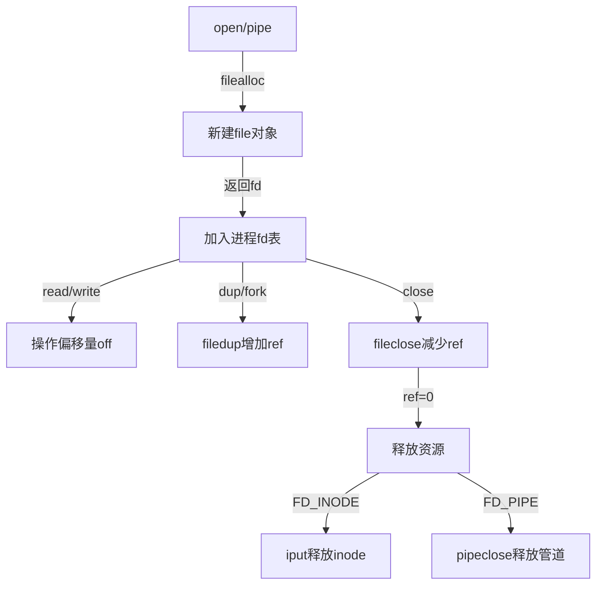

本文主要整理Chapter 8 File descriptor layer的要点。

## 8.13 File descriptor layer

### **核心设计理念**
**"万物皆文件"（Everything is a file）**  
- **统一抽象**：文件、管道、设备等均通过文件描述符访问  
- **操作统一**：`read`/`write`/`close`等系统调用通用  

---

### **关键数据结构**
#### 1. **文件表项（`struct file`）**
```c
struct file {
  enum { FD_NONE, FD_PIPE, FD_INODE } type; // 文件类型
  int ref;             // 引用计数
  char readable;       // 可读标志
  char writable;       // 可写标志
  struct pipe *pipe;   // 管道指针（若为管道）
  struct inode *ip;    // inode指针（若为文件）
  uint off;            // 读写偏移量
};
```
- **类型标识**：  
  - `FD_INODE`：常规文件/目录  
  - `FD_PIPE`：管道  
  - `FD_NONE`：未使用  

#### 2. **全局文件表（`ftable`）**
- **存储**：所有打开的文件对象数组  
- **管理函数**：  
  | **函数**       | **功能**                     | **关键逻辑**                          |
  |---------------|-----------------------------|--------------------------------------|
  | `filealloc()` | 分配空闲文件对象             | 扫描`ftable`找`ref=0`项 → 初始化返回  |
  | `filedup()`   | 增加引用计数（`dup`/`fork`） | `f->ref++`                           |
  | `fileclose()` | 释放文件对象                 | `ref--` → 若归零则释放底层资源         |
  | `fileread()`  | 读操作路由                   | 根据类型调用`piperead()`或`readi()`   |
  | `filewrite()` | 写操作路由                   | 根据类型调用`pipewrite()`或`writei()` |

---

### **核心机制解析**
#### 🔄 1. **文件描述符生命周期**


#### 📍 2. **偏移量管理**
- **独立性**：  
  不同进程打开同一文件 → **各自维护`off`**  
  ```c
  // 进程A
  fd1 = open("f"); write(fd1, "A", 1); // off=1
  // 进程B
  fd2 = open("f"); write(fd2, "B", 1); // off=1 → 覆盖A
  ```
- **共享性**：  
  `fork`或`dup`复制描述符 → **共享同一`file`对象** → 共享`off`  
  ```c
  fd1 = open("f"); fd2 = dup(fd1);
  write(fd1, "A", 1); // off=1
  write(fd2, "B", 1); // off=2 → 文件内容"AB"
  ```

#### 🔒 3. **并发安全**
- **写操作原子性**：  
  `inode`锁保证单文件写操作原子性（防数据覆盖）  
  ```c
  // fileread/filewrite内部
  ilock(f->ip);
  readi/writei(f->ip, ...);
  iunlock(f->ip);
  ```
- **全局表保护**：  
  `ftable.lock`自旋锁保护`ref`计数修改  

---

### **操作路由机制**
#### 📥 读操作流程（`fileread`）
```c
int
fileread(struct file *f, uint64 addr, int n)
{
  int r = 0;

  if(f->readable == 0) // 权限检查
    return -1;

  if(f->type == FD_PIPE){
    r = piperead(f->pipe, addr, n);
  } else if(f->type == FD_DEVICE){
    if(f->major < 0 || f->major >= NDEV || !devsw[f->major].read)
      return -1;
    r = devsw[f->major].read(1, addr, n);
  } else if(f->type == FD_INODE){
    ilock(f->ip); // 加inode锁
    if((r = readi(f->ip, 1, addr, f->off, n)) > 0) // 文件读
      f->off += r; // 更新偏移量
    iunlock(f->ip);
  } else {
    panic("fileread");
  }

  return r;
}
```

#### 📤 写操作流程（`filewrite`）
```c
int
filewrite(struct file *f, uint64 addr, int n)
{
  int r, ret = 0;

  if(f->writable == 0)
    return -1;

  if(f->type == FD_PIPE){
    ret = pipewrite(f->pipe, addr, n);
  } else if(f->type == FD_DEVICE){
    if(f->major < 0 || f->major >= NDEV || !devsw[f->major].write)
      return -1;
    ret = devsw[f->major].write(1, addr, n);
  } else if(f->type == FD_INODE){
    // write a few blocks at a time to avoid exceeding
    // the maximum log transaction size, including
    // i-node, indirect block, allocation blocks,
    // and 2 blocks of slop for non-aligned writes.
    // this really belongs lower down, since writei()
    // might be writing a device like the console.
    int max = ((MAXOPBLOCKS-1-1-2) / 2) * BSIZE;
    int i = 0;
    while(i < n){
      int n1 = n - i;
      if(n1 > max)
        n1 = max;

      begin_op();
      ilock(f->ip);
      if ((r = writei(f->ip, 1, addr + i, f->off, n1)) > 0)
        f->off += r;
      iunlock(f->ip);
      end_op();

      if(r != n1){
        // error from writei
        break;
      }
      i += r;
    }
    ret = (i == n ? n : -1);
  } else {
    panic("filewrite");
  }

  return ret;
}
```

| **操作**          | **块数** | **内容**                |
|--------------------|----------|------------------------|
| `write_log()`      | 3        | 3个数据块               |
| `write_head()`     | 1        | 提交记录(n=3)           |
| `install_trans()` | 3        | 写回3个数据块           |
| `write_head(0)`    | 1        | 清理日志               |

---

### **设计亮点**
1. **统一接口抽象**  
   - 隐藏底层差异：文件/管道使用相同`read`/`write`接口  
   - 扩展性强：新增设备类型只需扩展`file.type`  

2. **偏移量解耦**  
   - 文件对象持有`off` → 支持多光标读写  
   - 分离物理文件与访问上下文  

3. **引用计数管理**  
   - `ref`计数自动释放资源 → 避免内存泄漏  
   - 支持`fork`/`dup`语义无缝实现  

4. **权限分离**  
   - `readable`/`writable`独立控制 → 灵活权限管理  

---

### **资源释放流程（`fileclose`）**
```c
void
fileclose(struct file *f)
{
  struct file ff;

  acquire(&ftable.lock);
  if(f->ref < 1) // 仍有引用
    panic("fileclose");
  if(--f->ref > 0){
    release(&ftable.lock);
    return;
  }
  ff = *f;
  f->ref = 0;
  f->type = FD_NONE; // 标记空闲
  release(&ftable.lock);

  if(ff.type == FD_PIPE){
    pipeclose(ff.pipe, ff.writable);
  } else if(ff.type == FD_INODE || ff.type == FD_DEVICE){
    begin_op();
    iput(ff.ip);
    end_op();
  }
}

```

---

### **总结**
xv6文件描述符层通过：
1. **统一文件抽象**（`struct file`）  
2. **全局资源管理**（`ftable`）  
3. **操作路由机制**（`fileread`/`filewrite`）  
4. **引用计数生命周期**（`ref`）  
实现：
- **资源统一访问**（文件/管道/未来设备）  
- **并发安全控制**（inode锁+全局锁）  
- **描述符语义**（`fork`/`dup`共享状态）  
是Unix哲学**"万物皆文件"** 的经典教学实现。

## 8.14 Code: System calls

### **核心系统调用解析**
#### 🔗 1. **`sys_link`：创建硬链接**
```c
uint64
sys_link(void)
{
  char name[DIRSIZ], new[MAXPATH], old[MAXPATH];
  struct inode *dp, *ip;

  if(argstr(0, old, MAXPATH) < 0 || argstr(1, new, MAXPATH) < 0)
    return -1;

  begin_op();
  // 获取源文件 inode
  if((ip = namei(old)) == 0){
    end_op();
    return -1;
  }

  ilock(ip);
  // 禁止为目录创建硬链接（防循环引用）
  // iunlockput= 解锁 + 释放引用
  if(ip->type == T_DIR){
    iunlockput(ip);
    end_op();
    return -1;
  }

  ip->nlink++;
  iupdate(ip);
  iunlock(ip);

  // 获取目标父目录
  if((dp = nameiparent(new, name)) == 0)
    goto bad;
  ilock(dp);
  // 创建硬链接
  if(dp->dev != ip->dev || dirlink(dp, name, ip->inum) < 0){
    iunlockput(dp);
    goto bad;
  }
  iunlockput(dp);
  iput(ip);

  end_op();

  return 0;

bad:
  ilock(ip);
  ip->nlink--;
  iupdate(ip);
  iunlockput(ip);
  end_op();
  return -1;
}
```
- **事务保障**：
  - `nlink++` 与 `dirlink` 原子提交
  - 崩溃时全回滚（无半完成状态）
- **安全限制**：
  - 禁止目录硬链接（防循环引用）
  - 同设备限制（inode号仅本设备有效）

#### 🗑️ 2. **`sys_unlink`：删除链接**
```c
uint64
sys_unlink(void)
{
  struct inode *ip, *dp;
  struct dirent de;
  char name[DIRSIZ], path[MAXPATH];
  uint off;

  if(argstr(0, path, MAXPATH) < 0)
    return -1;

  begin_op();
  // 获取父目录 inode
  if((dp = nameiparent(path, name)) == 0){
    end_op();
    return -1;
  }

  ilock(dp);

  // Cannot unlink "." or "..".
  // 禁止删除特殊目录项
  if(namecmp(name, ".") == 0 || namecmp(name, "..") == 0)
    goto bad;

  if((ip = dirlookup(dp, name, &off)) == 0)
    goto bad;
  ilock(ip);

  if(ip->nlink < 1)
    panic("unlink: nlink < 1");
  // 目标验证
  if(ip->type == T_DIR && !isdirempty(ip)){
    iunlockput(ip);
    goto bad;
  }

  // 删除目录项
  memset(&de, 0, sizeof(de));
  if(writei(dp, 0, (uint64)&de, off, sizeof(de)) != sizeof(de))
    panic("unlink: writei");
  if(ip->type == T_DIR){
    dp->nlink--;
    iupdate(dp);
  }
  iunlockput(dp);

  ip->nlink--;
  iupdate(ip);
  iunlockput(ip);

  end_op();

  return 0;

bad:
  iunlockput(dp);
  end_op();
  return -1;
}
```
- **关键检查**：
  - 目录非空验证（`isdirempty`遍历条目）
  - 链接计数校验（防负值）
- **延迟释放**：`nlink=0`不立即删除（等待`iput`）

#### 🆕 3. **`create`：通用创建函数**
```c
static struct inode*
create(char *path, short type, short major, short minor)
{
  struct inode *ip, *dp;
  char name[DIRSIZ];

  // 获取父目录
  if((dp = nameiparent(path, name)) == 0)
    return 0;

  ilock(dp);

  // 同名项检查
  if((ip = dirlookup(dp, name, 0)) != 0){
    iunlockput(dp);
    ilock(ip);

    // 文件创建特殊处理，复用文件
    // open(O_CREATE)允许覆盖​​同名文件/设备​
    if(type == T_FILE && (ip->type == T_FILE || ip->type == T_DEVICE))
      return ip;
    iunlockput(ip);
    return 0;
  }

  // 分配新 inode
  if((ip = ialloc(dp->dev, type)) == 0){
    iunlockput(dp);
    return 0;
  }

  ilock(ip);
  ip->major = major;
  ip->minor = minor;
  ip->nlink = 1;
  iupdate(ip);

  // 目录特殊初始化
  if(type == T_DIR){  // Create . and .. entries.
    // No ip->nlink++ for ".": avoid cyclic ref count.
    if(dirlink(ip, ".", ip->inum) < 0 || dirlink(ip, "..", dp->inum) < 0)
      goto fail;
  }

  // 链接到父目录
  if(dirlink(dp, name, ip->inum) < 0)
    goto fail;

  // 更新父目录链接计数
  if(type == T_DIR){
    // now that success is guaranteed:
    dp->nlink++;  // for ".."
    iupdate(dp);
  }

  iunlockput(dp);

  return ip;

 fail:
  // something went wrong. de-allocate ip.
  ip->nlink = 0;
  iupdate(ip);
  iunlockput(ip);
  iunlockput(dp);
  return 0;
}
```
- **多态支持**：
  | **调用源**   | **创建类型** | **特殊处理**               |
  |-------------|-------------|--------------------------|
  | `open`      | `T_FILE`    | 允许覆盖同名文件           |
  | `mkdir`     | `T_DIR`     | 初始化`.`/`..`，父目录`nlink++` |
  | `mknod`     | `T_DEVICE`  | 设置设备号                |
- **锁安全**：同时持有`dp`和`ip`锁（新`ip`无竞争）

#### 📂 4. **`sys_open`：文件打开**
```c
uint64
sys_open(void)
{
  char path[MAXPATH];
  int fd, omode;
  struct file *f;
  struct inode *ip;
  int n;

  argint(1, &omode);
  if((n = argstr(0, path, MAXPATH)) < 0)
    return -1;

  begin_op();

  // 创建模式处理
  if(omode & O_CREATE){
    ip = create(path, T_FILE, 0, 0);
    if(ip == 0){
      end_op();
      return -1;
    }
  } 
  // 打开模式处理
  else {
    if((ip = namei(path)) == 0){
      end_op();
      return -1;
    }
    ilock(ip);
    // 目录检查
    if(ip->type == T_DIR && omode != O_RDONLY){
      iunlockput(ip);
      end_op();
      return -1;
    }
  }

  // 设备文件校验
  if(ip->type == T_DEVICE && (ip->major < 0 || ip->major >= NDEV)){
    iunlockput(ip);
    end_op();
    return -1;
  }

  // 分配文件对象
  // filealloc()：全局文件表分配
  // fdalloc()：进程文件描述符表分配
  if((f = filealloc()) == 0 || (fd = fdalloc(f)) < 0){
    if(f)
      fileclose(f);
    iunlockput(ip);
    end_op();
    return -1;
  }

  // 初始化文件对象
  if(ip->type == T_DEVICE){
    f->type = FD_DEVICE;
    f->major = ip->major;
  } else {
    f->type = FD_INODE;
    f->off = 0;
  }
  f->ip = ip;
  f->readable = !(omode & O_WRONLY);
  f->writable = (omode & O_WRONLY) || (omode & O_RDWR);

  if((omode & O_TRUNC) && ip->type == T_FILE){
    itrunc(ip);
  }

  iunlock(ip);
  end_op();

  return fd;
}
```
- **模式处理**：
  - `O_CREATE`：调用`create`
  - `O_APPEND`：偏移量设为文件末尾
- **目录保护**：目录文件禁止写打开

#### 🚰 5. **`sys_pipe`：管道创建**
```c
uint64
sys_pipe(void)
{
  uint64 fdarray; // user pointer to array of two integers
  struct file *rf, *wf;
  int fd0, fd1;
  struct proc *p = myproc();

  argaddr(0, &fdarray);

  // 管道对象创建
  if(pipealloc(&rf, &wf) < 0)
    return -1;
  fd0 = -1;
  // 文件描述符分配
  if((fd0 = fdalloc(rf)) < 0 || (fd1 = fdalloc(wf)) < 0){
    if(fd0 >= 0)
      p->ofile[fd0] = 0;
    fileclose(rf);
    fileclose(wf);
    return -1;
  }
  // copyout将内核数据复制到用户空间
  if(copyout(p->pagetable, fdarray, (char*)&fd0, sizeof(fd0)) < 0 ||
     copyout(p->pagetable, fdarray+sizeof(fd0), (char *)&fd1, sizeof(fd1)) < 0){
    p->ofile[fd0] = 0;
    p->ofile[fd1] = 0;
    fileclose(rf);
    fileclose(wf);
    return -1;
  }
  return 0;
}
```
- **文件系统整合**：
  - 管道作为`FD_PIPE`类型文件
  - 复用文件描述符接口

---

### **设计亮点总结**
#### 🔒 1. 事务原子性保障
| **操作**       | **多磁盘操作**                     | **事务解决方案**              |
|----------------|-----------------------------------|-----------------------------|
| **创建链接**   | 1. `nlink++`<br>2. 添加目录项      | 原子提交防部分完成            |
| **删除文件**   | 1. 清除目录项<br>2. `nlink--`      | 崩溃时全回滚或全应用          |
| **创建目录**   | 1. 分配inode<br>2. 初始化`.`/`..`<br>3. 父目录`nlink++` | 单事务保证完整结构            |

#### ⚙️ 2. 资源生命周期管理
- **链接计数**：
  - `sys_link`：`nlink++`（立即写回）
  - `sys_unlink`：`nlink--`（触发延迟释放）
- **inode释放**：
  - `nlink=0`且`ref=0`时由`iput`释放

#### 🔄 3. 统一创建接口
- **`create`函数复用**：
  ```mermaid
  graph TD
    create --> open
    create --> mkdir
    create --> mknod
  ```
- **减少冗余**：避免三套独立创建逻辑

#### 🛡️ 4. 安全边界控制
| **防护点**          | **实现机制**                     | **防御目标**                |
|---------------------|--------------------------------|----------------------------|
| **目录硬链接**       | `sys_link`禁止目录类型          | 防止循环引用               |
| **非空目录删除**     | `isdirempty`检查               | 避免孤儿文件               |
| **目录写打开**      | `sys_open`模式检查              | 保护目录结构完整性         |
| **设备号校验**      | `mknod`参数检查                | 防止无效设备访问           |

#### 💡 5. 管道系统集成
- **无缝接入**：
  - 管道作为特殊文件类型（`FD_PIPE`）
  - 复用文件描述符表
- **零拷贝优化**：
  - 内核缓冲区直接传递数据
  - 无磁盘I/O开销

---

### **事务的价值体现**
#### 崩溃场景对比
| **操作**       | **无事务风险**                     | **事务保障**               |
|----------------|-----------------------------------|---------------------------|
| **创建链接**   | `nlink++`后崩溃 → 链接计数虚高     | 全回滚 → 计数一致          |
| **删除文件**   | 清除目录项后崩溃 → 空间泄露        | 目录项回滚 → 文件仍可访问  |
| **创建目录**   | 初始化`..`前崩溃 → 残缺目录        | 全回滚 → 无残留            |

---

### **总结**
xv6文件系统调用层通过：
1. **事务原子性** → 保障多步操作崩溃安全
2. **通用创建接口** → 统一文件/目录/设备创建
3. **分层锁协议** → 预防死锁（如`create`持双锁）
4. **资源引用计数** → 精确控制inode生命周期
5. **管道无缝整合** → 扩展"万物皆文件"哲学


