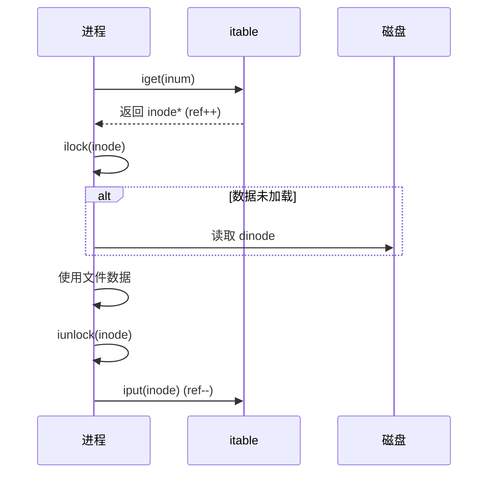
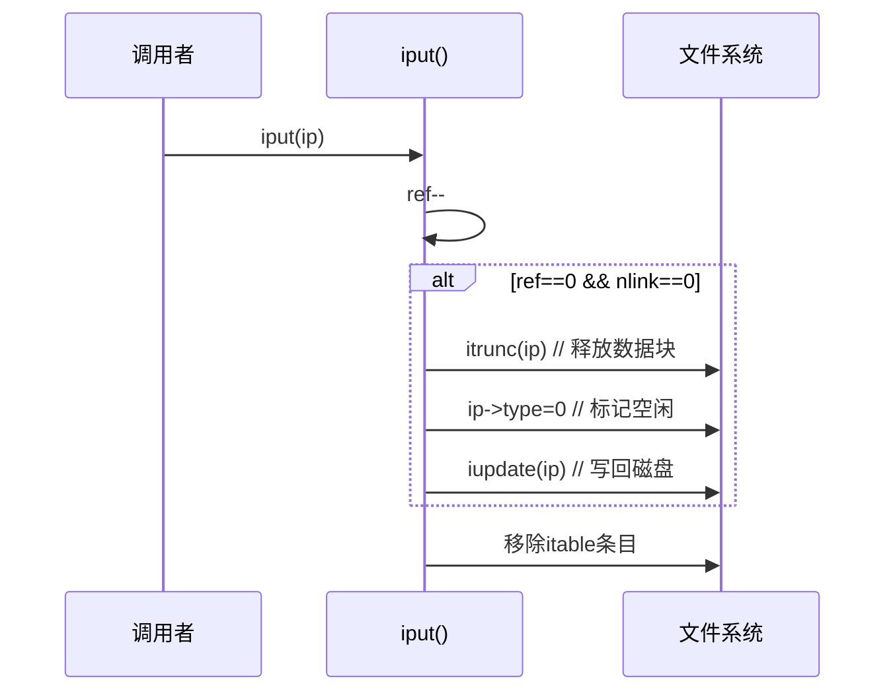
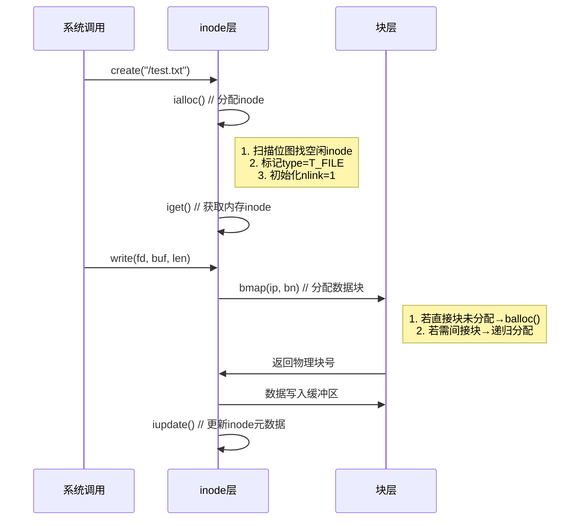

本文主要整理Chapter 8 Inode layer的要点。

## 8.7 Code: Block allocator

### **磁盘块管理机制**
#### 1. **位图（Bitmap）结构**
   - **存储位置**：专用磁盘块（由`mkfs`初始化）  
   - **映射规则**：  
     - **1 bit → 1磁盘块**  
     - `0` = 空闲块，`1` = 已分配块  
   - **初始化设置**：  
     `mkfs` 预先标记**不可分配块**（引导扇区/超级块/日志区/inode区/位图区）  

#### 2. **关键函数**
   | **函数**   | **功能**                             | **实现要点**                                                                 |
   |------------|--------------------------------------|-----------------------------------------------------------------------------|
   | `balloc()` | 分配空闲块                           | 1. 扫描位图块，寻找首个 `0` 位<br>2. 更新位图为 `1`<br>3. 返回块号           |
   | `bfree()`  | 释放指定块                           | 1. 定位块对应的位图块<br>2. 清除位（置 `0`）<br>3. 更新位图缓存              |

---

### **分配算法优化（balloc）**
#### 🔍 **双层扫描设计**
```c
static uint
balloc(uint dev)
{
  int b, bi, m;
  struct buf *bp;

  bp = 0;
  for(b = 0; b < sb.size; b += BPB){
    bp = bread(dev, BBLOCK(b, sb));
    for(bi = 0; bi < BPB && b + bi < sb.size; bi++){
      m = 1 << (bi % 8);
      if((bp->data[bi/8] & m) == 0){  // Is block free?
        bp->data[bi/8] |= m;  // Mark block in use.
        log_write(bp);
        brelse(bp);
        bzero(dev, b + bi);
        return b + bi;
      }
    }
    brelse(bp);
  }
  printf("balloc: out of blocks\n");
  return 0;
}
```
- **优化目的**：减少磁盘I/O  
  - 外层循环按**位图块**遍历（减少bread调用次数）  
  - 内层循环检查单个位图块内所有位（内存操作高效）  
- **性能收益**：  
  若文件系统有 10,000 块（约 10 位图块），最坏情况仅需 10 次磁盘读（而非 10,000 次）  

---

### **并发安全设计**
#### 🔒 **隐式锁机制**
- **依赖缓冲区缓存层**：  
  - `bread()` 获取位图块时，缓冲区睡眠锁**阻止其他进程访问同一块**  
  - **临界区保护**：  
    ```c
    buf = bread(bitmap_bno);  // 加锁（其他进程阻塞）
    ... // 修改位图
    bwrite(buf);             // 写回
    brelse(buf);             // 释放锁
    ```
- **安全效果**：  
  避免两个进程同时修改同一位图块（如同时分配块导致重复分配）  

---

### **事务整合要求**
#### ⚠️ **必须包裹在事务中**
```c
begin_op();
bno = balloc(dev);  // 分配块
... // 使用块（如写文件数据）
end_op();
```
- **必要性**：  
  块分配涉及**位图修改**（元数据），必须通过日志保证：  
  1. **原子性**：分配操作要么完全生效（位图更新+块使用），要么完全回滚  
  2. **崩溃一致性**：避免位图更新后崩溃，导致块已分配但未被使用（空间泄露）  

---

> 💡 **典型场景**：  
> - **文件创建**：`balloc` 分配 inode 块 + 数据块  
> - **文件删除**：`bfree` 释放所有关联块  
> 均通过日志事务确保操作原子性，从根源杜绝块泄露或重复分配问题。

## 8.8 Inode layer

### **inode的双重含义**
| **类型**         | **存储位置** | **数据结构**       | **核心作用**                               |
|-------------------|--------------|--------------------|------------------------------------------|
| **磁盘inode**     | 磁盘固定区域 | `struct dinode`    | 持久化存储文件元数据（大小/块列表/类型）   |
| **内存inode**     | 内存itable表 | `struct inode`     | 运行时副本（含额外控制字段）               |

---

### **磁盘inode结构（`struct dinode`）**
```c
struct dinode {
  short type;     // 文件类型（0=空闲, 1=文件, 2=目录, 3=设备）
  short nlink;    // 硬链接计数（决定何时释放inode）
  uint size;      // 文件字节数
  uint addrs[NDIRECT+1]; // 数据块地址（直接+间接索引）
};
```
- **关键字段**：
  - `type=0` → 空闲inode（可分配）
  - `nlink=0` → 无目录引用（可释放数据块）
  - `addrs[]` → 文件内容块位置（xv6支持12个直接块+1个间接块）

---

### **内存inode结构（`struct inode`）**
```c
struct inode {
  uint dev;           // 设备号
  uint inum;          // inode编号
  int ref;            // 内存引用计数
  struct sleeplock lock; // 睡眠锁（保护字段修改）
  short type;         // 拷贝自磁盘
  short nlink;         // 拷贝自磁盘
  uint size;          // 拷贝自磁盘
  uint addrs[NDIRECT+1]; // 拷贝自磁盘
};
```
- **新增运行时字段**：
  - `ref`：内存引用计数（归零时从itable移除）
  - `lock`：睡眠锁（保障字段访问安全）

---

### **四大同步机制**
| **机制**               | **保护目标**                                     | **实现方式**                          |
|------------------------|------------------------------------------------|--------------------------------------|
| **itable.lock自旋锁**  | 确保内存inode唯一性 + `ref`计数准确性            | 修改itable时加锁                     |
| **inode睡眠锁**         | 保护inode字段及文件内容块                        | `ilock()`/`iunlock()` 加解锁         |
| **内存引用计数(ref)**   | 维持inode内存驻留（>0时不可复用）                 | `iget()`增加 / `iput()`减少           |
| **磁盘链接计数(nlink)**| 决定inode是否释放（>0时不可删除）                | 目录操作时更新                       |

| **特性**               | **自旋锁 (itable.lock)**                  | **睡眠锁 (inode.lock)**               |
|-------------------------|------------------------------------------|---------------------------------------|
| **阻塞行为**            | 忙等待（不释放CPU）                      | 让出CPU（触发进程切换）               |
| **持有时间**            | 必须极短（纳秒-微秒级）                  | 可较长（毫秒级，含I/O）               |
| **嵌套风险**            | 禁止嵌套（临界区原子化）                 | 需顺序控制（否则死锁）                |
| **死锁可能性**          | ❌ 不可能（无阻塞+无嵌套）               | ✅ 可能（需顺序控制）                 |

---

### **核心函数工作流**
#### 🔄 **1. `iget()` 获取内存inode**
- **作用**：返回内存inode指针（不保证数据最新）
- **特性**：
  - **非独占**：允许多个进程同时持有指针
  - **延迟加载**：不立即读取磁盘数据
- **使用场景**：
  - 长期持有（如打开文件）
  - 避免路径查找死锁

#### 🔒 **2. `ilock()` 加载并锁定inode**
- **作用**：
  1. 加睡眠锁（阻塞其他进程）
  2. 若未加载 → 从磁盘读取`dinode`到内存
- **关键**：分离`iget`（获取引用）和`ilock`（加载数据）避免死锁

#### 📤 **3. `iupdate()` 写回磁盘**
- **作用**：将内存inode同步到磁盘
- **触发条件**：修改inode元数据后（如文件截断）
- **事务要求**：必须在日志事务中调用

#### 🔓 **4. `iput()` 释放inode引用**
- **作用**：
  1. 减少`ref`计数
  2. 若`ref=0`且`nlink=0` → 释放磁盘inode和数据块
  3. 从itable移除
- **调用时机**：关闭文件/目录时

---

### **设计亮点**
#### 🧠 1. **引用分离机制**
- `iget` 只管理**内存结构生命周期**
- `ilock` 负责**数据一致性与互斥**
- **优势**：避免路径查找时死锁（如进程A锁`/a`，进程B锁`/a/b`）

#### ⚡ 2. **缓存与持久化分离**
- **内存inode**：运行时控制结构（含锁/引用计数）
- **磁盘inode**：持久化元数据
- **同步**：`iupdate`显式写回（通常在事务中）

#### 🔄 3. **双重生命周期管理**
| **计数** | **作用域** | **归零条件**               | **后果**         |
|----------|------------|--------------------------|------------------|
| `ref`    | 内存       | 无进程引用inode           | 移出itable       |
| `nlink`  | 磁盘       | 无目录项指向该inode        | 释放磁盘空间     |

---

### **工作流示例：打开文件**


---

### **总结**
xv6 inode层通过：
1. **内存/磁盘结构分离** → 兼顾性能与持久化  
2. **四级保护机制** → 解决并发冲突  
3. **引用与锁分离** → 避免死锁  
4. **双重计数管理** → 精确控制资源生命周期  
为文件系统提供了高效安全的元数据管理基础。

## 8.9 Code: Inodes

### **核心函数功能**
| **函数**      | **作用**                           | **关键机制**                              |
|---------------|-----------------------------------|------------------------------------------|
| `ialloc()`    | 分配空闲inode（类似`balloc`）       | 扫描磁盘inode区 → 标记类型 → 调用`iget`   |
| `iget()`      | 获取内存inode引用                  | 查itable → 增`ref` → 记录空闲槽位         |
| `ilock()`     | 锁定并加载inode数据                | 加睡眠锁 → 从磁盘/缓存读取元数据          |
| `iput()`      | 释放inode引用                      | 减`ref` → 若`ref=0 & nlink=0`则释放资源   |
| `itrunc()`    | 释放文件数据块                     | 清空`addrs[]` → 更新位图                  |

---

### **关键设计解析**
#### 🔒 1. **并发安全机制**
- **`ialloc` 防冲突**：
  - 依赖**缓冲区锁**（`bp->lock`）保证单进程修改inode类型，事先调用ilock(dp)
  - 避免两进程同时认为同一inode空闲

- **`iput` 释放安全**：
  - 若 `ref=1 & nlink=0` → 仅当前线程持有引用 → 无并发访问风险
  - `ialloc` 重用inode前会等待睡眠锁 → 与释放操作互斥

#### ⚠️ 2. **崩溃恢复缺陷**
- **孤儿inode问题**：
  - 场景：文件被删（`nlink=0`）但进程仍打开（`ref>0`）时崩溃
  - 后果：磁盘inode**被标记占用但无目录项指向** → 空间泄露
- **xv6的不足**：
  - ❌ 未记录待释放inode列表
  - ❌ 重启后无扫描回收机制
  - 风险：长期运行可能导致磁盘耗尽

#### 💾 3. **写盘触发条件**
- **隐式写操作**：
  ```c
  read() → 打开文件 → ... → 关闭文件 → iput() → 若nlink=0 → itrunc() → 写位图
  ```
  - **关键结论**：即使**只读操作**也可能触发磁盘写（通过`iput`）
- **事务必要性**：
  - 所有文件操作必须包裹在事务中：
    ```c
    begin_op();
    read(fd, buf, n); // 可能调用iput()
    end_op();
    ```

---

### **资源释放流程（`iput`）**


### **设计局限与改进方向**
| **问题**                | **xv6处理**      | **工业级方案**               |
|-------------------------|-----------------|-----------------------------|
| **孤儿inode**           | ❌ 忽略          | 磁盘记录待释放列表 + 回收扫描 |
| **即时释放**            | ✅ 立即执行      | 延迟删除（避免频繁元数据写）  |
| **事务包裹只读操作**    | ✅ 强制要求      | 写时复制（COW）避免事务      |
| **大文件截断**          | ❌ 同步阻塞      | 异步释放 + 后台回收          |

---

### **总结**
xv6 inode层通过：
1. **分层锁机制**（自旋锁保存在性 + 睡眠锁保数据）
2. **双重计数**（`ref`内存引用 + `nlink`磁盘链接）
3. **事务整合**（所有操作包裹日志）
实现基础的文件元数据管理，但存在：
- 孤儿inode泄露风险
- 释放操作缺乏弹性
- 未优化只读路径

## 8.10 Code: Inode content

### **磁盘inode结构（`struct dinode`）**
```c
struct dinode {
  short type;
  short nlink;
  uint size;
  uint addrs[NDIRECT + 1]; // 数据块地址数组
};
```
- **块映射机制**：
  | **块类型**      | **存储位置**               | **容量**                     | **访问方式**              |
  |-----------------|---------------------------|-----------------------------|--------------------------|
  | **直接块**       | `addrs[0..NDIRECT-1]`     | `NDIRECT×BSIZE`（12KB）     | 直接索引                  |
  | **间接块**       | `addrs[NDIRECT]` 指向的块   | `NINDIRECT×BSIZE`（256KB）  | 二级索引                  |
  | **最大文件**     | -                         | 268KB（12+256）             | -                        |

> 📌 **xv6典型值**：  
> `NDIRECT=12`, `BSIZE=1024` → 直接块支持12KB  
> `NINDIRECT=256` → 间接块支持256KB

```
inode (dinode)
-----------------
| size         |
| addrs[0]     | ----> 数据块0
| ...          |
| addrs[11]    | ----> 数据块11（直接块）
| addrs[12]    | ----> 间接块
                 |
                 |
                 v
                间接块（数据块）
                -----------------
                | 块地址0     | ----> 数据块12
                | 块地址1     | ----> 数据块13
                | ...        |
                | 块地址255   | ----> 数据块267
                -----------------
```
---

### **核心函数解析**
#### 🔍 1. **`bmap()`：逻辑块到物理块映射**
```c
// kernel/fs.c:383
static uint bmap(struct inode *ip, uint bn) {
  if (bn < NDIRECT) {
    // 直接块处理
    if (ip->addrs[bn] == 0) 
      ip->addrs[bn] = balloc(ip->dev); // 按需分配
    return ip->addrs[bn];
  } 
  bn -= NDIRECT;
  if (bn < NINDIRECT) {
    // 间接块处理
    if (ip->addrs[NDIRECT] == 0) 
      ip->addrs[NDIRECT] = balloc(ip->dev); // 分配间接块
    
    struct buf *bp = bread(ip->dev, ip->addrs[NDIRECT]);
    uint *indirect = (uint*)bp->data;
    if (indirect[bn] == 0) 
      indirect[bn] = balloc(ip->dev); // 分配数据块
    
    bwrite(bp);
    brelse(bp);
    return indirect[bn];
  }
  panic("bmap: out of range");
}
```

#### 🗑️ 2. **`itrunc()`：释放文件所有块**
```c
// kernel/fs.c:426
void itrunc(struct inode *ip) {
  // 释放直接块
  for (int i = 0; i < NDIRECT; i++) {
    if (ip->addrs[i]) {
      bfree(ip->dev, ip->addrs[i]);
      ip->addrs[i] = 0;
    }
  }
  
  // 释放间接块
  if (ip->addrs[NDIRECT]) {
    struct buf *bp = bread(ip->dev, ip->addrs[NDIRECT]);
    uint *indirect = (uint*)bp->data;
    for (int i = 0; i < NINDIRECT; i++) {
      if (indirect[i]) 
        bfree(ip->dev, indirect[i]);
    }
    brelse(bp);
    bfree(ip->dev, ip->addrs[NDIRECT]); // 释放间接块本身
    ip->addrs[NDIRECT] = 0;
  }
  
  ip->size = 0;
  iupdate(ip);
}
```
- **释放顺序**：  
  1. 直接块（12个）  
  2. 间接块指向的所有数据块（256个）  
  3. 间接块本身  

#### 📖 3. **`readi()`：文件读取**
```c
// kernel/fs.c:472
int
readi(struct inode *ip, int user_dst, uint64 dst, uint off, uint n)
{
  uint tot, m;
  struct buf *bp;

  if(off > ip->size || off + n < off)
    return 0;
  if(off + n > ip->size)
    n = ip->size - off;

  for(tot=0; tot<n; tot+=m, off+=m, dst+=m){
    uint addr = bmap(ip, off/BSIZE);
    if(addr == 0)
      break;
    bp = bread(ip->dev, addr);
    m = min(n - tot, BSIZE - off%BSIZE);
    if(either_copyout(user_dst, dst, bp->data + (off % BSIZE), m) == -1) {
      brelse(bp);
      tot = -1;
      break;
    }
    brelse(bp);
  }
  return tot;
}
turn n;
}
```
- **关键逻辑**：  
  - 越界处理：超范围返回错误，末尾截断  
  - 分块拷贝：处理跨块读取  
  - 依赖 `bmap` 转换逻辑位置  

#### 📝 4. **`writei()`：文件写入**
```c
// kernel/fs.c:506
int writei(struct inode *ip, char *src, uint off, uint n) {
  // 边界检查（支持扩展）
  if (off > ip->size || off + n < off) 
    return -1;
  if (off + n > MAXFILE*BSIZE) 
    return -1;  // 超过最大文件
  
  // 逐块写入
  for (uint tot = 0; tot < n; ) {
    uint bno = bmap(ip, off / BSIZE);  // 可能分配新块
    struct buf *bp = bread(ip->dev, bno);
    uint m = min(n - tot, BSIZE - off%BSIZE);
    memmove(bp->data + off%BSIZE, src + tot, m);
    bwrite(bp);  // 写回修改
    brelse(bp);
    tot += m;
    off += m;
  }
  
  // 更新文件大小
  if (off > ip->size) {
    ip->size = off;
    iupdate(ip);  // 写回inode元数据
  }
  return n;
}
```
- **扩展特性**：  
  - 写入超出文件末尾 → 自动扩展  
  - 更新 `ip->size` 并写回磁盘  

#### 📋 5. **`stati()`：获取文件元数据**
```c
// kernel/fs.c:458
void stati(struct inode *ip, struct stat *st) {
  st->dev = ip->dev;
  st->ino = ip->inum;
  st->type = ip->type;
  st->nlink = ip->nlink;
  st->size = ip->size;
}
```
- **用户接口**：  
  通过 `stat` 系统调用暴露给用户程序  

---

### **设计亮点**
1. **按需分配**  
   - `bmap` 动态分配块 → 节省磁盘空间  
   - 小文件无需间接块（零开销）  

2. **统一访问接口**  
   - `readi`/`writei` 隐藏块映射细节  
   - 支持随机访问（通过 `off` 参数）  

3. **边界安全**  
   - 读写前检查 `off` 和 `size`  
   - 写操作限制 `MAXFILE`（防溢出）  

4. **块对齐优化**  
   - 分块处理跨块操作  
   - `min(n - tot, BSIZE - off%BSIZE)` 精确计算拷贝量  

---

### **性能权衡**
| **操作**       | **直接块访问**         | **间接块访问**               |
|----------------|----------------------|----------------------------|
| **读取成本**   | 1次磁盘读            | 2次磁盘读（间接块+数据块）   |
| **写入成本**   | 1次磁盘写            | 2次磁盘写（更新间接块）     |
| **分配开销**   | O(1)                | O(1) + 间接块分配          |

> 💡 **最佳实践**：  
> 将小文件（<12KB）存储在直接块中，避免间接访问开销。

---

### **总结**
xv6 inode内容层通过：
1. **两级索引结构**（直接+间接）→ 平衡小文件效率与大文件支持  
2. **按需分配策略**（`bmap`）→ 动态管理磁盘空间  
3. **统一读写接口**（`readi`/`writei`）→ 简化文件操作  
4. **边界安全控制** → 防止越界访问  
实现了高效可靠的文件内容管理，为文件系统提供了核心数据存取能力。


## ialloc/bmap关系

在xv6文件系统中，`ialloc` 和 `bmap` 是两个紧密协作但职责不同的关键函数，共同管理文件的存储资源。以下是它们的详细关系分析：

---

### **核心职责对比**
| **函数**   | **作用对象** | **功能**                           | **资源类型**      |
|------------|--------------|-----------------------------------|-------------------|
| `ialloc()` | **inode**    | 分配空闲inode（元数据）             | inode磁盘槽位     |
| `bmap()`   | **数据块**    | 分配文件数据块（内容存储）           | 文件数据块        |

---

### **协作流程（以创建文件为例）**


---

### **依赖关系**
1. **`ialloc` 依赖 `balloc`**  
   - 修改inode位图时需调用 `balloc` 分配位图块（若未缓存）  
   - 通过 `log_write` 记录位图修改（事务保护）  

2. **`bmap` 依赖 `balloc`**  
   - 遇未分配块时直接调用 `balloc` 获取新块  
   - 更新间接块时需写回磁盘（`bwrite`）  

3. **`bmap` 服务文件操作**  
   - `readi`/`writei` 通过 `bmap` 获取物理块号  
   - 文件扩展时触发 `bmap` 分配新块  

---

### **设计分离的意义**
1. **资源解耦**  
   - inode管理（`ialloc`）与数据块管理（`bmap`）分离  
   - 符合文件系统分层设计（元数据 vs 数据）  

2. **复用性提升**  
   - `bmap` 被所有文件操作复用（读/写/截断）  
   - `ialloc` 专注inode生命周期管理  

3. **事务整合**  
   - 两者均在事务中调用（`begin_op`/`end_op`）  
   - 共享日志层崩溃保护  

---

### **典型调用链**
#### 📝 文件写入场景
```c
begin_op();
  ip = create("test.txt"); // 内部调用ialloc+iget
  writei(ip, buf, off, n); // 内部循环调用bmap
end_op();
```

#### 🗑️ 文件删除场景
```c
begin_op();
  ilock(ip);
  ip->nlink--;          // 减少链接
  iupdate(ip);          // 写回inode
  itrunc(ip);           // 内部调用bmap释放块
  iput(ip);             // 若nlink=0则释放inode
end_op();
```

---

### **总结**
`ialloc` 和 `bmap` 是xv6文件系统的**资源分配双核心**：  
- `ialloc` → **元数据管家**：负责inode分配与初始化  
- `bmap` → **数据导航仪**：负责文件块映射与扩展  
两者通过**事务日志**协同，确保文件操作的原子性，共同构建了xv6文件存储的基础设施。