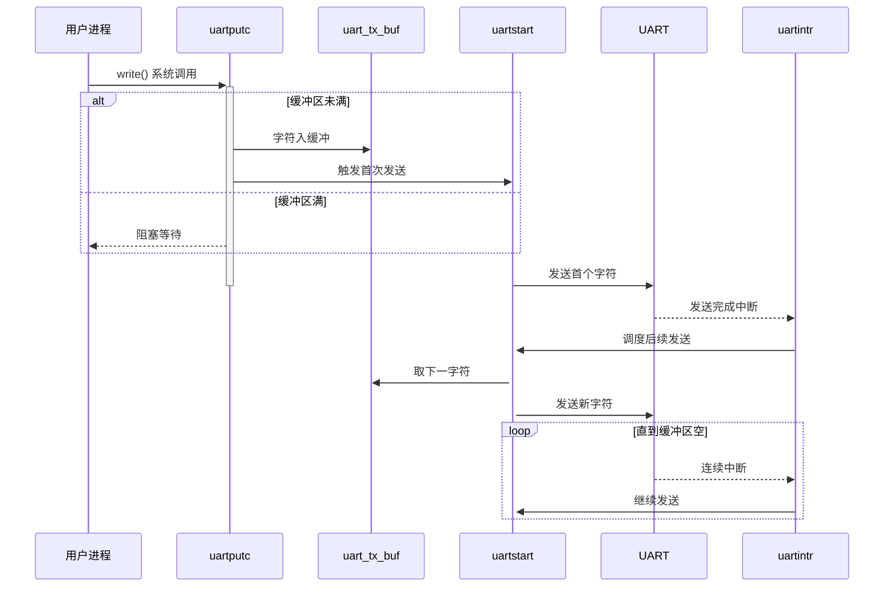
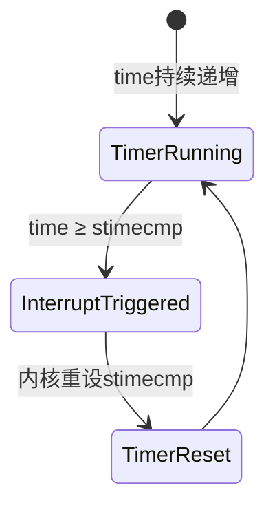
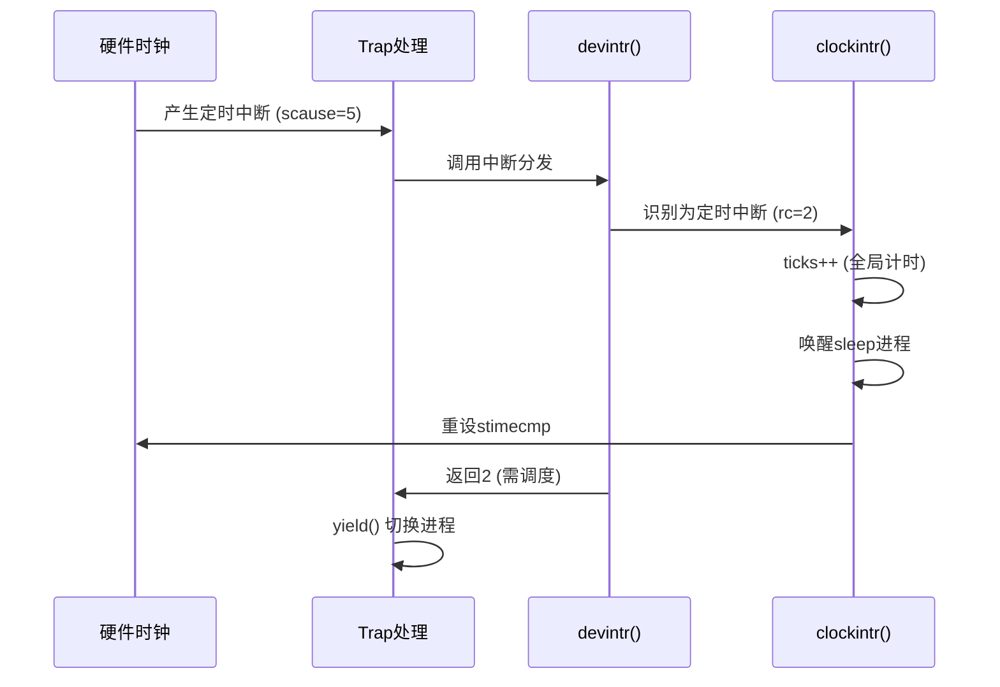

本文主要整理Chapter 5 Interrupts and device drivers的要点。

## 5.0 前言

### **核心内容概述**
本章描述了**操作系统设备驱动**的核心机制，重点围绕其**架构设计**、**中断处理**与**并发管理**展开。主要包括：
1. 驱动程序的**定义与功能**：驱动是管理特定设备的操作系统代码，负责硬件配置、指令发送、中断处理和进程交互。  
2. **中断驱动的协作模型**：设备通过中断（一种陷阱）请求系统处理，内核调用驱动的中断处理程序响应。  
3. **双层驱动架构（Top/Bottom Half）**：驱动程序分为**顶层（进程上下文）**与**底层（中断上下文）**两部分，协作完成异步I/O操作。

---

### **关键要点总结**
1. **驱动程序的核心职责**  
   - 硬件初始化与配置（如设定设备寄存器）。  
   - 向设备发送操作指令（如命令磁盘读取数据块）。  
   - 处理设备触发的中断事件。  
   - 与等待I/O结果的进程进行交互（唤醒/阻塞进程）。  

2. **中断机制的核心作用**  
   - 设备通过硬件中断主动通知操作系统（`devintr`函数在xv6中实现分发）。  
   - 中断属于**陷阱（trap）**的子类，由硬件触发后转交内核处理。  

3. **双层驱动架构的设计逻辑**  
   | **层级**       | **执行上下文**       | **主要行为**                                |  
   |---------------|-------------------|-------------------------------------------|  
   | **Top Half**  | 进程的内核线程         | - 通过系统调用（如`read/write`）接收用户请求。<br>- 启动设备操作（如发送磁盘读取指令）。<br>- **主动等待操作完成**（可能阻塞进程）。 |  
   | **Bottom Half** | 中断处理上下文         | - 在设备中断触发时运行。<br>- 识别已完成的操作。<br>- **唤醒等待该操作的进程**。<br>- 启动下一个等待中的设备操作。 |  

4. **驱动程序开发的关键挑战**  
   - **并发性问题**：驱动需协调设备硬件（异步操作）与进程（同步请求）的并发执行。  
   - **硬件复杂性**：设备接口常涉及复杂、非标准化的寄存器操作，且文档往往不足。  
   - **时序敏感性**：中断处理要求快速响应，避免阻塞系统。  

---

### **核心流程提炼（以I/O操作示例）**
1. **用户进程**通过系统调用（如`read`）进入驱动**Top Half**。  
2. **Top Half**向设备发送指令（如“读取磁盘块”），**进程进入休眠等待状态**。  
3. 设备完成操作后触发**中断**，内核调用驱动**Bottom Half**。  
4. **Bottom Half**：  
   - 确认操作结果（如“磁盘读取成功”）。  
   - **唤醒休眠的用户进程**。  
   - 若存在待处理任务，启动下一项操作。  

> 此模型通过分离**请求发起**（Top Half）与**结果响应**（Bottom Half），实现用户进程的异步非阻塞调度，同时保证硬件高效运作。

## 5.1 Code: Console input

### **核心内容概述**  
xv6的**控制台驱动**通过UART硬件（QEMU模拟的16550芯片）实现用户输入处理。驱动接收用户键入的字符，处理特殊字符（如退格键），并以**行缓冲**方式供Shell等进程通过`read`系统调用读取。整个流程涉及**硬件交互**、**中断处理**与**进程同步**。

---

### **关键要点总结**  
#### **1. UART硬件工作原理**  
- **内存映射寄存器**：UART物理地址从`0x10000000`（`UART0`）开始（`kernel/memlayout.h:21`）。  
- **关键寄存器**：  
  - **`RHR`** (Receive Holding Register)：读取接收到的字节（读取后从硬件FIFO移除）。  
  - **`LSR`** (Line Status Register)：标识字符就绪状态（如FIFO非空时置位）。  
- **收发分离**：发送（写入`THR`寄存器）与接收（读取`RHR`寄存器）相互独立。  

#### **2. 初始化流程**  
- `consoleinit()`（`kernel/console.c:182`）配置UART：  
  - **启用接收中断**（每接收1字节触发中断）。  
  - **启用发送完成中断**（每发送1字节触发中断）。  
- **中断绑定**：通过`PLIC`（中断仲裁器）关联UART中断与处理函数。  

```c
void
uartinit(void)
{
  // disable interrupts.
  WriteReg(IER, 0x00);

  // special mode to set baud rate.
  WriteReg(LCR, LCR_BAUD_LATCH);

  // LSB for baud rate of 38.4K.
  WriteReg(0, 0x03);

  // MSB for baud rate of 38.4K.
  WriteReg(1, 0x00);

  // leave set-baud mode,
  // and set word length to 8 bits, no parity.
  WriteReg(LCR, LCR_EIGHT_BITS);

  // reset and enable FIFOs.
  WriteReg(FCR, FCR_FIFO_ENABLE | FCR_FIFO_CLEAR);

  // enable transmit and receive interrupts.
  WriteReg(IER, IER_TX_ENABLE | IER_RX_ENABLE);

  initlock(&uart_tx_lock, "uart");
}
``` 

1. **安全初始化**  
   - 先禁止中断 → 避免配置过程被干扰
2. **波特率设置**  
   - 进入特殊模式 → 写入分频系数 → 退出特殊模式  
   - *38.4K baud 是串口通信标准速率*
3. **通信协议配置**  
   - 设置 8N1 格式：8位数据/无校验/1位停止位（最常见配置）
4. **硬件缓冲区启用**  
   - 打开硬件 FIFO 并清空残留数据 → 避免旧数据干扰
5. **中断机制激活**  
   - 使能接收中断（核心）和发送中断（可选）  
   - *接收中断驱动控制台输入*
6. **并发保护**  
   - 初始化自旋锁 `uart_tx_lock` → 保护发送操作的原子性（后续 `uartputc()` 使用


#### **3. 输入数据流**  
**流程闭环：用户键入 → 硬件中断 → 行缓冲 → 进程唤醒**  
1. **用户键入字符**：UART硬件接收字节后触发**接收中断**。  
2. **中断响应**：  
   - Trap handler → `devintr()`（`kernel/trap.c:185`）确认中断源。  
   - PLIC判定为UART中断 → 调用`uartintr()`（`kernel/uart.c:177`）。  
3. **字符处理**：  
   - `uartintr()`读取`RHR`获取字符 → 提交给`consoleintr()`（`kernel/console.c:136`）。  
   - `consoleintr()`进行行缓冲（`cons.buf`）并处理特殊字符（如退格删除整行）。  
4. **行唤醒条件**：  
   - 当收到`换行符`时，唤醒等待中的`consoleread()`进程。  

```c
void
consoleintr(int c)
{
  acquire(&cons.lock);

  switch(c){
  case C('P'):  // Ctrl+P: 打印进程列表
    procdump(); // 调用内核进程信息打印函数
    break;
  case C('U'):  // Ctrl+U: 删除整行
    // 从当前编辑位置回退到行首（或上一个换行符）
    while(cons.e != cons.w &&
          cons.buf[(cons.e-1) % INPUT_BUF_SIZE] != '\n'){
      cons.e--;            // 回退编辑位置
      consputc(BACKSPACE); // 向终端输出退格控制序列
    }
    break;
  case C('H'): // Backspace
  case '\x7f': // Delete key
    if(cons.e != cons.w){
      cons.e--;             // 回退编辑位置
      consputc(BACKSPACE);  // 输出退格序列（视觉删除）
    }
    break;
  default:
    // 仅处理非空字符且缓冲区未满的情况
    if(c != 0 && cons.e-cons.r < INPUT_BUF_SIZE){
      // 将回车(CR, '\r')转换为换行(LF, '\n')
      c = (c == '\r') ? '\n' : c;

      // 回显字符到终端 (用户实时看到输入)
      consputc(c);

      // 存储字符到环形缓冲区
      cons.buf[cons.e++ % INPUT_BUF_SIZE] = c;

      // 1. 用户按下回车
      // 2. 用户按下Ctrl+D (EOF)
      // 3. 缓冲区已满
      if(c == '\n' || c == C('D') || cons.e-cons.r == INPUT_BUF_SIZE){
        // 标记"已准备好"的数据结束位置
        cons.w = cons.e;

        // 唤醒阻塞在consoleread()的进程
        wakeup(&cons.r);
      }
    }
    break;
  }
  
  release(&cons.lock);
}
``` 


#### **4. 用户进程读取流程**  
- **系统调用入口**：Shell等进程通过`read()`调用 → `consoleread()`（`kernel/console.c:80`）。  
- **阻塞等待**：  
  - 若`cons.buf`中无完整行，进程在`sleep()`中阻塞（`kernel/console.c:96`）。  
  - 被唤醒时（即换行符触发），拷贝`cons.buf`整行数据至用户空间并返回。  

```c
int
consoleread(int user_dst, uint64 dst, int n)
{
  uint target;
  int c;
  char cbuf;

  target = n;
  acquire(&cons.lock);
  while(n > 0){
    // 等待中断处理程序放入数据
    // 缓冲区为空
    while(cons.r == cons.w){
      // 检查进程是否被杀死
      if(killed(myproc())){
        release(&cons.lock);
        return -1;
      }
      sleep(&cons.r, &cons.lock); // ⭐ 关键阻塞点
    }
    // 从环形缓冲区取字符
    c = cons.buf[cons.r++ % INPUT_BUF_SIZE];

    // EOF处理 (Ctrl+D)
    // ^D（Ctrl+D）字符保留在缓冲区中的作用是​​精确实现 EOF（End-of-File）的 POSIX 标准语义
    // 保留 ^D 在缓冲区中正是为了实现 ​​"部分输入+^D" 场景的第二次返回 0 字节​​。
    if(c == C('D')){  // end-of-file
      if(n < target){
        // Save ^D for next time, to make sure
        // caller gets a 0-byte result.
        cons.r--;
      }
      break;
    }

    // copy the input byte to the user-space buffer.
    cbuf = c;
    if(either_copyout(user_dst, dst, &cbuf, 1) == -1)
      break;

    dst++;
    --n;

    if(c == '\n'){
      // a whole line has arrived, return to
      // the user-level read().
      break;
    }
  }
  release(&cons.lock);

  return target - n;
}
``` 

#### **5. 核心设计亮点**  
- **中断驱动异步处理**：  
  - UART接收/发送均通过中断通知CPU，**避免轮询开销**。  
- **行缓冲抽象**：  
  - 控制台驱动屏蔽底层硬件细节，向进程提供面向行的输入接口。  
- **进程同步机制**：  
  - `sleep()`/`wakeup()`模型协调慢速I/O与进程调度，确保无忙等待。  

---

### **关键组件交互图**  
```plaintext
用户按键 → UART接收中断 → PLIC仲裁 → uartintr()  
                                ↓  
                       consoleintr() → 行缓冲(cons.buf)  
                                ↓  
                      (换行符到达) → wakeup()  
                                ↓  
consoleread()阻塞进程 → 被唤醒 → 拷贝行数据至用户空间  
```  

---  
### **总结**  
xv6控制台驱动通过UART硬件中断实现高效输入处理：  
1. **硬件层**：内存映射寄存器直接操控UART。  
2. **中断层**：响应接收中断，即时获取字符并转发行处理。  
3. **软件层**：行缓冲封装、特殊字符处理、进程唤醒协同工作。  
该设计以最小开销实现**行式输入抽象**，是驱动分层（Top/Bottom Half）模型的典型实践。

## 5.2 Code: Console output

### **核心内容概述**  
xv6 的控制台输出驱动通过 **UART 发送缓冲区 + 中断驱动机制**，实现了**进程与设备操作的完全解耦**。核心设计包括：
- **异步写入模型**：进程写入缓冲区后立即返回，无需等待硬件操作
- **中断驱动传输**：UART 发送完成中断自动触发后续数据发送
- **双组件协作**：`uartputc()` 处理写入请求，`uartstart()` 处理硬件交互

---

### **关键要点总结**

#### **1. 核心组件与功能**
| **组件**         | **作用**                                                                 |
|------------------|--------------------------------------------------------------------------|
| **输出缓冲区**     | `uart_tx_buf` (环形缓冲区) 存储待发送字符                                |
| **uartputc()**   | 用户写入入口：<br>- 字符入缓冲区<br>- 启动首次传输<br>- 仅缓冲区满时阻塞 |
| **uartstart()**  | 硬件交互层：<br>- 检查设备状态(LSR_TX_IDLE)<br>- 从缓冲区取字符发送      |
| **uartintr()**   | 中断处理：<br>- 响应发送完成中断<br>- 调用 uartstart() 继续发送          |

#### **2. 工作流程**


#### **3. 并发传输机制**
- **首字符同步启动**：
  ```c
  // uartputc() 中
  uartstart();  // 主动启动硬件
  ```
- **后续字符中断驱动**：
  ```c
  // uartintr() 中
  if(ReadReg(LSR) & LSR_TX_IDLE) {
      uartstart();  // 中断触发续传
  }
  ```

```c
void
uartstart()
{
  while(1){
    // 条件1: 检查缓冲区是否为空
    if(uart_tx_w == uart_tx_r){
      // 读取ISR清除潜在中断标志
      ReadReg(ISR);
      return;
    }
    // 条件2: 检查设备是否就绪
    if((ReadReg(LSR) & LSR_TX_IDLE) == 0){
      // the UART transmit holding register is full,
      // so we cannot give it another byte.
      // it will interrupt when it's ready for a new byte.
      return;
    }
    
    int c = uart_tx_buf[uart_tx_r % UART_TX_BUF_SIZE];
    uart_tx_r += 1;
    
    // 唤醒可能阻塞的写入进程 ⚡ 关键优化点
    wakeup(&uart_tx_r);
    
    WriteReg(THR, c);
  }
}
```

#### **4. 设计亮点：I/O 并发**
- **进程与设备并行**：
  - 进程写入缓冲区后立即继续执行
  - UART 硬件独立进行字符发送
- **性能优势**：
  | **场景**                | **传统模式**         | **xv6 并发模式**       |
  |------------------------|--------------------|----------------------|
  | 单进程发送多字符         | 顺序等待每次发送     | 仅首次等待，后续异步    |
  | 多进程同时写入           | 串行阻塞             | 并发写入缓冲区         |
- **必要性体现**：
  - **慢速设备**：UART 波特率低（38.4Kbps），发送1字节需 ≈260μs
  - **即时响应**：如输入回显需立即显示键入字符

#### **5. 阻塞边界条件**
唯一阻塞点：
```c
// uartputc() 中
while(tx_w == tx_r + UART_TX_BUF_SIZE) {
    // 缓冲区满时休眠
    sleep(&tx_r, &uart_tx_lock);
}
```
- 唤醒机制：发送完成中断中调用 `wakeup(&tx_r)`

---

### **关键数据结构**
```c
// 环形缓冲区管理
struct {
  struct spinlock lock;
  char buf[UART_TX_BUF_SIZE];
  int tx_w;  // 写指针 (新数据位置)
  int tx_r;  // 读指针 (待发送位置)
} uart_tx;
```

---

### **设计价值总结**
1. **解耦哲学**  
   通过**缓冲层**隔离：
   - 上层的进程调度（纳秒级）
   - 底层的硬件操作（毫秒级）

2. **性能优化**  
   - 避免 99% 的进程等待时间（CPU 时间片 ≈100ms vs UART 发送 ≈0.26ms/字符）
   - 合并多次小写入为单次大传输

3. **实时性保障**  
   - 中断响应保证发送连续性
   - 输入回显即时显示（否则用户会感知卡顿）

4. **资源利用率**  
   - 进程休眠时释放 CPU
   - 硬件闲置时自动停止中断处理

> 此设计是操作系统设备驱动的**黄金范式**，被广泛用于网络、磁盘等高性能 I/O 系统，现代 NVMe 固态硬盘的队列机制正是此思想的演进形态。

## 5.4 Timer interrupts

xv6 使用 RISC-V 的定时器中断实现两大核心功能：
1. **系统时间维护**：跟踪物理时间流逝
2. **进程调度切换**：强制剥夺 CPU 进行进程轮转

### **关键要点总结**

#### **1. 硬件基础**
| **组件**          | **作用**                                                                 |
|-------------------|--------------------------------------------------------------------------|
| **时钟硬件**       | 每个 CPU 核心独立配备的计时器                                             |
| **time 寄存器**    | 只读寄存器，硬件自动递增 (≈QEMU 1千万次/秒)                                |
| **stimecmp 寄存器**| 比较寄存器，当 time ≥ stimecmp 时触发中断                                 |

#### **2. 初始化配置** (`start.c:53`)
```c
// kernel/start.c
void start() {
  w_mtvec((uint64)timervec);  // 设置中断向量
  uint64 now = r_time();       // 获取当前时间
  w_sie(r_sie() | SIE_STIE);   // 使能定时器中断
  w_stimecmp(now + INTERVAL);  // 首次设置触发时间
}
```
- **时间单位**：1,000,000 tick ≈ 0.1秒 (QEMU 默认)
- **首次间隔**：`INTERVAL` 对应进程调度时间片

#### **3. 中断触发机制**


#### **4. 中断处理流程**


#### **5. 核心处理函数** (`trap.c:164`)
```c
// kernel/trap.c
void clockintr() {
  acquire(&tickslock);
  ticks++;                   // 全局时间基
  wakeup(&ticks);            // 唤醒定时相关进程
  if(cpuid() == 0) {         // 仅BSP核处理
    set_next_timer();        // 重设计时器
  }
  release(&tickslock);
}

static void set_next_timer() {
  uint64 next = r_time() + INTERVAL;
  w_stimecmp(next);          // 安排下次中断
}

void 
kerneltrap()
{
  // ...

  // give up the CPU if this is a timer interrupt.
  if(which_dev == 2 && myproc() != 0)
    yield();

  // ...
}
```

#### **6. 调度触发机制**
- `devintr()` 返回 **2** ：表示需要进程调度
- `usertrap/kerneltrap` 随后调用 `yield()`

#### **7. 关键设计挑战**
1. **状态保护**  
   ```c
   // usertrap 入口
   sepc = r_sepc(); // 必须在中斷前保存
   ```
2. **跨核同步**  
   - `ticks` 仅由引导核 (BSP) 更新  
   - 用 `tickslock` 保护全局变量

3. **移动感知**  
   内核代码需假设随时被迁移到不同 CPU  
   (如中断后 `yield()` 可能调度到其他核)

#### **8. 性能影响**
| **场景**       | **时间粒度** | **中断频率** | **影响**                   |
|---------------|-------------|-------------|---------------------------|
| QEMU 标准配置  | 10ms         | 100Hz       | 调度响应快，开销约1-3% CPU |
| 真实硬件        | 1-4ms       | 250-1000Hz  | 可配置，兼顾响应和吞吐     |

---

### **工作原理解析**
#### **定时器中断的独特性质**
1. **异步剥夺**  
   随时强制打断运行中的代码（用户态/内核态）
2. **无设备关联**  
   直接由 CPU 时间管理单元触发，不经过 PLIC
3. **跨核独立性**  
   每个 CPU 有独立定时器，需分别配置

#### **进程调度触发链**
```python
# 伪代码流程
def timer_handler():
    if current_cpu == boot_cpu:  # 仅引导核更新时间
        global_ticks += 1
        reset_timer()            # 设置下次中断
        
    wakeup_sleeping_processes()  # 唤醒sleep进程
    return NEED_SCHEDULE         # 特殊返回码2
    
def trap_dispatcher():
    if devintr() == 2:           # 定时器返回2
        yield()                  # 主动让出CPU
```

#### **时间漂移防护**
- **单调递增**：`time` 寄存器永不回绕
- **原子更新**：引导核独占更新 `ticks`
- **延迟补偿**：中断处理时间计入下一个周期
  ```c
  next = r_time() + INTERVAL; // 基于当前实时
  ```

---

### **设计价值总结**
1. **基础时序服务**  
   为 `sleep()/alarm()` 等系统调用提供支撑

2. **公平调度保障**  
   强制时间片轮转，防止进程饥饿

3. **系统健康基石**  
   看门狗机制可检测死循环/死锁

4. **性能可扩展**  
   多核独立计时，避免全局竞争

> xv6 的实现与 Linux 的 `tick_broadcast` 机制异曲同工，体现了操作系统时间管理的本质：**用硬件中断驱动软件调度，以时间流逝换取空间并行**。