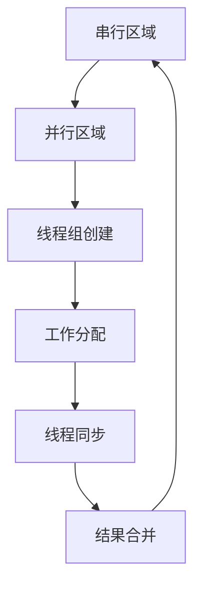

本文主要整理真实世界的并发编程章节的要点。

## 一、OpenMP基本使用

OpenMP 是用于共享内存并行编程的行业标准 API，通过编译器指令实现并行化。它提供了简单高效的方式来利用多核处理器性能，无需复杂的线程管理。

### 1. 核心概念



### 2. 环境配置

#### 编译器支持
| 编译器 | 启用选项       | 检查版本        |
|--------|----------------|-----------------|
| GCC    | `-fopenmp`     | `gcc --version` |
| Clang  | `-fopenmp`     | `clang --version`|
| MSVC   | `/openmp`      | `cl /?`         |

#### 编译运行
```bash
# Linux/macOS
g++ -fopenmp program.cpp -o program
./program

# Windows
cl /openmp program.cpp
program.exe
```

### 3. 基础指令

#### 3.1. 并行区域 (`parallel`)
```cpp
#include <omp.h>
#include <iostream>

int main() {
    #pragma omp parallel
    {
        int thread_id = omp_get_thread_num();
        int total_threads = omp_get_num_threads();
        std::cout << "Thread " << thread_id << " of " << total_threads << "\n";
    }
    return 0;
}
```

**控制线程数**：
```cpp
// 方法1：环境变量
export OMP_NUM_THREADS=4

// 方法2：代码设置
omp_set_num_threads(4);
```

#### 3.2. 并行循环 (`parallel for`)
```cpp
#include <vector>
#include <iostream>
#include <omp.h>

int main() {
    const int N = 100;
    std::vector<int> data(N, 0);
    
    #pragma omp parallel for
    for (int i = 0; i < N; i++) {
        data[i] = omp_get_thread_num(); // 记录执行线程
    }
    
    // 验证并行执行
    for (int i = 0; i < 10; i++) {
        std::cout << data[i] << " ";
    }
    return 0;
}
```

### 4. 数据共享属性

| 子句       | 描述                          | 示例                     |
|------------|-------------------------------|--------------------------|
| `shared`   | 变量在所有线程间共享          | `shared(counter)`        |
| `private`  | 每个线程有独立副本            | `private(temp)`          |
| `firstprivate` | 私有变量继承初始值          | `firstprivate(seed)`     |
| `lastprivate` | 最后迭代值赋给原始变量      | `lastprivate(result)`    |
| `reduction` | 并行聚合操作                | `reduction(+:sum)`       |

#### 归约示例
```cpp
#include <iostream>
#include <omp.h>

int main() {
    const int N = 1000000;
    double sum = 0.0;
    
    #pragma omp parallel for reduction(+:sum)
    for (int i = 1; i <= N; i++) {
        sum += 1.0 / i; // 计算调和级数
    }
    
    std::cout << "Sum: " << sum << std::endl;
    return 0;
}
```

### 5. 同步机制

#### 5.1. 临界区 (`critical`)
```cpp
#include <iostream>
#include <omp.h>

int main() {
    int counter = 0;
    
    #pragma omp parallel
    {
        #pragma omp critical
        {
            counter++; // 安全递增
            std::cout << "Thread " << omp_get_thread_num() 
                      << " increments to " << counter << "\n";
        }
    }
    
    std::cout << "Final counter: " << counter << std::endl;
    return 0;
}
```

#### 5.2. 原子操作 (`atomic`)
```cpp
#include <omp.h>

int main() {
    int counter = 0;
    
    #pragma omp parallel
    {
        #pragma omp atomic
        counter++; // 高效原子操作
    }
    
    return 0;
}
```

#### 5.3. 屏障同步 (`barrier`)
```cpp
#pragma omp parallel
{
    // 阶段1
    do_work_part1();
    
    #pragma omp barrier
    
    // 阶段2 (所有线程完成阶段1后开始)
    do_work_part2();
}
```

### 6. 高级工作分配

#### 6.1. 任务分配 (`sections`)
```cpp
#include <iostream>
#include <omp.h>

int main() {
    #pragma omp parallel sections
    {
        #pragma omp section
        {
            std::cout << "Section 1 by thread " 
                      << omp_get_thread_num() << "\n";
        }
        
        #pragma omp section
        {
            std::cout << "Section 2 by thread " 
                      << omp_get_thread_num() << "\n";
        }
        
        #pragma omp section
        {
            std::cout << "Section 3 by thread " 
                      << omp_get_thread_num() << "\n";
        }
    }
    return 0;
}
```

#### 6.2. 单次执行 (`single`)
```cpp
#pragma omp parallel
{
    do_work();
    
    #pragma omp single
    {
        std::cout << "This runs once (thread " 
                  << omp_get_thread_num() << ")\n";
    }
    
    do_more_work();
}
```

#### 6.3. 主线程执行 (`master`)
```cpp
#pragma omp parallel
{
    do_work();
    
    #pragma omp master
    {
        std::cout << "Master thread: " 
                  << omp_get_thread_num() << "\n";
    }
}
```

### 7. 调度策略

| 策略         | 描述                     | 适用场景               |
|--------------|--------------------------|------------------------|
| `static`     | 编译时分配               | 均匀负载循环           |
| `dynamic`    | 运行时动态分配           | 不均匀负载             |
| `guided`     | 大块开始，逐渐减小       | 负载递减               |
| `auto`       | 编译器决定               | 通用场景               |
| `runtime`    | 运行时通过环境变量指定   | 灵活配置               |

```cpp
#pragma omp parallel for schedule(dynamic, 10)
for (int i = 0; i < N; i++) {
    process_item(i); // 处理时间不定的任务
}
```

### 8. 性能优化技巧

#### 8.1. 避免伪共享
```cpp
struct alignas(64) Data { // 64字节缓存行对齐
    int value;
    char padding[60];     // 填充避免伪共享
};

Data thread_data[omp_get_max_threads()];

#pragma omp parallel
{
    int tid = omp_get_thread_num();
    thread_data[tid].value = compute_value();
}
```

#### 8.2. 循环嵌套优化
```cpp
// 并行外层循环
#pragma omp parallel for collapse(2)
for (int i = 0; i < M; i++) {
    for (int j = 0; j < N; j++) {
        matrix[i][j] = i * j;
    }
}
```

#### 8.3. 异步任务
```cpp
#pragma omp parallel
{
    #pragma omp single nowait
    {
        #pragma omp task
        { process_data_chunk(0); }
        
        #pragma omp task
        { process_data_chunk(1); }
        
        #pragma omp task
        { process_data_chunk(2); }
    }
    
    #pragma omp taskwait // 等待所有任务完成
}
```

### 9. 调试与性能分析

#### 9.1. 线程绑定
```bash
# 绑定线程到物理核心
export OMP_PROC_BIND=true
export OMP_PLACES=cores
```

#### 9.2. 性能分析工具
| 工具         | 用途                   | 命令                  |
|--------------|------------------------|-----------------------|
| **perf**     | Linux性能计数器        | `perf stat ./program` |
| **Intel VTune** | 深度性能分析        | `vtune -collect hotspots ./program` |
| **LLPC**     | OpenMP运行时分析       | `export LIBOMPTARGET_PLUGIN_PROFILE=T` |

#### 9.3. 调试环境变量
```bash
# 显示执行信息
export OMP_DISPLAY_ENV=true

# 调试负载平衡
export OMP_SCHEDULE="dynamic,1"
export OMP_DYNAMIC=true
```

### 10. 完整示例：并行矩阵乘法

```cpp
#include <iostream>
#include <vector>
#include <chrono>
#include <omp.h>

void matrix_multiply(const std::vector<std::vector<double>>& A,
                     const std::vector<std::vector<double>>& B,
                     std::vector<std::vector<double>>& C) {
    int n = A.size();
    
    #pragma omp parallel for collapse(2) schedule(static)
    for (int i = 0; i < n; i++) {
        for (int j = 0; j < n; j++) {
            double sum = 0.0;
            for (int k = 0; k < n; k++) {
                sum += A[i][k] * B[k][j];
            }
            C[i][j] = sum;
        }
    }
}

int main() {
    const int N = 512; // 矩阵大小
    std::vector<std::vector<double>> A(N, std::vector<double>(N, 1.0));
    std::vector<std::vector<double>> B(N, std::vector<double>(N, 2.0));
    std::vector<std::vector<double>> C(N, std::vector<double>(N, 0.0));
    
    auto start = std::chrono::high_resolution_clock::now();
    
    matrix_multiply(A, B, C);
    
    auto end = std::chrono::high_resolution_clock::now();
    std::chrono::duration<double> elapsed = end - start;
    
    std::cout << "Matrix multiplication time: " 
              << elapsed.count() << " seconds\n";
    
    // 验证结果 (左上角元素)
    std::cout << "C[0][0] = " << C[0][0] << " (expected: " 
              << N * 1.0 * 2.0 << ")\n";
    
    return 0;
}
```

### 11. OpenMP 4.0+ 高级特性

#### 11.1. 向量化支持 (`simd`)
```cpp
#pragma omp simd reduction(+:sum)
for (int i = 0; i < N; i++) {
    sum += data[i];
}
```

#### 11.2. 加速器卸载 (`target`)
```cpp
#pragma omp target teams distribute parallel for map(to:A,B) map(from:C)
for (int i = 0; i < N; i++) {
    C[i] = A[i] + B[i]; // 在GPU上执行
}
```

#### 11.3. 任务依赖
```cpp
#pragma omp parallel
#pragma omp single
{
    #pragma omp task depend(out: A)
    { compute_A(); }
    
    #pragma omp task depend(out: B)
    { compute_B(); }
    
    #pragma omp task depend(in: A, B)
    { combine_results(); }
}
```

### 12. 最佳实践总结

1. **渐进并行化**：
   ```mermaid
   graph LR
       S[串行正确实现] --> P[并行外层循环]
       P --> O[优化数据局部性]
       O --> T[任务并行化]
       T --> A[加速器卸载]
   ```

2. **避免过度并行**：
   - 并行开销 > 收益时保持串行
   - 小循环使用 `#pragma omp simd` 而非完整并行

3. **负载平衡优先**：
   - 首选 `schedule(dynamic)` 应对不规则负载
   - 使用 `collapse` 处理嵌套循环

4. **内存优化**：
   - 最大化缓存利用率
   - 使用 `firstprivate` 减少共享访问

5. **工具辅助**：
   ```bash
   # 检测数据竞争
   g++ -fopenmp -fsanitize=thread program.cpp
   ```

6. **可移植性**：
   - 使用 `_OPENMP` 宏进行条件编译
   ```cpp
   #ifdef _OPENMP
   #include <omp.h>
   #endif
   ```

OpenMP 提供了从简单循环并行到复杂任务并行的完整解决方案。掌握其核心概念和最佳实践，可以高效利用多核处理器性能，同时保持代码简洁和可维护性。

## 二、Perf基本使用

### **1. 常用命令**
#### **(1) `perf list`**
查看支持的事件（硬件/软件/跟踪点）：
```bash
perf list
```

#### **(2) `perf stat`**
统计命令执行的性能事件（如 CPU 缓存命中率、上下文切换等）：
```bash
# 分析命令
perf stat ls

# 指定事件（如缓存未命中）
perf stat -e cache-misses,instructions ls

# 持续监控进程（PID）
perf stat -p <PID>
```

#### **(3) `perf top`**
实时监控系统性能（类似 `top`，但显示函数级开销）：
```bash
sudo perf top
```

#### **(4) `perf record` & `perf report`**
- **采样记录**（生成 `perf.data`）：
  ```bash
  # 监控整个系统
  sudo perf record -ag -- sleep 10

  # 监控指定进程
  perf record -p <PID> -g  # -g 启用调用图
  ```
- **生成报告**：
  ```bash
  perf report  # 文本模式
  perf report --stdio  # 详细输出
  ```

#### **(5) `perf script`**
导出采样数据（用于生成火焰图）：
```bash
perf script > perf.script
```

---

### **2. 高级用法**
#### **(1) 火焰图生成**
1. 采样数据：
   ```bash
   perf record -F 99 -a -g -- sleep 30
   ```
2. 导出并生成火焰图：
   ```bash
   perf script | stackcollapse-perf.pl | flamegraph.pl > perf.svg
   ```
   > 需先安装 [FlameGraph](https://github.com/brendangregg/FlameGraph)。

#### **(2) 指定事件分析**
- **统计 CPU 迁移事件**：
  ```bash
  perf stat -e sched:sched_migrate_task
  ```
- **跟踪点事件**：
  ```bash
  perf record -e sched:sched_switch -a
  ```

#### **(3) 进程/线程分析**
```bash
# 监控线程
perf top -t <TID>

# 对比父子进程
perf record -e instructions --fork ./my_program
```

---

### **3. 关键选项**
| 选项 | 作用 |
|------|------|
| `-a` | 监控所有 CPU |
| `-g` | 记录调用栈（堆栈回溯） |
| `-F N` | 采样频率（Hz） |
| `-p PID` | 监控指定进程 |
| `-e EVENT` | 指定性能事件 |
| `-C CORE` | 监控指定 CPU 核心 |

---

### **4. 示例场景**
#### **分析 CPU 使用率高的进程**
```bash
# 1. 找到高 CPU 进程 PID
top

# 2. 采样 10 秒
perf record -F 99 -p <PID> -g -- sleep 10

# 3. 生成报告
perf report --stdio
```

#### **定位代码热点**
```bash
# 记录执行过程
perf record -g ./my_program

# 查看热点函数
perf report --sort comm,dso,symbol
```

---

### **5. 常见问题**
- **权限问题**：使用 `sudo` 或调整 `/proc/sys/kernel/perf_event_paranoid` 值（设为 `-1` 可禁用限制）。
- **符号缺失**：安装调试符号包（如 `dbgsym` 或 `debuginfo`）。
- **调用图不全**：确保编译时使用 `-fno-omit-frame-pointer` 和 `-g` 选项。

通过 `perf`，您可以深入分析系统瓶颈，优化代码性能。更多信息参考 `man perf` 或 [Perf Wiki](https://perf.wiki.kernel.org)。

## 三、Perf查看IPC/CPI

### 使用 `perf` 查看 IPC 和 CPI

IPC（Instructions Per Cycle，每周期指令数）和 CPI（Cycles Per Instruction，每条指令周期数）是 CPU 性能分析的核心指标，**两者互为倒数关系（IPC = 1 / CPI）**。使用 `perf` 查看这些指标的方法如下：

---

### **1. 基础方法：`perf stat` 计算 IPC**
```bash
perf stat -e cycles,instructions <命令>
```
#### 输出示例：
```
 Performance counter stats for 'sleep 1':

         1,000,000      cycles                  
           800,000      instructions              #  0.80  insn per cycle

       1.001000000 seconds time elapsed
```
**IPC = instructions / cycles = 0.80**  
**CPI = cycles / instructions = 1.25**

---

### **2. 直接输出 IPC**
```bash
perf stat -e cycles,instructions --metric-only <命令>
```
#### 输出示例：
```
 IPC 
 0.80
```

---

### **3. 持续监控进程的 IPC**
```bash
# 监控进程（替换 <PID>）
perf stat -e cycles,instructions -p <PID> -- sleep 10
```

---

### **4. 分析系统全局 IPC**
```bash
sudo perf stat -e cycles,instructions -a -- sleep 5
```

---

### **5. 高级方法：事件公式**
```bash
# 直接计算 IPC 比率（某些 perf 版本支持）
perf stat -e 'instructions/cycles' <命令>
```

---

### **6. 火焰图 + IPC 关联分析**
1. 采样性能数据：
   ```bash
   perf record -e cycles,instructions -F 99 -ag -- sleep 30
   ```
2. 生成报告：
   ```bash
   perf report --stdio
   ```
   在报告中查找 **`insn per cycle`** 字段（或手动计算特定函数的 IPC）。

---

### **关键说明：**
1. **IPC 解读**：
   - **IPC > 1.0**：CPU 效率高（超标量架构可同时执行多条指令）
   - **IPC < 1.0**：存在停顿（如缓存未命中、分支预测错误）
2. **必要依赖**：
   ```bash
   sudo sh -c 'echo -1 > /proc/sys/kernel/perf_event_paranoid'  # 临时解除权限限制
   sudo apt-get install linux-tools-$(uname -r)                # 确保支持 events
   ```
3. **硬件要求**：
   - 需要 CPU 支持 `cycles` 和 `instructions` 硬件计数器（现代 CPU 均支持）

---

### **示例场景：优化高 CPI 函数**
```bash
# 1. 找到高 CPI 的函数
perf record -e cycles,instructions -g ./my_program
perf report --sort symbol,ipc -n

# 2. 输出示例
Overhead  Instructions  Cycles  IPC   Symbol
  60.12%    1,200,000  2,000,000 0.60  slow_function()
  20.05%      800,000    900,000 0.89  fast_function()
```
**结论**：`slow_function` 的 CPI=1.67（1/0.6），需要重点优化缓存或分支预测。

通过分析 IPC/CPI，您可以：
- 定位 CPU 效率瓶颈
- 区分内存瓶颈（低 IPC）与计算瓶颈（高 IPC 但整体慢）
- 验证优化效果（优化后 IPC 应上升）

## 四、SIMD指令集发展史

### 1. 什么是 SIMD？
**SIMD**（Single Instruction, Multiple Data）是一种**并行计算架构**，它允许一条指令同时处理多个数据元素。与传统 SISD（单指令单数据）相比，SIMD 能够显著提升数据密集型任务的处理效率。

#### 核心特点：
- **一条指令** 同时操作 **多个数据元素**
- 专为**数据级并行**设计
- 适用于向量/矩阵运算、多媒体处理等场景

---

### 2. SIMD 的工作原理
```ascii
        ┌───┬───┬───┬───┐  SIMD 寄存器（128/256/512 位）
数据输入:│ D1│ D2│ D3│ D4│
        └─┬─┴─┬─┴─┬─┴─┬─┘
          │   │   │   │
          ▼   ▼   ▼   ▼
     ┌───────────────────┐
     │  单条 SIMD 指令    │（例如：加法、乘法）
     └───────────────────┘
          │   │   │   │
          ▼   ▼   ▼   ▼
        ┌───┬───┬───┬───┐
结果输出:│ R1│ R2│ R3│ R4│
        └───┴───┴───┴───┘
```
*示例：一条加法指令同时完成 4 个数据的加法运算*

---

### 3. 主流 SIMD 指令集发展史
| 指令集 | 推出时间 | 位宽 | 主要特性 | 应用场景 |
|--------|----------|------|----------|----------|
| **MMX** | 1996 (Intel) | 64位 | 首个 x86 SIMD<br>8个64位寄存器 | 早期多媒体 |
| **SSE** | 1999 (Intel) | 128位 | 浮点支持<br>16个寄存器 | 图形处理 |
| **SSE2** | 2001 | 128位 | 整数扩展<br>兼容 x86-64 | 通用计算 |
| **SSE3/4** | 2004-2006 | 128位 | 水平运算<br>点积优化 | 视频编码 |
| **AVX** | 2011 | 256位 | 寄存器翻倍<br>三操作数指令 | 科学计算 |
| **AVX2** | 2013 | 256位 | FMA 指令<br>广播/收集 | 深度学习 |
| **AVX-512** | 2016 | 512位 | 掩码寄存器<br>压缩指令 | HPC/AI |
| **NEON** | ARM | 128位 | ARM 标准<br>16x128位寄存器 | 移动设备 |
| **SVE** | ARMv8 | 可变长 | 向量长度无关编程 | 超算 |

---

### 4. 关键技术特性
#### 4.1. **寄存器结构**
   - 专用 SIMD 寄存器（XMM/YMM/ZMM）
   - 支持多种数据类型：
     * 单精度浮点（float）
     * 双精度浮点（double）
     * 8/16/32/64 位整数
     * 特殊格式（bfloat16）

#### 4.2. **数据打包模式**
   ```c
   // AVX2 示例：同时处理 8 个 float
   __m256 vector = _mm256_set_ps(1.0, 2.0, 3.0, 4.0, 5.0, 6.0, 7.0, 8.0);
   ```

#### 4.3. **关键指令类型**
   | 指令类别 | 示例 | 作用 |
   |----------|------|------|
   | 算术运算 | `vpaddd` | 向量整数加 |
   | 融合乘加 | `vfmadd231ps` | a*b + c |
   | 数据重排 | `vperm2f128` | 寄存器重组 |
   | 比较操作 | `vcmpltps` | 逐元素比较 |
   | 掩码操作 | `kandw` | AVX-512 条件处理 |

#### 4.4. **自动向量化**
   编译器自动生成 SIMD 代码：
   ```cpp
   // C++ 循环自动向量化（启用 -O3 -mavx2）
   for (int i = 0; i < N; i+=8) {
     C[i:i+7] = A[i:i+7] + B[i:i+7]; 
   }
   ```

---

### 5. 编程实践
#### 5.1. 内联汇编（GCC）
```cpp
// AVX2 浮点加法
asm volatile (
  "vaddps %[c], %[a], %[b]" 
  : [c] "=x" (result) 
  : [a] "x" (vec1), [b] "x" (vec2)
);
```

#### 5.2. 使用 Intrinsics
```cpp
#include <immintrin.h>

void simd_add(float* a, float* b, float* c, int n) {
  for (int i = 0; i < n; i += 8) {
    __m256 va = _mm256_load_ps(a + i);
    __m256 vb = _mm256_load_ps(b + i);
    __m256 vc = _mm256_add_ps(va, vb);
    _mm256_store_ps(c + i, vc);
  }
}
```

#### 5.3. 自动向量化优化
编译选项：
```bash
gcc -O3 -march=native -ftree-vectorize -fopt-info-vec
```

