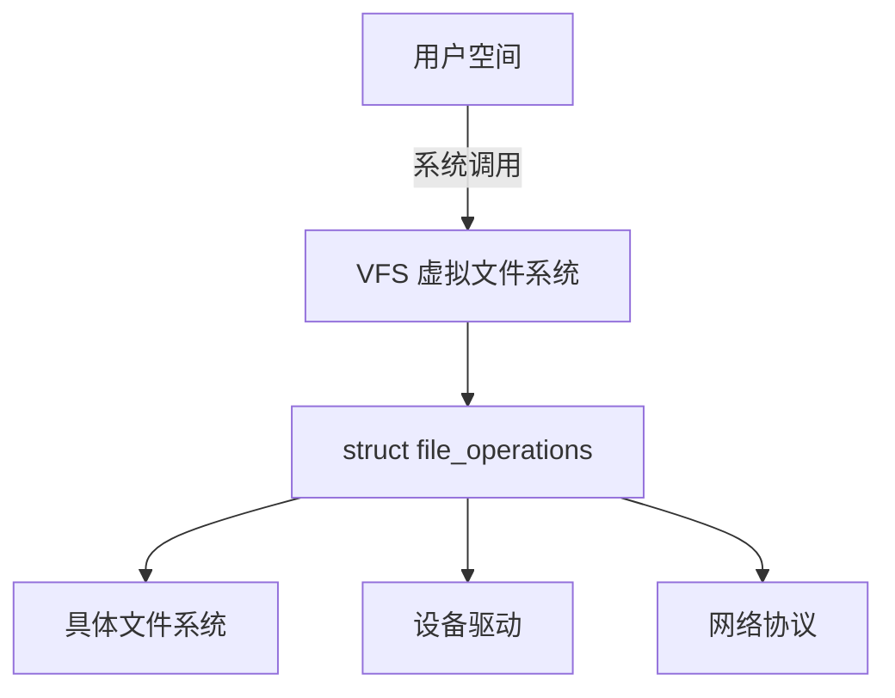
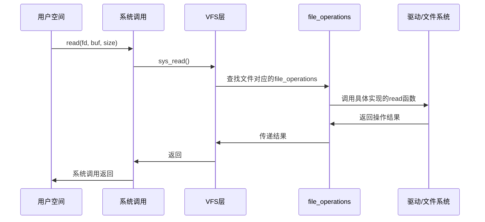
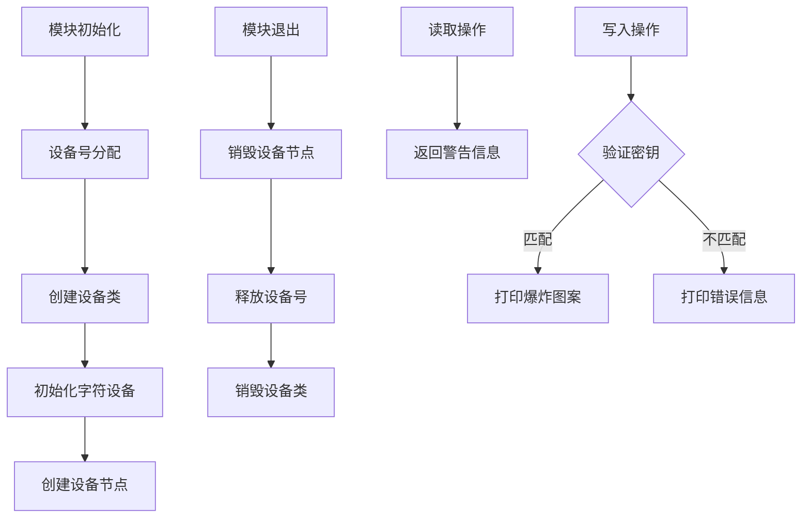
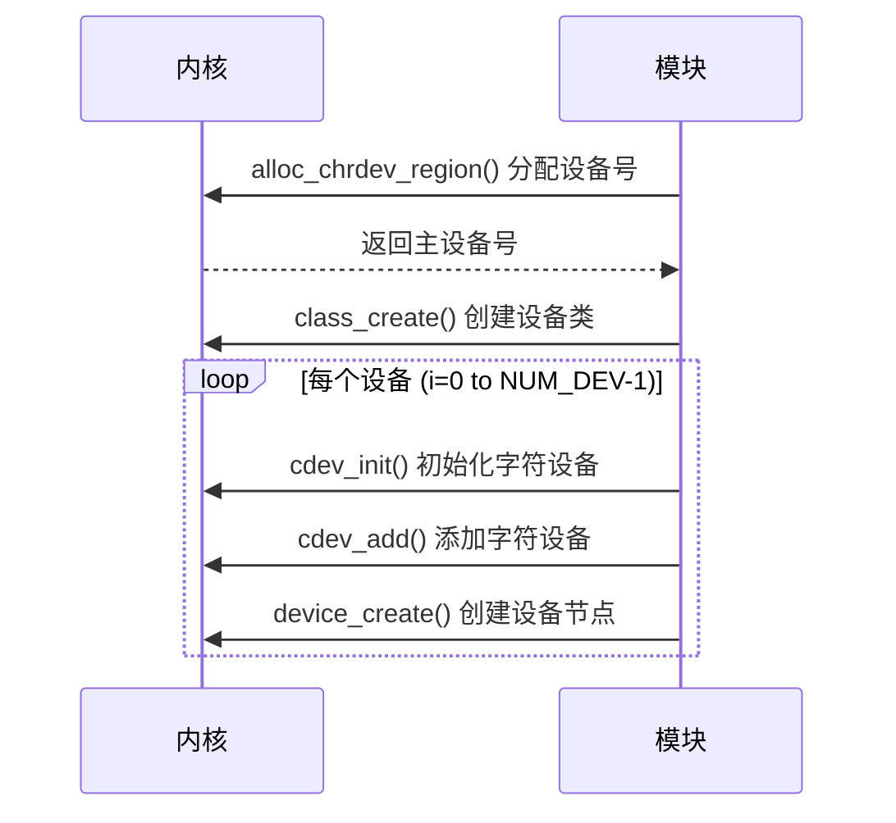
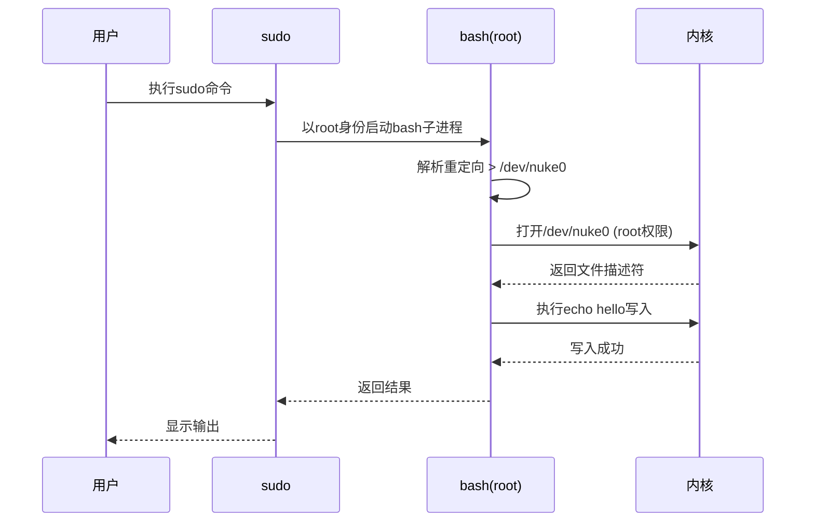
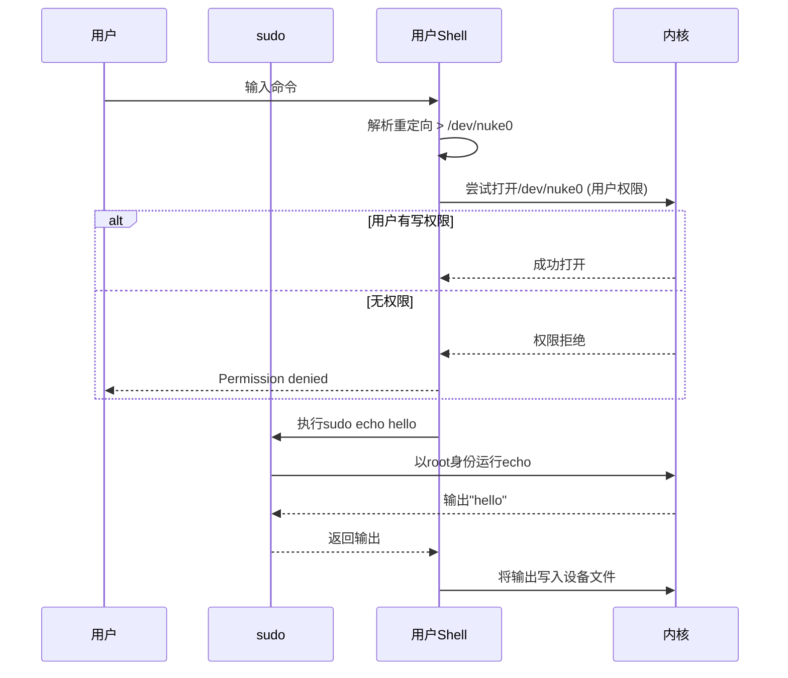
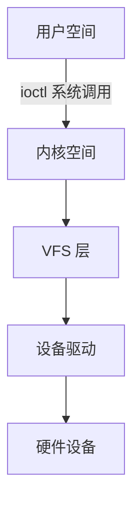

本文主要整理设备和驱动程序章节的要点。

## 一、struct file_operations深度解析

`struct file_operations` 是 Linux 内核中的**核心数据结构**，它定义了文件操作的方法集合，是 Linux "一切皆文件" 哲学的技术实现基石。这个结构体在 `<linux/fs.h>` 头文件中定义，包含了驱动开发者需要实现的一系列函数指针。

### 1. 核心作用与地位



- **抽象层**：统一所有文件/设备的操作接口
- **多态机制**：不同资源类型实现不同操作函数
- **驱动接口**：设备驱动程序的核心接入点

### 2. 结构体定义详解

```c
// 简化版结构体定义（基于 Linux 6.x）
struct file_operations {
    struct module *owner;
    loff_t (*llseek) (struct file *, loff_t, int);
    ssize_t (*read) (struct file *, char __user *, size_t, loff_t *);
    ssize_t (*write) (struct file *, const char __user *, size_t, loff_t *);
    int (*open) (struct inode *, struct file *);
    int (*release) (struct inode *, struct file *);
    unsigned int (*poll) (struct file *, struct poll_table_struct *);
    long (*unlocked_ioctl) (struct file *, unsigned int, unsigned long);
    long (*compat_ioctl) (struct file *, unsigned int, unsigned long);
    int (*mmap) (struct file *, struct vm_area_struct *);
    int (*fsync) (struct file *, loff_t, loff_t, int);
    // ... 其他可选操作 ...
};
```

### 3. 关键操作函数解析

#### 3.1. 基本文件操作

| 函数指针         | 对应系统调用       | 描述                     |
|------------------|--------------------|--------------------------|
| `llseek()`       | `lseek()`          | 改变文件读写位置         |
| `read()`         | `read()`           | 从文件读取数据           |
| `write()`        | `write()`          | 向文件写入数据           |
| `open()`         | `open()`           | 打开文件                 |
| `release()`      | `close()`          | 关闭文件                 |

#### 3.2. 高级控制操作

| 函数指针           | 对应系统调用/操作    | 描述                      |
|--------------------|----------------------|---------------------------|
| `unlocked_ioctl()` | `ioctl()`            | 设备特定控制命令          |
| `compat_ioctl()`   | 32位兼容`ioctl()`    | 64位系统上的32位兼容      |
| `poll()`           | `poll()/select()`    | 查询文件状态（可读/可写） |
| `mmap()`           | `mmap()`             | 内存映射文件              |
| `fsync()`          | `fsync()`            | 刷新缓存到存储设备        |

### 4. 典型实现示例

#### 4.1 字符设备驱动实现
```c
#include <linux/fs.h>

static int mydev_open(struct inode *inode, struct file *filp) {
    printk(KERN_INFO "Device opened\n");
    return 0;
}

static ssize_t mydev_read(struct file *filp, char __user *buf, 
                         size_t count, loff_t *f_pos) {
    const char *msg = "Hello from kernel!\n";
    size_t len = strlen(msg);
    if (*f_pos >= len) return 0;
    if (copy_to_user(buf, msg + *f_pos, count))
        return -EFAULT;
    *f_pos += count;
    return count;
}

// 定义文件操作结构
static const struct file_operations mydev_fops = {
    .owner = THIS_MODULE,
    .open = mydev_open,
    .read = mydev_read,
    .release = NULL, // 使用内核默认
};

// 注册驱动时关联
static int __init mydev_init(void) {
    major = register_chrdev(0, "mydev", &mydev_fops);
    return 0;
}
```

#### 4.2 文件系统实现
```c
// 虚拟文件系统示例
static int myfs_open(struct inode *inode, struct file *file) {
    file->private_data = get_data(inode);
    return 0;
}

static ssize_t myfs_read(struct file *file, char __user *buf,
                        size_t len, loff_t *ppos) {
    struct myfs_data *data = file->private_data;
    return simple_read_from_buffer(buf, len, ppos, 
                                  data->content, data->size);
}

// 文件操作定义
const struct file_operations myfs_file_ops = {
    .open = myfs_open,
    .read = myfs_read,
    .llseek = generic_file_llseek,
    .release = myfs_release,
};
```

### 5. 内核工作流程



### 6. 实际应用案例

#### 6.1. 键盘设备驱动
```c
static const struct file_operations kbd_fops = {
    .owner = THIS_MODULE,
    .open = kbd_open,
    .read = kbd_read,
    .poll = kbd_poll,
    .release = kbd_release,
};

// 读取按键
static ssize_t kbd_read(struct file *file, char __user *buf, 
                       size_t count, loff_t *ppos) {
    wait_event_interruptible(kbd_wait, kbd_has_data());
    return copy_scancode_to_user(buf);
}
```

#### 6.2. GPIO控制
```c
// /sys/class/gpio/gpioN/value 操作
static const struct file_operations gpio_value_ops = {
    .open = gpio_value_open,
    .read = gpio_value_read,
    .write = gpio_value_write,
    .llseek = generic_file_llseek,
};

// 写操作实现
static ssize_t gpio_value_write(struct file *file, const char __user *buf,
                               size_t count, loff_t *ppos) {
    struct gpio_desc *desc = file->private_data;
    char val;
    
    if (copy_from_user(&val, buf, 1))
        return -EFAULT;
    
    gpiod_set_value(desc, (val != '0'));
    return count;
}
```

## 二、launcher示例源码分析

这段代码实现了一个有趣的Linux内核模块，创建了一个名为"nuke"的虚拟字符设备。当用户向该设备写入特定密钥时，会在内核日志中打印一个爆炸图案。下面我将详细解析这个驱动程序的实现机制。

### 1. 代码结构概览



### 2. 核心组件解析

#### 2.1. 设备数据结构

```c
struct nuke {
    struct cdev cdev;  // 字符设备结构
} devs[NUM_DEV];       // 设备数组
```

#### 2.2. 文件操作集

```c
static struct file_operations fops = {
    .owner = THIS_MODULE,
    .read = launcher_read,    // 读操作处理函数
    .write = launcher_write,  // 写操作处理函数
};
```

#### 2.3. 模块初始化 (`launcher_init`)



关键代码：
```c
// 动态分配设备号
alloc_chrdev_region(&dev, 0, 1, "nuke");
dev_major = MAJOR(dev);

// 内核版本兼容的类创建
#if LINUX_VERSION_CODE < KERNEL_VERSION(5,16,0)
    launcher_class = class_create(THIS_MODULE, "nuke");
#else
    launcher_class = class_create("nuke");
#endif

// 初始化并添加字符设备
for (i = 0; i < NUM_DEV; i++) {
    cdev_init(&devs[i].cdev, &fops);
    cdev_add(&devs[i].cdev, MKDEV(dev_major, i), 1);
    device_create(launcher_class, NULL, MKDEV(dev_major, i), NULL, "nuke%d", i);
}
```

#### 2.4. 模块退出 (`launcher_exit`)

```c
static void __exit launcher_exit(void) {
    device_destroy(launcher_class, MKDEV(dev_major, 0));  // 销毁设备节点
    unregister_chrdev_region(MKDEV(dev_major, 0), MINORMASK); // 释放设备号
    class_unregister(launcher_class);  // 注销设备类
    class_destroy(launcher_class);     // 销毁设备类
}
```

#### 2.5. 读操作处理 (`launcher_read`)

```c
static ssize_t launcher_read(struct file *file, char __user *buf, 
                             size_t count, loff_t *offset) 
{
    if (*offset != 0) return 0;  // 非起始位置返回EOF
    
    const char *data = "This is dangerous!\n";
    size_t datalen = strlen(data);
    
    // 确保不超过缓冲区大小
    if (count > datalen) count = datalen;
    
    // 拷贝数据到用户空间
    if (copy_to_user(buf, data, count)) 
        return -EFAULT;
    
    *offset += count;  // 更新文件位置
    return count;
}
```

#### 2.6. 写操作处理 (`launcher_write`)

```c
static ssize_t launcher_write(struct file *file, const char __user *buf,
                              size_t count, loff_t *offset) 
{
    char databuf[4] = {0};  // 密钥缓冲区
    
    // 限制最大写入长度
    if (count > 4) count = 4;
    
    // 从用户空间拷贝数据
    if (copy_from_user(databuf, buf, count))
        return -EFAULT;
    
    // 检查密钥 (0x01, 0x14, 0x05, 0x14)
    if (memcmp(databuf, "\x01\x14\x05\x14", 4) == 0) {
        // ASCII艺术爆炸图案
        const char *EXPLODE[] = {
            "    ⠀⠀⠀⠀⠀⠀⠀⠀⣀⣠⣀⣀⠀⠀⣀⣤⣤⣄⡀⠀⠀⠀⠀⠀⠀⠀⠀⠀⠀⠀",
            // ... (其他图案行)
        };
        
        // 打印红色爆炸图案到内核日志
        for (int i = 0; i < ARRAY_SIZE(EXPLODE); i++) {
            printk("\033[01;31m%s\033[0m\n", EXPLODE[i]);
        }
    } else {
        printk("nuke: incorrect secret, cannot lanuch.\n");
    }
    
    return count;  // 返回写入字节数
}
```

### 3. 关键技术点

#### 3.1. 内核版本兼容性

```c
#if LINUX_VERSION_CODE < KERNEL_VERSION(5,16,0)
    launcher_class = class_create(THIS_MODULE, "nuke");
#else
    launcher_class = class_create("nuke");
#endif
```

- Linux 5.16 更改了 `class_create()` 的函数签名
- 使用条件编译确保不同内核版本的兼容性

#### 3.2. 多设备支持

```c
#define NUM_DEV 2
struct nuke devs[NUM_DEV];  // 设备数组

// 创建设备节点
device_create(..., "nuke%d", i);  // 生成 /dev/nuke0, /dev/nuke1
```

- 创建多个设备实例（NUM_DEV=2）
- 每个设备有独立的设备节点

#### 3.3. ANSI转义序列

```c
printk("\033[01;31m%s\033[0m\n", EXPLODE[i]);
```

- `\033[01;31m`: 设置红色加粗文本
- `\033[0m`: 重置文本样式
- 在内核日志中显示彩色爆炸图案

### 4. 设备使用示例

#### 4.1. 编译加载模块
```bash
make  # 编译内核模块
sudo insmod nuke.ko  # 加载模块
```

#### 4.2. 查看设备
```bash
$ ls /dev/nuke*
/dev/nuke0  /dev/nuke1

$ dmesg | tail
[ 1234.5678] nuke: registered major device number 246
```

#### 4.3. 读取设备
```bash
$ cat /dev/nuke0
This is dangerous!
```

#### 4.4. 写入密钥（触发爆炸）
```bash
# 写入魔法字节
# echo -n -e "\x01\x14\x05\x14" > /dev/nuke0
sudo bash -c "echo hello > /dev/nuke0"

# 查看内核日志
tail -f /var/log/kern.log
```

## 三、sudo bash -c "echo hello > /dev/nuke0" 和 sudo echo hello > /dev/nuke0的区别

这两个命令在权限处理和执行流程上有本质区别，特别是在访问特权设备（如 `/dev/nuke0`）时表现完全不同。理解这种区别对于安全系统操作至关重要。

### 1. 核心区别对比

| **特性**         | `sudo bash -c "echo hello > /dev/nuke0"`          | `sudo echo hello > /dev/nuke0`       |
|------------------|--------------------------------------------------|--------------------------------------|
| **权限提升范围** | 整个命令序列（包括重定向）                       | 仅 `echo` 命令                        |
| **重定向处理者** | `bash` 子进程（root权限）                         | 原始shell（当前用户权限）             |
| **设备访问权限** | 以root权限打开设备                               | 以当前用户权限打开设备                |
| **执行流程**     | 单步：root shell处理所有操作                      | 两步：sudo处理echo，shell处理重定向   |
| **安全风险**     | 低（明确提升权限）                               | 可能暴露root权限数据给用户            |
| **适用场景**     | 需要完整root权限的操作                           | 只需命令本身root权限的操作            |

### 2. 执行流程详解

#### 2.1 命令1：`sudo bash -c "echo hello > /dev/nuke0"`



**关键特点**：
1. 创建一个**新的bash进程**（拥有root权限）
2. 该bash进程处理**整个命令字符串**（包括重定向）
3. 设备文件在**root权限上下文**中打开和访问

#### 2.2 命令2：`sudo echo hello > /dev/nuke0`



**关键特点**：
1. **重定向由原始shell处理**（使用当前用户权限）
2. 只有`echo`命令通过sudo提升权限
3. 设备文件访问在**用户权限上下文**中执行

### 3. 设备访问权限验证

假设 `/dev/nuke0` 的权限设置：
```bash
$ ls -l /dev/nuke0
crw------- 1 root root 246, 0 Jun  5 10:00 /dev/nuke0
```
- 只有root用户有读写权限（`crw-------`）
- 普通用户无访问权限

#### 4. 执行结果对比

| 命令                                    | 结果                          | 原因 |
|----------------------------------------|-------------------------------|------|
| `sudo bash -c "echo hello > /dev/nuke0"` | 成功写入                      | 整个操作在root权限下 |
| `sudo echo hello > /dev/nuke0`         | `Permission denied` 错误      | 重定向使用用户权限 |
| `echo hello \| sudo tee /dev/nuke0`    | 成功写入                      | tee在root下执行写入 |

### 5. 技术原理深度解析

#### 5.1. 重定向的本质
在Unix/Linux中，重定向操作符（`>`, `<`, `>>` 等）是由**shell解释执行**的，而不是由命令本身处理。

当shell遇到：
```bash
sudo echo hello > /dev/nuke0
```
执行顺序为：
1. Shell解析命令，识别重定向
2. Shell尝试打开`/dev/nuke0`（使用当前用户权限）
3. Shell执行`sudo echo hello`
4. 将`echo`的输出重定向到打开的文件描述符

#### 5.2. sudo的权限边界
sudo只提升**指定命令**的权限，不会提升整个命令行管道的权限。

```bash
sudo command arg1 arg2
```
- 仅`command`以root权限执行
- 参数处理、重定向等由调用shell处理

#### 5.3. bash -c的执行机制
`bash -c "command"`创建一个**新的shell实例**来执行整个命令字符串。

当使用sudo：
```bash
sudo bash -c "command"
```
- 新创建的bash进程拥有root权限
- 该进程处理命令中的所有操作（包括重定向和变量扩展）

## 四、ioctl基本

`ioctl`（Input/Output Control）是 Linux 系统中**设备驱动开发的核心机制**，用于实现设备特定的控制命令。它提供了一种灵活的方式，让用户空间程序能够与内核空间设备驱动进行复杂的交互，超越了简单的读写操作。

### 1. 核心概念



### 2. ioctl 的本质
- **设备控制接口**：执行设备特定操作（如配置参数、诊断测试）
- **多功能通道**：一个接口实现多种控制功能
- **特权操作网关**：访问需要特殊权限的设备功能

### 3. 基本用法

#### 3.1 用户空间调用
```c
#include <sys/ioctl.h>

int ioctl(int fd, unsigned long request, void *arg);
```
- `fd`：打开的设备文件描述符
- `request`：控制请求码
- `arg`：指向数据的指针（输入/输出参数）

#### 3.2 驱动层实现
```c
#include <linux/ioctl.h>

long my_ioctl(struct file *file, unsigned int cmd, unsigned long arg)
{
    switch (cmd) {
        case IOCTL_CMD1:
            // 处理命令1
            break;
        case IOCTL_CMD2:
            // 处理命令2
            break;
        default:
            return -ENOTTY; // 不支持的命令
    }
    return 0;
}

// 注册到文件操作集
struct file_operations fops = {
    .owner = THIS_MODULE,
    .unlocked_ioctl = my_ioctl,
    // ...
};
```

### 4. ioctl 命令编码

Linux 使用 32 位整数表示 ioctl 命令，其结构如下：

```
 31             30           16 15            8 7             0
+---------------+-+----------+---------------+---------------+
|     Type      |D|   Size   |    Number     |    Direction  |
+---------------+-+----------+---------------+---------------+
```

| 字段 | 位置 | 说明 | 常用宏 |
|------|------|------|--------|
| **Direction (方向)** | [7:0] | 数据传输方向 | `_IOC_NONE`, `_IOC_READ`, `_IOC_WRITE` |
| **Number (序号)** | [15:8] | 命令序号 (0-255) | 自定义 |
| **Size (大小)** | [29:16] | 参数大小 | `sizeof(arg_type)` |
| **Type (类型)** | [31:30] | 幻数 (Magic Number) | 自定义字符 |

```c
// 无参数命令
#define IOCTL_RESET _IO('K', 0) 

// 读命令 (用户空间 <- 内核)
#define IOCTL_GET_CONFIG _IOR('K', 1, struct config)

// 写命令 (用户空间 -> 内核)
#define IOCTL_SET_CONFIG _IOW('K', 2, struct config)

// 读写命令 (双向传输)
#define IOCTL_RW_BUFFER _IOWR('K', 3, struct buffer)
```

## 五、kvm示例源码解析

这段代码是一个使用 KVM (Kernel-based Virtual Machine) API 创建并运行一个简单虚拟机 (VM) 的示例程序。虚拟机会执行一小段汇编代码，然后退出。以下是对代码的详细解析：

### 1. 头文件包含
```c
#include <stdio.h>
#include <stdlib.h>
#include <fcntl.h>
#include <sys/ioctl.h>
#include <linux/kvm.h>  // KVM API 头文件
#include <sys/mman.h>   // 内存映射相关函数
#include <string.h>
#include <unistd.h>
#include <stdint.h>
```

### 2. 宏定义
```c
#define GUEST_CODE_SIZE 0x1000  // 客户机代码大小 (4KB)
#define GUEST_MEM_SIZE  0x1000  // 客户机内存大小 (4KB)
#define GUEST_ENTRY     0x1000  // 客户机代码入口地址
```

### 3. 主函数流程

#### 3.1 打开 KVM 设备
```c
kvm = open("/dev/kvm", O_RDWR | O_CLOEXEC);
```
- 打开 `/dev/kvm` 设备文件，获取 KVM 子系统的文件描述符

#### 3.2 创建虚拟机 (VM)
```c
vmfd = ioctl(kvm, KVM_CREATE_VM, 0);
```
- 使用 `KVM_CREATE_VM` ioctl 创建一个新的虚拟机

#### 3.3 分配客户机内存
```c
void *guest_mem = mmap(NULL, GUEST_MEM_SIZE, PROT_READ | PROT_WRITE,
                       MAP_SHARED | MAP_ANONYMOUS, -1, 0);
```
- 使用 `mmap` 分配一块内存作为虚拟机的物理内存

#### 3.4 设置虚拟机内存区域
```c
struct kvm_userspace_memory_region mem_region = {
    .slot            = 0,
    .guest_phys_addr = GUEST_ENTRY,
    .memory_size     = GUEST_MEM_SIZE,
    .userspace_addr  = (uint64_t)guest_mem,
};
ioctl(vmfd, KVM_SET_USER_MEMORY_REGION, &mem_region);
```
- 将分配的内存映射到虚拟机的物理地址空间，起始地址为 `0x1000`

#### 3.5 创建虚拟 CPU (vCPU)
```c
vcpufd = ioctl(vmfd, KVM_CREATE_VCPU, 0);
```
- 为虚拟机创建一个虚拟 CPU

#### 3.6 映射 vCPU 运行结构
```c
mmap_size = ioctl(kvm, KVM_GET_VCPU_MMAP_SIZE, 0);
run = mmap(NULL, mmap_size, PROT_READ | PROT_WRITE, MAP_SHARED, vcpufd, 0);
```
- 获取并映射 `kvm_run` 结构，用于与 vCPU 交互

#### 3.7 设置客户机代码
```c
unsigned char guest_code[] = {
    0xba, 0xf8, 0x03,  /* mov $0x3f8, %dx */  // 设置串口地址 (COM1)
    0x00, 0xd8,        /* add %bl, %al */     // AL = AL + BL
    0x04, '0',         /* add $'0', %al */    // AL = AL + '0' (转换为ASCII)
    0xee,              /* out %al, (%dx) */   // 输出到串口
    0xf4,              /* hlt */              // 停机
};
memcpy(guest_mem, guest_code, sizeof(guest_code));
```
- 客户机执行的汇编代码：
  1. 将串口地址 `0x3f8` (COM1) 加载到 DX 寄存器
  2. 将 BL 加到 AL (RAX 的低8位)
  3. 将 '0' 加到 AL (转换为 ASCII 字符)
  4. 将 AL 的内容输出到 DX 指定的端口 (串口)
  5. 执行 HLT 指令停机

#### 3.8 设置 vCPU 特殊寄存器 (实模式)
```c
ioctl(vcpufd, KVM_GET_SREGS, &sregs);
sregs.cs.base     = 0;
sregs.cs.selector = 0;
ioctl(vcpufd, KVM_SET_SREGS, &sregs);
```
- 设置 CS 段寄存器，使虚拟机运行在实模式 (real mode)

#### 3.9 设置 vCPU 通用寄存器
```c
memset(&regs, 0, sizeof(regs));
regs.rip    = GUEST_ENTRY;   // 指令指针指向代码入口
regs.rax    = 2;            // 设置 RAX = 2
regs.rbx    = 2;            // 设置 RBX = 2
regs.rflags = 0x2;          // 标志寄存器 (IF=0)
ioctl(vcpufd, KVM_SET_REGS, &regs);
```
- 初始化寄存器：
  - RIP 指向 `0x1000` (代码入口)
  - RAX = 2
  - RBX = 2
  - RFLAGS = 0x2 (中断标志清零)

#### 3.10 运行虚拟机
```c
while (1) {
    ioctl(vcpufd, KVM_RUN, 0);
    switch (run->exit_reason) {
    case KVM_EXIT_HLT:      // 客户机执行了 HLT 指令
        printf("KVM_EXIT_HLT\n");
        goto done;
        
    case KVM_EXIT_IO:       // I/O 操作
        if (run->io.direction == KVM_EXIT_IO_OUT &&
            run->io.size == 1 &&
            run->io.port == 0x3f8 &&
            run->io.count == 1) {
            // 从共享内存中读取输出的字符
            char ch = *((char *)run + run->io.data_offset);
            printf("COM1: %c\n", ch);  // 应输出 '4' (2+2='4')
        }
        break;
        
    case KVM_EXIT_MMIO:     // 内存映射 I/O
        printf("KVM_EXIT_MMIO...\n");
        break;
        
    case KVM_EXIT_SHUTDOWN: // 虚拟机关闭
        printf("KVM_EXIT_SHUTDOWN\n");
        goto done;
        
    default:                // 其他退出原因
        fprintf(stderr, "Unhandled exit reason: %d\n", run->exit_reason);
        exit(1);
    }
}
```

### 4. 客户机代码执行流程

1. **寄存器初始状态**:
   - RAX = 2
   - RBX = 2
   - RIP = 0x1000 (指向代码开始)

2. **代码执行**:
   ```asm
   mov $0x3f8, %dx  ; DX = 0x3f8 (COM1 串口地址)
   add %bl, %al      ; AL = AL(2) + BL(2) = 4
   add $'0', %al     ; AL = 4 + 48 = 52 (ASCII '4')
   out %al, (%dx)    ; 向 COM1 输出字符 '4'
   hlt               ; 停机
   ```

3. **输出结果**:
   - 程序会打印: `COM1: 4`
   - 然后打印: `KVM_EXIT_HLT`

### 5. 关键数据结构

1. **`struct kvm_run`**:
   - 包含 vCPU 的状态和退出信息
   - `exit_reason`: 退出原因代码
   - I/O 退出时提供详细信息:
     ```c
     struct {
         uint8_t direction; // 输入/输出
         uint8_t size;      // 数据大小
         uint16_t port;     // 端口号
         uint32_t count;    // 操作次数
         uint64_t data_offset; // 数据在共享内存中的偏移
     } io;
     ```

2. **`struct kvm_userspace_memory_region`**:
   ```c
   struct kvm_userspace_memory_region {
       uint32_t slot;
       uint32_t flags;
       uint64_t guest_phys_addr; // 客户机物理地址
       uint64_t memory_size;     // 内存大小
       uint64_t userspace_addr;  // 用户空间地址
   };
   ```

### 6. 清理资源
```c
munmap(run, mmap_size);
close(vcpufd);
close(vmfd);
close(kvm);
```

