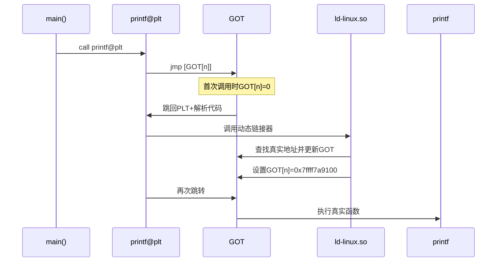
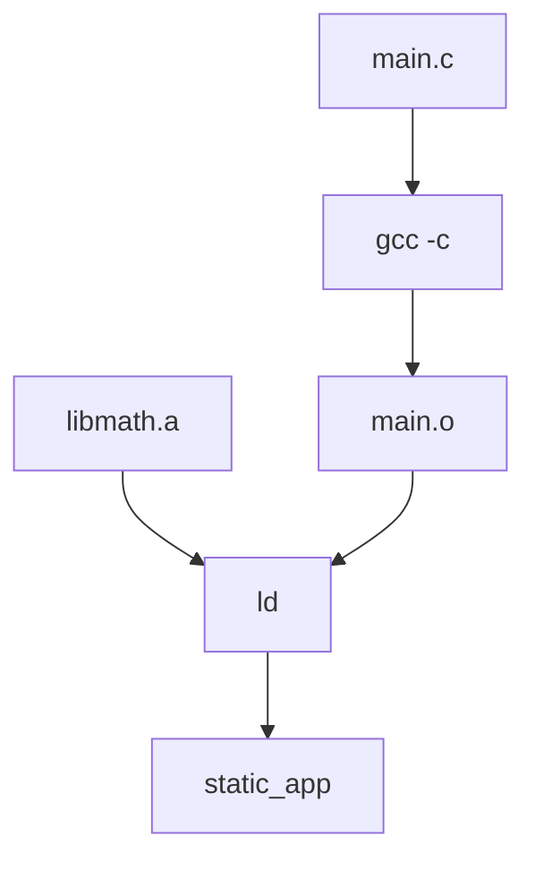
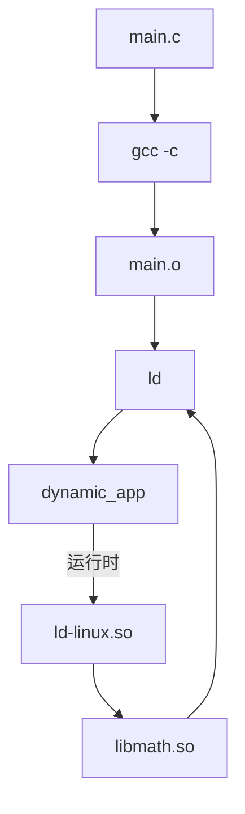

本文主要整理动态链接和加载的要点。

## 一、静态链接与动态链接中的重定位类型

动态链接过程参考[ICS-PA2024 Lecture8-9 note](./course/Computer_System/notes/PA_ICS2024_notes_04_IO设备_链接与加载.md)。

重定位（Relocation）是链接过程中的核心机制，用于解决符号地址引用问题。静态链接和动态链接在重定位类型上存在显著差异，以下是它们的深度解析：

### 1. 重定位的本质

重定位是**将符号引用绑定到实际内存地址**的过程：
```c
// 源代码
extern void print();  // 未定义符号

int main() {
    print();  // 需要重定位
}
```

编译后生成**重定位条目**，指导链接器/加载器如何修改指令中的地址。

### 2. 静态链接重定位

#### 2.1. 发生时机
- **链接阶段**（生成可执行文件时）
- 由**静态链接器**（ld）完成

#### 2.2. 核心重定位类型
| **类型** | **架构** | **计算方式** | **应用场景** |
|----------|----------|--------------|--------------|
| `R_X86_64_32` | x86-64 | S + A | 32位绝对地址访问 |
| `R_X86_64_64` | x86-64 | S + A | 64位绝对地址访问 |
| `R_386_PC32` | i386 | S + A - P | 32位相对地址访问 |
| `R_ARM_ABS32` | ARM | S + A | 32位绝对地址 |

**计算公式**：
- **S** = 符号地址
- **A** = 加数（通常为0）
- **P** = 被修改的位置地址

#### 2.3. 重定位过程示例
```c
// main.c
extern int global_var;  // 定义在lib.o

int main() {
    return global_var;
}
```

**编译与重定位**：
```bash
gcc -c main.c -o main.o
gcc -c lib.c -o lib.o
ld main.o lib.o -o static_app
```

**重定位步骤**：
1. 链接器合并所有 `.o` 文件
2. 为 `global_var` 分配地址（如 `0x601020`）
3. 修改 `main.o` 中的引用：
   ```asm
   ; 重定位前
   mov eax, [0x00000000]  ; R_X86_64_32 global_var
   
   ; 重定位后
   mov eax, [0x601020]
   ```

#### 2.4. 特点
- **一次性完成**：所有地址在链接时确定
- **绝对地址**：直接写入目标地址
- **无运行时开销**：执行时无需额外处理
- **地址空间限制**：`R_X86_64_32` 仅支持4GB地址空间

### 3. 动态链接重定位

#### 3.1. 发生时机
- **加载时**（程序启动）
- **运行时**（延迟绑定）
- 由**动态链接器**（ld-linux.so）完成

#### 3.2. 核心重定位类型
| **类型** | **架构** | **计算方式** | **应用场景** |
|----------|----------|--------------|--------------|
| `R_X86_64_PC32` | x86-64 | S + A - P | 函数调用（相对地址） |
| `R_X86_64_PLT32` | x86-64 | L + A - P | PLT跳转 |
| `R_X86_64_GOTPCREL` | x86-64 | G + GOT + A - P | GOT相对访问 |
| `R_ARM_RELATIVE` | ARM | B + A | 基址重定位 |

#### 3.3. 关键数据结构
**(1) 全局偏移表 (GOT)**
- 存储外部符号的实际地址
- 每个进程有独立的GOT副本
- 结构示例：
  | **条目** | **地址** | **符号** |
  |----------|----------|----------|
  | GOT[1] | 0x7ffff7dd4000 | printf |
  | GOT[2] | 0x7ffff7de5000 | malloc |

**(2) 过程链接表 (PLT)**
- 函数调用的跳转层
- 首次调用触发延迟绑定
- 结构示例：
  ```asm
  ; PLT条目
  printf@plt:
    jmp *GOT[1]  ; 首次跳转到解析器
    push index
    jmp resolver
  ```

#### 3.4 重定位过程示例
```c
// main.c
#include <stdio.h>

int main() {
    printf("Hello");  // 动态库函数
}
```

**运行时重定位**：


#### 3.5. 特点
- **位置无关**：使用相对地址（PIC）
- **延迟绑定**：函数首次调用时解析
- **运行时开销**：需要PLT/GOT间接层
- **ASLR兼容**：支持地址空间随机化

### 4. 重定位类型对比表

| **特性** | **静态链接重定位** | **动态链接重定位** |
|----------|-------------------|-------------------|
| **发生时机** | 链接时 | 加载时/运行时 |
| **核心类型** | `R_X86_64_32/64` | `R_X86_64_PC32/PLT32` |
| **地址性质** | 绝对地址 | 相对地址 |
| **关键数据结构** | 无 | GOT/PLT |
| **ASLR支持** | 有限 | 完全支持 |
| **内存占用** | 每个进程独立副本 | 多进程共享库代码 |
| **更新方式** | 重新编译整个程序 | 替换.so文件 |
| **性能特点** | 调用无开销 | 首次调用有解析开销 |
| **典型指令** | `mov [0x601020], eax` | `call printf@plt` |

### 5. 技术内幕

#### 5.1. 静态链接重定位实现
```c
// 链接器伪代码
void apply_relocation(Reloc reloc) {
    uint64_t addr = symtab[reloc.sym].value + reloc.addend;
    // 直接修改目标位置
    *(uint32_t*)(output + reloc.offset) = addr; 
}
```

#### 5.2. 动态链接延迟绑定
```c
// PLT解析器伪代码
void _dl_runtime_resolve(RelocIndex idx) {
    // 1. 通过.rela.plt查找符号
    Elf64_Rela* rela = &rela_plt[idx];
    
    // 2. 查找真实地址
    void* addr = _dl_lookup_symbol(rela->sym);
    
    // 3. 更新GOT
    *(uint64_t*)(got_base + rela->offset) = addr;
    
    // 4. 跳转到目标函数
    __asm__("jmp *%0" : : "r"(addr));
}
```

### 6. 实战：查看重定位信息

#### 6.1. 静态可执行文件
```bash
objdump -R static_app

# 输出示例：
# OFFSET   TYPE              VALUE
# 00002010 R_X86_64_64       global_var
```

#### 6.2. 动态可执行文件
```bash
readelf -d dynamic_app | grep RELA

# 输出：
# 0x000000007 RELACOUNT       42
# 0x0000000000000008 RELA             0x400
```

#### 6.3. 共享库
```bash
objdump -T libc.so.6 | grep ' printf'

# 输出：
# 000000000007d0 g    DF .text  0000000000000015  GLIBC_2.2.5 printf
```

### 7. 关键差异总结

1. **地址绑定时机**：
   - 静态链接：**编译时**确定所有地址
   - 动态链接：**运行时**逐步确定地址

2. **地址引用方式**：
   - 静态链接：直接使用**绝对地址**
   - 动态链接：通过**PLT/GOT**间接引用

3. **重定位类型**：
   - 静态链接：`R_*_ABS*` 绝对地址重定位
   - 动态链接：`R_*_PC*` 相对地址重定位

4. **性能权衡**：
   - 静态链接：启动快，调用无开销
   - 动态链接：节省内存，支持热更新

理解这些差异对于优化程序性能、解决链接错误和设计系统架构至关重要。现代操作系统通常结合两种方式：核心模块静态链接保证稳定性，非核心模块动态链接支持灵活更新。


## 二、静态链接与动态链接gcc编译选项
在 C/C++ 开发中，**静态链接（Static Linking）** 和 **动态链接（Dynamic Linking）** 是两种核心的库链接方式，它们在编译、链接和执行阶段有显著差异。以下是它们在 GCC 编译过程中的全面对比：


### 1. 核心概念对比
| **特性**         | **静态链接**                                 | **动态链接**                                 |
|------------------|---------------------------------------------|---------------------------------------------|
| **链接时机**      | 编译/链接阶段                               | 运行时                                      |
| **库文件形式**    | `.a` (Linux), `.lib` (Windows)             | `.so` (Linux), `.dll` (Windows)             |
| **可执行文件大小** | 较大（包含库代码）                          | 较小（仅包含引用）                          |
| **内存占用**      | 每个进程独立加载                            | 多个进程共享同一库实例                      |
| **更新维护**      | 需重新编译整个程序                          | 只需替换库文件                              |
| **依赖关系**      | 无外部依赖                                  | 依赖系统中特定版本的库                      |
| **启动速度**      | 较快（无运行时加载）                        | 稍慢（需加载共享库）                        |

---

### 2. GCC 编译命令差异

#### 2.1. 静态链接编译
```bash
# 编译并静态链接
gcc -static main.c -o static_app -lm

# 或分步编译
gcc -c main.c -o main.o
gcc -static main.o -o static_app -lm
```

**关键选项**：
- `-static`：强制静态链接所有库
- `-L/path/to/libs`：指定静态库搜索路径
- `-l<name>`：链接 `lib<name>.a` 库

#### 2.2. 动态链接编译
```bash
# 默认动态链接
gcc main.c -o dynamic_app -lm

# 显式指定动态链接
gcc -shared -fPIC main.c -o dynamic_app -lm
```

**关键选项**：
- `-fPIC`：生成位置无关代码（Position Independent Code）
- `-shared`：生成共享库（用于创建 `.so` 文件）
- `-Wl,-rpath=/path/to/libs`：指定运行时库搜索路径

---

### 3. 编译流程差异

#### 3.1. 静态链接流程


#### 3.2. 动态链接流程


---

### 4. 内部机制对比

#### 4.1. 符号解析
| **阶段**       | **静态链接**                                | **动态链接**                                |
|----------------|---------------------------------------------|---------------------------------------------|
| **符号解析时机** | 链接阶段                                    | 运行时                                      |
| **未定义符号处理** | 链接失败                                    | 运行时崩溃                                  |
| **符号可见性**  | 所有符号在链接时解析                         | 导出符号在运行时解析                         |

#### 4.2. 内存映射
| **特性**         | **静态链接**                                | **动态链接**                                |
|------------------|---------------------------------------------|---------------------------------------------|
| **代码段**        | 包含所有库代码                              | 仅包含主程序代码                            |
| **数据段**        | 独立数据副本                                | 共享库有独立数据段                          |
| **GOT/PLT**      | 不需要                                      | 通过全局偏移表/过程链接表实现延迟绑定        |

#### 4.3. 重定位处理
| **类型**         | **静态链接**                                | **动态链接**                                |
|------------------|---------------------------------------------|---------------------------------------------|
| **重定位时机**    | 链接时                                      | 加载时（基本重定位）或运行时（延迟绑定）     |
| **重定位类型**    | 绝对地址重定位（R_X86_64_32/64）            | 相对地址重定位（R_X86_64_PC32）             |
| **ASLR 支持**     | 有限支持                                    | 完全支持                                    |

---

### 5. 实际应用示例

#### 5.1. 创建静态库
```bash
# 编译目标文件
gcc -c math_utils.c -o math_utils.o

# 创建静态库
ar rcs libmath_utils.a math_utils.o

# 链接静态库
gcc -static main.c -L. -lmath_utils -o static_app
```

#### 5.2. 创建动态库
```bash
# 编译位置无关代码
gcc -fPIC -c math_utils.c -o math_utils.o

# 创建动态库
gcc -shared math_utils.o -o libmath_utils.so

# 链接动态库
gcc main.c -L. -lmath_utils -Wl,-rpath='$ORIGIN' -o dynamic_app
```

#### 5.3. 查看链接信息
```bash
# 检查静态链接
file static_app        # 显示: statically linked
ldd static_app         # 显示: not a dynamic executable

# 检查动态链接
file dynamic_app       # 显示: dynamically linked
ldd dynamic_app        # 列出所有动态依赖
readelf -d dynamic_app # 查看动态段信息
```


## 三、_start / ld-linux.so / Entry point 关系

在Linux系统中，_start、ld-linux.so和Entry point（入口点）有明确的职责区分，具体关系如下：

### 1. _start与ld-linux.so的关系
**动态链接时_start由ld-linux.so间接控制**
若程序依赖动态库（未使用-static编译），内核会加载动态链接器ld-linux.so（如/lib64/ld-linux-x86-64.so.2）。
ld-linux.so完成共享库加载、符号解析等初始化后，将控制权转交给_start（由C运行时库提供）。
**静态链接时_start直接嵌入程序**
使用-static编译时，所有库代码被静态链接到可执行文件中，_start由链接器直接嵌入，无需依赖ld-linux.so。


### 2. _start与Entry point的关系
**_start是程序的真正入口点**
ELF文件头（e_entry字段）指向_start的地址，内核加载程序后直接跳转到此地址。
_start的职责包括：初始化堆栈、解析命令行参数、调用全局/静态构造函数，最终调用用户定义的main函数。
**main是用户代码的逻辑入口点**
main由开发者实现，是程序实际逻辑的起点。_start通过调用__libc_start_main间接调用main，并传递参数（如argc、argv）。

### 3. 关键区别总结
| 组件	| 作用	| 与ld-linux.so的关系	| 与Entry point的关系 | 
|------ |------ | ---------- |----------------|
|_start	| 初始化环境、调用main | 动态链接时由ld-linux.so加载后调用 | 是ELF文件头指定的Entry point | 
|ld-linux.so | 动态链接器，负责加载共享库、解析符号	| 仅在动态链接时被加载 | 不是Entry point，而是_start的前置依赖 |
|Entry point | 程序执行的起始地址（e_entry字段）| 无直接关系 | 在ELF文件中指向_start的地址 | 

### 4. 示例场景
**动态链接程序**
内核加载ld-linux.so，后者加载共享库并初始化环境，最终调用_start。
_start完成底层初始化后，调用main。
**静态链接程序**
内核直接加载可执行文件，跳转到_start（无需ld-linux.so）。
_start直接调用main。

### 5. 总结
_start：是程序的真正入口点，由链接器嵌入（动态链接时由ld-linux.so间接控制，静态链接时直接嵌入）。
ld-linux.so：仅在动态链接时被加载，负责库加载和符号解析，不是Entry point。
Entry point：在ELF文件中指向_start的地址，是内核启动程序时的跳转目标。

## 四、-fPIC 默认会为所有 extern 数据增加一层间接访问

-fPIC（Position Independent Code，位置无关代码）是GCC编译器在生成共享库（.so）时常用的选项。它的核心目的是确保代码可以在内存中的任意位置运行，而无需重新编译。关于-fPIC为extern数据增加一层间接访问的含义，可以从以下几个方面理解：

### 1. 位置无关代码的基本原理
- 动态库的加载地址不确定：动态库在运行时被加载到进程的虚拟地址空间中，其基地址（基址）通常是随机的（受ASLR影响）。因此，库中的代码和数据不能依赖固定的绝对地址。
- **PIC的实现方式**：
  - 代码段（.text）：通过相对跳转（如call指令的相对偏移）实现位置无关。
  - 数据段（.data、.bss）：通过全局偏移表（GOT）间接访问全局变量和静态变量。

### 2. extern数据的间接访问
- extern变量的本质：extern变量通常声明在头文件中，表示该变量在其他模块（如另一个.c文件或动态库）中定义。动态库中的extern变量可能是其他库或程序的全局变量。

- **-fPIC的作用**：
当使用-fPIC编译动态库时，所有对外部全局变量（extern）的访问都会通过GOT（全局偏移表）进行间接寻址。具体流程如下：
  - 编译阶段：编译器生成对extern变量的引用时，不直接使用绝对地址，而是通过GOT条目访问。GOT条目初始指向一个PLT（过程链接表）条目，触发动态链接器在运行时解析符号并更新GOT。
  - 运行时阶段：动态链接器解析extern变量的实际地址，将其写入GOT。后续访问通过GOT中的地址间接获取变量值。

示例：
```c
// 程序代码
extern int shared_var;  // 声明为extern（可能在动态库中定义）
 
void func() {
    shared_var = 42;    // 实际访问：通过GOT获取shared_var的地址
}
```
编译后的汇编代码会通过GOT访问shared_var：
```assembly
movl shared_var@GOTPCREL(%rip), %eax  # 获取GOT条目地址
movl $42, (%eax)                      # 将42写入GOT指向的内存
```

### 3. 为什么需要间接访问？
- 地址无关性：
动态库的加载地址在编译时未知，直接使用绝对地址会导致代码无法在任意位置运行。通过GOT间接访问，代码只需知道GOT相对于当前指令指针（%rip）的偏移量，而GOT在运行时被动态链接器填充为实际地址。
- 共享库的通用性：
同一份动态库可以被多个进程加载到不同的地址空间。间接访问确保所有进程都能正确解析符号地址。

### 4. 与非PIC代码的对比
- 非PIC代码（静态链接或-fno-PIC）：
  - 直接使用绝对地址访问全局变量。
  - 代码必须在固定地址运行，无法作为动态库加载到任意位置。
- PIC代码（-fPIC）：
  - 通过GOT/PLT间接访问全局变量。
  - 代码可加载到任意地址，适合动态库场景。

### 5. 性能影响
- 额外开销：通过GOT间接访问变量会增加一次内存读取（访问GOT），理论上比直接访问稍慢。
- 现代CPU优化：GOT条目通常会被缓存（如TLB），实际性能影响较小。

### 总结
- -fPIC的间接访问机制：通过GOT对extern变量进行间接寻址，确保动态库的代码和数据可以在任意内存位置运行。
- 核心目的：实现地址无关性，支持动态库的灵活加载和共享。
- 开发者注意：编译动态库时必须使用-fPIC，否则可能导致符号解析错误或运行时崩溃。

## 五、LD_PRELOAD机制

ld-linux为我们提供了“preload”机制，通过LD_PRELOAD环境变量，我们可以指定一个动态链接库，在程序启动时，动态链接库中的函数会被优先调用，从而实现对程序的拦截和修改。

```c
static void init_real_functions() {
    real_malloc = dlsym(RTLD_NEXT, "malloc");
    real_free = dlsym(RTLD_NEXT, "free");
}

// Our malloc hook
void* malloc(size_t size) {
    // Initialize real functions if needed
    if (!real_malloc) {
        init_real_functions();
    }

    // Call real malloc
    void* ptr = real_malloc(size);

    // Print trace
    pthread_mutex_lock(&trace_mutex);
    fprintf(stderr, "[TRACE] malloc(%zu) = %p\n", size, ptr);
    pthread_mutex_unlock(&trace_mutex);

    return ptr;
}

// Our free hook
void free(void* ptr) {
    // Initialize real functions if needed
    if (!real_free) {
        init_real_functions();
    }

    // Print trace before freeing
    pthread_mutex_lock(&trace_mutex);
    fprintf(stderr, "[TRACE] free(%p)\n", ptr);
    pthread_mutex_unlock(&trace_mutex);

    // Call real free
    real_free(ptr);
} 
```

```bash
LD_PRELOAD=./libmalloc_hook.so ./test_program
```

- RTLD_NEXT：表示从当前动态库的下一个依赖库中查找符号（即系统默认的libc.so中的malloc和free）。
- dlsym：动态链接接口函数，用于在运行时查找符号（函数或变量）的地址。