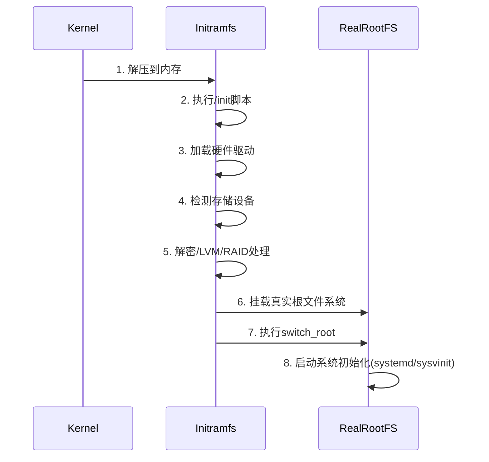
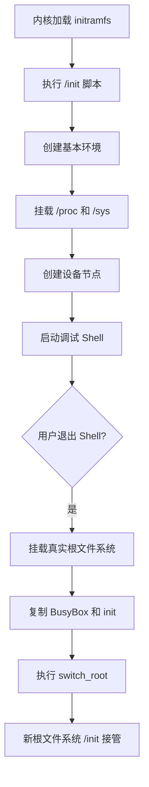
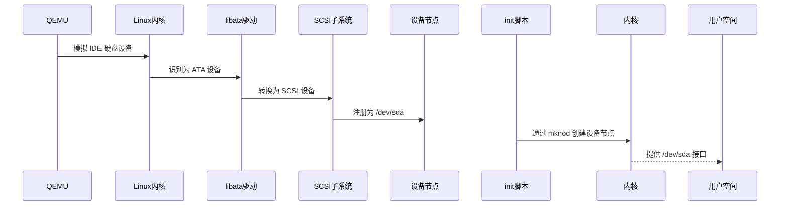

本文主要整理NJU-OS操作系统上的应用生态世界章节的要点。

## 一、Linux initramfs概述

**initramfs**（Initial RAM File System）是 Linux 启动过程中的**临时根文件系统**，它在内核加载后、实际根文件系统挂载前被加载到内存中运行。其核心目的是为内核提供必要的工具和环境，使其能够访问和挂载真正的根文件系统。


### 1. 核心功能与作用

#### 1.1. 解决"鸡与蛋"问题
- **问题**：内核需要挂载根文件系统才能加载驱动程序
- **矛盾**：根文件系统在磁盘上，需要驱动程序才能访问
- **方案**：initramfs 包含访问根文件系统所需的最小驱动集合

#### 1.2. 关键任务
| **任务类型** | **具体场景** | **解决方案** |
|--------------|--------------|--------------|
| **硬件驱动** | 特殊存储设备（RAID/LVM/NVMe） | 提供对应内核模块 |
| **文件系统** | 加密文件系统（LUKS） | 包含解密工具（cryptsetup） |
| **网络启动** | 无盘工作站 | 包含网络驱动和协议栈 |
| **恢复模式** | 系统损坏修复 | 提供紧急恢复工具集 |

#### 1.3. 具体功能实现
- 加载关键硬件驱动（存储控制器、文件系统）
- 解密加密的根分区
- 激活逻辑卷（LVM）
- 处理软件RAID组装
- 网络初始化（用于NFS根文件系统）
- 提供紧急恢复shell

### 2. 技术架构详解

#### 2.1. 物理结构
```bash
/boot/
├── initramfs-5.15.0-86-generic.img  # 压缩的cpio存档
├── vmlinuz-5.15.0-86-generic        # Linux内核
└── grub/                            # 引导加载程序
```

#### 2.2. 内部组成
典型的 initramfs 包含：
```
├── bin/              # 核心工具
│   ├── busybox       # 多功能工具集
│   ├── mount         # 挂载工具
│   ├── mkfs          # 文件系统创建
│   └── cryptsetup    # 磁盘加密工具
├── sbin/             # 系统管理工具
│   ├── modprobe      # 内核模块加载
│   └── lvm           # 逻辑卷管理
├── lib/              # 共享库和内核模块
│   ├── modules/      # 内核驱动模块
│   └── *.so          # 动态链接库
├── scripts/          # 启动脚本
│   ├── init-top/     # 早期初始化
│   ├── init-premount # 预挂载处理
│   └── local-top/    # 本地设备处理
└── init              # 主初始化程序
```

#### 2.3. 工作流程


## 二、最小Linux（打印Hello word）Initramfs Makefile解读

```
# Requires statically linked busybox in $PATH

INIT := /init

initramfs: minimal
# Copy kernel and minimal from the host system
	@mkdir -p build/initramfs/bin
	sudo bash -c "cp /boot/vmlinuz build/ && chmod 666 build/vmlinuz"
	cp minimal build/initramfs/init

# Pack build/initramfs as gzipped cpio archive
	cd build/initramfs && \
	  find . -print0 \
	  | cpio --null -ov --format=newc \
	  | gzip -9 > ../initramfs.cpio.gz

run:
# Run QEMU with the installed kernel and generated initramfs
	qemu-system-x86_64 \
	  -serial mon:stdio \
	  -kernel build/vmlinuz \
	  -initrd build/initramfs.cpio.gz \
	  -machine accel=kvm:tcg \
	  -append "console=ttyS0 quiet rdinit=$(INIT)"

clean:
	rm -rf build minimal.s minimal.o minimal

.PHONY: initramfs run clean minimal

minimal: minimal.S
	gcc -g -S minimal.S > minimal.s
	as minimal.s -o minimal.o
	ld -o minimal minimal.o
```

这个 Makefile 用于构建一个极简的 Linux initramfs 并在 QEMU 虚拟机中运行。以下是关键部分的详细解读：

### 1. 核心目标定义
```makefile
INIT := /init
.PHONY: initramfs run clean minimal
```
- `INIT`：指定 initramfs 的初始化程序路径（默认为 `/init`）
- `.PHONY`：声明伪目标（不生成实际文件）

---

### 2. `minimal` 目标 - 编译初始化程序
```makefile
minimal: minimal.S
	gcc -g -S minimal.S > minimal.s
	as minimal.s -o minimal.o
	ld -o minimal minimal.o
```
1. 将汇编源文件 `minimal.S` 编译为中间汇编代码 `minimal.s`
2. 将 `minimal.s` 汇编为目标文件 `minimal.o`
3. 链接目标文件生成静态可执行文件 `minimal`
> **关键要求**：生成的 `minimal` 必须是静态链接（不依赖动态库），因为它将在独立环境中运行

---

### 3. `initramfs` 目标 - 构建 initramfs
```makefile
initramfs: minimal
	@mkdir -p build/initramfs/bin
	sudo bash -c "cp /boot/vmlinuz build/ && chmod 666 build/vmlinuz"
	cp minimal build/initramfs/init
	
	cd build/initramfs && \
	  find . -print0 | cpio --null -ov --format=newc | gzip -9 > ../initramfs.cpio.gz
```
1. **依赖**：先编译 `minimal` 程序
2. **准备目录**：创建 initramfs 目录结构
3. **复制内核**：
   - 使用 `sudo` 复制主机系统的内核镜像 `/boot/vmlinuz`
   - 修改权限为 `666`（确保所有用户可读写）
4. **设置初始化程序**：
   - 将编译好的 `minimal` 复制为 initramfs 的 `/init`
5. **打包 initramfs**：
   - `find . -print0`：递归查找文件（空字符分隔）
   - `cpio --null -ov --format=newc`：创建 newc 格式的 cpio 存档
   - `gzip -9`：最高压缩级别生成 `initramfs.cpio.gz`

---

### 4. `run` 目标 - 启动 QEMU 虚拟机
```makefile
run:
	qemu-system-x86_64 \
	  -serial mon:stdio \
	  -kernel build/vmlinuz \
	  -initrd build/initramfs.cpio.gz \
	  -machine accel=kvm:tcg \
	  -append "console=ttyS0 quiet rdinit=$(INIT)"
```
QEMU 参数详解：
- `-serial mon:stdio`：串口输出重定向到标准 I/O
- `-kernel`：指定内核镜像路径
- `-initrd`：指定 initramfs 路径
- `-machine accel=kvm:tcg`：使用 KVM 加速（失败则回退到软件模拟）
- `-append`：内核启动参数
  - `console=ttyS0`：使用串口作为控制台
  - `quiet`：抑制内核启动日志
  - `rdinit=$(INIT)`：指定 initramfs 的初始化程序

---

### 5. `clean` 目标 - 清理构建产物
```makefile
clean:
	rm -rf build minimal.s minimal.o minimal
```
删除所有生成的文件和目录：
- `build/`：包含内核和 initramfs
- `minimal.s`：中间汇编文件
- `minimal.o`：目标文件
- `minimal`：最终可执行文件

---

### 关键要求说明
1. **静态链接 BusyBox**：
   - 注释 `# Requires statically linked busybox in $PATH` 提示需要静态版 BusyBox
   - 但实际代码使用自编译的 `minimal` 作为初始化程序
   - 若需 BusyBox，应将其二进制文件放入 `build/initramfs/bin/`

2. **内核兼容性**：
   - `cp /boot/vmlinuz` 假设主机使用标准内核路径
   - 实际路径可能因发行版不同而变化（如 `/boot/vmlinuz-$(uname -r)`）

---

### 使用流程
1. **编译初始化程序**：`make minimal`
2. **构建 initramfs**：`make initramfs`
3. **启动虚拟机**：`make run`
4. **清理**：`make clean`

## 三、最小Linux（带文件系统）Initramfs Makefile解读

```makefile
# Requires statically linked busybox in $PATH

INIT := /init
IMG := build/disk.img
MOUNT := $(shell mktemp -d)
K := $(shell uname -r)

all: initramfs fsroot

initramfs:
# Copy kernel and busybox from the host system
	@mkdir -p build/initramfs/bin
	sudo bash -c "cp /boot/vmlinuz build/ && chmod 666 build/vmlinuz"
	cp init build/initramfs/
	cp $(shell which busybox) build/initramfs/bin/

# Pack build/initramfs as gzipped cpio archive
	cd build/initramfs && \
	  find . -print0 \
	  | cpio --null -ov --format=newc \
	  | gzip -9 > ../initramfs.cpio.gz

fsroot:
	mkdir -p fsroot/modules
	cp $$(find /lib/modules/$K/ -name e1000.ko) fsroot/modules/

	dd if=/dev/zero of=$(IMG) bs=1M count=64
	mkfs.ext4 -F $(IMG)
	sudo mount $(IMG) $(MOUNT)
	cd fsroot && sudo cp -r * $(MOUNT)
	sudo umount $(MOUNT)

run:
# Run QEMU with the installed kernel and generated initramfs
	qemu-system-x86_64 \
	  -serial mon:stdio -vga std \
	  -drive file=$(IMG),format=raw,index=0,media=disk \
	  -netdev user,id=net0,hostfwd=tcp:127.0.0.1:8080-:8080 -device e1000,netdev=net0 \
	  -kernel build/vmlinuz \
	  -initrd build/initramfs.cpio.gz \
	  -machine accel=kvm:tcg \
	  -append "console=ttyS0 quiet rdinit=$(INIT)"

clean:
	rm -rf build fsroot/modules

.PHONY: initramfs run clean fsroot
```

这个 Makefile 用于构建一个包含 initramfs 和完整根文件系统的 Linux 环境，并在 QEMU 虚拟机中运行。相比之前的版本，它增加了磁盘镜像创建、网络支持和模块加载等功能。以下是详细解读：

### 1. 变量定义
```makefile
INIT := /init
IMG := build/disk.img
MOUNT := $(shell mktemp -d)
K := $(shell uname -r)
```
- `INIT`: 初始化程序路径 (initramfs 中的 `/init`)
- `IMG`: 磁盘镜像文件路径
- `MOUNT`: 自动创建临时挂载点目录
- `K`: 获取当前系统内核版本

### 2. 目标依赖关系
```makefile
all: initramfs fsroot
```
默认目标 `all` 依赖于 `initramfs` 和 `fsroot`，构建完整的系统需要这两个组件

### 3. initramfs 目标 - 构建初始内存文件系统
```makefile
initramfs:
	@mkdir -p build/initramfs/bin
	sudo bash -c "cp /boot/vmlinuz build/ && chmod 666 build/vmlinuz"
	cp init build/initramfs/
	cp $(shell which busybox) build/initramfs/bin/

	cd build/initramfs && \
	  find . -print0 | cpio --null -ov --format=newc | gzip -9 > ../initramfs.cpio.gz
```
1. 创建目录结构
2. 复制主机内核镜像并设置权限
3. 复制自定义的 `init` 脚本（关键初始化程序）
4. **复制静态链接的 busybox**（要求必须在 $PATH 中）
5. 打包为 gzip 压缩的 cpio 格式

### 4. fsroot 目标 - 构建根文件系统
```makefile
fsroot:
	mkdir -p fsroot/modules
	cp $$(find /lib/modules/$K/ -name e1000.ko) fsroot/modules/

	dd if=/dev/zero of=$(IMG) bs=1M count=64
	mkfs.ext4 -F $(IMG)
	sudo mount $(IMG) $(MOUNT)
	cd fsroot && sudo cp -r * $(MOUNT)
	sudo umount $(MOUNT)
```
1. 准备模块目录
2. **复制 e1000 网卡驱动模块**（用于网络功能）
3. 创建 64MB 的空白磁盘镜像
4. 格式化为 ext4 文件系统
5. 挂载镜像并复制文件
6. 卸载镜像

### 5. run 目标 - 启动 QEMU 虚拟机
```makefile
run:
	qemu-system-x86_64 \
	  -serial mon:stdio -vga std \
	  -drive file=$(IMG),format=raw,index=0,media=disk \
	  -netdev user,id=net0,hostfwd=tcp:127.0.0.1:8080-:8080 -device e1000,netdev=net0 \
	  -kernel build/vmlinuz \
	  -initrd build/initramfs.cpio.gz \
	  -machine accel=kvm:tcg \
	  -append "console=ttyS0 quiet rdinit=$(INIT)"
```
新增关键参数：
- `-vga std`: 启用标准 VGA 显示
- `-drive`: 添加磁盘镜像作为虚拟硬盘
- **网络配置**:
  - `-netdev user`: 用户模式网络
  - `hostfwd=tcp:...`: 端口转发 (主机 8080 → 虚拟机 8080)
  - `-device e1000`: 使用 e1000 网卡设备

### 6. clean 目标 - 清理构建产物
```makefile
clean:
	rm -rf build fsroot/modules
```
清理构建目录和模块目录

### 7. 伪目标声明
```makefile
.PHONY: initramfs run clean fsroot
```

#### 关键组件解析

1. **init 脚本** (未在 Makefile 中显示但被引用)
   - 必须存在于项目目录中
   - 作为 initramfs 的初始化程序
   - 应包含挂载根文件系统、切换根目录等逻辑

2. **BusyBox 要求**
   - 必须是静态链接版本
   - 需要在系统 $PATH 中可访问
   - 提供基础命令行工具集

3. **网络支持**
   - **e1000.ko**: 虚拟网卡驱动模块
   - **端口转发**: 可通过主机 8080 端口访问虚拟机服务
   - 用户模式网络: 提供 NAT 网络访问

#### 完整工作流程

1. **准备阶段**:
   ```bash
   # 安装依赖
   sudo apt-get install busybox-static cpio gzip qemu-system-x86
   
   # 创建 init 脚本 (示例内容)
   echo -e '#!/bin/sh\nmount -t proc proc /proc\nexec /bin/sh' > init
   chmod +x init
   ```

2. **构建系统**:
   ```bash
   make all  # 构建 initramfs 和根文件系统
   ```

3. **运行虚拟机**:
   ```bash
   make run  # 启动 QEMU
   ```

4. **测试网络**:
   ```bash
   # 在虚拟机中启动服务
   /bin/busybox httpd -p 8080 -h / 
   
   # 在主机访问
   curl http://localhost:8080
   ```

5. **清理**:
   ```bash
   make clean
   ```

#### 启动流程

```
graph TD
    A[QEMU启动] --> B[加载内核]
    B --> C[initramfs初始化]
    C --> D[加载e1000驱动]
    D --> E[挂载磁盘根文件系统]
    E --> F[执行/sbin/init]
    F --> G[启动网络服务]
```

## 四、最小Linux（带文件系统）init源码解读

```bash
#!/bin/busybox sh

# At this point, we only have:
#   /bin/busybox - the binary
#   /dev/console - the console device
BB=/bin/busybox

# Delete this file
# (Yes, we can do this on UNIX! The file is "removed"
# after the last reference, the fd, is gone.)
$BB rm /init

$BB find / -type f
$BB echo "Unlimited power!!"
# $BB poweroff -f
# ----------------------------------------------------
 
# "Create" command-line tools by making symbolic links
#   try: busybox --list
for cmd in $($BB --list); do
    $BB ln -s $BB /bin/$cmd
done

# Mount procfs and sysfs
mkdir -p /proc && mount -t proc  none /proc
mkdir -p /sys  && mount -t sysfs none /sys

# Create devices
mknod /dev/random  c 1 8
mknod /dev/urandom c 1 9
mknod /dev/null    c 1 3
mknod /dev/tty     c 4 1
mknod /dev/sda     b 8 0

echo -e "\033[31mInit OK; launch a shell (initramfs).\033[0m"

busybox sh

# Display a countdown

echo -e "\n\n"
echo -e "\033[31mSwitch root in...\033[0m"
for sec in $(seq 3 -1 1); do
    echo $sec; sleep 1
done

# Switch root to /newroot (a real file system)
N=/newroot

mkdir -p $N
mount -t ext4 /dev/sda $N

mkdir -p $N/bin
cp $BB $N/bin/
cp $BB /init
exec switch_root /newroot/ /init
```

这个 `init` 脚本是 initramfs 的初始化程序，负责在 Linux 系统启动的早期阶段设置环境并切换到真正的根文件系统。以下是详细的源码解读：

```bash
#!/bin/busybox sh
```
- 使用静态编译的 BusyBox 作为解释器（确保在最小环境中可用）

---

### 1. 初始设置
```bash
BB=/bin/busybox

# 删除当前运行的 init 脚本（利用 UNIX 文件系统特性）
$BB rm /init

# 调试：列出所有文件
$BB find / -type f
$BB echo "Unlimited power!!"
```
- **关键技巧**：`rm /init` 删除正在运行的脚本文件（UNIX 特性：文件在打开状态下仍可访问，直到最后一个句柄关闭）
- 调试输出：显示当前 initramfs 中的所有文件

---

### 2. 创建基本命令工具链
```bash
for cmd in $($BB --list); do
    $BB ln -s $BB /bin/$cmd
done
```
- 为 BusyBox 支持的所有命令创建符号链接
- 例如：`/bin/sh -> /bin/busybox`, `/bin/ls -> /bin/busybox`
- 这样可以直接使用 `ls` 等命令而不需要输入完整路径

---

### 3. 挂载虚拟文件系统
```bash
mkdir -p /proc && mount -t proc  none /proc
mkdir -p /sys  && mount -t sysfs none /sys
```
- **/proc**：进程和系统信息文件系统
- **/sys**：设备驱动和内核对象文件系统
- 这是 Linux 系统正常运行的基础设施

---

### 4. 创建设备节点
```bash
mknod /dev/random  c 1 8
mknod /dev/urandom c 1 9
mknod /dev/null    c 1 3
mknod /dev/tty     c 4 1
mknod /dev/sda     b 8 0
```
- 创建必要的设备文件：
  - `/dev/random` & `/dev/urandom`：随机数生成器
  - `/dev/null`：空设备
  - `/dev/tty`：控制台终端
  - `/dev/sda`：磁盘设备（对应 QEMU 中的虚拟硬盘）

---

### 5. 启动交互式 Shell（调试阶段）
```bash
echo -e "\033[31mInit OK; launch a shell (initramfs).\033[0m"
busybox sh
```
- 打印红色提示信息
- 启动一个交互式 Shell
- **重要**：此时系统会暂停在这里，直到用户退出 Shell（按 Ctrl+D 或输入 `exit`）

---

### 6. 切换到真正的根文件系统
```bash
# 倒计时提示
echo -e "\n\n"
echo -e "\033[31mSwitch root in...\033[0m"
for sec in $(seq 3 -1 1); do
    echo $sec; sleep 1
done

# 挂载真实根文件系统
N=/newroot
mkdir -p $N
mount -t ext4 /dev/sda $N

# 准备新环境
mkdir -p $N/bin
cp $BB $N/bin/
cp $BB /init

# 执行根切换
exec switch_root /newroot/ /init
```

#### 详细步骤：
1. **倒计时提示**：3秒倒计时，红色文字提示
2. **挂载真实根文件系统**：
   - 创建挂载点 `/newroot`
   - 将 `/dev/sda` 磁盘挂载为 ext4 文件系统
3. **准备新环境**：
   - 复制 BusyBox 到新系统的 `/bin`
   - 复制当前脚本作为新系统的 init 程序
4. **关键操作**：`exec switch_root /newroot/ /init`
   - `switch_root`：BusyBox 命令，用于切换到新的根文件系统
   - 会卸载当前 initramfs 的所有文件系统
   - 将 `/newroot` 设为新的根目录
   - 执行新系统中的 `/init` 程序
   - `exec` 确保进程替换（PID 1 不变）

---

### 关键技术和注意事项

1. **文件删除技巧**：
   ```bash
   $BB rm /init  # 删除正在运行的脚本
   ```
   - 利用 UNIX 文件系统特性：文件在打开状态下不会被真正删除
   - 释放 initramfs 空间（重要：initramfs 通常很小）

2. **根切换过程**：
   - 必须使用 `switch_root` 而不是 `chroot`
   - `switch_root` 会清理 initramfs 环境，释放内存
   - 新 init 进程会成为 PID 1

3. **交互式调试**：
   ```bash
   busybox sh  # 暂停启动过程
   ```
   - 允许开发者在切换根文件系统前进行调试
   - 可检查设备、测试命令等

4. **设备创建**：
   - `mknod /dev/sda b 8 0` 对应 QEMU 的虚拟磁盘
   - 主设备号 8 = SCSI/SATA 设备
   - 次设备号 0 = 第一个磁盘

5. **颜色输出**：
   ```bash
   echo -e "\033[31m...\033[0m"  # 红色文本
   ```
   - 使用 ANSI 转义序列增强可读性

---

### 完整启动流程



## 五、/dev/sda 怎么对应到 QEMU 中的虚拟硬盘

在 Linux 系统启动过程中，`/dev/sda` 设备文件与 QEMU 虚拟硬盘的对应关系是通过设备模拟和内核驱动的协同工作实现的。以下是详细的对应机制解析：

---

### 1. **QEMU 命令行参数**
在 Makefile 的 `run` 目标中指定了虚拟硬盘：
```makefile
-drive file=$(IMG),format=raw,index=0,media=disk
```
- **`file=$(IMG)`**：指定磁盘镜像文件（`build/disk.img`）
- **`format=raw`**：使用原始磁盘格式（无额外封装）
- **`index=0`**：表示这是第一个磁盘设备
- **`media=disk`**：明确指定为硬盘设备（而非软盘等）

---

### 2. **QEMU 的设备模拟**
QEMU 默认将第一个硬盘模拟为 **IDE 控制器上的主设备**：
```mermaid
graph LR
    A[QEMU] -->|模拟| B[IDE 控制器]
    B --> C[主设备: Master]
    C --> D[/dev/hda 或 /dev/sda]
```

但现代 Linux 内核通过统一的 **ATA 子系统**，将 IDE 设备映射为 SCSI 设备：
- IDE 设备 → 识别为 `/dev/sdX` (SCSI/SATA 命名规则)
- 这是由内核的 **`libata`** 驱动实现的转换

---

### 3. **内核设备号映射**
在 Linux 设备模型中：
- **主设备号 8**：表示 SCSI 磁盘设备
- **次设备号 0**：表示整个磁盘（而非分区）

在 init 脚本中创建的设备节点：
```bash
mknod /dev/sda b 8 0
```
- `b`：块设备
- `8`：主设备号 (SCSI disk)
- `0`：次设备号 (第一个磁盘)

---

### 4. **完整的映射链条**


---

### 5. **为什么是 /dev/sda 而不是 /dev/hda?**
| 设备类型 | 传统命名 | 现代命名 | 原因 |
|----------|----------|----------|------|
| IDE/PATA | /dev/hda | /dev/sda | 内核统一使用 libata 驱动 |
| SATA     | -        | /dev/sda | 原生 SCSI 命令集 |
| SCSI     | -        | /dev/sda | 直接映射 |

现代 Linux 内核（2.6.19+）已**弃用原生 IDE 驱动**，所有 PATA/SATA 设备都通过 `libata` 驱动映射为 SCSI 设备。

---

### 6. **验证对应关系**
在 QEMU 启动后，可以通过以下方式验证：
```bash
# 查看内核识别到的设备
dmesg | grep sda
# 输出示例： [    1.234567] sd 0:0:0:0: [sda] 131072 512-byte sectors (67 MB)

# 查看设备号
ls -l /dev/sda
# 输出： brw-rw---- 1 root disk 8, 0 Jun  4 12:34 /dev/sda
```

---

### 7. **多磁盘场景的扩展**
如果添加第二个磁盘：
```makefile
-drive file=disk2.img,format=raw,index=1,media=disk
```
则对应关系为：
- `index=0` → `/dev/sda`
- `index=1` → `/dev/sdb`
- `index=2` → `/dev/sdc`

---

### 8. **为什么 init 脚本需要手动创建设备节点？**
在早期用户空间（initramfs）中：
1. 内核已检测到设备，但尚未创建设备文件
2. initramfs 通常是极简环境，没有 udev 等设备管理工具
3. 脚本需要手动创建关键设备节点才能访问硬件

在完整系统中，`udev` 或 `devtmpfs` 会自动管理设备节点。

---

### 9. **设备号的具体含义**
| 设备 | 主设备号 | 次设备号 | 说明 |
|------|----------|----------|------|
| /dev/sda | 8 | 0 | 整个第一磁盘 |
| /dev/sda1 | 8 | 1 | 第一分区 |
| /dev/sda2 | 8 | 2 | 第二分区 |
| /dev/sdb | 8 | 16 | 整个第二磁盘 |

计算公式：  
`次设备号 = (磁盘索引 × 16) + 分区号`  
其中分区号 0 表示整个磁盘

---

### 总结：映射关系链
```
QEMU 参数: -drive file=disk.img
      ↓
QEMU 模拟: IDE 硬盘 (默认)
      ↓
Linux 内核: 通过 libata 驱动识别为 ATA 设备
      ↓
内核子系统: 映射为 SCSI 设备 (sd 驱动)
      ↓
设备节点: 注册为 /dev/sda (主设备号8, 次设备号0)
      ↓
init 脚本: mknod /dev/sda b 8 0 创建设备文件
      ↓
挂载命令: mount -t ext4 /dev/sda /newroot
```
