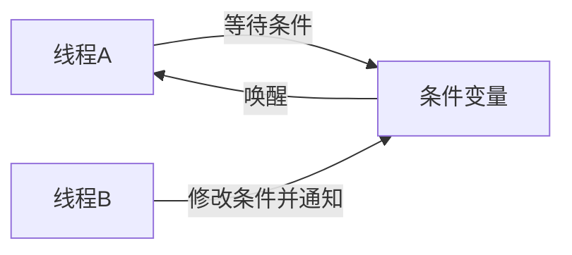
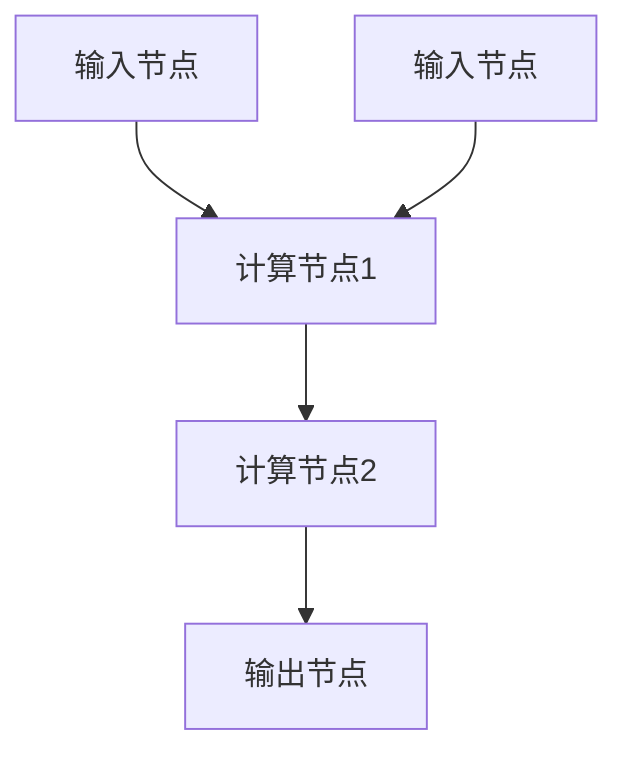
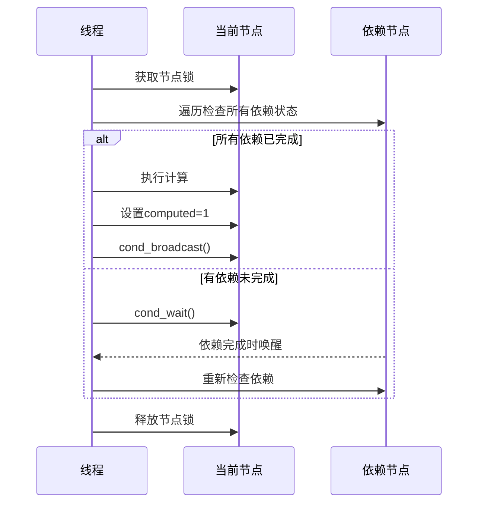

本文主要整理并发控制（条件变量）的要点。

## 一、std::condition_variable

条件变量(`std::condition_variable`)是C++多线程编程中用于线程间同步的重要工具，它允许线程在特定条件满足前等待，并在条件改变时被通知。

### 1. 基本概念



### 2. 核心组件

1. **条件变量**：`std::condition_variable` 或 `std::condition_variable_any`
2. **互斥锁**：`std::mutex`
3. **唯一锁**：`std::unique_lock<std::mutex>`
4. **共享数据**：用于存储条件状态

### 3. 基本使用模式

#### 等待线程

```cpp
std::mutex mtx;
std::condition_variable cv;
bool ready = false; // 条件变量

void waiting_thread() {
    std::unique_lock<std::mutex> lock(mtx);
    
    // 等待条件满足（使用lambda表达式检查条件）
    cv.wait(lock, []{ return ready; });
    
    // 条件满足后执行的操作
    std::cout << "条件满足，继续执行..." << std::endl;
}
```

#### 通知线程

```cpp
void notifying_thread() {
    // 执行一些操作...
    
    {
        std::lock_guard<std::mutex> lock(mtx);
        ready = true; // 修改条件
    } // 锁在这里自动释放
    
    cv.notify_one(); // 通知一个等待线程
    // 或 cv.notify_all(); // 通知所有等待线程
}
```

### 4. 关键方法详解

#### `wait()`

- **作用**：阻塞当前线程直到条件变量被通知
- **重载形式**：
  1. `void wait(std::unique_lock<std::mutex>& lock);`
  2. `void wait(std::unique_lock<std::mutex>& lock, Predicate pred);`

#### `notify_one()`

- 唤醒一个等待线程
- 如果没有等待线程，则无操作

#### `notify_all()`

- 唤醒所有等待线程
- 如果没有等待线程，则无操作

### 5. 完整生产者-消费者示例

```cpp
#include <iostream>
#include <thread>
#include <mutex>
#include <condition_variable>
#include <queue>
#include <chrono>

std::mutex mtx;
std::condition_variable cv;
std::queue<int> data_queue;
const int MAX_SIZE = 10;

void producer(int id) {
    for (int i = 0; i < 5; ++i) {
        std::this_thread::sleep_for(std::chrono::milliseconds(100));
        
        std::unique_lock<std::mutex> lock(mtx);
        
        // 等待队列非满
        cv.wait(lock, []{ return data_queue.size() < MAX_SIZE; });
        
        int data = id * 100 + i;
        data_queue.push(data);
        std::cout << "生产者 " << id << " 生产: " << data << std::endl;
        
        lock.unlock(); // 提前解锁
        cv.notify_all(); // 通知消费者
    }
}

void consumer(int id) {
    while (true) {
        std::unique_lock<std::mutex> lock(mtx);
        
        // 等待队列非空
        cv.wait(lock, []{ return !data_queue.empty(); });
        
        int data = data_queue.front();
        data_queue.pop();
        std::cout << "消费者 " << id << " 消费: " << data << std::endl;
        
        lock.unlock(); // 提前解锁
        cv.notify_all(); // 通知生产者
        
        // 模拟处理时间
        std::this_thread::sleep_for(std::chrono::milliseconds(50));
    }
}

int main() {
    std::thread producers[2];
    std::thread consumers[3];
    
    for (int i = 0; i < 2; ++i) {
        producers[i] = std::thread(producer, i+1);
    }
    
    for (int i = 0; i < 3; ++i) {
        consumers[i] = std::thread(consumer, i+1);
    }
    
    for (auto& t : producers) t.join();
    
    // 等待生产者完成后，添加结束标记
    {
        std::lock_guard<std::mutex> lock(mtx);
        for (int i = 0; i < 3; ++i) {
            data_queue.push(-1); // 结束标记
        }
        cv.notify_all();
    }
    
    for (auto& t : consumers) t.join();
    
    return 0;
}
```

### 6. 使用注意事项

1. **虚假唤醒**：
   - 线程可能在没有收到通知的情况下被唤醒
   - 始终在循环中检查条件：`while (!condition) cv.wait(lock);`

2. **锁的管理**：
   - `wait()`会自动释放锁，唤醒后重新获取锁
   - 在调用`notify`前释放锁，减少等待线程的阻塞时间

3. **条件变量生命周期**：
   - 确保条件变量比所有使用它的线程生命周期更长

4. **通知的时机**：
   - 在修改共享条件后立即通知
   - 考虑使用`notify_one()`还是`notify_all()`

### 7. 常见错误及解决方案

| 错误 | 解决方案 |
|------|----------|
| 忘记检查条件 | 始终使用带谓词的`wait()` |
| 通知时持有锁 | 在锁的作用域外通知 |
| 条件变量生命周期问题 | 确保条件变量比线程生命周期长 |
| 丢失通知 | 在修改条件后立即通知 |
| 过度通知 | 仅在条件改变时通知 |

记住关键原则：
1. 使用互斥锁保护共享数据
2. 在循环或谓词中等待条件
3. 修改条件后立即通知
4. 最小化锁持有时间

通过生产者-消费者模式等标准模式，可以构建高效、安全的并发程序。

## 二、生产者-消费者源码解读

```c
#define CAN_PRODUCE (depth < n)
#define CAN_CONSUME (depth > 0)

void T_produce() {
    while (1) {
        mutex_lock(&lk);

        while (!CAN_PRODUCE) {
            cond_wait(&cv, &lk);
            // We are here if the thread is being waked up, with
            // the mutex being acquired. Then we check once again,
            // and move out of the loop if CAN_PRODUCE holds.
        }

        // We still hold the mutex--and we check again.
        assert(CAN_PRODUCE);

        printf("(");
        depth++;

        cond_broadcast(&cv);
        mutex_unlock(&lk);
    }
}

void T_consume() {
    while (1) {
        mutex_lock(&lk);

        while (!CAN_CONSUME) {
            cond_wait(&cv, &lk);
        }

        printf(")");
        depth--;

        cond_broadcast(&cv);
        mutex_unlock(&lk);
    }
}
```

### 关键机制解析

1. **条件检查模式**：
   ```c
   while (!condition) {
       cond_wait(&cv, &mutex);
   }
   ```
   - 使用`while`而非`if`防止**虚假唤醒**(spurious wakeup)
   - 每次唤醒后重新检查条

2. **广播通知**：
   - 使用`cond_broadcast()`而非`cond_signal()`
   - 原因：可能有多个线程在等待（多个生产者/消费者）
   - 唤醒所有等待线程，让它们竞争锁并检查条件

### 典型执行场景

#### 场景1：缓冲区未满时
1. 生产者获取锁
2. 检查`depth < n` → 条件满足
3. 生产资源（`depth++`）
4. 广播通知
5. 释放锁

#### 场景2：缓冲区已满时
1. 生产者获取锁
2. 检查`depth == n` → 条件不满足
3. 进入等待状态（释放锁）
4. 消费者获取锁并消费资源
5. 消费者广播通知
6. 生产者被唤醒，重新检查条件

## 三、同步机制实现计算图

计算图（Computational Graph）是一种表示数学运算的有向无环图(DAG)，在深度学习框架中广泛使用。下面我将展示如何利用同步原语（互斥锁和条件变量）实现一个线程安全的计算图执行引擎。

### 设计概述



### 核心组件
1. **节点(Node)**：计算图的基本单元
2. **依赖关系(Dependency)**：节点间的数据流
3. **执行引擎(Executor)**：管理节点执行顺序
4. **同步机制(Synchronization)**：协调多线程执行

### 完整实现代码

```c
#include <stdio.h>
#include <stdlib.h>
#include <pthread.h>
#include <unistd.h>

// 同步原语封装
typedef pthread_mutex_t mutex_t;
#define MUTEX_INIT() PTHREAD_MUTEX_INITIALIZER
void mutex_lock(mutex_t *lk) { pthread_mutex_lock(lk); }
void mutex_unlock(mutex_t *lk) { pthread_mutex_unlock(lk); }

typedef pthread_cond_t cond_t;
#define COND_INIT() PTHREAD_COND_INITIALIZER
void cond_wait(cond_t *cv, mutex_t *lk) { pthread_cond_wait(cv, lk); }
void cond_signal(cond_t *cv) { pthread_cond_signal(cv); }
void cond_broadcast(cond_t *cv) { pthread_cond_broadcast(cv); }

// 计算图节点类型
typedef enum {
    INPUT_NODE,
    COMPUTE_NODE,
    OUTPUT_NODE
} NodeType;

// 计算图节点结构
typedef struct Node {
    int id;
    NodeType type;
    int value;
    int computed;  // 是否已计算完成
    
    // 依赖关系
    int dependency_count;
    struct Node **dependencies;
    
    // 同步机制
    mutex_t lock;
    cond_t computed_cond;
} Node;

// 创建新节点
Node *create_node(int id, NodeType type) {
    Node *node = malloc(sizeof(Node));
    node->id = id;
    node->type = type;
    node->value = 0;
    node->computed = 0;
    node->dependency_count = 0;
    node->dependencies = NULL;
    node->lock = MUTEX_INIT();
    node->computed_cond = COND_INIT();
    return node;
}

// 添加依赖关系
void add_dependency(Node *node, Node *dependency) {
    node->dependencies = realloc(node->dependencies, 
                                sizeof(Node*) * (node->dependency_count + 1));
    node->dependencies[node->dependency_count++] = dependency;
}

// 等待所有依赖节点完成
void wait_for_dependencies(Node *node) {
    mutex_lock(&node->lock);
    
    // 检查所有依赖是否完成
    int all_computed = 1;
    for (int i = 0; i < node->dependency_count; i++) {
        Node *dep = node->dependencies[i];
        
        // 锁定依赖节点检查状态
        mutex_lock(&dep->lock);
        if (!dep->computed) {
            all_computed = 0;
        }
        mutex_unlock(&dep->lock);
        
        if (!all_computed) break;
    }
    
    // 如果有未完成的依赖，等待
    while (!all_computed) {
        // 等待任意依赖节点的计算完成通知
        cond_wait(&node->computed_cond, &node->lock);
        
        // 重新检查依赖状态
        all_computed = 1;
        for (int i = 0; i < node->dependency_count; i++) {
            Node *dep = node->dependencies[i];
            mutex_lock(&dep->lock);
            if (!dep->computed) {
                all_computed = 0;
            }
            mutex_unlock(&dep->lock);
            if (!all_computed) break;
        }
    }
    
    mutex_unlock(&node->lock);
}

// 节点计算函数
void compute(Node *node) {
    switch (node->type) {
        case INPUT_NODE:
            // 输入节点由外部设置值
            break;
            
        case COMPUTE_NODE: {
            // 简单示例：求依赖节点值的和
            int sum = 0;
            for (int i = 0; i < node->dependency_count; i++) {
                sum += node->dependencies[i]->value;
            }
            node->value = sum;
            break;
        }
            
        case OUTPUT_NODE:
            // 输出节点直接使用最后一个依赖的值
            if (node->dependency_count > 0) {
                node->value = node->dependencies[0]->value;
            }
            break;
    }
    
    // 标记节点已完成计算
    mutex_lock(&node->lock);
    node->computed = 1;
    cond_broadcast(&node->computed_cond); // 通知所有等待此节点的线程
    mutex_unlock(&node->lock);
}

// 节点执行线程函数
void *node_thread(void *arg) {
    Node *node = (Node *)arg;
    
    // 等待所有依赖完成
    wait_for_dependencies(node);
    
    // 执行计算
    compute(node);
    
    printf("Node %d computed: value=%d\n", node->id, node->value);
    
    return NULL;
}

// 创建并执行计算图
int main() {
    // 创建计算图节点
    Node *input1 = create_node(1, INPUT_NODE);
    Node *input2 = create_node(2, INPUT_NODE);
    Node *compute1 = create_node(3, COMPUTE_NODE);
    Node *compute2 = create_node(4, COMPUTE_NODE);
    Node *output = create_node(5, OUTPUT_NODE);
    
    // 设置输入值
    input1->value = 10;
    input2->value = 20;
    
    // 构建依赖关系
    add_dependency(compute1, input1);
    add_dependency(compute1, input2);
    add_dependency(compute2, compute1);
    add_dependency(output, compute2);
    
    // 设置节点计算状态
    input1->computed = 1;  // 输入节点已就绪
    input2->computed = 1;  // 输入节点已就绪
    
    // 创建线程执行节点
    pthread_t threads[3];
    pthread_create(&threads[0], NULL, node_thread, compute1);
    pthread_create(&threads[1], NULL, node_thread, compute2);
    pthread_create(&threads[2], NULL, node_thread, output);
    
    // 等待所有节点完成
    for (int i = 0; i < 3; i++) {
        pthread_join(threads[i], NULL);
    }
    
    // 打印最终结果
    printf("Final output: %d\n", output->value);
    
    // 清理资源
    free(input1);
    free(input2);
    free(compute1);
    free(compute2);
    free(output);
    
    return 0;
}
```

### 关键同步机制解析

#### 1. 依赖等待机制
```c
void wait_for_dependencies(Node *node) {
    mutex_lock(&node->lock);
    
    // 检查所有依赖是否完成
    int all_computed = 1;
    for (int i = 0; i < node->dependency_count; i++) {
        // ... 检查每个依赖节点的计算状态 ...
    }
    
    // 如果有未完成的依赖，等待
    while (!all_computed) {
        cond_wait(&node->computed_cond, &node->lock);
        // ... 重新检查依赖状态 ...
    }
    
    mutex_unlock(&node->lock);
}
```
- 使用条件变量等待依赖节点完成
- 循环检查防止虚假唤醒
- 获取每个依赖节点的锁来检查状态

#### 2. 计算完成通知
```c
void compute(Node *node) {
    // ... 执行计算 ...
    
    mutex_lock(&node->lock);
    node->computed = 1;
    cond_broadcast(&node->computed_cond);
    mutex_unlock(&node->lock);
}
```
- 计算完成后设置computed标志
- 使用`cond_broadcast`通知所有等待此节点的线程
- 广播而不是信号，因为多个节点可能等待同一个节点

#### 3. 线程执行流程


### 计算图执行流程

#### 示例计算图
```
输入1 (10) ---> 计算1 (求和)
输入2 (20) ---> 计算1 (求和) ---> 计算2 (求和) ---> 输出
```

#### 执行顺序
1. 输入节点已就绪（computed=1）
2. 计算1节点：
   - 等待输入1和输入2完成 → 立即满足
   - 计算：10 + 20 = 30
   - 标记完成并广播
3. 计算2节点：
   - 等待计算1完成 → 被计算1的广播唤醒
   - 计算：30 (只有1个依赖)
   - 标记完成并广播
4. 输出节点：
   - 等待计算2完成 → 被计算2的广播唤醒
   - 输出值：30

### 性能优化技术

#### 1. 线程池优化
```c
// 线程池实现伪代码
void thread_pool_executor(Graph *graph) {
    ThreadPool pool;
    Queue ready_queue;
    
    // 初始化就绪队列（入度为0的节点）
    for (Node *node : graph->nodes) {
        if (node->dependency_count == 0) {
            ready_queue.push(node);
        }
    }
    
    while (!ready_queue.empty()) {
        Node *node = ready_queue.pop();
        pool.submit([=] {
            compute(node);
            
            // 遍历后继节点
            for (Node *succ : node->successors) {
                lock(succ->lock);
                succ->remaining_deps--;
                if (succ->remaining_deps == 0) {
                    ready_queue.push(succ);
                }
                unlock(succ->lock);
            }
        });
    }
}
```

#### 2. 依赖计数器优化
- 每个节点维护`remaining_deps`计数器
- 替代遍历检查所有依赖节点
- 依赖节点完成时原子递减计数器

```c
struct Node {
    // ...
    int remaining_deps; // 剩余未完成的依赖数
    // ...
};

// 节点完成时更新后继
void on_node_complete(Node *node) {
    for (Node *succ : node->successors) {
        mutex_lock(&succ->lock);
        succ->remaining_deps--;
        if (succ->remaining_deps == 0) {
            cond_signal(&succ->computed_cond);
        }
        mutex_unlock(&succ->lock);
    }
}
```

#### 3. 多条件变量优化
- 为不同节点组使用独立条件变量
- 减少无效唤醒
- 提高唤醒效率

### 应用场景

1. **深度学习框架**
   - TensorFlow/PyTorch后端执行引擎
   - 自动微分计算

2. **数据处理流水线**
   - ETL(抽取、转换、加载)流程
   - 多阶段数据处理

3. **任务调度系统**
   - 复杂依赖任务执行
   - DAG工作流引擎

4. **编译器优化**
   - 指令调度
   - 数据流分析

### 总结

通过同步原语实现计算图的关键点：
1. **依赖管理**：使用条件变量等待前置节点完成
2. **状态传播**：通过广播/信号通知后继节点
3. **线程安全**：互斥锁保护节点状态和依赖计数器
4. **拓扑排序**：基于依赖关系确定执行顺序

这种实现方式提供了：
- **自动并行化**：独立节点可并行执行
- **高效同步**：最小化线程阻塞时间
- **正确性保证**：通过同步机制确保数据依赖
- **可扩展性**：支持任意复杂度的计算图

实际工业级实现（如TensorFlow）还会加入：
- 跨设备同步（CPU/GPU）
- 梯度计算特殊处理
- 分布式执行支持
- 计算图分区优化

通过合理使用同步原语，我们可以构建高效、可靠的计算图执行引擎，为各种计算密集型应用提供强大的并行处理能力。