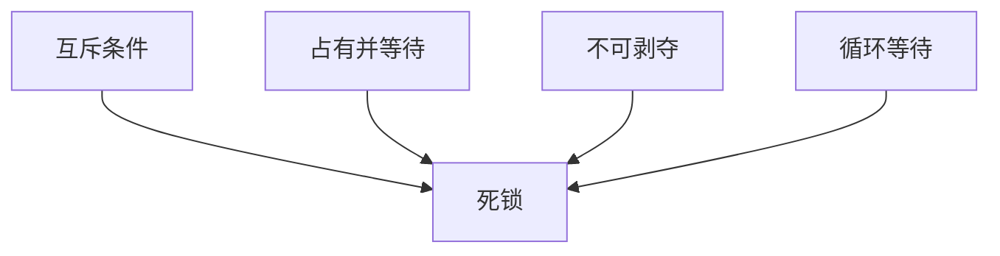
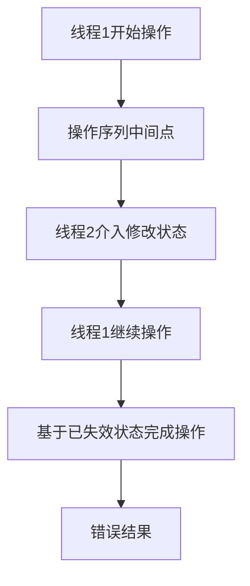

本文主要整理并发Bugs和应对的要点。

## 一、死锁产生的条件
死锁（Deadlock）是并发系统中一种严重的资源竞争问题，指两个或多个进程（线程）因争夺资源而陷入无限等待的状态。理解死锁产生的条件是预防和解决死锁的关键。

**死锁产生的四个必要条件**



### 1. 互斥条件 (Mutual Exclusion)
- **定义**：资源不能被共享，一次只能被一个进程使用
- **特点**：
  - 资源本质上是独占的（如打印机、临界区）
  - 其他进程请求该资源时必须等待
- **示例**：
  ```c
  pthread_mutex_t printer = PTHREAD_MUTEX_INITIALIZER;
  
  void print_document() {
      pthread_mutex_lock(&printer);  // 互斥访问打印机
      // 使用打印机...
      pthread_mutex_unlock(&printer);
  }
  ```

### 2. 占有并等待 (Hold and Wait)
- **定义**：进程持有至少一个资源，同时等待获取其他进程持有的资源
- **特点**：
  - 进程在等待期间不释放已持有资源
  - 资源分配呈现部分分配状态
- **示例**：
  ```c
  void process_A() {
      pthread_mutex_lock(&resource1);
      // ...执行操作...
      pthread_mutex_lock(&resource2);  // 等待resource2
      // ...使用两个资源...
      pthread_mutex_unlock(&resource2);
      pthread_mutex_unlock(&resource1);
  }
  
  void process_B() {
      pthread_mutex_lock(&resource2);
      // ...执行操作...
      pthread_mutex_lock(&resource1);  // 等待resource1
      // ...使用两个资源...
      pthread_mutex_unlock(&resource1);
      pthread_mutex_unlock(&resource2);
  }
  ```

### 3. 不可剥夺 (No Preemption)
- **定义**：资源不能被强制从持有它的进程手中夺走
- **特点**：
  - 资源只能由持有进程主动释放
  - 系统不能强行回收资源
- **示例**：
  ```c
  // 线程持有锁时，其他线程不能强制解锁
  pthread_mutex_t lock = PTHREAD_MUTEX_INITIALIZER;
  
  void critical_section() {
      pthread_mutex_lock(&lock);
      // 系统不能强行剥夺这个锁
      // ...关键操作...
      pthread_mutex_unlock(&lock);  // 只能由持有线程释放
  }
  ```

### 4. 循环等待 (Circular Wait)
- **定义**：存在一组进程{P1, P2, ..., Pn}，其中：
  - P1等待P2占用的资源
  - P2等待P3占用的资源
  - ...
  - Pn等待P1占用的资源
- **特点**：
  - 形成资源请求的循环链
  - 所有进程都在等待下一个进程释放资源
- **循环等待示意图**：
  ```mermaid
  graph LR
      P1[进程1] -->|等待| R2[资源2]
      P2[进程2] -->|等待| R3[资源3]
      P3[进程3] -->|等待| R1[资源1]
      R1 -->|被进程1占有| P1
      R2 -->|被进程2占有| P2
      R3 -->|被进程3占有| P3
  ```

### 5. 死锁预防策略（破坏必要条件）

| 必要条件 | 破坏方法 | 实现示例 |
|----------|----------|----------|
| **互斥条件** | 允许资源共享 | 使用无锁数据结构<br>`std::atomic<int> counter;` |
| **占有并等待** | 一次性申请所有资源 | `pthread_mutex_lock(&global_lock);`<br>`// 获取所有资源` |
| **不可剥夺** | 允许资源抢占 | 超时机制：<br>`pthread_mutex_trylock()` |
| **循环等待** | 资源排序分配 | 统一获取顺序：<br>`int min = std::min(left, right);`<br>`int max = std::max(left, right);` |

## 二、Lock Ordering

锁排序是一种**预防死锁的核心策略**，通过强制线程按照固定的全局顺序获取锁来破坏死锁的循环等待条件。下面我将详细解释其原理、实现方法和最佳实践。
锁排序基于一个简单但强大的思想：**如果所有线程都按照相同的顺序请求锁，就不可能形成循环等待链**。


**死锁条件破坏**

- **目标条件**：循环等待（Circular Wait）
- **破坏方法**：强制所有锁请求遵循线性顺序
- **效果**：资源依赖图从循环变为线性

### 1. 建立全局顺序
为系统中的每个锁分配唯一序号：
```c
pthread_mutex_t lockA;  // 顺序1
pthread_mutex_t lockB;  // 顺序2
pthread_mutex_t lockC;  // 顺序3
```

### 2. 获取锁的规则
线程必须按照序号**从小到大**获取锁：
```c
void safe_operation() {
    // 正确顺序：lockA -> lockB -> lockC
    pthread_mutex_lock(&lockA);
    pthread_mutex_lock(&lockB);
    pthread_mutex_lock(&lockC);
    
    // ...操作共享资源...
    
    // 解锁顺序可以任意（但建议逆序）
    pthread_mutex_unlock(&lockC);
    pthread_mutex_unlock(&lockB);
    pthread_mutex_unlock(&lockA);
}
```

### 3. 禁止的锁获取模式
```c
void unsafe_operation() {
    // 危险：违反全局顺序（lockB在lockA之前）
    pthread_mutex_lock(&lockB);  // 顺序2
    pthread_mutex_lock(&lockA);  // 顺序1 ← 错误！
    // ...
}
```

## 三、lockdep源码解读

```c
// This function is to be C-linked; name mangling is disabled.
extern "C"
void lock(lock_t *lk) {
    // Vertices and edges (set<>s) are shared across threads.
    // Keep them safe with an RAII-guarded lock.
    { [[maybe_unused]] HoldLock h(&GL);
        bool updated = false;

        vertices->insert(lk->name);
        for (auto name : held_locks) {
            edge e(name, lk->name);
            if (!edges->contains(e)) {
                edges->insert(e);
                updated = true;
            }
        }

        if (updated) {
            check_cycles();
        }
    }

    // The held_locks is declared as thread_local.
    // No need for locks.
    held_locks.insert(lk->name);

    mutex_lock(&lk->mutex);
}

extern "C"
void unlock(lock_t *lk) {
    mutex_unlock(&lk->mutex);

    held_locks.erase(lk->name);
}

static void check_cycles() {
    // At this point, we must have held GL.
    // Unfortunately, there is no graceful way to check if
    // this lock is held by the current thread.
    assert(pthread_mutex_trylock(&GL) == EBUSY);

    // Transitive closure by Floyd-Warshall's algorithm.
    for (auto v: *vertices)
        for (auto u: *vertices)
            for (auto w: *vertices)
                if (edges->contains({u, v}) && edges->contains({v, w})) {
                    edges->insert({u, w});
                }

    // Check for cycles
    cout << endl << "Lockdep check:" << endl;
    for (auto [u, v] : *edges) {
        cout << "    " << u << " -> " << v << endl;
        if (u == v) {
            cout << "    \033[31m!!! Cycle detected for "
                 << u << "\033[0m" << endl;
        }
    }
}
```

### 1. 死锁条件形成
当依赖图中出现以下模式时：
```
线程1: A -> B
线程2: B -> A
```
经过传递闭包计算后：
```
A -> B -> A → 检测到 A->A
```

### 2. 检测示例
假设两个线程操作：
```c
// 线程1
lock(&A);
lock(&B);
unlock(&B);
unlock(&A);

// 线程2
lock(&B);
lock(&A);
unlock(&A);
unlock(&B);
```

Lockdep将报告：
```
Lockdep check:
    A -> B
    B -> A
    A -> A  !!! Cycle detected for A
    B -> B  !!! Cycle detected for B
```

## 四、Atomicity Violation


Atomicity Violation (原子性违反) 发生在**一组本应原子执行的操作被其他线程打断**，导致程序状态出现不一致。



### 核心特征
1. **操作序列中断**：关键操作序列未受到保护
2. **中间状态暴露**：操作过程中的临时状态被其他线程观察到
3. **数据不一致**：基于过期状态做出决策

### 经典案例：检查后使用(Check-then-Act)

```c
// 银行账户转账
void transfer(Account* from, Account* to, int amount) {
    if (from->balance >= amount) {           // 检查
        // <-- 此处可能被其他线程打断
        from->balance -= amount;            // 使用
        to->balance += amount;
    }
}
```

**问题场景**：
1. 账户A余额100，向账户B转账100
2. 线程1检查通过（100>=100）
3. 同时线程2从账户A转账60
4. 线程1继续执行：100-100=0（应为40-100=-60）

### 模式识别


决策点(B)和状态修改点(C)之间缺乏原子性保护是问题的根源。

### 解决方案
1. **互斥锁保护整个临界区**
   ```c
   pthread_mutex_lock(&account_lock);
   if (from->balance >= amount) {
       from->balance -= amount;
       to->balance += amount;
   }
   pthread_mutex_unlock(&account_lock);
   ```

2. **事务内存**
   ```cpp
   __transaction_atomic {
       if (from->balance >= amount) {
           from->balance -= amount;
           to->balance += amount;
       }
   }
   ```

3. **原子操作**
   ```cpp
   bool transfer_atomic(Account* from, Account* to, int amount) {
       int old_balance = from->balance.load();
       while (old_balance >= amount) {
           if (from->balance.compare_exchange_weak(old_balance, 
                                                  old_balance - amount)) {
               to->balance.fetch_add(amount);
               return true;
           }
       }
       return false;
   }
   ```

## 五、Order Violation

Order Violation (顺序违反)发生在**操作执行顺序与预期逻辑顺序不一致**，导致程序状态错误。


### 核心特征
1. **隐含顺序依赖**：操作B必须在操作A完成后执行
2. **缺乏显式同步**：没有强制顺序的机制
3. **时间敏感错误**：问题只在特定时序下出现

### 经典案例：初始化前使用

```c
// 全局配置
Config* global_config = NULL;

// 初始化线程
void init_thread() {
    global_config = load_config();  // 耗时操作
}

// 工作线程
void worker_thread() {
    // 可能先于初始化执行
    if (global_config->debug_mode) {  // 解引用空指针!
        log_debug("Starting work");
    }
    // ...
}
```

**问题场景**：
1. 工作线程在初始化线程完成前运行
2. 访问未初始化的`global_config`
3. 导致空指针解引用崩溃

### 模式识别


箭头表示的依赖关系在代码中没有显式同步保证。

### 解决方案
1. **条件变量同步**
   ```c
   pthread_mutex_t config_lock = PTHREAD_MUTEX_INITIALIZER;
   pthread_cond_t config_ready = PTHREAD_COND_INITIALIZER;
   bool config_initialized = false;
   
   void init_thread() {
       pthread_mutex_lock(&config_lock);
       global_config = load_config();
       config_initialized = true;
       pthread_cond_broadcast(&config_ready);
       pthread_mutex_unlock(&config_lock);
   }
   
   void worker_thread() {
       pthread_mutex_lock(&config_lock);
       while (!config_initialized) {
           pthread_cond_wait(&config_ready, &config_lock);
       }
       pthread_mutex_unlock(&config_lock);
       
       // 安全使用global_config
   }
   ```

2. **屏障同步**
   ```c
   pthread_barrier_t init_barrier;
   
   void init_thread() {
       global_config = load_config();
       pthread_barrier_wait(&init_barrier);
   }
   
   void worker_thread() {
       pthread_barrier_wait(&init_barrier);  // 等待初始化完成
       // 安全使用global_config
   }
   ```

3. **信号量控制**
   ```c
   sem_t config_sem;
   sem_init(&config_sem, 0, 0);  // 初始不可用
   
   void init_thread() {
       global_config = load_config();
       sem_post(&config_sem);    // 标记为可用
   }
   
   void worker_thread() {
       sem_wait(&config_sem);    // 等待初始化
       // 安全使用global_config
   }
   ```

### 对比分析

| 特性 | Atomicity Violation | Order Violation |
|------|---------------------|-----------------|
| **本质问题** | 操作序列被打断 | 操作顺序颠倒 |
| **关键点** | 临界区保护不足 | 顺序依赖未保障 |
| **错误表现** | 数据不一致 | 未初始化使用 |
| **检测难度** | 中等（数据损坏） | 高（时序敏感） |
| **典型场景** | 检查后使用 | 初始化前使用 |
| **主要修复** | 扩大临界区 | 添加顺序同步 |
| **工具检测** | 数据竞争检测器 | 静态分析工具 |


## 六、-fsanitize=thread

`-fsanitize=thread` 是 Clang/GCC 编译器提供的一个**革命性的动态分析工具**，专门用于检测多线程程序中的数据竞争(Data Races)和死锁(Deadlocks)问题。它实现了 Google 的 ThreadSanitizer(TSan) 技术，是并发编程中不可或缺的调试利器。

### 1. 核心功能与工作原理

#### 检测能力矩阵
| 问题类型         | 检测能力 | 典型场景                     |
|------------------|----------|------------------------------|
| 数据竞争         | ⭐⭐⭐⭐⭐   | 多线程同时访问共享变量       |
| 死锁             | ⭐⭐⭐⭐     | 循环等待锁资源               |
| 原子性违反       | ⭐⭐⭐⭐     | 非原子操作序列被打断         |
| 锁顺序违规       | ⭐⭐⭐      | 不按全局顺序获取锁           |
| 未初始化内存访问 | ⭐⭐       | 使用未初始化同步原语         |

#### 工作原理


1. **编译时插桩**：
   - 编译器在每个内存访问和同步操作处插入检测代码
   - 记录操作类型、线程ID、内存地址等元数据

2. **运行时监控**：
   - 维护每个内存地址的访问历史
   - 跟踪线程创建/销毁、锁操作、信号量操作等

3. **Happens-Before(HB)关系分析**：
   - 构建线程操作间的偏序关系
   - 检测是否存在冲突访问缺乏同步

4. **数据竞争报告**：
   - 当发现两个冲突访问没有HB关系时报告错误
   - 提供详细调用栈和冲突位置

### 2. 核心优势

#### 2.1. 高效的数据竞争检测
**传统方法**：
```c
int counter = 0;

void* increment(void* arg) {
    for (int i = 0; i < 1000000; i++) {
        counter++; // 数据竞争!
    }
    return NULL;
}

int main() {
    pthread_t t1, t2;
    pthread_create(&t1, NULL, increment, NULL);
    pthread_create(&t2, NULL, increment, NULL);
    pthread_join(t1, NULL);
    pthread_join(t2, NULL);
    printf("Counter: %d\n", counter);
}
```
**TSan检测**：
```
WARNING: ThreadSanitizer: data race
  Write of size 4 at 0x00000060108c by thread T2:
    #0 increment /path/to/file.c:10:16

  Previous write of size 4 at 0x00000060108c by thread T1:
    #0 increment /path/to/file.c:10:16
```

#### 2.2. 死锁检测能力
```c
pthread_mutex_t A = PTHREAD_MUTEX_INITIALIZER;
pthread_mutex_t B = PTHREAD_MUTEX_INITIALIZER;

void* thread1(void* arg) {
    pthread_mutex_lock(&A);
    sleep(1);
    pthread_mutex_lock(&B); // 死锁点
    return NULL;
}

void* thread2(void* arg) {
    pthread_mutex_lock(&B);
    sleep(1);
    pthread_mutex_lock(&A); // 死锁点
    return NULL;
}
```
**TSan报告**：
```
WARNING: ThreadSanitizer: lock-order-inversion
  Cycle in lock order graph: M1 => M2 => M1

  Mutex M1 acquired here while holding mutex M2:
    #0 pthread_mutex_lock

  Mutex M2 acquired here while holding mutex M1:
    #0 pthread_mutex_lock
```

### 3. 使用指南

#### 基本使用
```bash
# 编译时启用TSan
clang -fsanitize=thread -g -O1 your_program.c -o your_program
./your_program

# 或使用GCC
gcc -fsanitize=thread -g -O1 your_program.c -o your_program -lpthread
```

#### 环境变量控制
```bash
# 设置报告格式
export TSAN_OPTIONS="verbosity=2:log_path=tsan_report.log"

# 控制检测灵敏度
export TSAN_OPTIONS="detect_deadlocks=1:history_size=7"

# 忽略已知问题
export TSAN_OPTIONS="suppressions=tsan.supp"
```

#### 高级选项
| 选项                  | 功能描述                          | 推荐值       |
|-----------------------|-----------------------------------|--------------|
| `halt_on_error`       | 发现第一个错误后是否停止          | 0 (继续运行) |
| `report_thread_leaks` | 报告线程泄漏                      | 1 (启用)     |
| `history_size`        | 内存访问历史深度                  | 7 (最佳平衡) |
| `detect_deadlocks`    | 死锁检测模式 (0=关, 1=全, 2=部分) | 1 (完全检测) |

### 4. 实战案例解析

#### 案例1：原子性违反检测
```c
#include <pthread.h>
#include <stdio.h>

int balance = 100; // 共享账户余额

void* withdraw(void* amount) {
    int amt = *(int*)amount;
    if (balance >= amt) {
        // 模拟处理延迟
        sleep(0.1);
        balance -= amt;
    }
    return NULL;
}

int main() {
    pthread_t t1, t2;
    int amt1 = 80, amt2 = 50;
    
    pthread_create(&t1, NULL, withdraw, &amt1);
    pthread_create(&t2, NULL, withdraw, &amt2);
    
    pthread_join(t1, NULL);
    pthread_join(t2, NULL);
    
    printf("Final balance: %d\n", balance);
    return 0;
}
```

**TSan报告**：
```
WARNING: ThreadSanitizer: data race on balance
  Read by thread T2:
    #0 withdraw /path/file.c:8:12

  Write by thread T1:
    #0 withdraw /path/file.c:11:9
```

**问题分析**：
1. 两个线程同时检查余额
2. 都通过检查后各自扣款
3. 导致余额变为负值

**修复方案**：
```c
// 添加互斥锁
pthread_mutex_t lock = PTHREAD_MUTEX_INITIALIZER;

void* withdraw(void* amount) {
    pthread_mutex_lock(&lock);
    // ... 临界区操作 ...
    pthread_mutex_unlock(&lock);
}
```

#### 案例2：顺序违反检测
```c
#include <pthread.h>
#include <stdio.h>

int* global_ptr = NULL;

void* init_thread(void* arg) {
    sleep(1); // 模拟初始化延迟
    int value = 42;
    global_ptr = &value; // 错误：局部变量地址!
    return NULL;
}

void* use_thread(void* arg) {
    printf("Value: %d\n", *global_ptr); // 可能解引用无效指针
    return NULL;
}

int main() {
    pthread_t t1, t2;
    pthread_create(&t1, NULL, init_thread, NULL);
    pthread_create(&t2, NULL, use_thread, NULL);
    
    pthread_join(t1, NULL);
    pthread_join(t2, NULL);
    return 0;
}
```

**TSan报告**：
```
WARNING: ThreadSanitizer: data race on global_ptr
  Write by thread T1:
    #0 init_thread /path/file.c:8:16

  Read by thread T2:
    #0 use_thread /path/file.c:13:26
```

**问题分析**：
1. 使用线程可能先于初始化线程执行
2. global_ptr 可能未初始化或指向无效内存
3. 存在跨线程栈内存访问风险

**修复方案**：
```c
// 添加同步机制
pthread_mutex_t lock = PTHREAD_MUTEX_INITIALIZER;
pthread_cond_t cond = PTHREAD_COND_INITIALIZER;
int initialized = 0;

void* init_thread(void* arg) {
    // ... 初始化 ...
    pthread_mutex_lock(&lock);
    global_ptr = malloc(sizeof(int));
    *global_ptr = 42;
    initialized = 1;
    pthread_cond_broadcast(&cond);
    pthread_mutex_unlock(&lock);
}

void* use_thread(void* arg) {
    pthread_mutex_lock(&lock);
    while (!initialized) {
        pthread_cond_wait(&cond, &lock);
    }
    pthread_mutex_unlock(&lock);
    // 安全访问
}
```

### 5. 性能影响与优化

#### 性能开销
| 资源类型   | 典型开销       | 优化建议                     |
|------------|----------------|------------------------------|
| CPU        | 2-5倍          | 仅用于调试，生产环境禁用     |
| 内存       | 5-10倍         | 增加系统内存                 |
| 磁盘       | 日志写入开销   | 使用内存文件系统             |
| 执行时间   | 10-20倍        | 减少测试数据规模             |

#### 优化策略
1. **选择性检测**：
   ```bash
   # 仅检测特定文件
   clang -fsanitize=thread -g -O1 main.c utils.c -o app
   clang -c -fsanitize=thread critical.c # 仅关键文件
   ```

2. **黑名单功能**：
   ```text
   # tsan_ignore.txt
   fun:high_frequency_function
   src:third_party/*
   ```
   ```bash
   export TSAN_OPTIONS="ignore=tsan_ignore.txt"
   ```

3. **采样检测**：
   ```bash
   # 每1000次内存访问采样1次
   export TSAN_OPTIONS="sample_events=1000"
   ```

### 6. 与其他工具对比

| 工具            | 检测能力      | 性能开销 | 适用场景         |
|-----------------|---------------|----------|------------------|
| **TSan**        | 数据竞争/死锁 | 高       | 开发/测试阶段    |
| **Helgrind**    | 死锁/顺序违规 | 极高     | 深度调试         |
| **DRD**         | 锁错误        | 高       | 锁相关错误       |
| **静态分析**    | 潜在风险      | 低       | 代码审查/CI      |
| **Lockdep**     | 锁顺序        | 中       | 内核开发         |

### 总结

`-fsanitize=thread` 是并发编程的"X光机"：
- 🛡️ **预防灾难性错误**：捕获数据竞争和死锁
- 🔍 **深度可见性**：提供详细冲突上下文
- ⏱️ **节省调试时间**：将数天的调试缩短至数小时
- 📊 **提升代码质量**：强制良好并发实践

使用建议：
1. 在开发早期和持续集成中启用
2. 关注关键并发模块
3. 结合日志和单元测试分析报告
4. 生产环境务必禁用

通过将 TSan 纳入开发流程，团队可以显著提高并发代码的可靠性和健壮性，减少生产环境中的并发故障风险。