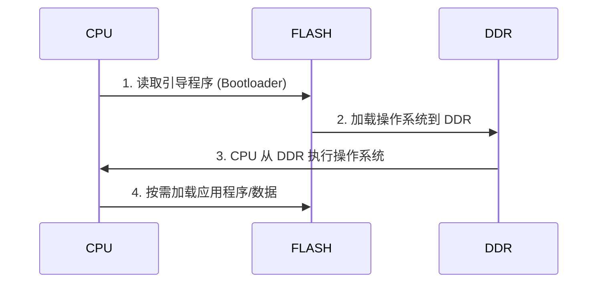
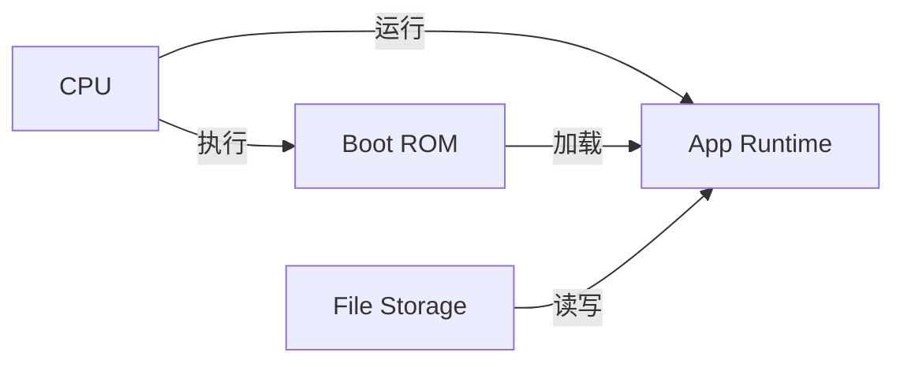
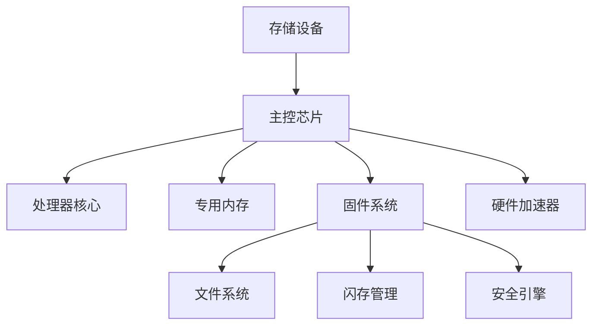
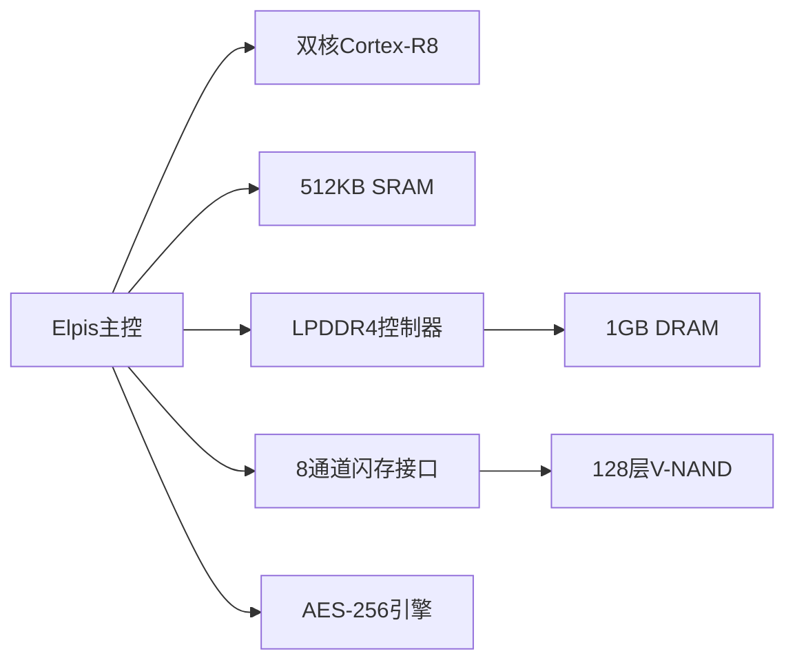
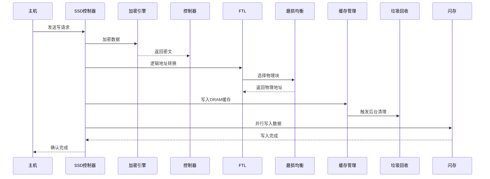
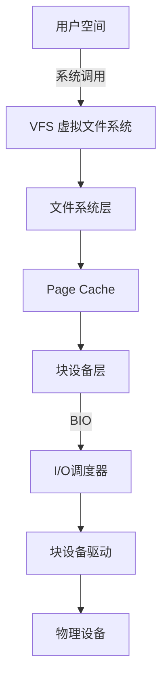
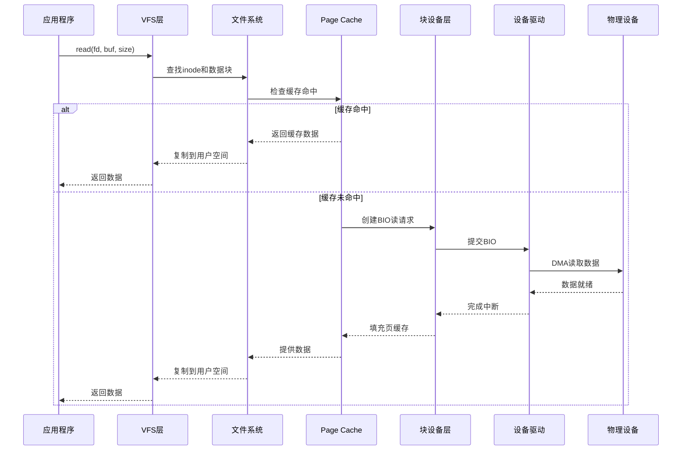
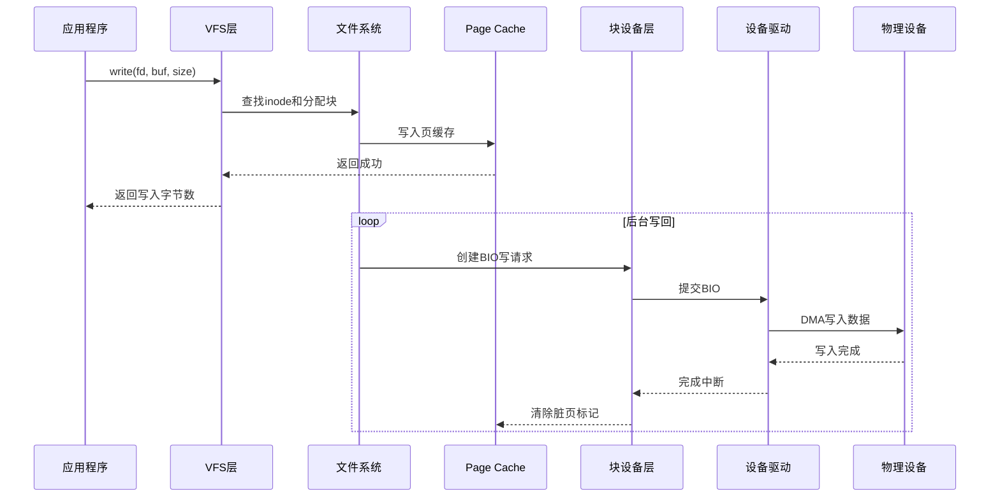
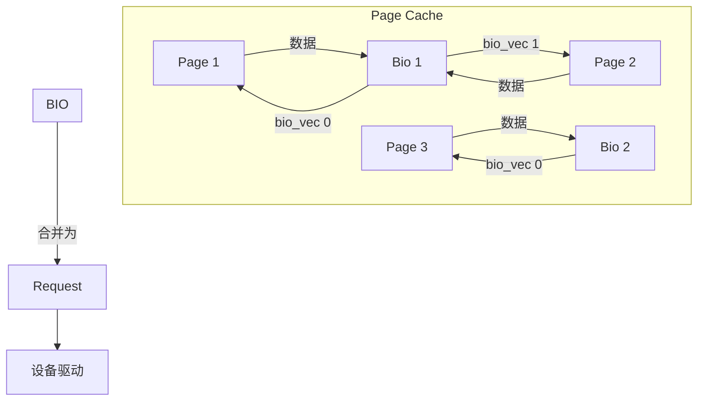
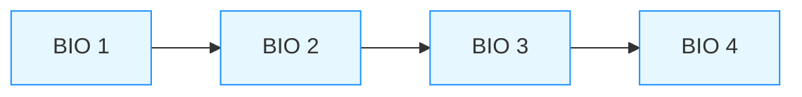

本文主要整理存储设备原理章节的要点。

## 一、FLASH、DDR对比

FLASH 和 DDR 是计算机系统中两种完全不同的存储技术，它们在系统中扮演互补的角色。以下是它们的核心关系及对比分析：

---

### **1. 基础概念对比**
| **特性**       | **FLASH 存储器**                     | **DDR 存储器**                      |
|----------------|--------------------------------------|-------------------------------------|
| **类型**       | 非易失性存储器 (NVM)                 | 易失性存储器 (RAM)                  |
| **断电后数据** | 保留数据                             | 丢失数据                            |
| **主要用途**   | 长期存储 (固件、操作系统、用户数据) | 临时运行内存 (CPU 工作空间)         |
| **读写速度**   | 慢 (μs~ms 级延迟)                    | 极快 (ns 级延迟)                    |
| **寿命**       | 有限擦写次数 (约 1万~10万次)         | 理论上无限次读写                    |
| **价格/容量**  | 低成本/大容量 (GB~TB)                | 高成本/中等容量 (GB 级)             |

---

### **2. 协同工作关系**
#### (1) **系统启动流程**


#### (2) **运行时数据流**
```
         [CPU]
          ↑↓ 高速访问
         [DDR] ←→ 临时工作区
          ↑↓ 批量传输
    [FLASH/SSD] ←→ 永久存储
```

---

### **3. 关键交互场景**
#### (1) **启动加速 (XIP)**
- **eXecute-In-Place**：
  - NOR Flash 允许 CPU **直接执行代码**（无需加载到 DDR）
  - 应用：嵌入式系统启动代码
  - 限制：速度远低于 DDR

#### (2) **虚拟内存交换**
- 当 DDR 空间不足时：
  ```c
  // Linux 内核页面交换
  swap_out_page(DDR_page);   // 将 DDR 页面写入 FLASH/SSD
  swap_in_page(FLASH_page);  // 从存储设备加载到 DDR
  ```

#### (3) **混合存储架构**
- **Intel Optane 技术**：
  - 使用 3D XPoint (类似 FLASH 的非易失存储)
  - 作为 DDR 和 SSD 之间的缓存层
  - 延迟：≈ 300ns (DDR4: 15ns, NAND FLASH: 100μs)

---

### **4. 硬件接口差异**
| **特性**         | FLASH                         | DDR                           |
|------------------|-------------------------------|-------------------------------|
| **物理接口**     | SPI, eMMC, NVMe, SATA         | DIMM 插槽 (双通道/四通道)     |
| **控制信号**     | 片选(CS)、时钟(SCK)           | 时钟(CLK)、选通(DQS)          |
| **关键时序**     | 页编程时间(~200μs)            | 时序参数(tCL, tRCD, tRP)      |
| **纠错机制**     | ECC (每512字节+8位)           | ECC (每64位+8位)              |

---

### **5. 典型应用场景**
#### **嵌入式系统**


#### **数据中心服务器**
```
NVMe SSD (FLASH) 
  → PCIe总线 → 
    DDR4 Cache → 
      CPU寄存器
```

---

### **6. 技术融合趋势**
1. **NVDIMM (非易失内存)**  
   - 结合 DDR + FLASH + 超级电容
   - 断电时自动将 DDR 数据转存到 FLASH

2. **CXL 互联协议**  
   - 允许 FLASH 设备通过 DDR 总线连接 CPU
   - 实现存储级内存 (Storage-Class Memory)

3. **HBM + FLASH 堆叠**  
   - 3D 封装中将 FLASH 与 DDR 集成
   - 应用：AI 推理芯片的持久化权重存储

---

### **7. 性能优化实践**
#### **DDR 优化 FLASH 访问**
```c
// 使用 DDR 作为 FLASH 写缓存
void flash_write(uint32_t addr, void* data, size_t len) {
    ddr_cache[addr] = data;       // 先写入 DDR 缓存
    schedule_flash_flush();        // 异步刷写到 FLASH
}

// 读取时优先查 DDR 缓存
void* flash_read(uint32_t addr) {
    if(ddr_cache_hit(addr)) 
        return ddr_cache[addr];
    else 
        return physical_flash_read(addr);
}
```

#### **FLASH 延长 DDR 寿命**
- 在 SSD 控制器中：
  - 使用 DDR 缓存 **FTL 映射表** (Flash Translation Layer)
  - 减少对 FLASH 元数据的直接访问

---

### **总结**
- **功能互补**：  
  FLASH = 永久存储仓库，DDR = 高速工作台
- **性能鸿沟**：  
  DDR 速度比 FLASH 快 1000 倍以上
- **演进方向**：  
  新型非易失内存 (PCM, ReRAM) 试图统一两者特性
- **设计启示**：  
  系统架构需根据两者特性优化数据局部性：
  - 热数据 → DDR
  - 冷数据 → FLASH
  - 温数据 → 混合缓存层

## 二、SSD/优盘/TF卡内计算机系统

您提到的现象是现代存储设备中一个非常有趣的技术现实——**看似简单的存储设备内部其实运行着完整的嵌入式计算机系统**。让我从技术角度深入解释这一现象：

### 1. 存储设备的"隐藏计算机"架构


#### 核心组件解析：
1. **主控芯片 (Controller)**
   - 相当于设备的"CPU"
   - 常见架构：ARM Cortex-R/M系列 (如三星SSD用Cortex-R8)
   - 频率：100MHz-1.5GHz (高端SSD可达3GHz)

2. **专用内存**
   - DRAM缓存：512MB-4GB (企业级SSD)
   - SRAM：芯片内置高速缓存
   - 示例：WD SN850X SSD 配备2GB LPDDR4

3. **固件系统**
   - 相当于设备的"操作系统"
   - 代码规模：10万-200万行C代码
   - 功能模块：
     ```c
     // 伪代码展示固件结构
     void firmware_main() {
         init_hardware();      // 硬件初始化
         load_ftl();           // 闪存转换层
         start_gc_thread();    // 垃圾回收线程
         run_wear_leveling();  // 磨损均衡
         handle_commands();    // 处理主机指令
     }
     ```

---

### 2. 为什么需要完整计算机系统？

#### 2.1. 闪存管理的复杂性


- **FTL (Flash Translation Layer)**：
  - 实现类似虚拟内存的地址映射
  - 典型映射表大小：1TB SSD需要1GB映射表
  - 需要实时更新：每次写入都需更新映射关系

#### 2.2. 性能优化需求
- **读写调度算法**：
  ```python
  # 伪代码：多通道并行调度
  def schedule_write(requests):
      sort_by_lba(requests)  # 逻辑块地址排序
      group = split_to_channels(requests)  # 分配到8-32个闪存通道
      for chan in group:
          execute_parallel(chan)  # 并行执行
  ```

- **缓存管理**：
  - DRAM缓存：存储热数据/映射表
  - SLC缓存：TLC/QLC模拟SLC高速写入

#### 2.3. 安全功能实现
- **加密引擎**：
  - AES-256/XTS硬件加速
  - 自加密驱动器(SED)标准
- **安全启动**：
  ```mermaid
  sequenceDiagram
      主机->>设备: 发送指令
      设备->>安全处理器: 验证签名
      安全处理器-->>设备: 验证通过
      设备->>闪存: 执行操作
  ```

---

### 3. 典型设备系统对比

| **组件**        | 高端SSD                 | U盘                 | TF卡               |
|----------------|------------------------|---------------------|-------------------|
| **处理器**      | 多核ARM Cortex-R8      | 单核Cortex-M3       | RISC-V 嵌入式核    |
| **内存**        | 2-4GB LPDDR4           | 无DRAM (HMB技术)    | 片上SRAM (256KB)  |
| **存储管理**    | 多层FTL + AI预测       | 基础FTL             | 精简FTL           |
| **接口速度**    | PCIe 4.0 x4 (8GB/s)    | USB 3.2 (1.2GB/s)   | UHS-II (312MB/s)  |
| **固件复杂度**  | 200万行代码            | 5万行代码           | 2万行代码         |

---

### 4. 实际案例解析

#### 4.1. 三星980 Pro SSD内部架构


#### 4.2. 当您拷贝文件时发生的完整流程：



## 三、块设备数据读写流程与BIO

### 1. 核心流程详解

#### 1.1. 完整读写流程架构



#### 1.2. 读写流程分解

##### (1) 读操作流程



##### (2) 写操作流程



### 2. BIO (Block I/O) 核心机制

#### 2.1. BIO 结构解析

```c
struct bio {
    struct bio *bi_next;        // 请求队列中的下一个BIO
    struct block_device *bi_bdev; // 目标块设备
    unsigned long bi_flags;      // 状态标志
    unsigned long bi_rw;         // 读写标志
    struct bvec_iter bi_iter;    // 当前迭代位置
    unsigned int bi_phys_segments; // 物理段数
    bio_end_io_t *bi_end_io;     // I/O完成回调
    void *bi_private;            // 私有数据
    unsigned short bi_vcnt;       // bio_vec数量
    struct bio_vec *bi_io_vec;    // bio_vec数组指针
};
```

##### 关键嵌套结构 bio_vec:
```c
struct bio_vec {
    struct page *bv_page;   // 内存页指针
    unsigned int bv_len;    // 数据长度
    unsigned int bv_offset; // 页内偏移
};
```

#### 2.2. BIO 生命周期


#### 2.3. BIO 与页缓存的关系



### 3. 内核代码级流程分析

#### 3.1. 读操作核心代码路径

```c
// 文件系统层
generic_file_read_iter()
  -> filemap_read() // 处理页缓存
    -> page_cache_sync_readahead() // 预读
    -> filemap_get_pages() // 获取页

// 块设备层
submit_bio()
  -> __submit_bio_noacct()
    -> generic_make_request()
      -> blk_mq_submit_bio() // 多队列提交

// 驱动层
scsi_queue_rq() // SCSI驱动示例
  -> scsi_dispatch_cmd()
    -> scsi_cmd_to_driver() // 发送到设备
```

#### 3.2. 写操作核心代码路径

```c
// 文件系统层
generic_perform_write()
  -> iov_iter_copy_from_user_atomic()
  -> set_page_dirty() // 标记脏页

// 写回机制
writeback_sb_inodes()
  -> do_writepages()
    -> ext4_writepages() // ext4示例
      -> mpage_submit_page()
        -> ext4_bio_write_page()

// BIO提交
submit_bio_wait()
  -> blk_mq_submit_bio()
```

### 4. BIO 高级特性

#### 4.1. BIO 链式处理



#### 4.2. BIO 拆分机制

```c
// 当BIO跨越设备边界时
blk_bio_segment_split()
  -> bio_split() // 拆分BIO

// 示例：
原始BIO: [0-128K] -> 拆分为:
  BIO1: [0-64K]
  BIO2: [64K-128K]
```

#### 4.3. BIO 优先级控制

```c
// 设置优先级
bio_set_prio(bio, IOPRIO_PRIO_VALUE(class, data));

// I/O优先级类:
#define IOPRIO_CLASS_RT 0 // 实时
#define IOPRIO_CLASS_BE 1 // 尽力而为
#define IOPRIO_CLASS_IDLE 2 // 空闲
```

### 5. 性能优化实践

#### 5.1. BIO 合并策略

| 合并类型       | 触发条件                     | 性能影响 |
|----------------|-----------------------------|----------|
| **前端合并**   | 新BIO在现有请求前连续        | 高       |
| **后端合并**   | 新BIO在现有请求后连续        | 高       |
| **设备合并**   | 相同设备的非连续BIO合并      | 中       |
| **软件合并**   | 在I/O调度器层合并           | 低       |

#### 5.2. 多队列机制 (blk-mq)

```mermaid
graph TB
    submaph BIO提交
        B1[BIO]
        B2[BIO]
    end
    
    submaph 软件队列
        SQ1[软件队列1] --> HQ1
        SQ2[软件队列2] --> HQ2
    end
    
    submaph 硬件队列
        HQ1[硬件队列1] --> D1[CPU1]
        HQ2[硬件队列2] --> D2[CPU2]
    end
    
    D1 -->|中断| C1[处理完成]
    D2 -->|中断| C2[处理完成]
```

#### 5.3. 直接 I/O 绕过缓存

```c
// 打开文件时指定
fd = open("file", O_DIRECT);

// 内核处理：
direct_io()
  -> dio_bio_submit()
    -> submit_bio() // 直接提交到设备
```

### 6. 实际案例：EXT4 文件系统写操作

#### 6.1. 数据流路径

```
应用程序 write()
  -> ext4_file_write_iter()
    -> generic_perform_write()
      -> ext4_journal_start() // 日志开始
      -> ext4_da_write_begin() // 写开始
      -> iov_iter_copy_from_user_atomic() // 拷贝数据
      -> ext4_da_write_end() // 写结束
      -> mark_inode_dirty() // 标记脏inode
    
后台写回：
  writeback_sb_inodes()
    -> ext4_writepages()
      -> mpage_map_and_submit_buffers()
        -> do_mpage_readpage()
        -> submit_bio() // 提交BIO
```

#### 6.2. BIO 构造过程

```c
// 在ext4_writepages中：
struct bio *bio = bio_alloc(GFP_NOFS, BIO_MAX_VECS);
bio_set_dev(bio, bdev);
bio->bi_iter.bi_sector = blocks[0] << (blkbits - 9);
bio->bi_opf = REQ_OP_WRITE | wbc_to_write_flags(wbc);

for (page in dirty_pages) {
    struct bio_vec bvec = {
        .bv_page = page,
        .bv_len = PAGE_SIZE,
        .bv_offset = 0
    };
    bio_add_page(bio, page, PAGE_SIZE, 0);
}

submit_bio(bio);
```

### 7. 调试与监控

#### 7.1. BIO 监控工具

```bash
# 实时监控块层事件
blktrace -d /dev/sda -o - | blkparse -i -

# 输出示例：
  8,0    3        1     0.000000000   123  A  WS 987654 + 32 <- (8,1) 987321
  8,0    3        2     0.000001000   123  Q  WS 987654 + 32 [kworker/0:1]
  8,0    3        3     0.000002000   123  G  WS 987654 + 32 [kworker/0:1]
  8,0    3        4     0.000003000   123  I  WS 987654 + 32 [kworker/0:1]
  8,0    3        5     0.000004000   123  D  WS 987654 + 32 [kworker/0:1]
```

#### 7.2. BIO 相关统计文件

```bash
# 查看请求队列统计
cat /sys/block/sda/queue/scheduler
cat /sys/block/sda/queue/nr_requests

# 查看BIO分配统计
grep "bio" /proc/slabinfo

# 输出示例：
biovec-256          0      0    256   16    1 : tunables    0    0    0 : slabdata      0      0      0
bio-0               96     96    128   32    1 : tunables    0    0    0 : slabdata      3      3      0
```

### 总结

块设备的数据读写流程是一个复杂的多层体系：
1. **用户空间**到**VFS**：系统调用接口
2. **文件系统**到**页缓存**：数据组织与缓存管理
3. **块层**的**BIO抽象**：统一的I/O描述结构
4. **调度器优化**：合并、排序、QoS控制
5. **驱动实现**：硬件命令转换
6. **物理设备**：最终执行

BIO作为核心数据结构：
- 封装了从内存缓冲区到物理扇区的映射
- 支持复杂的链式、拆分、合并操作
- 提供统一的接口贯穿整个I/O栈
- 支持现代存储技术的创新演进

理解BIO的生命周期和处理流程，是优化存储性能、开发高级存储功能和调试I/O问题的关键基础。随着NVMe、ZNS、SCM等新技术的发展，BIO机制仍在持续演进以适应现代存储需求。