本文主要整理目录树管理API章节的要点。

## 一、linux目录树关联API

在 Linux 系统中，目录树操作涉及多个层次的 API，涵盖了从用户空间到内核的完整操作链。以下是关键 API 的分类解析和关联关系：

### 1. 核心目录树操作 API 体系

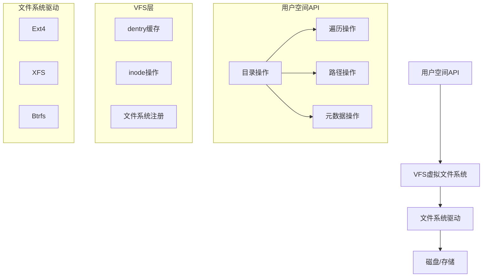

### 2. 关键 API 分类解析

#### 2.1. 目录创建与删除
```c
#include <sys/stat.h>
#include <unistd.h>

// 创建目录
int mkdir(const char *pathname, mode_t mode);

// 递归创建目录
int mkdir_p(const char *path, mode_t mode) {
    char *p = strdup(path);
    for (char *sp = p; *sp; sp++) {
        if (*sp == '/') {
            *sp = '\0';
            mkdir(p, mode); // 忽略已存在错误
            *sp = '/';
        }
    }
    mkdir(p, mode);
    free(p);
}

// 删除空目录
int rmdir(const char *pathname);
```

#### 2.2. 目录遍历与操作
```c
#include <dirent.h>

// 打开目录流
DIR *opendir(const char *name);

// 读取目录项
struct dirent *readdir(DIR *dirp);

// 关闭目录流
int closedir(DIR *dirp);

// 目录定位
void rewinddir(DIR *dirp);
long telldir(DIR *dirp);
void seekdir(DIR *dirp, long loc);
```

#### 2.3. 递归目录遍历
```c
#include <ftw.h>

// 目录树遍历
int nftw(
    const char *dirpath,
    int (*fn)(const char *fpath, const struct stat *sb, int typeflag, struct FTW *ftwbuf),
    int nopenfd,
    int flags  // FTW_PHYS, FTW_MOUNT, FTW_DEPTH等
);
```

#### 2.4. 路径解析与操作
```c
#include <libgen.h>
#include <stdlib.h>

// 获取绝对路径
char *realpath(const char *path, char *resolved_path);

// 分解路径
char *dirname(char *path);   // 获取目录部分
char *basename(char *path);  // 获取文件名部分

// 路径拼接
char *path_join(const char *dir, const char *file) {
    char *path = malloc(strlen(dir) + strlen(file) + 2);
    sprintf(path, "%s/%s", dir, file);
    return path;
}
```

#### 2.5. 目录流文件描述符操作
```c
#include <fcntl.h>
#include <dirent.h>

// 获取目录文件描述符
int dirfd(DIR *dirp);

// 使用文件描述符打开目录
DIR *fdopendir(int fd);

// 创建目录文件描述符
int open(const char *pathname, O_DIRECTORY | O_RDONLY);
```

### 3. 目录树元数据操作

#### 3.1. 属性获取与修改
```c
#include <sys/stat.h>
#include <unistd.h>

// 获取文件状态
int stat(const char *pathname, struct stat *statbuf);
int lstat(const char *pathname, struct stat *statbuf); // 不跟踪符号链接
int fstatat(int dirfd, const char *pathname, struct stat *statbuf, int flags);

// 修改权限
int chmod(const char *pathname, mode_t mode);
int fchmodat(int dirfd, const char *pathname, mode_t mode, int flags);

// 修改所有者
int chown(const char *pathname, uid_t owner, gid_t group);
int fchownat(int dirfd, const char *pathname, uid_t owner, gid_t group, int flags);
```

#### 3.2. 时间戳操作
```c
#include <sys/stat.h>
#include <fcntl.h>

// 修改访问/修改时间
int utimensat(int dirfd, const char *pathname,
             const struct timespec times[2], int flags);
```

### 4. 目录树关联操作

#### 4.1. 硬链接与符号链接
```c
#include <unistd.h>

// 创建硬链接
int link(const char *oldpath, const char *newpath);
int linkat(int olddirfd, const char *oldpath,
          int newdirfd, const char *newpath, int flags);

// 创建符号链接
int symlink(const char *target, const char *linkpath);
int symlinkat(const char *target, int newdirfd, const char *linkpath);

// 读取符号链接
ssize_t readlink(const char *pathname, char *buf, size_t bufsiz);
ssize_t readlinkat(int dirfd, const char *pathname,
                  char *buf, size_t bufsiz);
```

#### 4.2. 目录树移动与重命名
```c
#include <stdio.h>

// 重命名/移动文件或目录
int rename(const char *oldpath, const char *newpath);
int renameat(int olddirfd, const char *oldpath,
            int newdirfd, const char *newpath);
int renameat2(int olddirfd, const char *oldpath,
             int newdirfd, const char *newpath, unsigned int flags);
```

### 5. 工作目录操作

```c
#include <unistd.h>

// 获取当前工作目录
char *getcwd(char *buf, size_t size);

// 改变工作目录
int chdir(const char *path);
int fchdir(int fd);

// 改变根目录
int chroot(const char *path);
```

## 二、VFS层与文件系统驱动层分工

### 1. 整体架构概览

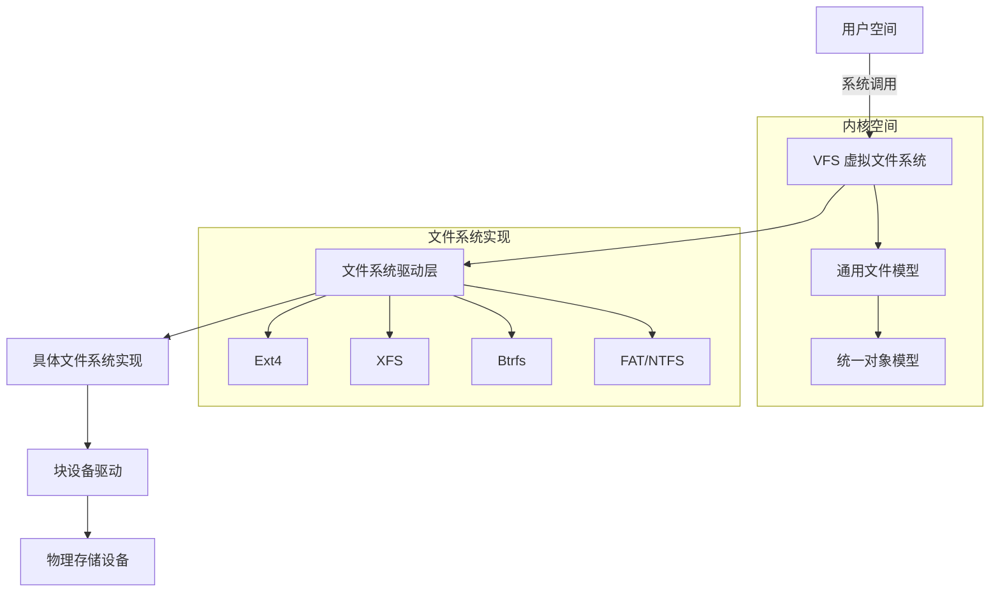

### 2. VFS 层核心职责

#### 2.1. 统一抽象接口
- **提供通用文件操作**：
  ```c
  struct file_operations {
      ssize_t (*read)(struct file *, char __user *, size_t, loff_t *);
      ssize_t (*write)(struct file *, const char __user *, size_t, loff_t *);
      int (*open)(struct inode *, struct file *);
      int (*release)(struct inode *, struct file *);
      // 共20+个标准操作
  };
  ```

#### 2.2. 核心对象模型
| **对象**      | **描述**                     | **关键数据结构**             |
|---------------|-----------------------------|-----------------------------|
| **超级块**    | 文件系统全局信息            | `struct super_block`        |
| **索引节点**  | 文件/目录元数据             | `struct inode`             |
| **目录项**    | 路径分量缓存                | `struct dentry`            |
| **文件对象**  | 进程打开的文件实例          | `struct file`              |
| **挂载点**    | 文件系统挂载信息            | `struct vfsmount`          |

#### 2.3. 路径解析与转换
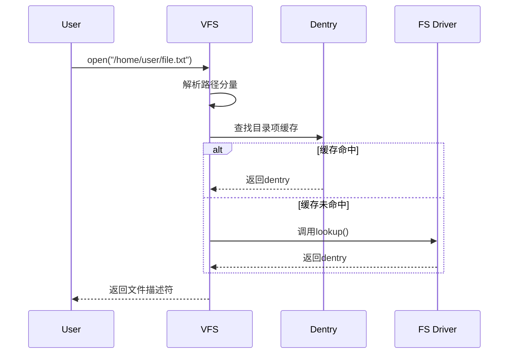

#### 2.4. 权限与访问控制
```c
// VFS通用权限检查
int vfs_permission(struct inode *inode, int mask) {
    if (inode->i_op->permission)
        return inode->i_op->permission(inode, mask);
    else
        return generic_permission(inode, mask);
}
```

#### 2.5. 缓存管理
- **页缓存**：`struct address_space`
- **目录项缓存**：`dentry_cache`
- **索引节点缓存**：`inode_cache`

### 3. 文件系统驱动层核心职责

#### 3.1. 文件系统具体实现
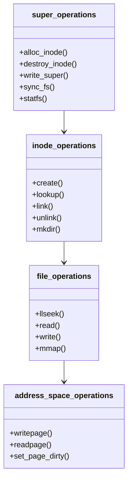

#### 3.2. 磁盘数据结构管理
| **文件系统** | **超级块结构**       | **索引节点结构**    | **目录结构**       |
|-------------|---------------------|-------------------|-------------------|
| **Ext4**    | ext4_super_block    | ext4_inode        | ext4_dir_entry_2  |
| **XFS**     | xfs_sb_t            | xfs_dinode_t      | xfs_dir2_sf_hdr   |
| **Btrfs**   | btrfs_super_block   | btrfs_inode_item  | btrfs_dir_item    |
| **NTFS**    | NTFS_BOOT_SECTOR    | NTFS_ATTR_RECORD  | NTFS_INDEX_ENTRY  |

#### 3.3. 存储空间管理
- **Ext4 块分配示例**：
  ```c
  // 在ext4中分配新块
  static int ext4_alloc_blocks(handle_t *handle, struct inode *inode,
                              ext4_fsblk_t goal, int flags) {
      // 1. 检查空闲块位图
      // 2. 从块组分配空闲块
      // 3. 更新块位图
      // 4. 记录日志
  }
  ```

#### 3.4. 日志与事务管理
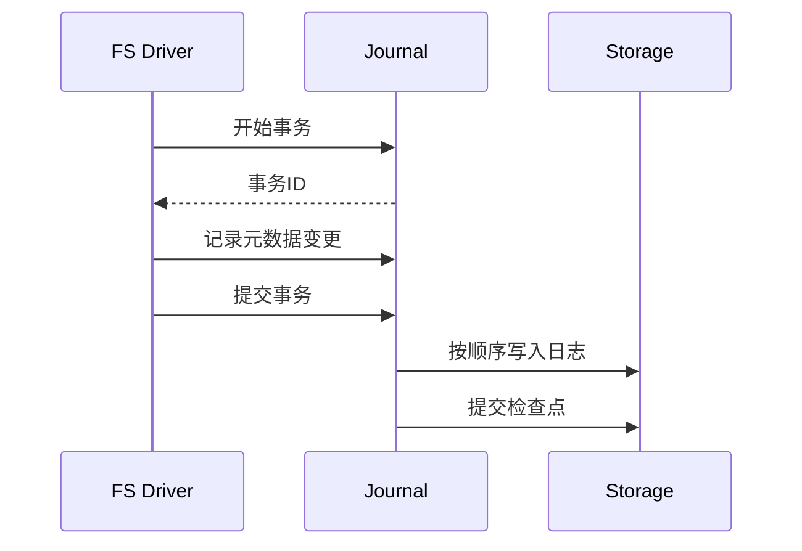

#### 3.5. 高级特性实现
- **Btrfs 写时复制**：
  ```c
  void btrfs_cow_block(struct btrfs_trans_handle *trans,
                      struct btrfs_root *root,
                      struct extent_buffer *buf) {
      if (btrfs_buffer_uptodate(buf) {
          // 创建新副本
          new_buf = btrfs_alloc_free_block();
          copy_buffer(new_buf, buf);
          // 更新指针
          btrfs_set_node_ptr(parent, slot, new_buf->start);
      }
  }
  ```

### 4. 两层的交互与协作

#### 4.1. 典型操作流程：文件读取
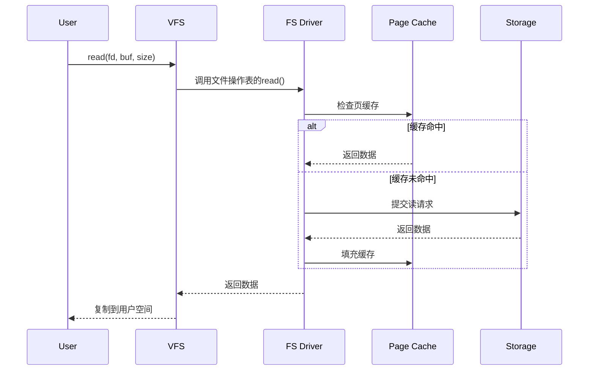

#### 4.2. 挂载过程协作
```c
// VFS层处理挂载请求
SYSCALL_DEFINE5(mount, ...) {
    // 1. 查找文件系统类型
    struct file_system_type *type = get_fs_type(fstype);
    
    // 2. 调用文件系统的挂载方法
    struct dentry *root = type->mount(type, flags, dev_name, data);
    
    // 3. 创建vfsmount对象
    struct vfsmount *mnt = vfs_kern_mount(type, flags, dev_name, data);
}

// 文件系统驱动实现挂载
static struct dentry *ext4_mount(struct file_system_type *fs_type,
        int flags, const char *dev_name, void *data) {
    // 1. 读取超级块
    struct super_block *sb = sget(fs_type, ext4_test_super, ...);
    
    // 2. 初始化文件系统
    ext4_fill_super(sb, data, flags);
    
    // 3. 返回根dentry
    return dget(sb->s_root);
}
```

#### 4.3. 数据结构转换
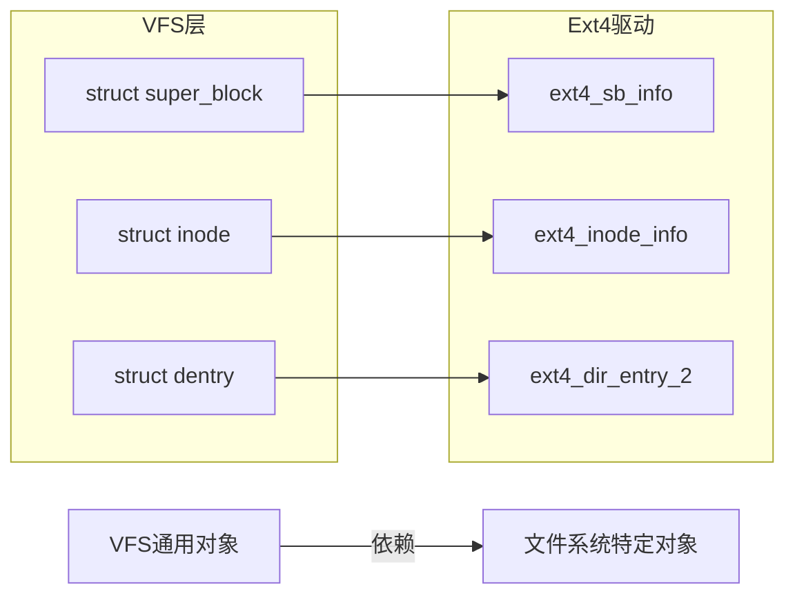

### 5. 性能优化对比

#### 5.1. VFS 层优化技术
| **技术**           | **目的**                    | **实现方式**                     |
|--------------------|----------------------------|--------------------------------|
| RCU路径查找        | 无锁路径解析               | RCU保护的dentry缓存遍历         |
| 延迟挂载           | 加速启动                   | 挂载时仅初始化元数据            |
| 负目录项缓存       | 避免重复失败查找           | 缓存不存在的路径结果            |
| 预读优化           | 提升顺序读性能             | 根据访问模式预测预读量          |

#### 5.2. 文件系统驱动优化
| **文件系统** | **特有优化**              | **效果**                     |
|-------------|--------------------------|-----------------------------|
| **Ext4**    | 多块分配器               | 减少小文件分配开销           |
| **XFS**     | B+树索引                 | 高效处理大目录和大文件       |
| **Btrfs**   | 写时复制                 | 避免写入放大                 |
| **F2FS**    | 日志结构文件系统         | 优化SSD写入性能              |

### 6. 总结：VFS 与文件系统驱动分工

| **特性**         | **VFS 层**                | **文件系统驱动层**          |
|------------------|--------------------------|---------------------------|
| **主要职责**      | 提供统一抽象接口          | 实现具体文件系统逻辑        |
| **核心数据结构**  | super_block, inode, file | 文件系统特定元数据结构      |
| **性能关注点**    | 路径查找效率, 缓存管理    | 磁盘布局优化, 事务处理      |
| **可扩展性**      | 支持多种文件系统类型      | 实现特定存储特性            |
| **错误处理**      | 通用错误返回              | 文件系统特定恢复机制        |
| **演进方向**      | 异步I/O, 命名空间         | 新存储介质支持, 分布式      |

**协作本质**：
- VFS 层：**定义标准框架**，提供文件系统无关的通用服务
- 文件系统驱动：**实现具体行为**，处理存储介质特定的操作

通过这种分层设计，Linux 文件系统实现了：
1. **统一性**：应用程序通过一致接口访问不同文件系统
2. **灵活性**：支持从本地磁盘到网络文件系统的各种存储
3. **可扩展性**：新文件系统可通过实现驱动接口轻松添加
4. **性能优化**：各层可独立进行针对性优化

理解 VFS 与文件系统驱动的分工机制，是开发高性能存储系统和调试复杂文件问题的关键基础。

## 三、inode/dentry介绍

### 1. 核心概念总览

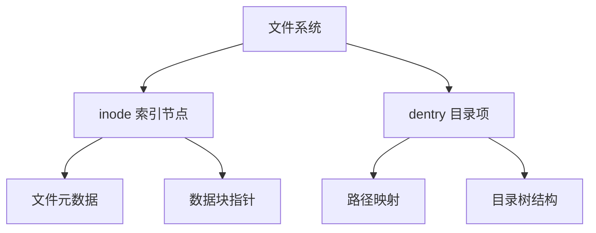

### 2. inode (Index Node) 详解

#### 2.1. 本质与作用
inode 是文件系统的**元数据核心**，每个文件/目录对应唯一的 inode，存储除文件名外的所有信息

#### 2.2. 关键数据结构
```c
struct inode {
    umode_t         i_mode;       // 文件类型和权限
    uid_t           i_uid;        // 所有者ID
    gid_t           i_gid;        // 组ID
    loff_t          i_size;       // 文件大小(字节)
    struct timespec i_atime;      // 最后访问时间
    struct timespec i_mtime;      // 最后修改时间
    struct timespec i_ctime;      // inode变更时间
    unsigned long   i_ino;        // inode号(唯一标识)
    unsigned int    i_nlink;      // 硬链接计数
    const struct inode_operations *i_op; // 操作函数表
    struct super_block *i_sb;     // 所属超级块
    struct address_space *i_mapping; // 页缓存映射
    // 文件系统特定数据
    union {
        struct ext4_inode_info   ext4_i;
        struct xfs_inode         xfs_i;
        struct btrfs_inode       btrfs_i;
    };
};
```

#### 2.3. inode 核心信息图解


#### 2.4. inode 操作函数集
```c
struct inode_operations {
    int (*create)(struct inode *, struct dentry *, umode_t, bool);
    struct dentry *(*lookup)(struct inode *, struct dentry *, unsigned int);
    int (*link)(struct dentry *, struct inode *, struct dentry *);
    int (*unlink)(struct inode *, struct dentry *);
    int (*mkdir)(struct inode *, struct dentry *, umode_t);
    int (*rmdir)(struct inode *, struct dentry *);
    // 共20+个操作函数
};
```

#### 2.5. inode 生命周期管理
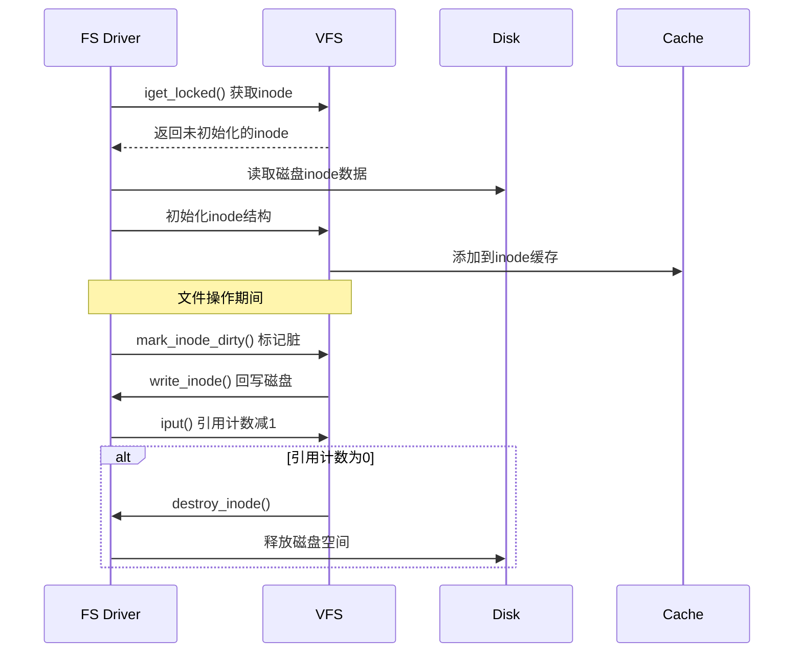

### 3. dentry (Directory Entry) 详解

#### 3.1. 本质与作用
dentry 是内核**路径解析的核心结构**，构建内存中的目录树，实现路径到 inode 的映射

#### 3.2. 关键数据结构
```c
struct dentry {
    unsigned int d_flags;         // 缓存状态标志
    struct seqcount d_seq;        // 序列锁
    struct hlist_bl_node d_hash;  // 哈希表链表
    struct dentry *d_parent;      // 父目录项
    struct qstr d_name;           // 文件名
    struct inode *d_inode;        // 关联的inode
    unsigned char d_iname[DNAME_INLINE_LEN]; // 短文件名存储
    struct lockref d_lockref;     // 锁和引用计数
    const struct dentry_operations *d_op; // 操作函数集
    struct super_block *d_sb;     // 所属超级块
    struct list_head d_subdirs;   // 子目录项链表
    // ...
};
```

#### 3.3. dentry 状态机
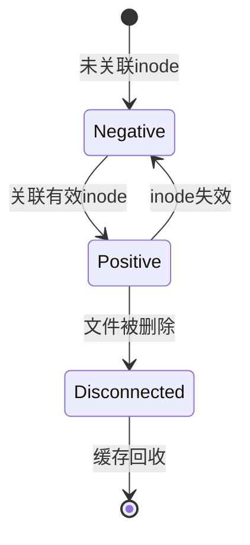

#### 3.4. dentry 操作函数集
```c
struct dentry_operations {
    int (*d_revalidate)(struct dentry *, unsigned int);
    int (*d_weak_revalidate)(struct dentry *, unsigned int);
    int (*d_hash)(const struct dentry *, struct qstr *);
    int (*d_compare)(const struct dentry *,
                     unsigned int, const char *, const struct qstr *);
    int (*d_delete)(const struct dentry *);
    // ...
};
```

#### 3.5. dentry 缓存机制 (dcache)


### 4. inode 与 dentry 的协同关系

#### 4.1. 结构关联图
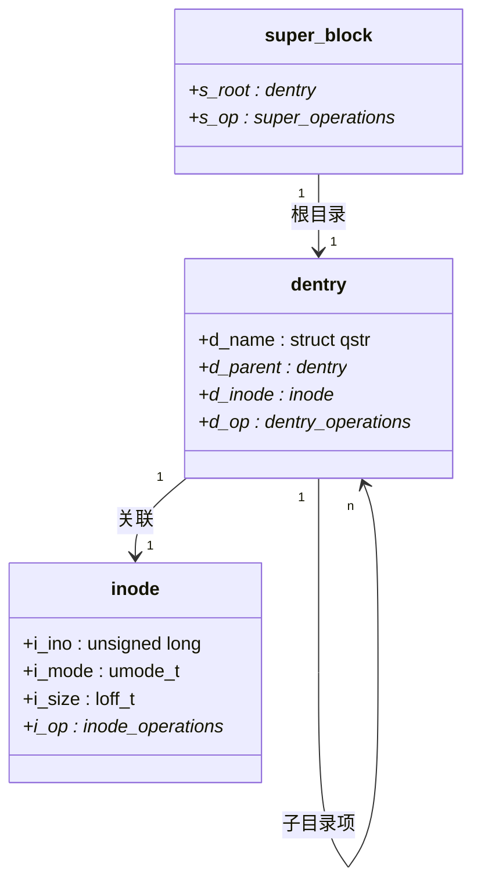

#### 4.2. 文件打开流程中的协作
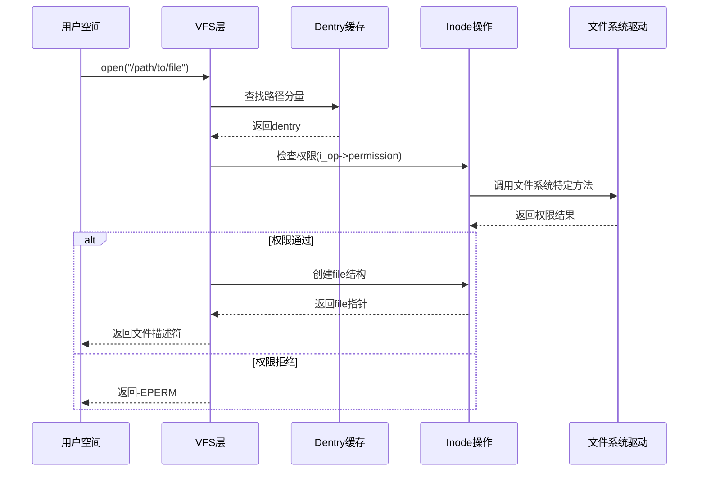

#### 4.3. 硬链接的实现原理
```mermaid
graph LR
    A[物理文件] --> B[inode]
    B --> C[dentry1]
    B --> D[dentry2]
    C --> E[/path1/file]
    D --> F[/path2/link]
```

内核代码实现：
```c
// 创建硬链接
int vfs_link(struct dentry *old_dentry, struct inode *dir,
             struct dentry *new_dentry)
{
    // 1. 增加inode链接计数
    inode_inc_link_count(old_dentry->d_inode);
    
    // 2. 创建新dentry关联同一inode
    d_instantiate(new_dentry, old_dentry->d_inode);
}
```

### 5. 实际应用与性能影响

#### 5.1. 性能关键指标

| **操作**       | inode 影响              | dentry 影响              |
|---------------|-------------------------|--------------------------|
| 文件打开        | 权限检查、属性加载       | 路径解析、缓存查找        |
| 目录遍历        | 每个文件inode访问        | dentry缓存命中率决定性能  |
| 文件删除        | 减少链接计数、释放空间   | 断开dentry-inode关联     |
| 路径解析        | 最终目标访问             | 决定解析效率              |

#### 5.2. 性能优化技巧

**inode 优化：**
```c
// 预加载inode属性
iget_locked(inode);  // 获取时预加载
```

**dentry 优化：**
```bash
# 调整dcache参数
sysctl -w vm.vfs_cache_pressure=50  # 缓存压力值
sysctl -w fs.dentry-state=70000,5000 # 最大/最小dentry数
```

#### 5.3. 调试与监控命令

**查看 inode 使用：**
```bash
df -i  # 文件系统inode使用情况
stat file.txt  # 单个文件inode信息
```

**监控 dentry 缓存：**
```bash
cat /proc/sys/fs/dentry-state
# 输出：70000 34792 45 0 0 0
# 含义：总dentry数 | 未使用dentry | age限制 | 需要回收 | 伪引用 | 未使用负dentry
```

### 6. 总结：inode 与 dentry 的核心价值

| **特性**         | inode                      | dentry                      | 协同价值                     |
|------------------|----------------------------|-----------------------------|------------------------------|
| **核心职责**      | 文件元数据存储              | 路径到inode的映射            | 构建完整文件访问路径          |
| **存储位置**      | 磁盘持久化+内存缓存         | 内存缓存(非持久化)           | 分层提升性能                  |
| **唯一性**        | 文件系统内唯一              | 路径上下文相关               | 支持硬链接和多路径访问        |
| **性能影响**      | 决定文件操作效率            | 决定路径解析效率             | 共同决定整体文件访问性能      |
| **现代演进**      | 扩展属性/安全标签           | RCU路径查找                 | 适应新型应用需求              |

理解 inode 和 dentry 的协作机制，是掌握 Linux 文件系统精髓的关键。它们共同构成了文件系统的"骨架"（dentry 树）和"灵魂"（inode 元数据），使 Linux 能够高效管理从本地磁盘到分布式存储的各种数据。

## 四、mount/loopback协同

### 1. 核心概念关系

```mermaid
graph TD
    A[普通文件] -->|loopback 设备| B[虚拟块设备]
    B -->|mount 命令| C[目录树挂载点]
    
    subgraph 文件系统
        D[磁盘镜像文件.img]
        E[ISO 光盘镜像]
        F[加密容器文件]
    end
    
    subgraph 虚拟设备
        G[/dev/loop0]
        H[/dev/loop1]
        I[/dev/loop2]
    end
    
    subgraph 挂载点
        J[/mnt/disk]
        K[/mnt/iso]
        L[/mnt/secure]
    end
    
    D --> G --> J
    E --> H --> K
    F --> I --> L
```

**核心关系**：
- **Loopback 设备**：将普通文件虚拟化为块设备
- **Mount 命令**：将虚拟设备挂载到目录树
- **协同作用**：Loopback 提供设备抽象，Mount 实现文件系统接入

### 2. 技术实现原理

#### 2.1. Loopback 设备工作原理

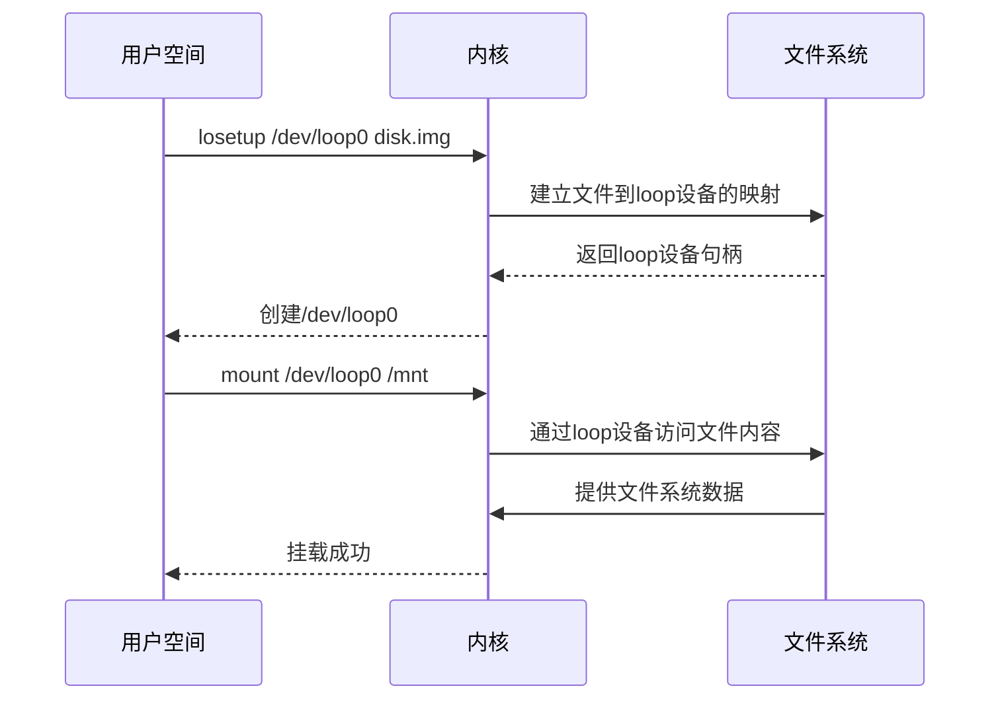

**内核关键结构**：
```c
// drivers/block/loop.c
struct loop_device {
    int lo_number;               // loop设备号
    struct file *lo_backing_file; // 关联的文件指针
    struct block_device *lo_device; // 虚拟块设备
    struct bio_list lo_bio_list; // I/O请求队列
};

// 文件访问操作
static int do_lo_receive_bio(struct loop_device *lo, struct bio *bio)
{
    struct file *file = lo->lo_backing_file;
    // 将bio请求转换为文件读写操作
    return do_lo_send_aops(lo, bio, file, pos);
}
```

#### 2.2. Mount 工作流程

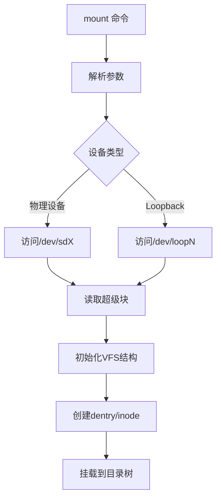

### 3. 关键操作对比

| **特性**         | Loopback 设备               | Mount 操作                | 协同工作场景               |
|------------------|----------------------------|--------------------------|--------------------------|
| **功能定位**      | 文件虚拟化为块设备          | 设备接入目录树            | 文件系统接入目录树        |
| **操作命令**      | `losetup`                  | `mount`                  | `mount -o loop`          |
| **操作对象**      | 普通文件 (img, iso等)      | 块设备文件 (/dev/xxx)     | 镜像文件+挂载点           |
| **内核组件**      | loop 驱动                  | VFS 文件系统层            | loop驱动 + 文件系统驱动   |
| **持久性**        | 需要手动维护关联           | 重启后失效                | 重启后需重建              |
| **性能影响**      | 文件I/O转换为块I/O         | 增加VFS层开销            | 双重转换开销              |

### 4. 实际应用场景

#### 4.1. 磁盘镜像操作
```bash
# 创建磁盘镜像
dd if=/dev/zero of=disk.img bs=1M count=1024

# 格式化为ext4
mkfs.ext4 disk.img

# 挂载到目录
sudo mount -o loop disk.img /mnt/disk

# 查看挂载
df -hT /mnt/disk
```
**输出**：
```
Filesystem     Type  Size  Used Avail Use% Mounted on
/dev/loop0     ext4  991M  2.6M  921M   1% /mnt/disk
```

#### 4.2. ISO 文件挂载
```bash
# 挂载ISO镜像
sudo mount -o loop ubuntu-22.04.iso /mnt/iso

# 访问内容
ls /mnt/iso
```

#### 4.3. 加密容器操作
```bash
# 创建加密容器
dd if=/dev/urandom of=secure.img bs=1M count=500

# 关联loop设备
sudo losetup /dev/loop1 secure.img

# 加密格式化
sudo cryptsetup luksFormat /dev/loop1

# 打开加密设备
sudo cryptsetup open /dev/loop1 secure_vol

# 创建文件系统
sudo mkfs.ext4 /dev/mapper/secure_vol

# 挂载使用
sudo mount /dev/mapper/secure_vol /mnt/secure
```

### 5. 内核机制详解

#### 5.1. Loopback 设备创建
```c
// 用户空间调用
int ioctl(int fd, int cmd, ...) {
    // LOOP_SET_FD 命令处理
    case LOOP_SET_FD:
        return loop_set_fd(lo, mode, file);
}

// 内核处理函数
static int loop_set_fd(struct loop_device *lo, fmode_t mode,
                      struct file *file)
{
    // 建立文件关联
    lo->lo_backing_file = file;
    lo->lo_device = bdev;
    
    // 设置块设备操作
    blk_queue_make_request(lo->lo_queue, loop_make_request);
}
```

#### 5.2. Mount 系统调用
```c
SYSCALL_DEFINE5(mount, char __user *, dev_name, 
               char __user *, dir_name, 
               char __user *, type, 
               unsigned long, flags, 
               void __user *, data)
{
    // 解析设备路径
    ret = user_path_at(AT_FDCWD, dir_name, LOOKUP_FOLLOW, &path);
    
    // 查找文件系统类型
    fstype = get_fs_type(type);
    
    // 处理loop设备
    if (flags & MS_LOOP) {
        struct file *file = backing_file;
        lo = loop_setup(file);
        dev_name = loop_device_name(lo);
    }
    
    // 执行挂载
    ret = vfs_kern_mount(fstype, flags, dev_name, data);
}
```

#### 5.3. I/O 请求处理流程
```mermaid
sequenceDiagram
    participant App as 应用程序
    participant VFS as VFS层
    participant FS as 文件系统
    participant Loop as Loop驱动
    participant File as 文件系统
    
    App->>VFS: write() 系统调用
    VFS->>FS: 提交I/O请求
    FS->>Loop: 发送bio请求
    Loop->>File: 转换为文件操作(f_op->write_iter)
    File->>VFS: 完成写入
    VFS-->>App: 返回成功
```

### 6. 总结：Mount 与 Loopback 的协同关系

1. **功能互补**：
   - Loopback：文件 → 块设备
   - Mount：块设备 → 目录树

2. **工作流程**：
   ```mermaid
   graph LR
       F[镜像文件] --> L[Loopback 设备]
       L --> M[Mount 操作]
       M --> D[目录树]
   ```

3. **应用价值**：
   - 磁盘镜像操作
   - 安全加密容器
   - 安装介质访问
   - 开发测试环境

4. **演进方向**：
   - 用户空间文件系统 (FUSE)
   - 容器化挂载 (Rootless)
   - 云原生存储接口

Mount 和 Loopback 的组合是 Linux 文件系统灵活性的核心体现，通过软件抽象实现了物理存储与逻辑访问的解耦，为各种高级存储应用场景提供了基础支持。