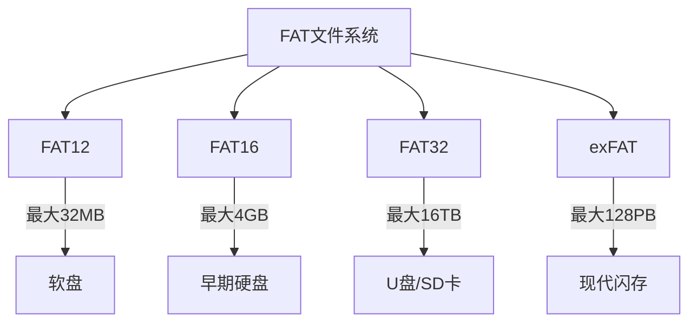
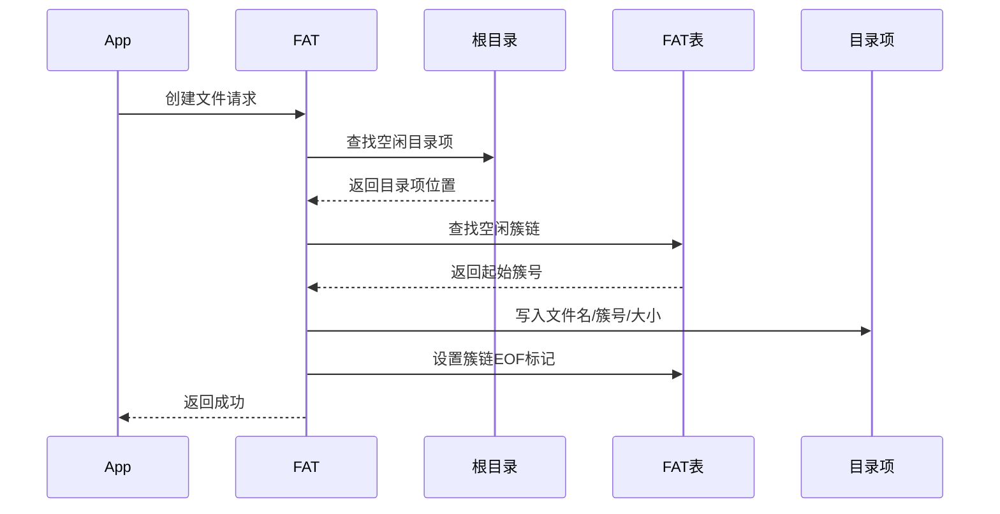
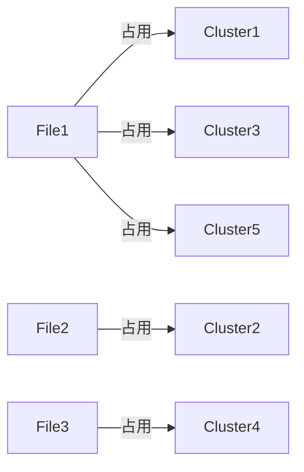
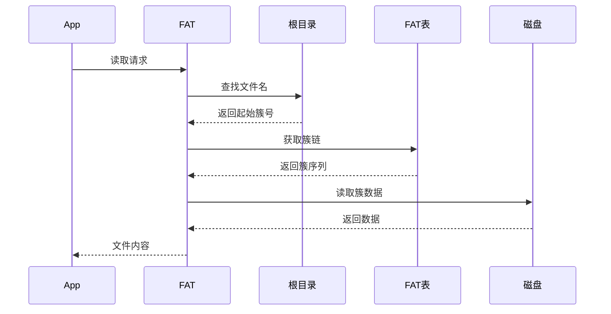
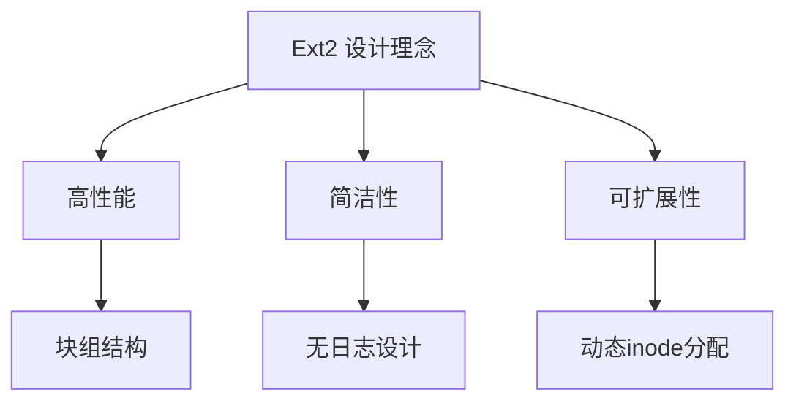
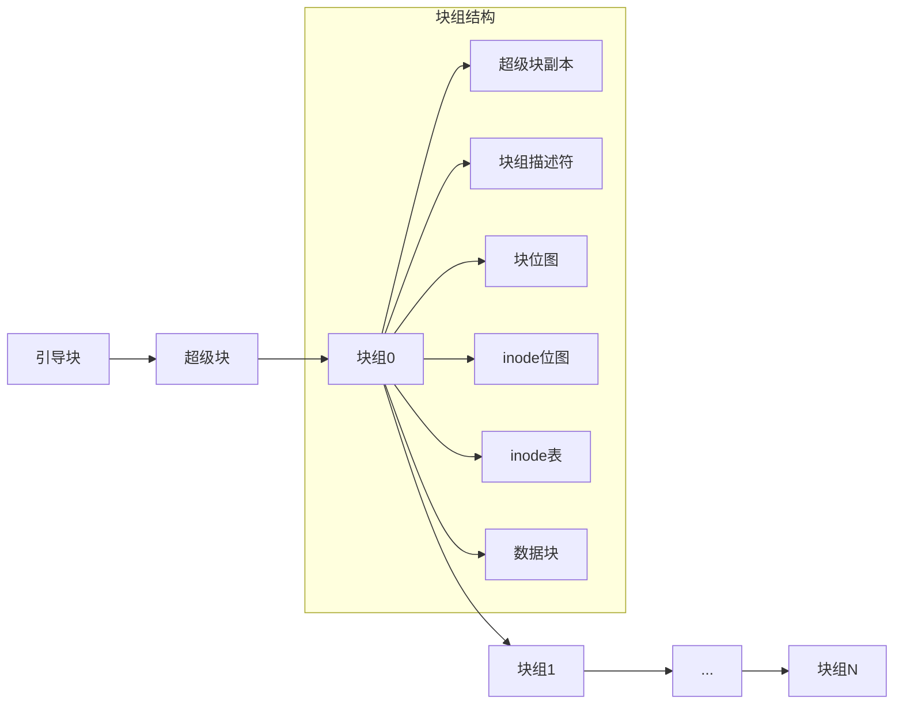
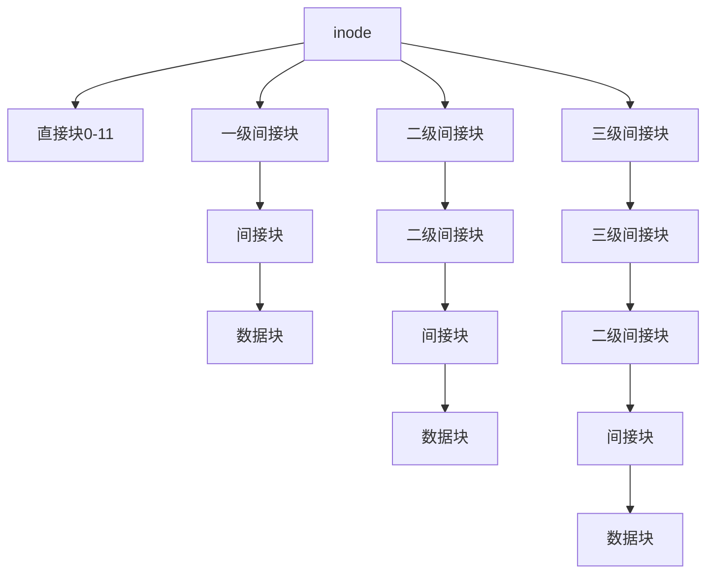
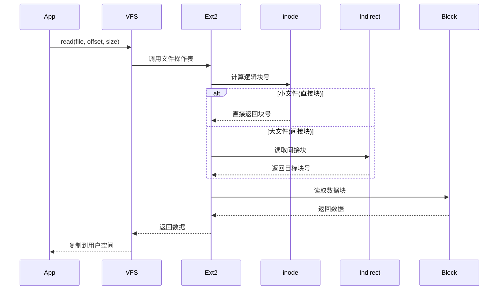
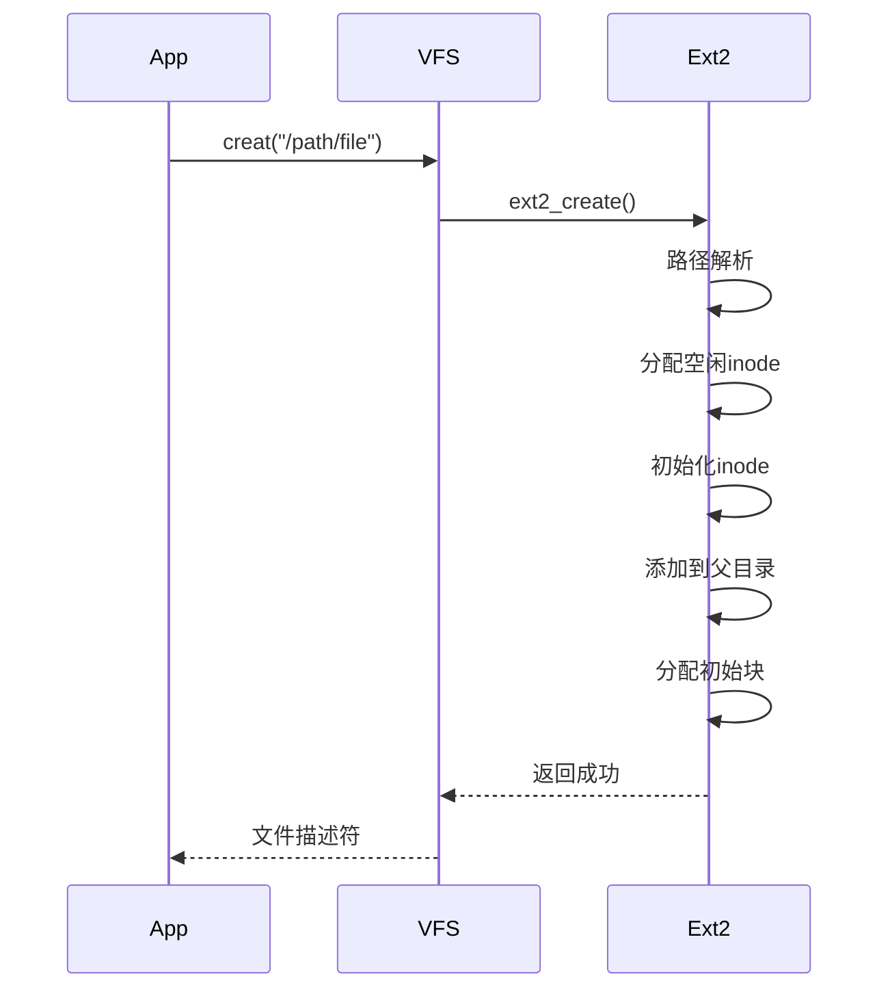

本文主要整理文件系统实现章节的要点。

## 一、FAT文件系统原理

### 1. FAT 文件系统概述

FAT（File Allocation Table）文件系统是微软设计的简单文件系统，广泛应用于各类存储设备：



### 2. 磁盘结构布局

#### 2.1. FAT 分区结构


#### 2.2. 关键区域说明
| **区域**       | **大小**        | **内容**                     | **重要性**        |
|---------------|----------------|-----------------------------|------------------|
| 引导扇区       | 512字节         | 启动代码+分区参数            | ★★★★★           |
| 保留扇区       | 可变(通常32扇区)| 扩展引导记录                | ★★★☆☆           |
| FAT1          | 可变            | 文件分配表主副本             | ★★★★★           |
| FAT2          | 与FAT1相同      | 文件分配表备份               | ★★★★☆           |
| 根目录区       | FAT12/16固定<br>FAT32可变 | 目录条目数组               | ★★★★☆           |
| 数据区         | 剩余空间         | 文件实际数据                | ★★★★★           |

### 3.核心数据结构

#### 3.1. 引导扇区结构 (512字节)
```c
struct BootSector {
    uint8_t  jump[3];        // 跳转指令 EB 3C 90
    char     oem[8];         // OEM标识 "MSDOS5.0"
    uint16_t bytes_per_sector; // 512
    uint8_t  sectors_per_cluster; // 1,2,4,8...
    uint16_t reserved_sectors; // 保留扇区数
    uint8_t  fat_copies;     // FAT表数量(通常2)
    uint16_t root_entries;   // 根目录条目数(FAT32=0)
    uint16_t total_sectors16;// 总扇区数(<32MB)
    uint8_t  media_descriptor; // 介质类型 F0=软盘/F8=硬盘
    uint16_t sectors_per_fat;// FAT表大小(扇区)
    // ... FAT32扩展字段
    uint32_t sectors_per_fat32;
    uint32_t root_cluster;   // 根目录起始簇
    uint16_t signature;      // 0xAA55
};
```

#### 3.2. 目录条目结构 (32字节)
```c
struct DirEntry {
    char     filename[8];    // 主文件名
    char     extension[3];   // 扩展名
    uint8_t  attributes;     // 属性字节
    uint8_t  reserved;       // 保留
    uint8_t  create_time_ms; // 创建时间(毫秒)
    uint16_t create_time;    // 创建时间
    uint16_t create_date;    // 创建日期
    uint16_t access_date;    // 访问日期
    uint16_t cluster_high;   // 起始簇号高16位
    uint16_t mod_time;       // 修改时间
    uint16_t mod_date;       // 修改日期
    uint16_t cluster_low;    // 起始簇号低16位
    uint32_t file_size;      // 文件大小(字节)
};
```

#### 3.3. 属性字节解析
| **位** | 掩码    | 含义         |
|--------|--------|--------------|
| 0      | 0x01   | 只读         |
| 1      | 0x02   | 隐藏         |
| 2      | 0x04   | 系统         |
| 3      | 0x08   | 卷标         |
| 4      | 0x10   | 子目录       |
| 5      | 0x20   | 归档         |
| 6      | 0x40   | 设备(内部用) |
| 7      | 0x80   | 未使用       |

### 4. 文件分配表(FAT)工作原理

#### 4.1. FAT 表项含义
| **值(16位)** | **含义**           |
|-------------|-------------------|
| 0x0000      | 空闲簇             |
| 0x0002-0xFFEF| 下一个簇号         |
| 0xFFF7      | 坏簇              |
| 0xFFF8-0xFFFF| 文件结束簇(EOF)    |

#### 4.2. 文件存储原理


#### 4.3. 簇链查找算法
```python
def read_file(first_cluster):
    current = first_cluster
    data = b''
    
    while not is_eof(current):
        # 计算簇的物理位置
        sector = data_start + (current - 2) * sectors_per_cluster
        # 读取簇数据
        data += read_sectors(sector, sectors_per_cluster)
        # 查找FAT表获取下一簇
        current = fat_table[current]
    
    return data
```

### 5. FAT 文件操作详解

#### 5.1. 文件创建流程


#### 5.2. 文件删除实现
```c
void delete_file(DirEntry* entry) {
    // 1. 标记目录项为删除
    entry->filename[0] = 0xE5; // 删除标记
    
    // 2. 释放簇链
    uint32_t cluster = GET_CLUSTER(entry);
    while (!IS_EOF(cluster)) {
        uint32_t next = fat[cluster];
        fat[cluster] = 0; // 标记为空闲
        cluster = next;
    }
}
```

#### 5.3. 碎片化问题
FAT 文件系统的簇分配策略导致严重碎片化：


### 6. FAT 类型对比

| **特性**         | FAT12       | FAT16       | FAT32         | exFAT        |
|------------------|-------------|-------------|---------------|--------------|
| **最大卷大小**   | 32MB        | 4GB         | 16TB          | 128PB        |
| **最大文件大小** | 32MB        | 4GB         | 4GB-1         | 16EB         |
| **簇大小范围**   | 512B-4KB    | 2KB-32KB    | 4KB-32KB      | 512B-32MB    |
| **根目录位置**   | 固定        | 固定        | 数据区可变     | 数据区可变    |
| **目录项数限制** | 固定        | 固定        | 无限          | 无限         |
| **创建日期**     | 不支持       | 不支持       | 支持           | 支持         |


## 二、 File Allocation Table

### 1. FAT 表核心机制

#### 1.1. FAT 表数据结构
```c
// FAT32 表项结构 (32位)
typedef struct {
    uint32_t value : 28;   // 实际使用的28位
    uint32_t reserved : 4; // 保留位
} FAT32_Entry;

// FAT 表项含义
#define FREE_CLUSTER   0x00000000
#define RESERVED_CLUSTER 0x00000001
#define BAD_CLUSTER    0x0FFFFFF7
#define EOF_CLUSTER    0x0FFFFFFF  // FAT32结束标志
```

#### 1.2. 簇链工作原理
```mermaid
graph LR
    A[目录条目] -->|起始簇号| B[簇2]
    B -->|FAT[2]=5| C[簇5]
    C -->|FAT[5]=9| D[簇9]
    D -->|FAT[9]=EOF| E[文件结束]
```

#### 1.3. 簇号到物理地址转换
```
物理扇区 = 数据区起始扇区 + (簇号 - 2) * 每簇扇区数
```

### 2. 关键磁盘结构详解

#### 2.1. 引导扇区 (512字节)
```c
struct BootSector {
    uint8_t  jump[3];        // EB 3C 90
    char     oem[8];         // "MSDOS5.0"
    uint16_t bytes_per_sector; // 512
    uint8_t  sectors_per_cluster;
    uint16_t reserved_sectors;
    uint8_t  fat_copies;     // 通常为2
    uint16_t root_entries;   // FAT32=0
    uint16_t total_sectors16;
    uint8_t  media_descriptor; // F8=硬盘
    uint16_t sectors_per_fat;
    // FAT32扩展字段
    uint32_t sectors_per_fat32;
    uint32_t root_cluster;   // 根目录起始簇
    uint16_t signature;      // 0xAA55
};
```

#### 2.2. 目录条目 (32字节)
```c
struct DirEntry {
    char     name[8];        // 主文件名
    char     ext[3];         // 扩展名
    uint8_t  attributes;     // 属性字节
    uint8_t  reserved;
    uint8_t  create_time_ms; // 10ms单位
    uint16_t create_time;    // 小时(5)分(6)秒(5)
    uint16_t create_date;    // 年(7)月(4)日(5)
    uint16_t access_date;
    uint16_t cluster_high;   // 起始簇高16位
    uint16_t mod_time;
    uint16_t mod_date;
    uint16_t cluster_low;    // 起始簇低16位
    uint32_t file_size;      // 文件实际大小
};
```

#### 2.3. 长文件名实现 (VFAT)


### 3. 文件操作核心流程

#### 3.1. 文件读取过程


#### 3.2. 文件写入过程
```python
def write_file(filename, data):
    # 1. 查找或创建目录项
    entry = find_or_create_entry(filename)
    
    # 2. 计算所需簇数
    clusters_needed = ceil(len(data) / cluster_size)
    
    # 3. 分配簇链
    cluster_chain = allocate_clusters(clusters_needed)
    
    # 4. 更新FAT表
    update_fat_chain(cluster_chain)
    
    # 5. 写入数据
    for i, cluster in enumerate(cluster_chain):
        write_cluster(cluster, data[i*cluster_size: (i+1)*cluster_size])
    
    # 6. 更新目录项
    entry.file_size = len(data)
    entry.mod_time = current_time()
```

#### 3.3. 文件删除机制
```c
void delete_file(DirEntry* entry) {
    // 1. 标记目录项
    entry->name[0] = 0xE5; // 删除标记
    
    // 2. 释放簇链
    uint32_t cluster = GET_CLUSTER(entry);
    while (!IS_EOF(cluster)) {
        uint32_t next = fat[cluster];
        fat[cluster] = FREE_CLUSTER;
        cluster = next;
    }
    
    // 3. 不更新文件大小!
}
```

## 三、Ext2 文件系统原理

Ext2 (Second Extended File System) 是 Linux 最经典的文件系统，尽管已被 Ext3/4 取代，但其核心设计仍是理解现代文件系统的基础：



### 1. 磁盘结构布局

#### 1.1. Ext2 分区结构


#### 1.2. 关键区域功能
| **区域**         | **大小**       | **作用**                     | **重要性** |
|------------------|---------------|-----------------------------|-----------|
| 引导块           | 1KB           | 系统启动代码                 | ★★☆☆☆     |
| 超级块           | 1024字节      | 文件系统全局元数据           | ★★★★★     |
| 块组描述符       | 32字节/组     | 块组详细信息                 | ★★★★☆     |
| 块位图           | 1块/块组      | 数据块分配状态               | ★★★★☆     |
| inode位图        | 1块/块组      | inode分配状态                | ★★★★☆     |
| inode表          | 多个块        | 存储所有inode                | ★★★★★     |
| 数据块           | 剩余空间      | 实际文件内容                 | ★★★★★     |

### 2. 核心数据结构

#### 2.1. 超级块结构 (1024字节)
```c
struct ext2_super_block {
    __le32  s_inodes_count;        // 总inode数
    __le32  s_blocks_count;        // 总块数
    __le32  s_r_blocks_count;      // 保留块数
    __le32  s_free_blocks_count;   // 空闲块数
    __le32  s_free_inodes_count;   // 空闲inode数
    __le32  s_first_data_block;    // 首个数据块号
    __le32  s_log_block_size;      // 块大小指数 (0=1KB,1=2KB...)
    __le32  s_log_frag_size;       // 片段大小(未使用)
    __le32  s_blocks_per_group;    // 每组块数
    __le32  s_frags_per_group;     // 每组片段数
    __le32  s_inodes_per_group;    // 每组inode数
    __le32  s_mtime;               // 最后挂载时间
    __le32  s_wtime;               // 最后写入时间
    // ... 共40多个字段
};
```

#### 2.2. inode 结构 (128字节)
```c
struct ext2_inode {
    __le16  i_mode;         // 文件类型+权限
    __le16  i_uid;          // 用户ID低16位
    __le32  i_size;         // 文件大小(字节)
    __le32  i_atime;        // 最后访问时间
    __le32  i_ctime;        // inode变更时间
    __le32  i_mtime;        // 最后修改时间
    __le32  i_dtime;        // 删除时间
    __le16  i_gid;          // 组ID低16位
    __le16  i_links_count;  // 硬链接计数
    __le32  i_blocks;       // 占用512B块数
    __le32  i_flags;        // 扩展标志
    __le32  i_block[15];    // 数据块指针
    // ... 其他字段
};
```

#### 2.3. 块指针结构


### 3. 数据存储机制

#### 3.1. 块分配策略
```python
def allocate_block(group):
    # 1. 在块组内查找空闲块
    free_block = find_free_bit(block_bitmap)
    
    # 2. 优先使用相同块组
    if free_block != -1:
        return free_block
    
    # 3. 搜索其他块组
    for other_group in groups:
        free_block = find_free_bit(other_group.block_bitmap)
        if free_block != -1:
            return free_block
    
    # 4. 空间不足
    return -1
```

#### 3.2. 文件读取流程


#### 3.3. 最大文件尺寸计算
| **块大小** | **直接块** | **一级间接** | **二级间接** | **三级间接** | **最大文件** |
|------------|------------|--------------|--------------|--------------|--------------|
| 1KB        | 12KB       | 256KB        | 64MB         | 16GB         | ~16GB        |
| 2KB        | 24KB       | 2MB          | 1GB          | 512GB        | ~512GB       |
| 4KB        | 48KB       | 8MB          | 4GB          | 4TB          | ~4TB         |

### 4. 目录结构实现

#### 4.1. 目录项结构
```c
struct ext2_dir_entry {
    __le32  inode;          // inode号
    __le16  rec_len;        // 目录项长度
    __le8   name_len;       // 文件名长度
    __le8   file_type;      // 文件类型
    char    name[255];      // 文件名
};
```

#### 4.2. 目录树示例
```
inode table:
inode 2: / (目录)
  ├─ dir_entry: "home" -> inode 100
  ├─ dir_entry: "etc" -> inode 101
  └─ dir_entry: "bin" -> inode 102

inode 100: /home (目录)
  ├─ dir_entry: "user1" -> inode 200
  └─ dir_entry: "user2" -> inode 201

inode 200: /home/user1 (目录)
  ├─ dir_entry: "file.txt" -> inode 300
  └─ dir_entry: "photo.jpg" -> inode 301
```

#### 4.3. 目录查找优化
```c
// 线性查找算法
struct ext2_dir_entry *find_entry(struct inode *dir, const char *name) {
    char *buf = kmalloc(dir->i_size);
    read_blocks(dir, buf);  // 读取所有目录块
    
    struct ext2_dir_entry *de = (struct ext2_dir_entry *)buf;
    char *limit = buf + dir->i_size;
    
    while ((char *)de < limit) {
        if (de->inode && memcmp(name, de->name, de->name_len) == 0) {
            return de;  // 找到匹配项
        }
        de = (struct ext2_dir_entry *)((char *)de + de->rec_len);
    }
    return NULL;  // 未找到
}
```

### 5. Ext2 文件操作

#### 5.1. 文件创建流程


#### 5.2. 文件写入流程
```c
ssize_t ext2_write(struct file *file, const char *buf, size_t count) {
    // 1. 检查文件大小限制
    if (file->f_pos + count > MAX_FILE_SIZE)
        return -EFBIG;
    
    // 2. 分配必要的数据块
    while (needed_blocks > allocated_blocks) {
        new_block = allocate_block(inode);
        add_block_to_inode(inode, new_block);
    }
    
    // 3. 写入数据
    write_blocks(inode, file->f_pos, buf, count);
    
    // 4. 更新元数据
    inode->i_size = max(inode->i_size, file->f_pos + count);
    inode->i_mtime = CURRENT_TIME;
    
    return count;
}
```
